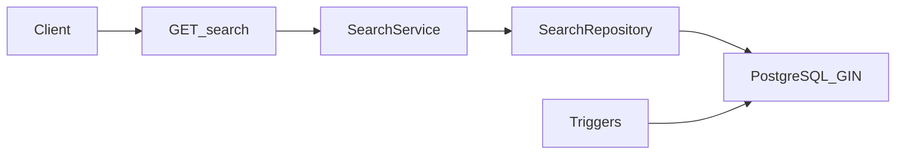

# Search backend (FEATURE-B)

> **Ticket :** B.4 — implémentation  
> **Produit :** [`docs/prd/PRD-B1-local-discovery-and-search-philosophy.md`](../prd/PRD-B1-local-discovery-and-search-philosophy.md)  
> **Spec :** [`docs/technical/search-technical-spec.md`](../technical/search-technical-spec.md)

## Décisions

| Décision | Choix |
|----------|--------|
| Moteur | PostgreSQL FTS (`tsvector`, GIN, config `french`) |
| Sync index | Triggers `BEFORE INSERT OR UPDATE` par table |
| API | `GET /api/v1/search` — résultats **groupés par type** (`groups.events`, `groups.posts`, …) |
| Scope ville | Obligatoire (profil ou query `city`) |
| Invariant tribu | `posts.tribe_id IS NULL` sur toute recherche post |
| Ranking | `ts_rank_cd` + tri chronologique explicable — pas d’engagement |

## Schéma

## Tables indexées

- `posts` (feed ville uniquement)
- `local_events`
- `organizations`
- `partner_offers`
- `tribes` (métadonnées publiques)
- `user_profiles` (+ join `users`)
- `neighborhoods`

## Paramètres API

| Param | Description |
|-------|-------------|
| `q` | Requête (2–120 caractères) |
| `city` | Ville (défaut : `users.city` si JWT) |
| `neighborhood_slug` | Filtre optionnel quartier actif |
| `type` | `post`, `event`, `org`, `offer`, `tribe`, `user`, `neighborhood`, `all` |
| `period` | `upcoming` \| `past` \| `all` (événements) |
| `page` / `limit` | Pagination (single-type ; max 50) |

## Rate limit

30 requêtes / minute par IP ou utilisateur (`rl:search:*`).

## Limitations MVP

- Pas d’autocomplétion, pas de géo-radius, pas d’Elasticsearch.
- Mode `type=all` : max 8 résultats par type, page 1 recommandée.

## Migration

`alembic upgrade head` — révision `20260531_0017_search_fts`.
