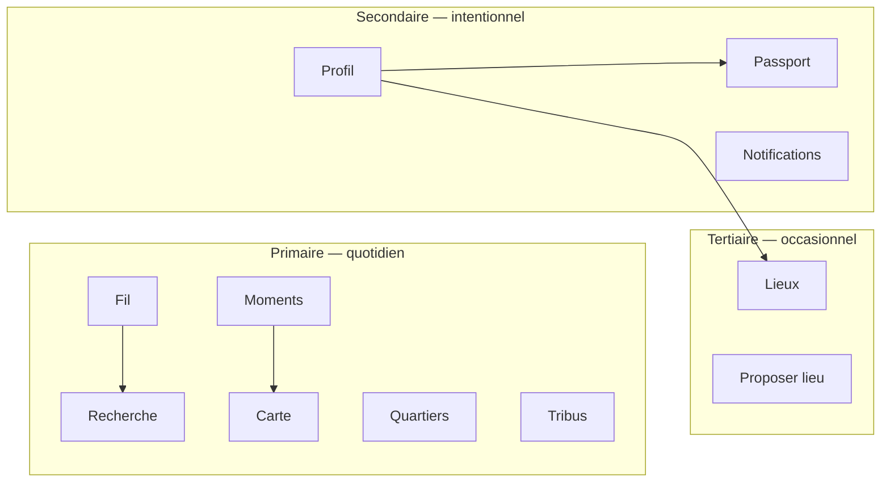

# Navigation Review — SPRINT-UX-01

| Champ | Valeur |
|-------|--------|
| Section | §1 — Navigation Audit |
| Référence | [ux-hardening-audit.md](./ux-hardening-audit.md) |
| Code web | `frontend/apps/web/lib/layout/web-layout-config.ts` |
| Code mobile | `frontend/apps/mobile/app/(protected)/(tabs)/_layout.tsx` |

---

## 1. Objectif

Cartographier navigation **primaire** vs **secondaire**, repérer surcharge cognitive et redondances, proposer des ajustements **sans casser** l’architecture routes actuelle.

---

## 2. Web — navigation citoyenne

### 2.1 Architecture

| Élément | Fichier | Rôle |
|---------|---------|------|
| Config canonique | `web-layout-config.ts` → `WEB_CITIZEN_NAV` | Source unique labels + href |
| Sidebar desktop | `web-sidebar.tsx` | Nav sticky lg+ |
| Header mobile | `web-mobile-chrome.tsx` | Même liste, `flex-wrap` |
| Shell | `web-app-shell.tsx` | Grille + rail contextuel optionnel |

Pas de bottom tab bar web — choix cohérent pour desktop-first, **fatigue possible sur mobile web** (11 liens visibles).

### 2.2 Inventaire navigation primaire (actuelle)

| # | href | Label nav | Match | Usage attendu |
|---|------|-----------|-------|---------------|
| 1 | `/feed` | Fil local | prefix | **Pilier** — home émotionnelle |
| 2 | `/search` | Recherche | prefix | **Pilier** — découverte transverse |
| 3 | `/events` | Événements | prefix | **Pilier** — calendrier (titre page : Moments locaux) |
| 4 | `/map` | Carte | prefix | **Pilier** — exploration spatiale |
| 5 | `/neighborhoods` | Quartiers | prefix | **Pilier** — territoire |
| 6 | `/tribes` | Tribus | prefix | **Pilier** — communautés légères |
| 7 | `/notifications` | Notifications | prefix | **Secondaire** — inbox |
| 8 | `/passport` | Passport | prefix | **Secondaire** — wallet local |
| 9 | `/profile/me` | Profil | prefix | **Compte** |
| 10 | `/organizations/me` | Lieux | prefix | **Partenaire / org** |
| 11 | `/organizations/request` | Proposer un lieu | prefix | **Onboarding** — faible fréquence |

**Observation :** 6 piliers territoriaux + 5 entrées compte/outil au **même poids visuel**.

### 2.3 Navigation secondaire web

| Type | Exemple | Fichiers |
|------|---------|----------|
| Onglets in-page | Recherche : Tous / Publications / Événements… | `search-type-tabs.tsx` |
| Rail contextuel | Fil : Profil, Recherche ville, Passport, Proposer lieu | `feed-context-rail.tsx` |
| Asides | Profil, Mes lieux | `web-page-asides.tsx` |
| Liens tribu | Retour fil, toutes tribus | `tribes-screen.tsx` |
| Profil public | Header minimal hors shell | `profile/[username]/page.tsx` |

**Redondance :** « Proposer un lieu » dans **nav globale** ET rail fil.

### 2.4 Profondeur navigation web

| Profondeur | Exemples |
|------------|----------|
| 1 | `/feed`, `/map`, `/search` |
| 2 | `/events/[id]`, `/tribes/[slug]`, `/profile/me` |

Profondeur **faible** — bon pour compréhension. Hub détail événement unique : `/events/[id]`.

### 2.5 Incohérences libellés

| Zone | Libellé A | Libellé B |
|------|-----------|-----------|
| Nav | Événements | Titre page : Moments locaux |
| Mobile tab | Moments | Titre : Moments locaux |

**Impact :** utilisateur cherche « Événements » sur mobile, voit « Moments ».

### 2.6 Surfaces trop visibles vs sous-utilisées (hypothèses beta)

| Trop visible (sans preuve usage) | Sous-utilisée (risque) |
|----------------------------------|------------------------|
| Proposer un lieu (nav primaire) | Tribus (si pas d’invitation) |
| Notifications (si peu de push) | Quartiers (si pas de découverte depuis fil) |
| Lieux (citoyen non partenaire) | Carte (si pas de lien depuis events mobile) |

---

## 3. Mobile — tab bar & stacks

### 3.1 Onglets (8)

Fichier : `(tabs)/_layout.tsx`

| Tab | Label | Écran | Header |
|-----|-------|-------|--------|
| feed | Fil | `FeedScreen` | Custom |
| events | Moments | Liste événements | Custom |
| map | Carte | `EventMapScreen` | Custom |
| neighborhoods | Quartiers | Liste | Custom |
| tribes | Tribus | Liste | Custom |
| passport | Passport | Wallet | Custom |
| profile | Profil | Profil | **Natif Expo** |
| organizations | Lieux | Liste orgs | **Natif Expo** |

**Problème P0 :** 8 icônes + labels = **saturation barre** (iPhone SE / petits devices : labels tronqués).

### 3.2 Stack hors tabs (14 routes)

Catégories :

| Catégorie | Routes | Profondeur max |
|-----------|--------|----------------|
| Territoire | `neighborhoods/[slug]`, `tribes/[slug]`, `events/[id]` | 2 taps depuis tab |
| Découverte | `search` | 1 tap depuis Fil ou Profil |
| Passport | `passport/present` (modal) | 2 |
| Partenaire | `partner-offers/*`, `partner-scan/*` (5 écrans) | **5** depuis Lieux |
| Org | `organizations/request` | 2 |

**Flow le plus lourd :** Partner scan (Lieux → hub → scan/manual → offers → result).

### 3.3 Redondances mobile

| Redondance | Détail |
|------------|--------|
| Recherche ×2 | Entrée Fil + Profil → même `search` |
| Passport ×N | Tab + lien fil offre + résultats recherche |
| Hub `events/[id]` | OK — convergence carte / moments / quartier / recherche |

### 3.4 Navigation primaire recommandée (cible)

**Tier A — tabs visibles (5 max)**

1. Fil  
2. Moments (libellé unifié)  
3. Carte  
4. Quartiers  
5. Tribus  

**Tier B — accessible depuis Profil ou menu « Plus »**

- Passport  
- Lieux (partenaires)  
- Recherche (icône header Fil **seule** primaire)  
- Notifications  

**Implémentation sans casser routes :** masquer tabs via `href: null` Expo Router ou regrouper sous stack `more/` — **design only ici**.

---

## 4. Cartographie primaire / secondaire (synthèse)

---

## 5. Recommandations (sans refactor architecture)

| # | Recommandation | Priorité | Casser routes ? |
|---|----------------|----------|-----------------|
| N1 | Web : retirer « Proposer un lieu » de `WEB_CITIZEN_NAV` → lien Profil / Lieux / rail | P1 | Non |
| N2 | Web : regrouper Lieux + Proposer sous section Profil aside | P1 | Non |
| N3 | Mobile : réduire à 5 tabs + menu Plus | P0 | Non (config tabs) |
| N4 | Unifier libellé **Moments** (nav + page + web) | P1 | Non |
| N5 | Une entrée Recherche primaire mobile (header Fil) | P1 | Non |
| N6 | Notifications : badge header, pas tab | P2 | Non |
| N7 | Lien explicite Moments → Carte (mobile) | P1 | Non |

---

## 6. Métriques MEASURE (beta)

| Métrique | Comment mesurer |
|----------|-----------------|
| Taps to event detail | Scénario beta #1 |
| Tab confusion rate | « Où est la carte ? » spontané |
| Nav item recall | Post-session : lister 5 fonctions vues |
| Time on primary vs secondary | Analytics (si instrumenté) |

---

## 7. Non-objectifs

- Pas de refonte `expo-router` tree  
- Pas de fusion Tribus / Quartiers  
- Pas de bottom nav web  

---

*Voir aussi : [mobile-fatigue-review.md](./mobile-fatigue-review.md), [product-coherence-report.md](./product-coherence-report.md)*
