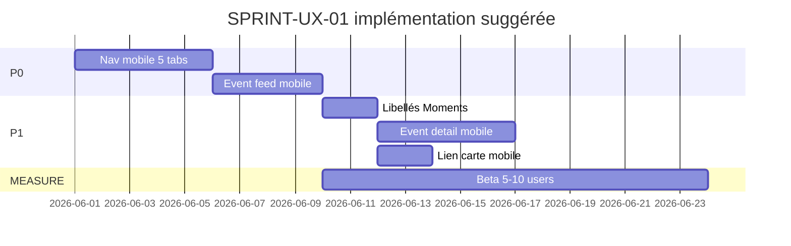

# Product Coherence Report — SPRINT-UX-01

| Champ | Valeur |
|-------|--------|
| Section | §10 — Synthèse finale |
| Date | 2026-05-25 |
| Phase | MEASURE (DISCOVER + DESIGN) |
| Documents liés | Tous fichiers `docs/measure/*.md` |

---

## 1. Question finale

> **Yunicity ressemble-t-il maintenant à une vraie expérience locale ?**

**Réponse (état code + doctrine, pré-beta terrain) :**

**Oui, structurellement** — ville nommée, quartiers, tribus, moments locaux, carte calme, Passport ancré commerce local.  
**Pas encore pleinement mémorable** — hiérarchie navigation mobile, parité feed/détail, et densité émotionnelle du fil restent en deçà d’une expérience « je sens Reims vivante » au quotidien.

La beta ([beta-observation-script.md](./beta-observation-script.md)) tranchera entre **produit crédible** et **expérience mémorable**.

---

## 2. Maturité produit

| Dimension | Niveau (1–5) | Commentaire |
|-----------|--------------|-------------|
| Couverture fonctionnelle | **5** | Fil, territoire, events, carte, recherche, passport, offres |
| Cohérence territoriale | **4** | Reims seed, carte, quartiers ; libellés à unifier |
| Cohérence web/mobile | **3** | Event feed mobile, détail event, lien carte mobile |
| Hiérarchie UX | **2–3** | 11 nav web, 8 tabs mobile |
| Émotion / densité | **3** | Calme OK ; pulse locale faible dans fil mobile |
| Prêt beta fermée Reims | **4** | Oui avec script + compte démo |
| Prêt scale multi-ville | **2** | Dépend contenu + ville profil — hors sprint |

**Maturité globale estimée :** **MVP+ / Beta-ready** — pas encore **Growth-ready**.

---

## 3. Cohérence produit

### 3.1 Pilier narratif

| Pilier | Surfaces | Cohérent ? |
|--------|----------|------------|
| **Vivre la ville** | Fil, quartiers, carte | Oui |
| **Moments dans le temps** | Events, carte, feed event (web) | Partiel mobile |
| **Appartenance légère** | Tribus | Oui ; écran lourd |
| **Relation locale économique** | Passport, offres, lieux | Oui ; jargon Passport |
| **Découverte** | Recherche | Oui ; entrées multiples mobile |

### 3.2 Doctrine respectée

| Règle | Statut |
|-------|--------|
| Pas de géoloc user carte | ✅ |
| Carte non anxiogène | ✅ |
| Pas de viralité / streaks | ✅ |
| API métier hors UI | ✅ |
| Texte UI français | ✅ |

### 3.3 Incohérences à traiter (P0/P1)

1. Vocabulaire Événements / Moments / Fil.  
2. Navigation même poids pour outils rares (Proposer lieu) et Fil.  
3. Mobile : 8 tabs vs 5 piliers produit.  
4. Event dans fil invisible sur mobile.

---

## 4. Forces

1. **Stack territorial complète** — rare à ce stade MVP.
2. **Carte FEATURE-D** — alignée vision « voir sa ville ».
3. **Architecture frontend maintenable** — config nav web, hooks map partagés, labels utils.
4. **Séparation calme / feed** — pas de FOMO algorithmique visible.
5. **Passport différenciant** — hors modèle réseau social classique.
6. **Seed Reims géolocalisé** — QA carte réaliste ([commit seed](../../backend/app/db/seeds/reims_demo_content.py)).

---

## 5. Risques

| Risque | Probabilité | Impact | Mitigation |
|--------|-------------|--------|------------|
| Fatigue tabs mobile | Haute | Abandon | UX-01 P0 nav |
| « Encore une app » | Moyenne | Non-adoption | Beta message local + wow moments |
| Parité mobile faible | Haute | Confiance | Event feed + détail P1 |
| Surcharge partenaire (Lieux/scan) | Moyenne | Confusion citoyen | Hub Profil, rôle clair |
| Carte vide sans seed | Moyenne | Déception | Seed + empty copy |
| Scope creep post-audit | Haute | Dette | Matrice P0/P1 stricte |

---

## 6. Dette UX (non technique)

| Dette | Type | Priorité traitement |
|-------|------|---------------------|
| 8 tabs | Structure IA | P0 |
| Event card mobile | Parité | P0 |
| Libellés mixtes | Copy | P1 |
| Tribu monolith UI | Composition | P2 |
| Rail web redondant | Layout | P2 |
| Empty states froids | Copy/émotion | P1 |

**Dette technique liée :** `tribes/[slug].tsx` taille — refacto composants **P2**, pas sprint redesign.

---

## 7. Readiness beta Reims

| Critère | Ready ? |
|---------|---------|
| Parcours démo complet | ✅ |
| Compte + seed | ✅ |
| Script observation | ✅ (ce doc) |
| Carte web | ✅ |
| Carte mobile | ⚠️ dev build Mapbox requis |
| Instrumentation analytics | ❓ à définir (MEASURE) |
| Support feedback | ❓ canal à définir |

**Verdict :** **GO beta fermée 5–10 users** après validation CTO matrice P0.

---

## 8. Positionnement vs réseaux sociaux

| | TikTok / FB / Snap | Yunicity aujourd’hui |
|---|-------------------|----------------------|
| Boucle addictive | Infinie | Pagination « Charger plus » |
| Portée | Globale | Ville / quartier |
| Preuve sociale | Likes publics | Intérêt moment (discret) |
| Temps réel | Stories, online | Non |
| Carte | Rare / check-in | Exploration events calme |

**Unique selling experience :** *« Je sais ce qui se passe près de chez moi sans me sentir surveillé. »*

---

## 9. Roadmap hardening recommandée (post-DECIDE)

Ordre suggéré **sans grosses features** :

1. **P0** — Tabs + event feed mobile  
2. **P1** — Détail + liens + copy  
3. **MEASURE** — Beta + ANALYZE  
4. **DECIDE** — P2 ou repousser  

---

## 10. Synthèse exécutive CTO

| Question | Réponse |
|----------|---------|
| Fonctionnel ? | **Oui** |
| Cohérent territorialement ? | **Oui, avec réserves copy/nav** |
| Mémorable ? | **En progression** — beta requise |
| Prochain risque ? | **Surcharge UX mobile**, pas manque de features |
| Action immédiate ? | Valider P0/P1, lancer beta, **ne pas** ajouter couches sociales |

---

## 11. Index documents MEASURE

| Document | Contenu |
|----------|---------|
| [ux-hardening-audit.md](./ux-hardening-audit.md) | Audit transversal, carte, émotion, matrice, reco |
| [navigation-review.md](./navigation-review.md) | Web + mobile nav |
| [feed-density-review.md](./feed-density-review.md) | Fil local |
| [event-detail-review.md](./event-detail-review.md) | Fiche événement |
| [mobile-fatigue-review.md](./mobile-fatigue-review.md) | Fatigue mobile |
| [beta-observation-script.md](./beta-observation-script.md) | Protocole terrain |

---

## 12. Validation

| Stakeholder | Validation matrice P0/P1 | Date |
|-------------|--------------------------|------|
| Product | ☐ | |
| CTO | ☐ | |
| Design (si applicable) | ☐ | |

**Aucun commit code** issu de ce sprint documentaire sans ticket validé explicitement.

---

*Rapport à mettre à jour après beta — section 1 et 7 en priorité.*
