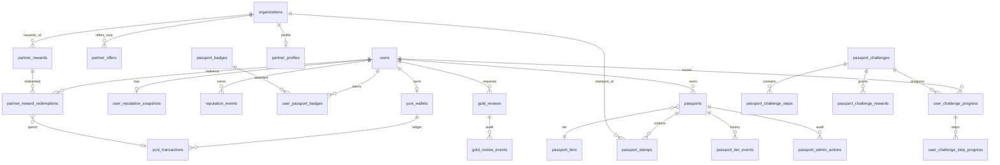

# PASSPORT-V2-B.3 — Data Model & Plan BMAD

> **Feature :** FEATURE-PASSPORT-V2  
> **Ticket :** PASSPORT-V2-B.3  
> **Phase :** ARCHITECTURE (BUILD prep)  
> **Statut :** **DRAFT — review CTO**  
> **Prérequis validés :** PASSPORT-V2-A DISCOVER · PASSPORT-V2-B.1 PRD · PASSPORT-V2-B.2 ADR  
> **Scope :** modèle de données, relations, contraintes, services, endpoints futurs, sprints BMAD — **aucun code**

---

## Références amont

| Document / artefact | Rôle |
|---------------------|------|
| PASSPORT-V2-A DISCOVER | Besoins, personas, principes produit |
| PASSPORT-V2-B.1 PRD | Règles métier, périmètre MVP/V2 |
| PASSPORT-V2-B.2 ADR | Décisions techniques (hybride, ledger, anti-abus) |
| `backend/app/models/passport.py` | Fondation existante (passports, tiers, stamps, offers) |
| `backend/app/core/passport_level_rules.py` | Seuils réputation MVP (à migrer vers event-sourcing) |
| `docs/prd/PRD-301-passport-benefits-foundation.md` | Vision fondatrice |

### Décisions produit verrouillées (rappel)

- Passport **hybride** : réputation historique permanente + statut actif réversible.
- **Silver** automatique · **Gold** hybride (éligibilité + revue staff).
- **Badges** visibles + secrets · **Défis** équilibrés avec progression persistée.
- **YuniMonnaie (YM)** : monnaie d’engagement territoriale, non convertible, non transférable, **ledger append-only**.
- **Rewards partenaires** : YM + € symbolique + minimum d’achat · anti-abus dès MVP.
- Gold = prestige + expériences + privilèges limités (pas de cashback national).

---

## 1. Vue d’ensemble architecture Passport V2

### 1.1 Principes d’architecture

```
┌─────────────────────────────────────────────────────────────────────────┐
│                         COUCHE PRÉSENTATION                              │
│   Web / Mobile (citoyen) · Partner cockpit · Admin passport-v2          │
└─────────────────────────────────────────────────────────────────────────┘
                                    │
                                    ▼
┌─────────────────────────────────────────────────────────────────────────┐
│                         API /api/v1 (routers fins)                       │
│   passport · organizations/partner · admin/passport-v2                   │
└─────────────────────────────────────────────────────────────────────────┘
                                    │
                                    ▼
┌─────────────────────────────────────────────────────────────────────────┐
│                         SERVICES MÉTIER                                  │
│   Reputation · Wallet · Badge · Challenge · PartnerReward · Tier · Gold  │
│   AntiAbuse (transversal)                                                  │
└─────────────────────────────────────────────────────────────────────────┘
                                    │
                                    ▼
┌─────────────────────────────────────────────────────────────────────────┐
│                    PERSISTANCE PostgreSQL                                │
│   Event-sourcing réputation · Ledger YM · Catalogues · Progressions      │
│   + tables existantes : users, passports, passport_stamps, partner_offers│
└─────────────────────────────────────────────────────────────────────────┘
```

### 1.2 Séparation des concepts (invariant produit)

| Concept | Rôle | Mutabilité | Visible citoyen |
|---------|------|------------|-----------------|
| **Réputation** | Score d’engagement territorial cumulé | Historique **append-only** ; total via snapshot | Oui (score + historique résumé) |
| **YuniMonnaie** | Monnaie d’échange locale (rewards) | Ledger **append-only** ; solde dérivé | Oui (wallet) |
| **Tier (Basic/Silver/Gold)** | Statut de prestige + accès offres | Silver auto ; Gold via revue ; réversible si passport suspendu | Oui |
| **Statut passport** | Autorisation opérationnelle (scan, redeem) | **Réversible** (active/suspended/revoked) | Oui (badge statut) |
| **Badges** | Accomplissements narratifs | Earn-once ; catalogue admin | Visibles ou secrets |
| **Défis** | Parcours guidés multi-étapes | Progression persistée ; récompenses claim idempotent | Visibles ou secrets |
| **Partner rewards** | Catalogue échange YM (+ € symbolique) | Stock/limites ; redemption avec expiration | Oui (catalogue filtré tier) |

### 1.3 Stratégie d’intégration avec le MVP existant

Le repo possède déjà un socle solide (`passports`, `passport_tiers`, `passport_stamps`, `partner_offers`, `passport_offer_redemptions`, `passport_tier_events`, `passport_admin_actions`). Passport V2 **étend** ce socle sans le remplacer :

1. **Réputation** : remplace le calcul éphémère `PassportLevelService.compute_reputation_score()` par un modèle event-sourced ; `passports.reputation_score` devient **cache dénormalisé** synchronisé par service (puis lecture snapshot en V2.1).
2. **Offres vs Rewards** : `partner_offers` (MVP, redemption QR passport) **coexiste** avec `partner_rewards` (catalogue YM V2). Pas de fusion en MVP V2 — lien documenté en §8.
3. **Tiers** : réutilise `passport_tiers` + `passport_tier_events` ; Silver auto via nouveau service ; Gold via `gold_reviews`.
4. **Partenaires** : FK **`organization_id`** (convention repo — `PartnerOffer`, `PassportStamp`), pas `partner_profile_id` direct (relation 1:1 via `organizations.partner_profile`).

---

## 2. Tables PostgreSQL proposées

### 2.1 Réputation

#### `reputation_events`

Journal immuable des attributions de points.

| Colonne | Type | Contraintes |
|---------|------|-------------|
| `id` | UUID | PK, default `gen_random_uuid()` |
| `user_id` | UUID | FK → `users.id` ON DELETE CASCADE, NOT NULL |
| `event_type` | VARCHAR(64) | NOT NULL — allowlist application |
| `source_type` | VARCHAR(64) | NOT NULL — allowlist application |
| `source_id` | UUID | NULLABLE — ID de la source métier |
| `points` | INTEGER | NOT NULL, CHECK (`points > 0`) |
| `metadata` | JSONB | NULLABLE, default `'{}'` |
| `created_at` | TIMESTAMPTZ | NOT NULL, default `now()` |

**Allowlist `event_type` (MVP V2) :**

`stamp_collected` · `offer_redeemed` · `local_post_published` · `event_attended` · `challenge_completed` · `badge_earned` · `tenure_bonus` · `verified_account_bonus` · `admin_adjustment` · `migration_backfill`

**Allowlist `source_type` :**

`passport_stamp` · `passport_offer_redemption` · `local_event` · `post` · `passport_challenge` · `passport_badge` · `user` · `admin_action` · `migration`

#### `user_reputation_snapshots`

Matérialisation du total par utilisateur (lecture rapide).

| Colonne | Type | Contraintes |
|---------|------|-------------|
| `user_id` | UUID | PK, FK → `users.id` ON DELETE CASCADE |
| `total_points` | INTEGER | NOT NULL, default 0, CHECK (`total_points >= 0`) |
| `last_event_at` | TIMESTAMPTZ | NULLABLE |
| `updated_at` | TIMESTAMPTZ | NOT NULL, default `now()` |

---

### 2.2 YuniMonnaie

#### `yuni_wallets`

Un wallet par utilisateur.

| Colonne | Type | Contraintes |
|---------|------|-------------|
| `id` | UUID | PK |
| `user_id` | UUID | FK → `users.id` ON DELETE CASCADE, UNIQUE, NOT NULL |
| `balance` | INTEGER | NOT NULL, default 0, CHECK (`balance >= 0`) |
| `lifetime_earned` | INTEGER | NOT NULL, default 0, CHECK (`lifetime_earned >= 0`) |
| `lifetime_spent` | INTEGER | NOT NULL, default 0, CHECK (`lifetime_spent >= 0`) |
| `status` | VARCHAR(16) | NOT NULL, default `'active'` — `active` \| `suspended` |
| `created_at` | TIMESTAMPTZ | NOT NULL |
| `updated_at` | TIMESTAMPTZ | NOT NULL |

#### `yuni_transactions`

Ledger append-only.

| Colonne | Type | Contraintes |
|---------|------|-------------|
| `id` | UUID | PK |
| `wallet_id` | UUID | FK → `yuni_wallets.id` ON DELETE RESTRICT, NOT NULL |
| `type` | VARCHAR(16) | NOT NULL — `EARN` \| `SPEND` \| `ADJUSTMENT` \| `REVERSAL` \| `EXPIRE` |
| `amount` | INTEGER | NOT NULL, CHECK (`amount > 0`) |
| `balance_after` | INTEGER | NOT NULL, CHECK (`balance_after >= 0`) |
| `reference_type` | VARCHAR(64) | NOT NULL |
| `reference_id` | UUID | NULLABLE |
| `metadata` | JSONB | NULLABLE, default `'{}'` |
| `created_at` | TIMESTAMPTZ | NOT NULL, default `now()` |

**Décision CTO — timing débit YM (rewards) :**

| Étape | Action ledger | Statut redemption |
|-------|---------------|-------------------|
| `POST .../rewards/{id}/redeem` | `SPEND` atomique (solde vérifié) | `pending` |
| Confirmation partenaire (scan QR) | — (déjà débité) | `confirmed` |
| Annulation / expiration | `REVERSAL` idempotent | `cancelled` / `expired` |

Pas de transfert user-to-user. Pas de conversion €. `EXPIRE` réservé V2.1 (YM avec date d’expiration configurable).

---

### 2.3 Badges

#### `passport_badges`

Catalogue admin.

| Colonne | Type | Contraintes |
|---------|------|-------------|
| `id` | UUID | PK |
| `code` | VARCHAR(64) | UNIQUE, NOT NULL |
| `name` | VARCHAR(128) | NOT NULL |
| `description` | TEXT | NULLABLE |
| `family` | VARCHAR(32) | NOT NULL — `explorer` \| `culture` \| `citizen` \| `prestige` \| `creator` \| `secret` |
| `visibility` | VARCHAR(16) | NOT NULL — `visible` \| `secret` |
| `rarity` | VARCHAR(16) | NOT NULL — `common` \| `rare` \| `epic` \| `legendary` |
| `reputation_reward` | INTEGER | NOT NULL, default 0, CHECK (`>= 0`) |
| `ym_reward` | INTEGER | NOT NULL, default 0, CHECK (`>= 0`) |
| `is_active` | BOOLEAN | NOT NULL, default true |
| `display_order` | INTEGER | NOT NULL, default 0 |
| `created_at` | TIMESTAMPTZ | NOT NULL |
| `updated_at` | TIMESTAMPTZ | NOT NULL |

#### `user_passport_badges`

Attribution utilisateur (earn-once).

| Colonne | Type | Contraintes |
|---------|------|-------------|
| `id` | UUID | PK |
| `user_id` | UUID | FK → `users.id` ON DELETE CASCADE |
| `badge_id` | UUID | FK → `passport_badges.id` ON DELETE RESTRICT |
| `earned_at` | TIMESTAMPTZ | NOT NULL, default `now()` |
| `source_type` | VARCHAR(64) | NOT NULL |
| `source_id` | UUID | NULLABLE |
| `metadata` | JSONB | NULLABLE, default `'{}'` |

**Contrainte :** UNIQUE (`user_id`, `badge_id`).

---

### 2.4 Défis

#### `passport_challenges`

| Colonne | Type | Contraintes |
|---------|------|-------------|
| `id` | UUID | PK |
| `code` | VARCHAR(64) | UNIQUE, NOT NULL |
| `title` | VARCHAR(160) | NOT NULL |
| `description` | TEXT | NULLABLE |
| `category` | VARCHAR(32) | NOT NULL — `discovery` \| `economy` \| `citizen` \| `culture` \| `seasonal` \| `partner` \| `prestige` \| `secret` |
| `visibility` | VARCHAR(16) | NOT NULL — `visible` \| `secret` |
| `status` | VARCHAR(16) | NOT NULL — `draft` \| `active` \| `paused` \| `archived` |
| `starts_at` | TIMESTAMPTZ | NULLABLE |
| `ends_at` | TIMESTAMPTZ | NULLABLE |
| `organization_id` | UUID | NULLABLE, FK → `organizations.id` ON DELETE SET NULL |
| `city` | VARCHAR(128) | NOT NULL |
| `max_completions` | INTEGER | NULLABLE, CHECK (`max_completions IS NULL OR max_completions > 0`) |
| `created_at` | TIMESTAMPTZ | NOT NULL |
| `updated_at` | TIMESTAMPTZ | NOT NULL |

#### `passport_challenge_steps`

| Colonne | Type | Contraintes |
|---------|------|-------------|
| `id` | UUID | PK |
| `challenge_id` | UUID | FK → `passport_challenges.id` ON DELETE CASCADE |
| `step_type` | VARCHAR(32) | NOT NULL — `stamp_partner` \| `explore_district` \| `attend_event` \| `use_offer` \| `custom` |
| `required_count` | INTEGER | NOT NULL, CHECK (`required_count > 0`) |
| `constraints` | JSONB | NOT NULL, default `'{}'` |
| `display_order` | INTEGER | NOT NULL, default 0 |

**Exemple `constraints` :**

```json
{ "organization_id": "uuid", "district": "Centre", "event_id": "uuid", "offer_id": "uuid" }
```

#### `passport_challenge_rewards`

| Colonne | Type | Contraintes |
|---------|------|-------------|
| `id` | UUID | PK |
| `challenge_id` | UUID | FK → `passport_challenges.id` ON DELETE CASCADE |
| `reward_type` | VARCHAR(32) | NOT NULL — `reputation` \| `ym` \| `badge` \| `tier_eligibility` \| `custom` |
| `amount` | INTEGER | NULLABLE |
| `badge_id` | UUID | NULLABLE, FK → `passport_badges.id` |
| `metadata` | JSONB | NULLABLE, default `'{}'` |

#### `user_challenge_progress`

| Colonne | Type | Contraintes |
|---------|------|-------------|
| `id` | UUID | PK |
| `user_id` | UUID | FK → `users.id` ON DELETE CASCADE |
| `challenge_id` | UUID | FK → `passport_challenges.id` ON DELETE CASCADE |
| `status` | VARCHAR(16) | NOT NULL — `not_started` \| `in_progress` \| `completed` \| `claimed` \| `expired` |
| `progress_percent` | INTEGER | NOT NULL, default 0, CHECK (`0 <= progress_percent <= 100`) |
| `started_at` | TIMESTAMPTZ | NULLABLE |
| `completed_at` | TIMESTAMPTZ | NULLABLE |
| `claimed_at` | TIMESTAMPTZ | NULLABLE |
| `updated_at` | TIMESTAMPTZ | NOT NULL |

**Contrainte :** UNIQUE (`user_id`, `challenge_id`).

#### `user_challenge_step_progress`

| Colonne | Type | Contraintes |
|---------|------|-------------|
| `id` | UUID | PK |
| `user_challenge_progress_id` | UUID | FK → `user_challenge_progress.id` ON DELETE CASCADE |
| `step_id` | UUID | FK → `passport_challenge_steps.id` ON DELETE CASCADE |
| `current_count` | INTEGER | NOT NULL, default 0, CHECK (`current_count >= 0`) |
| `completed_at` | TIMESTAMPTZ | NULLABLE |
| `metadata` | JSONB | NULLABLE, default `'{}'` |

**Contrainte :** UNIQUE (`user_challenge_progress_id`, `step_id`).

---

### 2.5 Récompenses partenaires (catalogue YM)

#### `partner_rewards`

| Colonne | Type | Contraintes |
|---------|------|-------------|
| `id` | UUID | PK |
| `organization_id` | UUID | FK → `organizations.id` ON DELETE CASCADE, NOT NULL |
| `title` | VARCHAR(160) | NOT NULL |
| `description` | TEXT | NULLABLE |
| `reward_type` | VARCHAR(32) | NOT NULL — `discount` \| `free_item` \| `experience` \| `priority_access` \| `custom` |
| `ym_cost` | INTEGER | NOT NULL, default 0, CHECK (`ym_cost >= 0`) |
| `cash_amount_cents` | INTEGER | NOT NULL, default 0, CHECK (`cash_amount_cents >= 0`) |
| `minimum_purchase_cents` | INTEGER | NOT NULL, default 0, CHECK (`minimum_purchase_cents >= 0`) |
| `monthly_stock` | INTEGER | NULLABLE, CHECK (`monthly_stock IS NULL OR monthly_stock > 0`) |
| `monthly_limit_per_user` | INTEGER | NOT NULL, default 1, CHECK (`monthly_limit_per_user > 0`) |
| `starts_at` | TIMESTAMPTZ | NULLABLE |
| `ends_at` | TIMESTAMPTZ | NULLABLE |
| `status` | VARCHAR(16) | NOT NULL — `draft` \| `active` \| `paused` \| `archived` |
| `tier_required` | VARCHAR(32) | NULLABLE — `basic` \| `silver` \| `gold` |
| `terms` | TEXT | NULLABLE |
| `created_at` | TIMESTAMPTZ | NOT NULL |
| `updated_at` | TIMESTAMPTZ | NOT NULL |

> **Convention repo :** FK `organization_id` (comme `partner_offers`, `passport_stamps`). Le partenaire signé est résolu via `organizations.partner_profile`.

#### `partner_reward_redemptions`

| Colonne | Type | Contraintes |
|---------|------|-------------|
| `id` | UUID | PK |
| `reward_id` | UUID | FK → `partner_rewards.id` ON DELETE RESTRICT |
| `user_id` | UUID | FK → `users.id` ON DELETE CASCADE |
| `organization_id` | UUID | FK → `organizations.id` ON DELETE CASCADE |
| `yuni_transaction_id` | UUID | NULLABLE, FK → `yuni_transactions.id` ON DELETE RESTRICT |
| `cash_amount_cents` | INTEGER | NOT NULL, default 0 |
| `status` | VARCHAR(16) | NOT NULL — `pending` \| `confirmed` \| `cancelled` \| `expired` |
| `qr_token_hash` | VARCHAR(128) | NULLABLE — hash SHA-256 du token éphémère |
| `redeemed_at` | TIMESTAMPTZ | NULLABLE |
| `expires_at` | TIMESTAMPTZ | NOT NULL |
| `created_at` | TIMESTAMPTZ | NOT NULL |
| `updated_at` | TIMESTAMPTZ | NOT NULL |

**Règles MVP :**

- Pas de remboursement cash côté Yunicity (`cash_amount_cents` = montant symbolique affiché, encaissé par le partenaire).
- `expires_at` obligatoire (défaut : 15 min après création, configurable via settings).
- Stock mensuel : compteur via agrégation redemptions `confirmed` du mois courant (ou colonne matérialisée V2.1 si perf).

---

### 2.6 Gold (revue hybride)

#### `gold_reviews`

| Colonne | Type | Contraintes |
|---------|------|-------------|
| `id` | UUID | PK |
| `user_id` | UUID | FK → `users.id` ON DELETE CASCADE, NOT NULL |
| `status` | VARCHAR(16) | NOT NULL — `pending` \| `approved` \| `rejected` \| `revoked` |
| `eligibility_snapshot` | JSONB | NOT NULL — critères au moment de la demande |
| `requested_at` | TIMESTAMPTZ | NOT NULL, default `now()` |
| `reviewed_by` | UUID | NULLABLE, FK → `users.id` ON DELETE SET NULL |
| `reviewed_at` | TIMESTAMPTZ | NULLABLE |
| `decision_reason` | TEXT | NULLABLE |
| `created_at` | TIMESTAMPTZ | NOT NULL |
| `updated_at` | TIMESTAMPTZ | NOT NULL |

**Contrainte :** un seul review **actif** (`pending` ou `approved`) par user — index unique partiel :

```sql
CREATE UNIQUE INDEX uq_gold_reviews_one_active_per_user
  ON gold_reviews (user_id)
  WHERE status IN ('pending', 'approved');
```

#### `gold_review_events`

| Colonne | Type | Contraintes |
|---------|------|-------------|
| `id` | UUID | PK |
| `gold_review_id` | UUID | FK → `gold_reviews.id` ON DELETE CASCADE |
| `actor_id` | UUID | NULLABLE, FK → `users.id` ON DELETE SET NULL |
| `event_type` | VARCHAR(32) | NOT NULL — `requested` \| `approved` \| `rejected` \| `revoked` \| `restored` |
| `notes` | TEXT | NULLABLE |
| `created_at` | TIMESTAMPTZ | NOT NULL, default `now()` |

**RBAC :** approval/reject/revoke réservé `SUPER_ADMIN` / `CITY_ADMIN` (permissions existantes `auth_rbac.py`).

---

### 2.7 Statut actif Passport — décision Option A

#### Analyse des options

| Critère | Option A — colonnes `passports` | Option B — `passport_status_events` |
|---------|--------------------------------|-------------------------------------|
| Cohérence repo | **Déjà en place** : `status`, `suspended_at`, index partiel one-active-per-user | Nouvelle table ; chevauche `passport_admin_actions` |
| Lecture hot path | **1 requête** sur `passports` | JOIN ou reconstruction |
| Audit | `passport_admin_actions` existant (ADMIN-03B) | Audit complet mais redondant |
| Migration | Ajout 2 colonnes | Nouvelle table + backfill |

#### Décision CTO : **Option A étendue + audit existant**

Étendre `passports` avec :

| Colonne nouvelle | Type | Notes |
|------------------|------|-------|
| `suspension_reason` | TEXT | NULLABLE ; obligatoire si `status = suspended` (check application) |
| `suspended_until` | TIMESTAMPTZ | NULLABLE ; suspension temporaire auto-restore via job |

**Conserver :**

- `passports.status` (`active` / `suspended` / `revoked`) — enum existant `PassportStatus`.
- `passports.suspended_at` — déjà présent.
- `passport_admin_actions` — journal audit staff (action, actor, previous/new status, reason).

**Ne pas créer** `passport_status_events` en V2 — évite duplication avec `passport_admin_actions`. Si besoin d’historique citoyen-facing V3, exporter depuis admin actions + tier events.

---

## 3. Relations entre tables

### 3.1 Diagramme entité-relation (V2)



### 3.2 Cardinalités clés

| Relation | Cardinalité | Notes |
|----------|-------------|-------|
| `users` → `yuni_wallets` | 1:1 | Création lazy à première activité YM |
| `users` → `user_reputation_snapshots` | 1:1 | Création lazy à première attribution |
| `users` → `passports` | 1:1 actif | Index partiel existant `status = active` |
| `passport_badges` → `user_passport_badges` | 1:N | UNIQUE (user, badge) |
| `passport_challenges` → `user_challenge_progress` | 1:N | UNIQUE (user, challenge) |
| `partner_rewards` → `partner_reward_redemptions` | 1:N | Limites stock/user |
| `gold_reviews` → user | N:1 | 1 actif max (pending/approved) |

---

## 4. Contraintes métier

### 4.1 Réputation

| ID | Règle | Enforcement |
|----|-------|-------------|
| REP-01 | Points toujours > 0 par event | CHECK DB + validation service |
| REP-02 | Pas de DELETE sur `reputation_events` | Pas de route DELETE ; soft policy migration |
| REP-03 | Idempotence attribution | UNIQUE partiel `(user_id, source_type, source_id) WHERE source_id IS NOT NULL` |
| REP-04 | Snapshot = SUM(events) | Service transactionnel ; job réconciliation nightly V2.1 |
| REP-05 | `admin_adjustment` requiert actor + reason | metadata obligatoire + `passport_admin_actions` |
| REP-06 | Réputation **ne diminue jamais** (historique permanent) | Pas d’events négatifs ; tier peut baisser si Gold révoqué |

### 4.2 YuniMonnaie

| ID | Règle | Enforcement |
|----|-------|-------------|
| YM-01 | Ledger append-only | Pas d’UPDATE/DELETE sur `yuni_transactions` |
| YM-02 | SPEND interdit si `balance < amount` | Transaction SERIALIZABLE + row lock wallet |
| YM-03 | `balance_after` cohérent | Calcul service ; CHECK >= 0 |
| YM-04 | Pas de transfert P2P | Pas de route ; pas de `reference_type = user_transfer` |
| YM-05 | Wallet suspended → earn autorisé, spend bloqué | Service guard |
| YM-06 | REVERSAL idempotent | UNIQUE `(reference_type, reference_id, type)` pour REVERSAL |

### 4.3 Badges

| ID | Règle | Enforcement |
|----|-------|-------------|
| BDG-01 | Earn-once par user/badge | UNIQUE (user_id, badge_id) |
| BDG-02 | Badge `secret` absent du catalogue public | Filtre API + UI |
| BDG-03 | Récompenses badge → events réputation/YM | Service orchestration post-earn |
| BDG-04 | Badge inactif non attribuable | Service guard |

### 4.4 Défis

| ID | Règle | Enforcement |
|----|-------|-------------|
| CHL-01 | Progress 0–100 | CHECK DB |
| CHL-02 | Claim idempotent | Status `claimed` terminal ; UNIQUE claim attempt via status guard |
| CHL-03 | Expiration si `ends_at` dépassé | Job + transition → `expired` |
| CHL-04 | `max_completions` global | Compteur service avant start |
| CHL-05 | Secret non listé | Filtre visibility |

### 4.5 Partner rewards

| ID | Règle | Enforcement |
|----|-------|-------------|
| PRW-01 | Stock mensuel | Agrégation COUNT confirmed mois UTC |
| PRW-02 | Limite user/mois | COUNT par (user, reward, month) |
| PRW-03 | Tier requis | Guard vs `passports.tier_id` |
| PRW-04 | Expiration redemption obligatoire | NOT NULL `expires_at` |
| PRW-05 | Pas remboursement cash Yunicity | Produit + absence endpoint refund |
| PRW-06 | Organisation vérifiée | Guard `VerificationStatus` (existant) |

### 4.6 Gold

| ID | Règle | Enforcement |
|----|-------|-------------|
| GLD-01 | Un review actif max | Index unique partiel |
| GLD-02 | Approval → tier Gold + `passport_tier_events` | Service transactionnel |
| GLD-03 | Revoke → downgrade Silver si éligible sinon Basic | Service + tier event |
| GLD-04 | Audit obligatoire | `gold_review_events` append-only |
| GLD-05 | Gold **jamais** auto depuis score seul | `PassportTierEvaluationService` exclut Gold auto |

### 4.7 Statut passport

| ID | Règle | Enforcement |
|----|-------|-------------|
| PST-01 | Suspended → pas scan/redeem/challenge claim | Guards transversaux |
| PST-02 | Revoked → terminal (nouveau passport = V3) | Service existant |
| PST-03 | `suspended_until` passé → auto-restore job | Scheduled task |
| PST-04 | Changement statut → `passport_admin_actions` | Service admin existant étendu |

---

## 5. Index recommandés

### 5.1 Réputation

```sql
CREATE INDEX ix_reputation_events_user_created
  ON reputation_events (user_id, created_at DESC);

CREATE INDEX ix_reputation_events_source
  ON reputation_events (source_type, source_id)
  WHERE source_id IS NOT NULL;

CREATE UNIQUE INDEX uq_reputation_events_idempotent
  ON reputation_events (user_id, source_type, source_id)
  WHERE source_id IS NOT NULL;
```

### 5.2 YuniMonnaie

```sql
CREATE UNIQUE INDEX uq_yuni_wallets_user_id ON yuni_wallets (user_id);

CREATE INDEX ix_yuni_transactions_wallet_created
  ON yuni_transactions (wallet_id, created_at DESC);

CREATE INDEX ix_yuni_transactions_reference
  ON yuni_transactions (reference_type, reference_id);

CREATE UNIQUE INDEX uq_yuni_transactions_reversal_idempotent
  ON yuni_transactions (reference_type, reference_id, type)
  WHERE type = 'REVERSAL';
```

### 5.3 Badges & Défis

```sql
CREATE UNIQUE INDEX uq_passport_badges_code ON passport_badges (code);
CREATE INDEX ix_user_passport_badges_user ON user_passport_badges (user_id, earned_at DESC);

CREATE UNIQUE INDEX uq_passport_challenges_code ON passport_challenges (code);
CREATE INDEX ix_passport_challenges_city_status ON passport_challenges (city, status);
CREATE UNIQUE INDEX uq_user_challenge_progress ON user_challenge_progress (user_id, challenge_id);
CREATE INDEX ix_user_challenge_step_progress_parent ON user_challenge_step_progress (user_challenge_progress_id);
```

### 5.4 Partner rewards

```sql
CREATE INDEX ix_partner_rewards_org_status ON partner_rewards (organization_id, status);
CREATE INDEX ix_partner_reward_redemptions_user_month
  ON partner_reward_redemptions (user_id, reward_id, created_at);
CREATE INDEX ix_partner_reward_redemptions_status_expires
  ON partner_reward_redemptions (status, expires_at)
  WHERE status = 'pending';
CREATE INDEX ix_partner_reward_redemptions_qr_hash
  ON partner_reward_redemptions (qr_token_hash)
  WHERE qr_token_hash IS NOT NULL;
```

### 5.5 Gold

```sql
CREATE INDEX ix_gold_reviews_status ON gold_reviews (status, requested_at DESC);
CREATE UNIQUE INDEX uq_gold_reviews_one_active_per_user
  ON gold_reviews (user_id) WHERE status IN ('pending', 'approved');
CREATE INDEX ix_gold_review_events_review ON gold_review_events (gold_review_id, created_at);
```

---

## 6. Règles anti-abus

### 6.1 Matrice anti-abus MVP

| Vecteur | Mitigation | Service |
|---------|------------|---------|
| Double attribution réputation | Index idempotent + hook post-action unique | `PassportReputationService` |
| Double earn badge/challenge | UNIQUE constraints + claim idempotent | `PassportBadgeService`, `PassportChallengeService` |
| Fraude QR redemption | Token JWT éphémère · hash en DB · one-time confirm · rate limit scan | `PartnerRewardService` + `PassportAntiAbuseService` |
| Grinding stamps | Cooldown org/user · max stamps/jour · geo optionnel V2.1 | `PassportAntiAbuseService` |
| Multi-comptes wallet | 1 wallet/user · device fingerprint optionnel V2.1 | `YuniWalletService` |
| Stock/limites rewards bypass | Compteurs transactionnels SERIALIZABLE | `PartnerRewardService` |
| Admin tier manipulation | RBAC + audit `passport_admin_actions` / `gold_review_events` | `GoldReviewService` |
| Suspension contournée | Guard `_require_active_passport` étendu V2 | Tous services citoyens |

### 6.2 Rate limits recommandés (Redis)

| Action | Limite MVP |
|--------|------------|
| `POST .../rewards/{id}/redeem` | 5 / user / heure |
| Scan QR confirmation partenaire | 30 / org / minute |
| `POST .../challenges/{id}/claim` | 10 / user / heure |
| Attribution réputation même source | 1 / source / user (DB) |

### 6.3 Signaux d’alerte admin (feed activity)

- Spike redemptions pending expirées (> seuil/jour).
- User avec > N events réputation même `source_type` en 1h.
- Gold review pending > 7 jours.
- Wallet REVERSAL rate anormal.

---

## 7. Services backend à créer

### 7.1 `PassportReputationService`

**Responsabilités :** attribution idempotente, mise à jour snapshot, backfill migration, lecture historique.

**Méthodes principales :**

| Méthode | Description |
|---------|-------------|
| `attribute_points(user_id, event_type, source_type, source_id, points, metadata)` | Insert event + upsert snapshot (transaction) |
| `get_snapshot(user_id)` | Lecture snapshot |
| `list_events(user_id, limit, cursor)` | Historique paginé |
| `reconcile_snapshot(user_id)` | Job réconciliation SUM vs snapshot |
| `backfill_from_legacy(passport)` | Migration stamps/redemptions/posts |

**Invariants :** REP-01 à REP-06 · pas de points négatifs · idempotence source.

**Tests :** idempotence double stamp · snapshot cohérent · backfill non-duplicatif · admin_adjustment audit.

---

### 7.2 `YuniWalletService`

**Responsabilités :** cycle de vie wallet, ledger, earn/spend/reversal, suspension.

**Méthodes principales :**

| Méthode | Description |
|---------|-------------|
| `get_or_create_wallet(user_id)` | Lazy creation |
| `earn(wallet_id, amount, reference_type, reference_id, metadata)` | EARN + balance |
| `spend(wallet_id, amount, reference_type, reference_id, metadata)` | SPEND avec lock |
| `reverse(transaction_id)` | REVERSAL idempotent |
| `get_balance(user_id)` | Lecture solde |
| `list_transactions(user_id, limit, cursor)` | Historique |

**Invariants :** YM-01 à YM-06 · atomicité SERIALIZABLE sur wallet row.

**Tests :** spend insuffisant · double reversal · concurrent spends · wallet suspended.

---

### 7.3 `PassportBadgeService`

**Responsabilités :** catalogue, attribution, récompenses cascade (rep + YM).

**Méthodes principales :**

| Méthode | Description |
|---------|-------------|
| `list_catalog(user_id, visibility_filter)` | Public vs earned secrets |
| `award_badge(user_id, badge_code, source_type, source_id)` | Earn-once + side effects |
| `evaluate_auto_badges(user_id, trigger)` | Règles MVP (ex. 5 stamps → explorer) |
| `get_user_badges(user_id)` | Collection |

**Invariants :** BDG-01 à BDG-04.

**Tests :** secret non leak · double award rejeté · rewards cascade.

---

### 7.4 `PassportChallengeService`

**Responsabilités :** catalogue, start, progression hooks, complete, claim.

**Méthodes principales :**

| Méthode | Description |
|---------|-------------|
| `list_available(user_id, city)` | Filtre status/visibility/tier |
| `start_challenge(user_id, challenge_id)` | Init progress + steps |
| `record_step_progress(user_id, step_type, context)` | Hook depuis stamps/events/offers |
| `complete_if_ready(progress_id)` | Transition completed |
| `claim_rewards(user_id, challenge_id)` | Idempotent · distribue rewards |

**Invariants :** CHL-01 à CHL-05 · progress_percent recalculé from steps.

**Tests :** claim double · expiration · max_completions · step partial progress.

---

### 7.5 `PartnerRewardService`

**Responsabilités :** CRUD partenaire, catalogue public, redemption flow, QR.

**Méthodes principales :**

| Méthode | Description |
|---------|-------------|
| `list_public(city, tier_code, filters)` | Catalogue citoyen |
| `create/update(org, payload)` | Partner CRUD |
| `redeem(user, reward_id)` | Limits + SPEND + pending redemption + QR |
| `confirm_redemption(org, qr_token)` | Partner scan → confirmed |
| `cancel/expired(job)` | REVERSAL + status |
| `list_redemptions(org, filters)` | Partner dashboard |

**Invariants :** PRW-01 à PRW-06 · expiration obligatoire.

**Tests :** stock épuisé · limite user · tier insuffisant · QR replay · expiry reversal.

---

### 7.6 `PassportTierEvaluationService`

**Responsabilités :** Silver auto, éligibilité Gold, sync tier events, remplace promotion directe score→Gold.

**Méthodes principales :**

| Méthode | Description |
|---------|-------------|
| `evaluate_silver(user_id)` | Snapshot rep vs seuil · promote Basic→Silver |
| `check_gold_eligibility(user_id)` | Retourne bool + snapshot critères |
| `apply_tier_change(passport, to_tier, reason)` | Tier event + update passport |
| `scheduled_evaluation(batch)` | Job nightly post-activité |

**Invariants :** GLD-05 · respect special tiers (neo_arrivant, press_creator) · pas de downgrade réputation.

**Tests :** silver auto · gold non auto · special tier preserved · suspended skip.

---

### 7.7 `GoldReviewService`

**Responsabilités :** Workflow demande/revue/approbation/révocation Gold.

**Méthodes principales :**

| Méthode | Description |
|---------|-------------|
| `request_review(user)` | Si éligible + pas actif pending |
| `list_pending(city, pagination)` | Admin queue |
| `approve(review_id, actor, notes)` | Tier Gold + events |
| `reject(review_id, actor, reason)` | Status rejected |
| `revoke(review_id, actor, reason)` | Downgrade + revoked status |

**Invariants :** GLD-01 à GLD-04 · RBAC SUPER_ADMIN/CITY_ADMIN.

**Tests :** double pending rejeté · approve idempotent · revoke downgrade correct.

---

### 7.8 `PassportAntiAbuseService`

**Responsabilités :** Rate limits, cooldowns, signaux, guards transversaux.

**Méthodes principales :**

| Méthode | Description |
|---------|-------------|
| `check_rate_limit(key, limit, window)` | Redis |
| `check_stamp_cooldown(user_id, org_id)` | Cooldown MVP 4h/org |
| `check_redemption_abuse(user_id)` | Heuristiques |
| `record_abuse_signal(type, context)` | Log + alert admin |
| `assert_passport_operational(passport)` | active + non expired suspension |

**Invariants :** fail-closed on abuse flag · pas de bypass auth.

**Tests :** rate limit exceeded · cooldown · suspended blocked.

---

## 8. Intégration avec tables existantes

### 8.1 `users`

| Intégration | Détail |
|-------------|--------|
| FK principale | Toutes tables V2 référencent `users.id` |
| `is_verified` | Trigger `verified_account_bonus` (once) via réputation |
| `created_at` | Éligibilité neo_arrivant (existant `PassportLevelService`) |
| Création wallet/snapshot | Lazy à première activité passport V2 |

### 8.2 `passports`

| Colonne existante | Évolution V2 |
|-------------------|--------------|
| `reputation_score` | Cache legacy → sync depuis `user_reputation_snapshots.total_points` ; dépréciation lecture directe en V2.1 |
| `tier_id` | Silver auto + Gold via review |
| `status`, `suspended_at` | Conservés · + `suspension_reason`, `suspended_until` |
| `stamps_count`, `redemptions_count` | Conservés · alimentent hooks réputation |
| `passport_tier_events` | Réutilisé pour promotions Silver/Gold |

### 8.3 `passport_stamps`

| Hook V2 | Event réputation | Challenge step |
|---------|------------------|----------------|
| INSERT stamp | `stamp_collected` · source `passport_stamp` | `stamp_partner` si constraints match |
| Existant UNIQUE (passport, org) | Idempotence naturelle | — |

Points MVP : `REPUTATION_PER_STAMP = 5` (existant) — migrer vers event.

### 8.4 `passport_tiers`

| Tier | Comportement V2 |
|------|-----------------|
| `basic` | Default |
| `silver` | Auto si snapshot >= seuil (configurable, défaut 25) |
| `gold` | Uniquement via `gold_reviews.approved` |
| `neo_arrivant`, `press_creator`, `business` | Spéciaux — non écrasés par Silver auto |

Seuils lus depuis `AdminPlatformConfigPassport.badge_thresholds` (settings snapshot existant).

### 8.5 `partner_profiles` / `organizations`

| Entité | Lien V2 |
|--------|---------|
| `organizations` | FK directe `partner_rewards`, `passport_challenges.organization_id` |
| `partner_profiles` | Gate partenaire signé avant publish reward |
| Vérification org | Réutilise `VerificationStatus` (existant offers) |

### 8.6 `partner_offers` (MVP)

**Coexistence — pas remplacement :**

| MVP (`partner_offers`) | V2 (`partner_rewards`) |
|------------------------|------------------------|
| Redemption liée passport QR | Redemption YM + QR dédié |
| Tier via `tier_code_required` | Tier via `tier_required` |
| `passport_offer_redemptions` | `partner_reward_redemptions` |

Hook challenge `use_offer` → `partner_offers` redemption completed.

### 8.7 `local_events`

| Hook | Event |
|------|-------|
| Participation confirmée (V2.1 RSVP/check-in) | `event_attended` + challenge `attend_event` |
| MVP V2 | Challenge step via admin/manual seed ou stamp at event org |

### 8.8 Admin activity

Étendre `AdminActivityRepository` / presenter pour :

- Gold reviews pending (section passport).
- Partner reward redemptions expirées anormales.
- Abuse signals.

Catégorie feed : `passport_v2`.

### 8.9 Analytics

Étendre cockpit/analytics admin :

- Distribution réputation (buckets).
- YM circulation (earned/spent/net).
- Badges earned par family.
- Challenge completion rate.
- Reward redemption funnel (pending→confirmed→expired).

Composant existant : `analytics-passport-distribution.tsx` — étendre métriques V2.

### 8.10 Settings snapshot

Étendre `AdminPlatformConfigPassport` :

```typescript
// Champs V2 à ajouter (spec future)
passport_v2: {
  silver_reputation_threshold: number;
  gold_reputation_eligibility_threshold: number;
  reputation_weights: Record<string, number>;
  ym_earn_rates: Record<string, number>;
  reward_redemption_ttl_minutes: number;
  stamp_cooldown_hours: number;
  challenge_max_active_per_user: number;
}
```

---

## 9. Endpoints futurs à prévoir

### 9.1 Citoyen — `/api/v1/passport`

| Méthode | Route | Description | Auth |
|---------|-------|-------------|------|
| GET | `/passport/me` | Agrégat V2 : passport + snapshot rep + wallet summary + tier + badges récents | User |
| GET | `/passport/me/reputation` | Snapshot + events paginés | User |
| GET | `/passport/me/wallet` | Balance + transactions paginées | User |
| GET | `/passport/me/badges` | Collection (secrets inclus si earned) | User |
| GET | `/passport/challenges` | Catalogue disponible (city scope) | User |
| POST | `/passport/challenges/{id}/start` | Démarre progression | User |
| POST | `/passport/challenges/{id}/claim` | Claim rewards (idempotent) | User |
| GET | `/passport/rewards` | Catalogue partner_rewards public | User |
| POST | `/passport/rewards/{id}/redeem` | Réservation + SPEND + QR payload | User |

**Notes :**

- `GET /passport/me` étend response existante (`PassportMeResponse`) — versionner champs V2 en optional d’abord.
- Pagination cursor sur listes events/transactions.
- Erreurs uniformes : `INSUFFICIENT_YM_BALANCE`, `REWARD_OUT_OF_STOCK`, `PASSPORT_SUSPENDED`.

### 9.2 Partenaire — `/api/v1/organizations/me/partner`

| Méthode | Route | Description | Auth |
|---------|-------|-------------|------|
| GET | `.../rewards` | Liste rewards org | Org member |
| POST | `.../rewards` | Création draft | Org admin |
| PATCH | `.../rewards/{id}` | Update status/fields | Org admin |
| GET | `.../reward-redemptions` | Redemptions org (filtres status) | Org member |
| POST | `.../reward-redemptions/confirm` | Scan QR confirm (body: token) | Org member |

### 9.3 Admin — `/api/v1/admin/passport-v2`

| Méthode | Route | Description | Auth |
|---------|-------|-------------|------|
| GET | `/overview` | KPIs : rep distribution, YM, badges, challenges, gold queue | Staff |
| GET | `/gold-reviews` | Liste pending/historique | CITY_ADMIN+ |
| POST | `/gold-reviews/{id}/approve` | Approve Gold | CITY_ADMIN+ |
| POST | `/gold-reviews/{id}/reject` | Reject | CITY_ADMIN+ |
| POST | `/gold-reviews/{id}/revoke` | Revoke Gold actif | SUPER_ADMIN |

Endpoints catalogue admin (badges, challenges CRUD) — ticket S6 ou extension :

- `GET/POST/PATCH /admin/passport-v2/badges`
- `GET/POST/PATCH /admin/passport-v2/challenges`

---

## 10. Packages / types frontend à prévoir

### 10.1 Types — `frontend/packages/types/src/passport-v2.ts`

```typescript
// Spec types — implémentation BUILD S5/S6

export interface PassportReputation {
  total_points: number;
  last_event_at: string | null;
  rank_label?: string; // citoyen / engagé / ambassadeur (UX copy)
}

export interface ReputationEvent {
  id: string;
  event_type: string;
  source_type: string;
  points: number;
  created_at: string;
  metadata?: Record<string, unknown>;
}

export interface YuniWallet {
  balance: number;
  lifetime_earned: number;
  lifetime_spent: number;
  status: "active" | "suspended";
}

export interface YuniTransaction {
  id: string;
  type: "EARN" | "SPEND" | "ADJUSTMENT" | "REVERSAL" | "EXPIRE";
  amount: number;
  balance_after: number;
  reference_type: string;
  created_at: string;
}

export interface PassportBadge {
  id: string;
  code: string;
  name: string;
  description: string | null;
  family: string;
  visibility: "visible" | "secret";
  rarity: string;
  display_order: number;
}

export interface UserPassportBadge extends PassportBadge {
  earned_at: string;
  is_new?: boolean;
}

export interface PassportChallenge {
  id: string;
  code: string;
  title: string;
  description: string | null;
  category: string;
  status: string;
  progress_percent?: number;
  user_status?: string;
  rewards_preview?: ChallengeRewardPreview[];
}

export interface UserChallengeProgress {
  id: string;
  challenge_id: string;
  status: "not_started" | "in_progress" | "completed" | "claimed" | "expired";
  progress_percent: number;
  started_at: string | null;
  completed_at: string | null;
  claimed_at: string | null;
}

export interface PartnerReward {
  id: string;
  organization_id: string;
  organization_name: string;
  title: string;
  description: string | null;
  reward_type: string;
  ym_cost: number;
  cash_amount_cents: number;
  minimum_purchase_cents: number;
  tier_required: string | null;
  terms: string | null;
  available_stock?: number | null;
}

export interface PartnerRewardRedemption {
  id: string;
  reward_id: string;
  status: "pending" | "confirmed" | "cancelled" | "expired";
  qr_payload?: string; // only pending, short-lived
  expires_at: string;
  redeemed_at: string | null;
}

export interface GoldReview {
  id: string;
  user_id: string;
  status: "pending" | "approved" | "rejected" | "revoked";
  eligibility_snapshot: Record<string, unknown>;
  requested_at: string;
  reviewed_at: string | null;
  decision_reason: string | null;
}
```

### 10.2 Clients API — `frontend/packages/utils/src/`

| Fichier | Responsabilité |
|---------|----------------|
| `passport-v2-api.ts` | me, reputation, wallet, badges, challenges, rewards citizen |
| `partner-rewards-api.ts` | CRUD rewards + redemptions partner cockpit |
| `admin-passport-v2-api.ts` | overview, gold reviews admin |

Réutiliser patterns existants : `passport-api.ts`, `partner-passport-api.ts`, `admin-passport.ts`.

### 10.3 Hooks à prévoir (apps web/mobile)

- `use-passport-v2-me.ts`
- `use-yuni-wallet.ts`
- `use-passport-challenges.ts`
- `use-partner-rewards-catalog.ts`

---

## 11. Sprints BMAD

| Sprint | Objectif | Phase BMAD | Durée indicative |
|--------|----------|------------|------------------|
| **PASSPORT-V2-S1** | Core Réputation & Wallet | BUILD | 1,5 sem |
| **PASSPORT-V2-S2** | Badges & Défis | BUILD | 1,5 sem |
| **PASSPORT-V2-S3** | Partner Rewards & Redemption YM | BUILD | 2 sem |
| **PASSPORT-V2-S4** | Tiers Silver & Gold | BUILD | 1,5 sem |
| **PASSPORT-V2-S5** | Citizen Passport UX | BUILD | 2 sem |
| **PASSPORT-V2-S6** | Admin / Analytics / Hardening | BUILD → VERIFY | 1,5 sem |

**Gate VERIFY** avant RELEASE : security review zone rouge (wallet, QR, admin Gold), tests critiques, recette Reims.

---

## 12. Tickets détaillés

### SPRINT PASSPORT-V2-S1 — Core Reputation & Wallet Foundation

#### PASSPORT-01A — Reputation data model + service

| Champ | Valeur |
|-------|--------|
| **Scope** | Migration tables `reputation_events`, `user_reputation_snapshots` · ORM · `PassportReputationService` · tests unitaires |
| **Livrables** | Modèles, migration Alembic, service, repository, constants allowlist |
| **Gate** | Snapshot cohérent après 1000 events concurrents |
| **Risque** | Migration prod backfill |

#### PASSPORT-01B — Reputation event attribution from existing stamps/events

| Champ | Valeur |
|-------|--------|
| **Scope** | Hooks post-insert `passport_stamps`, `passport_offer_redemptions`, posts · backfill script · idempotence |
| **Livrables** | Hooks dans services existants · command backfill · tests intégration |
| **Gate** | Aucun double point sur re-stamp impossible |
| **Depends** | PASSPORT-01A |

#### PASSPORT-02A — YuniWallet ledger data model + service

| Champ | Valeur |
|-------|--------|
| **Scope** | Tables `yuni_wallets`, `yuni_transactions` · `YuniWalletService` |
| **Livrables** | Migration, service, tests concurrence |
| **Gate** | Ledger audit trail reconstitue balance |

#### PASSPORT-02B — Wallet earn/spend invariants + tests

| Champ | Valeur |
|-------|--------|
| **Scope** | Earn paths MVP (badge, challenge) · spend stub · reversal · suspension |
| **Livrables** | Tests property-based balance · docs invariants |
| **Depends** | PASSPORT-02A |

---

### SPRINT PASSPORT-V2-S2 — Badges & Challenges Foundation

#### PASSPORT-03A — Badge catalog data model + seed MVP badges

| Champ | Valeur |
|-------|--------|
| **Scope** | Tables badges · seed 12 badges MVP (6 visibles, 2 secrets, 4 prestige) |
| **Livrables** | Migration, seed Alembic, admin read API (optional) |

#### PASSPORT-03B — User badge earning service

| Champ | Valeur |
|-------|--------|
| **Scope** | `PassportBadgeService` · auto rules · side effects rep/YM |
| **Depends** | PASSPORT-01A, 02A, 03A |

#### PASSPORT-04A — Challenge data model + seed MVP challenges

| Champ | Valeur |
|-------|--------|
| **Scope** | 5 tables challenges · seed 4 défis pilote Reims |
| **Livrables** | Migration, seed, constants |

#### PASSPORT-04B — Challenge progress engine

| Champ | Valeur |
|-------|--------|
| **Scope** | `PassportChallengeService` · hooks stamps/offers · claim |
| **Depends** | PASSPORT-01B, 03B, 04A |
| **Gate** | Claim idempotent prouvé |

---

### SPRINT PASSPORT-V2-S3 — Partner Rewards & YuniMonnaie Redemption

#### PASSPORT-05A — Partner rewards data model + admin/partner APIs

| Champ | Valeur |
|-------|--------|
| **Scope** | Tables rewards/redemptions · CRUD partner · list public |
| **Livrables** | Migration, routes partner, schemas |

#### PASSPORT-05B — Reward redemption flow + anti-abuse limits

| Champ | Valeur |
|-------|--------|
| **Scope** | Redeem + QR + confirm · rate limits · expiry job |
| **Depends** | PASSPORT-02A, 05A, PassportAntiAbuseService stub |
| **Gate** | QR replay impossible |

#### PASSPORT-05C — YM + € + minimum purchase rules

| Champ | Valeur |
|-------|--------|
| **Scope** | Validation métier affichage · copy UX · guard tier · tests |
| **Note** | € = symbolique partenaire · disclaimer légal |

---

### SPRINT PASSPORT-V2-S4 — Tiers, Silver & Gold

#### PASSPORT-06A — Silver eligibility service + scheduled evaluation

| Champ | Valeur |
|-------|--------|
| **Scope** | `PassportTierEvaluationService` · job nightly · settings thresholds |
| **Depends** | PASSPORT-01A |
| **Gate** | Special tiers non écrasés |

#### PASSPORT-06B — Gold review workflow backend

| Champ | Valeur |
|-------|--------|
| **Scope** | Tables gold · `GoldReviewService` · admin routes |
| **Depends** | PASSPORT-06A |

#### PASSPORT-06C — Gold admin UI

| Champ | Valeur |
|-------|--------|
| **Scope** | Admin app : queue gold reviews · approve/reject/revoke |
| **App** | `frontend/apps/admin` |
| **Depends** | PASSPORT-06B |

---

### SPRINT PASSPORT-V2-S5 — Citizen Passport UX

#### PASSPORT-07A — Passport dashboard UX

| Champ | Valeur |
|-------|--------|
| **Scope** | Refonte dashboard web/mobile · hero V2 · navigation |
| **Design** | `docs/ai/frontend-design-system.md` gate |

#### PASSPORT-07B — Reputation + wallet + badges UI

| Depends | PASSPORT-07A, S1, S2 APIs |

#### PASSPORT-07C — Challenges UI

| Depends | PASSPORT-07A, S2 APIs |

#### PASSPORT-07D — Rewards catalog + redemption UX

| Depends | PASSPORT-07A, S3 APIs |

---

### SPRINT PASSPORT-V2-S6 — Admin/Analytics/Hardening

#### PASSPORT-08A — Admin Passport V2 overview

| Scope | KPI dashboard · `/admin/passport-v2/overview` |

#### PASSPORT-08B — Analytics integration

| Scope | Étendre analytics admin + export metrics |

#### PASSPORT-08C — Activity feed integration

| Scope | Gold pending · abuse alerts · catégorie passport_v2 |

#### PASSPORT-08D — Anti-abuse QA + security review

| Scope | Checklist `docs/ai/security-checklist.md` · pentest QR · load test wallet |
| **Gate RELEASE** | Sign-off CTO + security |

---

## 13. Ordre de build recommandé

Ordre **strict** (dépendances techniques) :

```
1.  Data model réputation (PASSPORT-01A)
2.  Reputation service + hooks (PASSPORT-01A, 01B)
3.  Wallet ledger (PASSPORT-02A, 02B)
4.  Badges catalog + service (PASSPORT-03A, 03B)
5.  Challenges model + engine (PASSPORT-04A, 04B)
6.  Partner rewards + redemption (PASSPORT-05A, 05B, 05C)
7.  Silver auto evaluation (PASSPORT-06A)
8.  Gold review workflow (PASSPORT-06B, 06C)
9.  Citizen UX (PASSPORT-07A–07D)
10. Admin / analytics / hardening (PASSPORT-08A–08D)
```

**Parallélisation possible :**

- S1 (01/02) bloquant pour tout le reste.
- S2 (03/04) parallèle partiel une fois S1 done.
- S3 (05) après S1 wallet.
- S4 (06) après S1 reputation.
- S5 (07) après APIs S1–S4 stabilisées.
- S6 (08) en continu puis intensifié fin S5.

**Migration legacy :**

- Étape 0 (avant S1 merge) : documenter baseline counts stamps/redemptions.
- Pendant 01B : backfill non-destructif.
- Post-S4 : désactiver `compute_reputation_score()` direct · lecture snapshot only.

---

## 14. Risques techniques

| Risque | Sévérité | Mitigation |
|--------|----------|------------|
| **Complexité YuniMonnaie** | Haute | Ledger strict · tests concurrence · pas de P2P · REVERSAL idempotent · review sécurité S6 |
| **Fraude QR** | Haute | JWT TTL court · hash one-time · rate limit scan · audit redemption |
| **Double attribution** | Moyenne | Index idempotent · hooks centralisés · job réconciliation |
| **Surcharge utilisateur** | Moyenne | UX progressive S5 · pas plus de 3 défis actifs recommandés · settings `challenge_max_active_per_user` |
| **Dette migration** | Moyenne | `reputation_score` cache transitional · backfill script · feature flag lecture V2 |
| **Coût calcul défis** | Moyenne | Hooks event-driven (pas polling) · index step progress · batch nightly catch-up |
| **Confusion réputation vs YM** | Moyenne | Copy UX distinct · couleurs/icons différents · doc citoyen · jamais de conversion |
| **Responsabilité partenaire YM + €** | Haute | Terms obligatoires · € symbolique · disclaimer « réduction en caisse partenaire » · pas de payment processor Yunicity MVP |
| **Concurrence stock rewards** | Moyenne | SERIALIZABLE ou advisory lock par reward_id + month |
| **Gold queue backlog** | Faible | SLA admin 7j · alert activity feed |
| **Coexistence partner_offers / partner_rewards** | Moyenne | UX claire deux catalogues V2 · convergence V3 roadmap |

---

## 15. Décision CTO finale

### 15.1 Synthèse des décisions architecture

| Sujet | Décision |
|-------|----------|
| Modèle réputation | Event-sourcing append-only + snapshot matérialisé |
| YuniMonnaie | Ledger append-only · 1 wallet/user · SPEND à reservation · REVERSAL si cancel/expire |
| Statut passport | **Option A** — étendre `passports` + audit `passport_admin_actions` |
| FK partenaire | **`organization_id`** (convention repo) |
| Gold | Workflow hybride `gold_reviews` · jamais auto-promotion score seul |
| Silver | Auto via `PassportTierEvaluationService` + seuils settings |
| Badges secrets | Filtrage API strict · reveal on earn |
| Offres MVP | Coexistence `partner_offers` + `partner_rewards` |
| Cache legacy | `passports.reputation_score` sync temporaire puis dépréciation |

### 15.2 Critères de succès BUILD

- [ ] 100 % transactions YM reconstituables depuis ledger.
- [ ] 0 double attribution sur backfill + prod simulée.
- [ ] QR redemption non rejouable (test sécurité).
- [ ] Silver auto sans régression special tiers.
- [ ] Gold approval RBAC testé SUPER_ADMIN + CITY_ADMIN.
- [ ] Citizen UX : loading/empty/error/success sur tous écrans V2.
- [ ] Security review signée avant RELEASE recette.

### 15.3 Prochaines étapes

1. **Review CTO** de ce document (PASSPORT-V2-B.3).
2. **PASSPORT-V2-B.4** (si nécessaire) : spec migration backfill détaillée + feature flags.
3. **BUILD S1** : tickets PASSPORT-01A, 01B, 02A, 02B.

---

**PASSPORT-V2-B.3 DATA MODEL & BMAD terminé — prêt review CTO**
