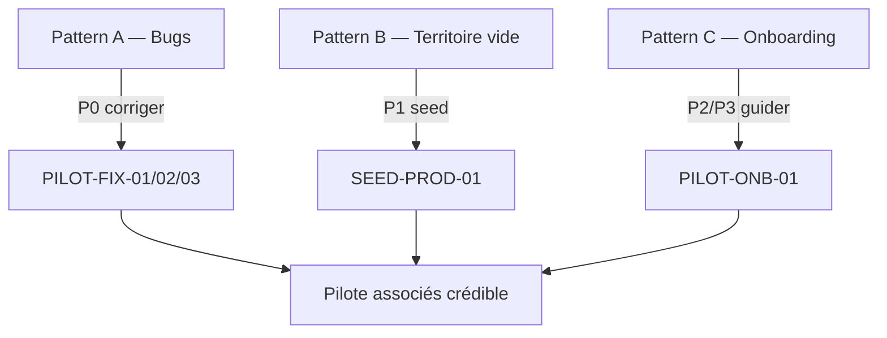

# PILOT-BACKLOG-01 — Backlog officiel pilote Reims

| Champ | Valeur |
|-------|--------|
| Feature | FEATURE-PILOT-V1 |
| Ticket | PILOT-BACKLOG-01 |
| Phase BMAD | ANALYZE → DOCUMENTATION |
| Date | 2026-07-02 |
| Sprint cible | FEATURE-BETA-FIXES-V1 |
| Sources | `docs/audit/AUDIT-01-platform-audit-v1.md` · retours bêta associés · Charte Cycle 2 |

> **Périmètre** : documentation uniquement. Aucune correction de code dans ce ticket.  
> **Règle anti-doublon** : avant tout ticket `BETA-XX`, vérifier les tickets existants — **enrichir l'existant** plutôt que dupliquer (cf. § Pilot Governance).

---

# ✔ Résolus

Tickets **définitivement clôturés**. Ils ne figurent plus dans les priorités actives.

| Ticket | Statut | Preuve / référence |
|--------|--------|-------------------|
| **FEATURE-CREATORS-V2** | CLOSED · PILOT READY | Pipeline Local Video E2E prod (2026-07-02) |
| **VIDEO-04A** | MERGED | Client types + upload API utilities (PR #76) |
| **VIDEO-04BC** | MERGED | Upload page + processing UX (PR #77) |
| **VIDEO-03B.1-QA** | CLOSED | QA post-smoke prod |
| **VIDEO-03A** | MERGED | Worker ARQ async (PR #72) |
| **DATA-CLEANUP-01** | CLOSED | Inventaire + purge smoke prod exécutée (2026-07-01) |
| **AUDIT-01** | CLOSED | `docs/audit/AUDIT-01-platform-audit-v1.md` (PR #80) |
| **OBS-01-SPEC** | CLOSED | `docs/ops/OBS-01-observability-spec.md` (PR #80) |
| **INFRA-R2-PROD** | CLOSED | `docs/ops/INFRA-R2-PROD-setup.md` (PR #79) |
| **CREATORS-UX-02A** | MERGED | Create Hub foundation (PR #74) |
| **CREATORS-UX-02B** | MERGED | Create Hub content + routing (PR #75) |
| **CREATORS-UX-03A** | MERGED | Consolidation entry points (PR #78) |
| **WEB-AUDIT-V1** (01–10) | CLOSED | Audit web complet pré-pilote |

---

## Méthode de fusion

| Source | Poids | Usage |
|--------|-------|-------|
| **AUDIT-01** (figé) | Technique · prod | Constats objectifs Code ↔ Prod |
| **Retours bêta associés** (juillet 2026) | UX · terrain · verbatim | Friction réelle post-déploiement |
| **Charte Cycle 2** | Qualification | Observation → Verbatim → Qualification → Décision CTO |

**Population bêta** : associés pilote Reims, usage réel sur `yunicity.city` (comptes authentifiés, mobile + desktop).

---

# 1. Bugs

Bugs = comportements **reproductibles** qui empêchent une action attendue ou affichent un état incorrect.

| ID | Priorité active | Symptôme (bêta + audit) | Reproduction | Cause probable | Ticket / action |
|----|-----------------|-------------------------|--------------|----------------|-----------------|
| **BUG-01** | **P0** | Vidéo publiée **absente du feed** | Publier une vidéo → ouvrir `/feed` → vidéo attendue absente | Règles d'injection feed post-publish · rail vidéo conditionnel | **PILOT-FIX-01** — feed post-publish |
| **BUG-02** | **P0** | **Upload photo profil / couverture** échoue ou ne persiste pas | `/profile/me/edit` → upload → refresh → image absente | Stockage avatar prod · CORS · MIME · endpoint upload | **PILOT-FIX-02** — E2E upload profil prod |
| **BUG-03** | **P0** | **Stories** : upload + publication ne fonctionnent pas | `/stories/new` → upload média → publier → liste vide ou erreur | Stack Stories (filesystem) vs R2 · auth · médias prod | **PILOT-FIX-03** — Stories read/create/upload E2E |
| **BUG-04** | P3 | Validation **téléphone** incohérente | Settings / org request → saisie FR → rejet ou non sauvegardé | Format E.164 non documenté · validation hétérogène | **PILOT-FIX-04** |
| **BUG-05** | P3 | **Google Maps** : carte blanche ou latence (devices bêta) | `/map` → chargement anormal mobile | Clé API · script async · réseau | **PILOT-FIX-05** |
| **BUG-06** | P3 | Statut API accueil **« Chargement… »** persistant | `/` → badge API bloqué | Fetch health client non résolu | **WEB-HOME-01** |
| **BUG-07** | P3 | **Redirect login silencieux** `/videos` `/stories` `/search` | Visiteur → flash loader → `/login` | Pas de mode découverte | **DISCOVERY-01** |

> Pipeline vidéo **techniquement validé E2E** (AUDIT-01 §3, FEATURE-CREATORS-V2 CLOSED). BUG-01 porte sur la **visibilité feed**, pas le processing.

---

# 2. Onboarding & compréhension

> **Ce ne sont pas des bugs.** Regroupés sous **PILOT-ONB-01** (§ Priorités P2).

| ID | Verbatim bêta | Pattern racine |
|----|---------------|----------------|
| **ONB-01** | « Je ne comprends pas le **+** » | FAB Create Hub sans affordance |
| **ONB-02** | « Je ne sais pas **quoi faire** » | Absence parcours first-run |
| **ONB-03** | « Je ne comprends pas les **quartiers** » | Page référentiel, pas récit vécu |
| **ONB-04** | « Je ne sais pas **publier une vidéo** » | Chemin Create Hub non découvert |
| **ONB-05** | « Je ne vois pas où **mettre une offre** » | Espace partenaire invisible (rôle org) |
| **ONB-06** | « C'est quoi Passport / Sortir / Tribus ? » | Jargon · nav saturée |

---

# 3. Contenu

> **Ce ne sont pas des bugs.** Regroupés sous **SEED-PROD-01** (§ Priorités P1).

| ID | Constats bêta + audit | Axe SEED-PROD-01 |
|----|----------------------|------------------|
| **CNT-01** | 0 événement sur `/sortir` | Événements Reims réels (≥ 5) |
| **CNT-02** | 0 offre partenaire publique | Offres RF-02A en prod |
| **CNT-03** | 0 tribu publique | Tribus pilotes ouvertes (≥ 2) |
| **CNT-04** | 0 créateur public | Créateurs seedés (≥ 3) |
| **CNT-05** | Peu de vidéos citoyennes | Vidéos associés (≥ 5) |
| **CNT-06** | Images quartiers génériques / absentes | Heroes CDN prod (12 slugs) |

Référence ops : `docs/ops/RF-SPRINT-01-reims-field-sourcing.md` · `docs/qa/RF-02B-seed-deployment-checklist.md`

---

# 4. Analyse systémique

Les retours bêta + AUDIT-01 révèlent **trois patterns distincts**, chacun avec un levier d'action dédié.

## Pattern A — Bugs fonctionnels

```text
Symptôme reproductible (feed, profil, stories)
        ↓
Corriger (FEATURE-BETA-FIXES-V1 · P0)
```

**Items** : BUG-01 · BUG-02 · BUG-03

Le socle technique est sain (AUDIT-01 ★★★★☆). Les bugs restants cassent des **actions concrètes** que les associés tentent dès la première session.

---

## Pattern B — Territoire vide

```text
UI riche · données absentes (0 event, 0 offre, 0 tribu…)
        ↓
SEED-PROD-01 (P1)
```

**Items** : CNT-01 à CNT-06

Sans carburant terrain, les associés concluent « il ne se passe rien » — indépendamment de la qualité technique.

---

## Pattern C — Découverte / onboarding

```text
Features existantes · parcours non guidé (« + », quartiers, offres…)
        ↓
PILOT-ONB-01 (P2) + DISCOVERY-01 (P3)
```

**Items** : ONB-01 à ONB-06

Problème de **première expérience utilisateur**, pas de stack. À traiter **après** bugs P0 et enrichissement contenu P1.

---

### Modèle causal



---

# 5. Priorités

Ordre d'exécution officiel pour **FEATURE-BETA-FIXES-V1**.

---

## 🔴 P0 — Bugs bloquants

Uniquement les bugs qui **cassent l'expérience**.

### 1. BUG-01 — Vidéo publiée absente du feed

| Champ | Valeur |
|-------|--------|
| Symptôme | Publish OK · vidéo invisible dans `/feed` |
| Ticket | **PILOT-FIX-01** |
| Dépendances | Aucune (DATA-CLEANUP-01 CLOSED) |

> ⚠️ **À confirmer par reproduction avant correction.**

### 2. BUG-02 — Upload photo profil / couverture

| Champ | Valeur |
|-------|--------|
| Symptôme | Upload avatar/bannière échoue ou ne persiste pas |
| Ticket | **PILOT-FIX-02** |

### 3. BUG-03 — Stories (upload + publication)

| Champ | Valeur |
|-------|--------|
| Symptôme | Création story : upload média ou publication en échec |
| Ticket | **PILOT-FIX-03** |

---

## 🟡 P1 — SEED-PROD-01

Créer du **contenu réel** en production :

| Axe | Cible minimale |
|-----|----------------|
| Événements | ≥ 5 événements Reims réels |
| Offres | 4 offres RF-02A déployées |
| Créateurs | ≥ 3 profils publics |
| Quartiers | 12 heroes CDN prod |
| Vidéos | ≥ 5 vidéos associés / pilotes |
| Tribus | ≥ 2 tribus ouvertes |

---

## 🟢 P2 — PILOT-ONB-01

Regroupe tous les signaux onboarding :

| Verbatim | ID |
|----------|-----|
| « Je ne comprends pas le **+** » | ONB-01 |
| « Je ne comprends pas les **quartiers** » | ONB-03 |
| « Je ne sais pas **quoi faire** » | ONB-02 |
| « Je ne sais pas **publier une vidéo** » | ONB-04 |
| « Je ne vois pas où **mettre une offre** » | ONB-05 |

> Problème systémique de **première expérience utilisateur**.  
> À traiter **après** correction des bugs bloquants (P0) **et après** enrichissement du contenu (P1).

Livrables attendus : brief first-run pilote · doc « 3 gestes associés » · micro-copy ciblée (sans refonte UI/UX V2).

---

## 🔵 P3 — Améliorations & ouverture publique

| Item | Description |
|------|-------------|
| **OBS-01** | Adoption progressive observabilité (Phase 1–2 Railway + uptime) |
| **DISCOVERY-01** | Mode découverte publique videos/stories/search |
| **CONFIG-WX-01** | Clé OpenWeather prod ou masquage météo |
| **WEB-HOME-01** | Statut API accueil (BUG-06) |
| **PILOT-FIX-04** | Téléphone (BUG-04) |
| **PILOT-FIX-05** | Google Maps devices (BUG-05) |
| **RF-04 / RF-05** | Cockpit + analytics admin |
| **Refonte UI/UX V2** | Hors scope beta-fixes — chantier post-pilote |

---

## Verdict backlog

```text
FEATURE-BETA-FIXES-V1 — ordre strict
  P0  BUG-01 → BUG-02 → BUG-03     (repro BUG-01 d'abord)
  P1  SEED-PROD-01
  P2  PILOT-ONB-01
  P3  OBS-01 · DISCOVERY-01 · CONFIG-WX-01 · divers
```

**GO pilote fermé** maintenu (AUDIT-01) — élargissement associés **après P0 reproduit + corrigé**.

**NO-GO public** tant que P0 + P1 + P2 incomplets.

---

# Pilot Governance

Règle officielle de gestion du pilote Reims :

```text
Audit
        ↓
Retours utilisateurs
        ↓
Fusion
        ↓
Backlog Pilote unique
        ↓
Priorisation CTO
        ↓
Développement
```

### Règles

1. **Aucun signal terrain ne devient un ticket directement** — passer par la Charte Cycle 2 (Observation → Verbatim → Qualification → Décision CTO).
2. Toute nouvelle remontée utilisateur doit **enrichir un ticket existant** si possible (BUG-XX, SEED-PROD-01, PILOT-ONB-01, etc.).
3. **Ne créer un nouveau ticket** que si aucun équivalent n'existe dans ce backlog ou dans § Résolus.
4. Les tickets § **Résolus** ne remontent pas dans les priorités sans **nouveau signal terrain** documenté.
5. Ce document (`PILOT-BACKLOG-01.md`) est la **source de vérité unique** pour FEATURE-BETA-FIXES-V1.

---

## Références

| Document | Rôle |
|----------|------|
| `docs/audit/AUDIT-01-platform-audit-v1.md` | Audit technique figé |
| `docs/ops/OBS-01-observability-spec.md` | Spec observabilité (P3) |
| `docs/measure/FEATURE-PILOT-REIMS-MEASURE.md` | KPIs pilote |
| `docs/workflow/FEATURE-ROADMAP-POST-RC.md` | RF-01 à RF-05 |
| `docs/ops/INFRA-R2-PROD-setup.md` | Infra média prod (Résolu) |

---

## Historique

| Date | Événement |
|------|-----------|
| 2026-07-02 | v1 — fusion AUDIT-01 + retours bêta associés |
| 2026-07-02 | v2 — section Résolus · repriorisation P0–P3 · patterns A/B/C · Pilot Governance |
