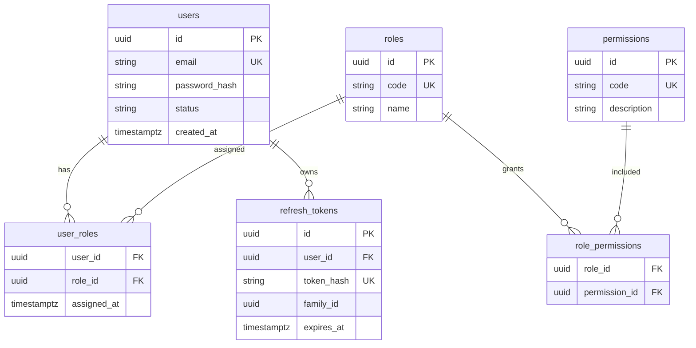
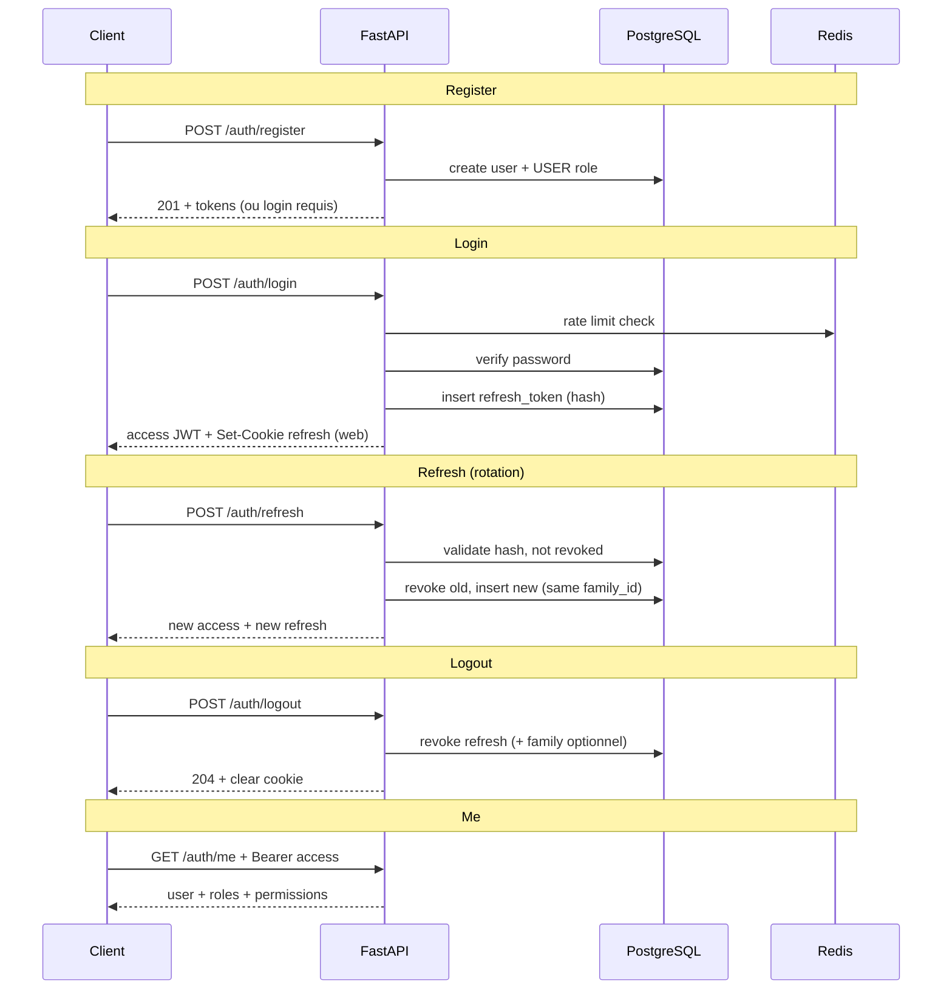

# PRD-101 — Auth + Users + RBAC Foundation

> **Phase :** DISCOVER + DESIGN  
> **Ticket :** SPRINT-1 / TICKET-101  
> **Workflow :** `docs/workflow/YUNICITY-OFFICIAL-WORKFLOW.md` — **BMAD :** `docs/bmad/BMAD.md`  
> **Ce document ne déclenche aucun code** — il guide TICKET-102 à TICKET-105.

---

## 0. Métadonnées

| Champ | Valeur |
|-------|--------|
| **ID** | PRD-101 |
| **Nom** | Auth + Users + RBAC Foundation |
| **Statut** | **DESIGN_READY** |
| **Phase officielle** | DISCOVER → DESIGN (terminé pour ce ticket) |
| **Phase BMAD** | — (BUILD démarre au TICKET-102+) |
| **Sprint** | Sprint 1 |
| **Priorité** | **P0** |
| **Scope** | Auth + Users + RBAC Foundation |
| **Auteur** | product-architect + backend-architect + security-reviewer + tech-lead |
| **Owner technique** | tech-lead backend |
| **Date création** | 2026-05-17 |
| **Dernière mise à jour** | 2026-05-17 |
| **Environnement cible** | dev → recette (MVP auth) |

### Tickets aval (hors scope PRD-101)

| Ticket | Objectif prévu |
|--------|----------------|
| **TICKET-102** | Modèles SQLAlchemy + migration Alembic + seed roles/permissions |
| **TICKET-103** | Services auth (hash, JWT, refresh rotation) + endpoints `/api/v1/auth/*` |
| **TICKET-104** | Guards RBAC (`require_permission`) + intégration dépendances FastAPI |
| **TICKET-105** | Clients web/admin/mobile : session, cookies, appels API auth |

---

# 1. Objectif produit

## 1.1 Problème

Yunicity a besoin d’une **identité utilisateur fiable** et d’un **contrôle d’accès extensible** avant toute feature métier (tribus, offres partenaires, modération, admin ville).

Sans fondation auth/RBAC :

- impossible de distinguer citoyen, modérateur et admin ;
- risque de colonne `users.role` rigide et non évolutive ;
- sessions non standardisées entre web, admin et mobile.

## 1.2 Objectif

Mettre en place la **fondation** permettant :

| Capacité | Description |
|----------|-------------|
| **Inscription citoyenne** | Création de compte email + mot de passe, rôle `USER` par défaut |
| **Login** | Authentification sécurisée, émission access JWT + refresh opaque |
| **Session sécurisée** | Access court, refresh rotatif, révocation au logout |
| **Rôles et permissions** | RBAC relationnel (tables dédiées), guards backend |
| **Extensibilité** | Base pour admin, organisations, partenaires, modération (sprints suivants) |

## 1.3 Résultat attendu (observable)

- Un citoyen peut **s’inscrire**, **se connecter**, **rafraîchir sa session**, **se déconnecter** et lire **`GET /me`** avec ses rôles/permissions effectives.
- Un endpoint protégé peut exiger une permission (`require_permission("moderation.manage")`) et renvoyer **403** si absent.
- Aucune logique métier ne dépend d’une colonne `users.role`.

## 1.4 Contexte Sprint 0 (acquis)

- Monorepo, FastAPI (`/api/v1`), PostGIS + Redis (Docker), CI quality gates.
- `Settings` interdit déjà `DEBUG=true` en `APP_ENV=prod`.
- Prefix API : `/api/v1` (`API_V1_PREFIX`).

---

# 2. Scope MVP

## 2.1 Inclus

| Domaine | Livrable design |
|---------|-----------------|
| **Persistance** | `users`, `roles`, `permissions`, `role_permissions`, `user_roles`, `refresh_tokens` |
| **Auth flows** | register, login, refresh (rotation), logout, `/me` |
| **Sécurité** | Hash mot de passe, JWT access court, refresh hashé, rate limit login/register |
| **AuthZ** | Guards permission côté backend (spec + points d’extension) |
| **Seed** | Rôles MVP + permissions MVP (TICKET-102) |

## 2.2 Exclus (explicitement hors PRD-101 / MVP auth)

| Exclusion | Sprint / note |
|-----------|----------------|
| `organizations`, multi-tenant ville | Sprint orgs |
| Partner onboarding | Avec `PARTNER_*` roles |
| Vérification email **réelle** (SMTP, liens) | Stub champ `email_verified_at` nullable OK |
| Password reset | Ticket dédié futur |
| OAuth Google / magic link / OTP | Hors MVP |
| Avatar upload | Hors MVP |
| Admin dashboard UI | TICKET-105+ |
| QR codes, points, gamification | Hors scope |
| **Audit logs** structurés | Plus tard ; prévoir extension sans bloquer MVP |
| **2FA** | Post-MVP |

---

# 3. Modèle RBAC cible

## 3.1 Principe

- **RBAC relationnel** : un utilisateur possède **un ou plusieurs rôles** via `user_roles`.
- Les rôles agrègent des **permissions** via `role_permissions`.
- Les endpoints et services vérifient des **codes permission** stables (`auth.me.read`), pas des rôles seuls (sauf cas admin très explicites).
- **Interdit :** colonne `users.role` (enum ou string). Toute évolution passe par `user_roles`.

## 3.2 Diagramme entités



## 3.3 Rôles MVP

| Code | Nom affiché | Usage MVP |
|------|-------------|-----------|
| `USER` | Citoyen | Défaut à l’inscription |
| `MODERATOR` | Modérateur | Lecture / actions modération (foundation) |
| `CITY_ADMIN` | Admin ville | Gestion utilisateurs statut, assignation rôles limitée |
| `SUPER_ADMIN` | Super administrateur | Toutes permissions système |

### Rôles futurs (non seed MVP)

| Code | Sprint prévu |
|------|----------------|
| `PARTNER_OWNER` | Organizations / partenaires |
| `PARTNER_STAFF` | Organizations / partenaires |

> Les permissions partenaires (`partner.*`) seront ajoutées avec le module organizations ; ne pas les inventer dans le seed TICKET-102.

## 3.4 Matrice rôles → permissions (MVP)

| Permission | USER | MODERATOR | CITY_ADMIN | SUPER_ADMIN |
|------------|:----:|:---------:|:----------:|:-----------:|
| `auth.me.read` | ✓ | ✓ | ✓ | ✓ |
| `users.read.self` | ✓ | ✓ | ✓ | ✓ |
| `users.update.self` | ✓ | ✓ | ✓ | ✓ |
| `moderation.read` | | ✓ | ✓ | ✓ |
| `moderation.manage` | | ✓ | ✓ | ✓ |
| `users.read.all` | | | ✓ | ✓ |
| `users.manage.status` | | | ✓ | ✓ |
| `roles.assign` | | | ✓* | ✓ |
| `system.admin` | | | | ✓ |

\* `CITY_ADMIN` : assignation limitée aux rôles `USER` et `MODERATOR` uniquement (règle métier TICKET-104 — pas `SUPER_ADMIN` / `CITY_ADMIN`).

## 3.5 Permissions MVP (catalogue)

| Code | Description |
|------|-------------|
| `auth.me.read` | Lire le profil et le contexte auth courant (`/me`) |
| `users.read.self` | Lire ses propres données utilisateur |
| `users.update.self` | Modifier son profil (champs autorisés MVP : `display_name` uniquement) |
| `moderation.read` | Consulter files / signalements (endpoints futurs) |
| `moderation.manage` | Actions modération (endpoints futurs) |
| `users.read.all` | Lister / lire utilisateurs (admin) |
| `users.manage.status` | Suspendre / réactiver un compte |
| `roles.assign` | Attribuer / retirer des rôles (selon règles CITY_ADMIN) |
| `system.admin` | Opérations système réservées super admin |

**Convention :** `{domaine}.{ressource}.{action}` en minuscules, segments pointés.

---

# 4. Flux d’authentification

## 4.1 Vue d’ensemble



## 4.2 Register

1. Client envoie `email`, `password`, `display_name` (optionnel).
2. API valide format email, politique mot de passe, unicité email.
3. Hash mot de passe (Argon2id ou bcrypt — §7).
4. Création `users` + ligne `user_roles` → rôle `USER`.
5. **Pas d’email envoyé** en MVP ; `email_verified_at` reste `NULL`.
6. Réponse : **201** avec tokens (recommandé) *ou* **201** sans tokens + message « connectez-vous » — **décision :** émettre tokens comme login pour DX mobile (voir §10).

## 4.3 Login

1. Rate limit par IP + email (Redis).
2. Recherche user par email ; si absent → même erreur que mot de passe incorrect (**anti-énumération**).
3. Vérification hash ; si `status != active` → **403** `ACCOUNT_SUSPENDED`.
4. Émission **access JWT** (court) + **refresh opaque** (stocké hashé).
5. Web/admin : refresh en **cookie httpOnly** ; mobile : refresh dans body JSON (§7.4).

## 4.4 Refresh (rotation stricte)

1. Client présente refresh (cookie ou body selon plateforme).
2. API charge token par hash ; vérifie `expires_at`, `revoked_at IS NULL`, user actif.
3. **Rotation :** révoquer l’ancien enregistrement, créer nouveau token **même `family_id`**.
4. Si un token révoqué de la famille est réutilisé → **révoquer toute la famille** (détection vol — §7.3).
5. Retourner nouveau access + nouveau refresh.

## 4.5 Logout

1. Identifier refresh courant (cookie / body).
2. Révoquer le token (et optionnellement toute la `family_id` si « logout all devices » — hors MVP sauf param `all_devices: false` par défaut).
3. Effacer cookie côté web (`Max-Age=0`, mêmes attributs Secure/SameSite).

## 4.6 GET /me

1. Bearer access JWT valide.
2. Charger user + rôles + **permissions effectives** (union des permissions des rôles).
3. Ne jamais exposer `password_hash`, secrets, ou refresh.

---

# 5. Sécurité

## 5.1 Mots de passe

| Règle | Valeur MVP |
|-------|------------|
| Algorithme préféré | **Argon2id** (`argon2-cffi`) |
| Fallback | **bcrypt** (cost ≥ 12) si contrainte perf / déploiement |
| Longueur min | 12 caractères |
| Complexité | Au moins 1 majuscule, 1 minuscule, 1 chiffre (ajustable) |
| Max length | 128 (éviter DoS hash) |
| Stockage | Jamais en clair ; pas de log du mot de passe |

## 5.2 Access token (JWT)

| Paramètre | Valeur recommandée |
|-----------|---------------------|
| Algorithme | `HS256` (MVP) ou `RS256` si infra clés prête |
| Durée | **15 minutes** (`ACCESS_TOKEN_TTL_MINUTES`) |
| Claims | `sub` (user id), `iat`, `exp`, `jti` (optionnel révocation future) |
| Secret | `JWT_SECRET` env — **jamais commité** |
| Transport | Header `Authorization: Bearer <token>` |

## 5.3 Refresh token

| Paramètre | Valeur recommandée |
|-----------|---------------------|
| Format | Opaque aléatoire (≥ 256 bits, base64url) |
| Stockage DB | **Hash** (SHA-256 ou HMAC avec pepper `REFRESH_TOKEN_PEPPER`) |
| Durée | **30 jours** (`REFRESH_TOKEN_TTL_DAYS`) |
| Rotation | Obligatoire à chaque `/refresh` |
| Révocation | `revoked_at`, détection reuse → revoke family |

## 5.4 Cookies web / admin

| Attribut | Valeur |
|----------|--------|
| Nom | `yunicity_refresh` (configurable) |
| `HttpOnly` | **true** |
| `Secure` | **true** en recette/preprod/prod |
| `SameSite` | `Lax` (web) ; `Strict` si admin sous-domaine dédié |
| `Path` | `/api/v1/auth` (limiter surface) |
| `Domain` | Config par env |

**CORS :** `allow_credentials=True` déjà en place — origines **explicites** uniquement (pas `*` en prod).

## 5.5 Stratégie mobile (documentée, impl. TICKET-105)

| Aspect | Choix MVP |
|--------|-----------|
| Access token | Mémoire (contexte app) + header Bearer |
| Refresh token | **Expo SecureStore** (ou équivalent) — **pas** de cookie httpOnly natif fiable |
| Transport refresh | Body JSON `{ "refresh_token": "..." }` sur `/refresh` et `/logout` |
| Risque XSS | Pas de refresh en `AsyncStorage` non chiffré |
| Rotation | Identique au web ; client remplace le refresh stocké après chaque refresh |

## 5.6 Rate limiting

| Endpoint | Limite indicative (Redis) |
|----------|---------------------------|
| `POST /auth/register` | 5 / heure / IP |
| `POST /auth/login` | 10 / 15 min / IP ; 5 / 15 min / email |
| `POST /auth/refresh` | 30 / min / user (après auth refresh) |
| Réponse | **429** `RATE_LIMITED` + `Retry-After` |

## 5.7 Autres exigences

- **Pas de secrets** dans le dépôt ; `.env.example` documente les clés sans valeurs.
- **`DEBUG=false` obligatoire en prod** — déjà validé dans `Settings`.
- **Anti-énumération** : messages login/register génériques côté client.
- **Audit logs** : hors MVP ; prévoir table `audit_events` future sans la créer ici.
- **IDOR** : `/me` et `users.update.self` utilisent uniquement `sub` du JWT, jamais un `user_id` client arbitraire pour self.

---

# 6. Endpoints cibles

Base : `{API_V1_PREFIX}/auth` → **`/api/v1/auth`**

| Méthode | Chemin | AuthN |
|---------|--------|-------|
| `POST` | `/register` | Public |
| `POST` | `/login` | Public |
| `POST` | `/refresh` | Refresh token |
| `POST` | `/logout` | Refresh token (et/ou access pour audit futur) |
| `GET` | `/me` | Bearer access |

---

# 7. Contrats API

## 7.1 Conventions erreurs

Format standard :

```json
{
  "detail": "Message lisible en français",
  "code": "ERROR_CODE",
  "errors": []
}
```

| HTTP | `code` | Cas |
|------|--------|-----|
| 400 | `VALIDATION_ERROR` | Payload Pydantic invalide |
| 401 | `UNAUTHORIZED` | Token absent / invalide / expiré |
| 403 | `FORBIDDEN` | Compte suspendu ou permission manquante |
| 409 | `EMAIL_ALREADY_EXISTS` | Email déjà inscrit |
| 422 | `WEAK_PASSWORD` | Politique mot de passe |
| 429 | `RATE_LIMITED` | Trop de tentatives |

---

### POST `/api/v1/auth/register`

**Auth :** aucune  
**Rate limit :** oui

**Request**

```json
{
  "email": "citoyen@example.com",
  "password": "MotDePasseSecurise1!",
  "display_name": "Alex"
}
```

| Champ | Type | Requis | Notes |
|-------|------|--------|-------|
| `email` | string (email) | oui | Normalisé lowercase |
| `password` | string | oui | §5.1 |
| `display_name` | string | non | 2–64 caractères, trim |

**Response `201`**

```json
{
  "access_token": "eyJ...",
  "token_type": "bearer",
  "expires_in": 900,
  "user": {
    "id": "550e8400-e29b-41d4-a716-446655440000",
    "email": "citoyen@example.com",
    "display_name": "Alex",
    "status": "active",
    "roles": ["USER"],
    "permissions": ["auth.me.read", "users.read.self", "users.update.self"]
  }
}
```

**Notes sécurité**

- Web : en plus, `Set-Cookie` refresh httpOnly (§5.4).
- Mobile : inclure `refresh_token` dans le corps **uniquement** pour clients mobile identifiés (`X-Client-Platform: mobile` ou négociation documentée TICKET-105).

**Erreurs**

| HTTP | `code` | Cas |
|------|--------|-----|
| 409 | `EMAIL_ALREADY_EXISTS` | Email pris |
| 422 | `WEAK_PASSWORD` | Politique non respectée |
| 429 | `RATE_LIMITED` | IP |

---

### POST `/api/v1/auth/login`

**Auth :** aucune  
**Rate limit :** oui

**Request**

```json
{
  "email": "citoyen@example.com",
  "password": "MotDePasseSecurise1!"
}
```

**Response `200`**

```json
{
  "access_token": "eyJ...",
  "token_type": "bearer",
  "expires_in": 900,
  "user": {
    "id": "550e8400-e29b-41d4-a716-446655440000",
    "email": "citoyen@example.com",
    "display_name": "Alex",
    "status": "active",
    "roles": ["USER"],
    "permissions": ["auth.me.read", "users.read.self", "users.update.self"]
  }
}
```

**Erreurs**

| HTTP | `code` | Cas |
|------|--------|-----|
| 401 | `INVALID_CREDENTIALS` | Email ou mot de passe incorrect (message générique) |
| 403 | `ACCOUNT_SUSPENDED` | `status = suspended` |
| 429 | `RATE_LIMITED` | IP / email |

**Notes sécurité**

- Ne pas indiquer si l’email existe.
- Mettre à jour `users.last_login_at` en succès.

---

### POST `/api/v1/auth/refresh`

**Auth :** refresh token (cookie web **ou** body mobile)

**Request (mobile)**

```json
{
  "refresh_token": "opaque-token-value"
}
```

**Request (web)** : cookie `yunicity_refresh` — body vide autorisé.

**Response `200`**

```json
{
  "access_token": "eyJ...",
  "token_type": "bearer",
  "expires_in": 900
}
```

**Notes sécurité**

- Rotation : nouveau refresh ; ancien révoqué.
- Reuse détecté → **401** `REFRESH_TOKEN_REUSE` + révocation famille.

**Erreurs**

| HTTP | `code` | Cas |
|------|--------|-----|
| 401 | `INVALID_REFRESH_TOKEN` | Inconnu / expiré / révoqué |
| 401 | `REFRESH_TOKEN_REUSE` | Token déjà rotaté — famille révoquée |
| 403 | `ACCOUNT_SUSPENDED` | User inactif |

---

### POST `/api/v1/auth/logout`

**Auth :** refresh présent

**Request (mobile)**

```json
{
  "refresh_token": "opaque-token-value"
}
```

**Response `204`** — pas de corps

**Notes sécurité**

- Invalider le refresh en DB.
- Effacer cookie web.

**Erreurs**

| HTTP | `code` | Cas |
|------|--------|-----|
| 401 | `INVALID_REFRESH_TOKEN` | Déjà révoqué ou inconnu (idempotent acceptable → 204) |

> **Décision :** logout idempotent — token inconnu → **204** pour ne pas fuiter d’info.

---

### GET `/api/v1/auth/me`

**Auth :** Bearer access JWT  
**Permission implicite :** `auth.me.read` (tout user authentifié actif l’a)

**Response `200`**

```json
{
  "id": "550e8400-e29b-41d4-a716-446655440000",
  "email": "citoyen@example.com",
  "display_name": "Alex",
  "status": "active",
  "email_verified_at": null,
  "roles": ["USER"],
  "permissions": ["auth.me.read", "users.read.self", "users.update.self"],
  "created_at": "2026-05-17T12:00:00Z",
  "updated_at": "2026-05-17T12:00:00Z"
}
```

**Erreurs**

| HTTP | `code` | Cas |
|------|--------|-----|
| 401 | `UNAUTHORIZED` | Header absent / JWT invalide |

**Notes sécurité**

- Pas de `password_hash` ni de refresh.
- Permissions = union calculée côté serveur (cache Redis optionnel post-MVP).

---

# 8. Modèle de données détaillé

> Implémentation SQLAlchemy + Alembic : **TICKET-102 uniquement.**

## 8.1 Table `users`

| Colonne | Type PostgreSQL | Contraintes | Notes |
|---------|-----------------|-------------|-------|
| `id` | `UUID` | PK, default `gen_random_uuid()` | |
| `email` | `VARCHAR(320)` | NOT NULL, **UNIQUE** | Index unique ; stockage lowercase |
| `password_hash` | `VARCHAR(255)` | NOT NULL | Argon2id / bcrypt |
| `display_name` | `VARCHAR(64)` | NULL | |
| `status` | `VARCHAR(32)` | NOT NULL, default `'active'` | Enum app : `active`, `suspended`, `deleted` |
| `email_verified_at` | `TIMESTAMPTZ` | NULL | Futur email verification |
| `last_login_at` | `TIMESTAMPTZ` | NULL | |
| `created_at` | `TIMESTAMPTZ` | NOT NULL, default `now()` | |
| `updated_at` | `TIMESTAMPTZ` | NOT NULL, default `now()` | Trigger / app on update |

**Index**

- `uq_users_email` UNIQUE (`email`)
- `idx_users_status` (`status`) — listes admin futures

**Relations**

- `user_roles` (1-N)
- `refresh_tokens` (1-N)

**Sécurité**

- Jamais sérialiser `password_hash` en API.
- Soft policy : `deleted` = anonymisation future RGPD (hors MVP impl).

---

## 8.2 Table `roles`

| Colonne | Type | Contraintes | Notes |
|---------|------|-------------|-------|
| `id` | `UUID` | PK | |
| `code` | `VARCHAR(64)` | NOT NULL, **UNIQUE** | ex. `USER`, `SUPER_ADMIN` |
| `name` | `VARCHAR(128)` | NOT NULL | Libellé FR |
| `description` | `TEXT` | NULL | |
| `is_system` | `BOOLEAN` | NOT NULL, default `true` | Empêcher suppression seed |
| `created_at` | `TIMESTAMPTZ` | NOT NULL | |

**Index**

- `uq_roles_code` UNIQUE (`code`)

---

## 8.3 Table `permissions`

| Colonne | Type | Contraintes | Notes |
|---------|------|-------------|-------|
| `id` | `UUID` | PK | |
| `code` | `VARCHAR(128)` | NOT NULL, **UNIQUE** | ex. `auth.me.read` |
| `description` | `TEXT` | NOT NULL | |
| `created_at` | `TIMESTAMPTZ` | NOT NULL | |

**Index**

- `uq_permissions_code` UNIQUE (`code`)

---

## 8.4 Table `role_permissions`

| Colonne | Type | Contraintes | Notes |
|---------|------|-------------|-------|
| `role_id` | `UUID` | PK, FK → `roles.id` ON DELETE CASCADE | |
| `permission_id` | `UUID` | PK, FK → `permissions.id` ON DELETE CASCADE | |

**Index**

- PK composite (`role_id`, `permission_id`)
- `idx_role_permissions_permission_id` (`permission_id`) — reverse lookup

---

## 8.5 Table `user_roles`

| Colonne | Type | Contraintes | Notes |
|---------|------|-------------|-------|
| `user_id` | `UUID` | PK, FK → `users.id` ON DELETE CASCADE | |
| `role_id` | `UUID` | PK, FK → `roles.id` ON DELETE RESTRICT | |
| `assigned_at` | `TIMESTAMPTZ` | NOT NULL, default `now()` | |
| `assigned_by` | `UUID` | NULL, FK → `users.id` ON DELETE SET NULL | Admin qui assigne |

**Index**

- PK composite (`user_id`, `role_id`)
- `idx_user_roles_role_id` (`role_id`)

**Règles**

- Inscription : une ligne (`user_id`, USER).
- Un user peut cumuler plusieurs rôles (ex. `USER` + `MODERATOR`).

---

## 8.6 Table `refresh_tokens`

| Colonne | Type | Contraintes | Notes |
|---------|------|-------------|-------|
| `id` | `UUID` | PK | |
| `user_id` | `UUID` | NOT NULL, FK → `users.id` ON DELETE CASCADE | |
| `token_hash` | `VARCHAR(64)` | NOT NULL, **UNIQUE** | SHA-256 hex du token |
| `family_id` | `UUID` | NOT NULL | Chaîne rotation |
| `expires_at` | `TIMESTAMPTZ` | NOT NULL | |
| `revoked_at` | `TIMESTAMPTZ` | NULL | |
| `replaced_by_id` | `UUID` | NULL, FK → `refresh_tokens.id` | Traçabilité rotation |
| `created_at` | `TIMESTAMPTZ` | NOT NULL | |
| `user_agent` | `VARCHAR(512)` | NULL | Audit futur |
| `ip_address` | `INET` | NULL | Audit futur |

**Index**

- `uq_refresh_tokens_token_hash` UNIQUE (`token_hash`)
- `idx_refresh_tokens_user_id` (`user_id`)
- `idx_refresh_tokens_family_id` (`family_id`)
- `idx_refresh_tokens_expires_at` (`expires_at`) — job purge TTL

**Sécurité**

- Ne jamais stocker le refresh en clair.
- Purge async des tokens expirés > 90 jours (job futur).

---

# 9. Guards permissions (backend)

## 9.1 Modèle d’exécution

```python
# Spec — implémentation TICKET-104
@router.get("/admin/users")
async def list_users(
    _: None = Depends(require_permission("users.read.all")),
    current_user: User = Depends(get_current_user),
):
    ...
```

## 9.2 Algorithme `get_current_user`

1. Extraire Bearer JWT.
2. Valider signature, `exp`, `sub`.
3. Charger user ; vérifier `status == active`.
4. Attacher à `request.state.user`.

## 9.3 Algorithme `require_permission(code)`

1. Appeler `get_current_user`.
2. Charger permissions effectives (join `user_roles` → `role_permissions` → `permissions`).
3. Si `code` absent → **403** `FORBIDDEN`.
4. Option : cache Redis `perms:{user_id}` TTL 5 min, invalidation à changement de rôles.

## 9.4 Règles TICKET-104

- Les routes **self** utilisent `sub` du JWT, pas un `user_id` path pour les opérations sur soi (sauf admin explicite).
- `roles.assign` : service dédié avec matrice CITY_ADMIN (§3.4).

---

# 10. Tests attendus

> Implémentation pytest : TICKET-103 / TICKET-104.

## 10.1 Backend (intégration API)

| # | Cas | Résultat attendu |
|---|-----|------------------|
| T1 | register success | 201, user créé, rôle USER, tokens |
| T2 | duplicate email | 409 `EMAIL_ALREADY_EXISTS` |
| T3 | weak password | 422 `WEAK_PASSWORD` |
| T4 | login success | 200, access + refresh persisté hashé |
| T5 | login wrong password | 401 `INVALID_CREDENTIALS` |
| T6 | refresh success | 200, nouveau couple, ancien révoqué |
| T7 | refresh token rotation | ancien refresh → 401 reuse ; nouveau OK |
| T8 | revoked token rejected | 401 après logout |
| T9 | /me authorized | 200 profil + permissions |
| T10 | /me unauthorized | 401 sans Bearer |
| T11 | permission guard allowed | 200 avec permission |
| T12 | permission guard denied | 403 sans permission |

## 10.2 Unitaires services (indicatif)

- Hash verify round-trip
- JWT expiré rejeté
- Calcul union permissions multi-rôles
- Family revocation on reuse

## 10.3 Hors scope tests PRD-101

- E2E Playwright / Detox → TICKET-105
- Charge / pénétration → recette

---

# 11. Stratégie de migration

## 11.1 TICKET-102 (BUILD DB)

1. Créer révision Alembic `xxxx_auth_rbac_foundation.py` :
   - Tables §8 dans l’ordre : `users` → `roles` → `permissions` → `role_permissions` → `user_roles` → `refresh_tokens`
2. **Seed idempotent** (data migration ou script `scripts/seed_rbac.py`) :
   - 4 rôles MVP
   - 9 permissions MVP
   - Liens `role_permissions` selon §3.4
3. **Pas de colonne `users.role`.**

## 11.2 Rollback

- `alembic downgrade -1` supprime les tables dans l’ordre inverse des FK.
- **Attention :** perte données auth en dev — acceptable.
- En recette/preprod : backup snapshot avant migration.

## 11.3 Variables d’environnement (`.env.example` TICKET-102+)

| Variable | Description |
|----------|-------------|
| `JWT_SECRET` | Secret signing JWT |
| `JWT_ALGORITHM` | `HS256` par défaut |
| `ACCESS_TOKEN_TTL_MINUTES` | default `15` |
| `REFRESH_TOKEN_TTL_DAYS` | default `30` |
| `REFRESH_TOKEN_PEPPER` | Pepper hash refresh |
| `REFRESH_COOKIE_NAME` | default `yunicity_refresh` |

---

# 12. User stories (résumé)

### US-101-01 — Inscription citoyenne

En tant que **nouveau citoyen**, je veux **créer un compte avec email et mot de passe**, afin d’**accéder à Yunicity**.

- [ ] Email unique, mot de passe conforme
- [ ] Rôle `USER` assigné automatiquement
- [ ] Session émise (access + refresh selon plateforme)

### US-101-02 — Connexion

En tant que **utilisateur inscrit**, je veux **me connecter**, afin d’**utiliser l’application**.

- [ ] Credentials invalides → message générique
- [ ] Compte suspendu → 403 explicite

### US-101-03 — Session persistante

En tant que **utilisateur**, je veux **rafraîchir ma session**, afin de **rester connecté sans ressaisir mon mot de passe**.

- [ ] Rotation refresh obligatoire
- [ ] Logout révoque le refresh

### US-101-04 — Profil courant

En tant que **utilisateur connecté**, je veux **voir mon profil et mes droits**, afin de **comprendre ce que je peux faire**.

- [ ] `GET /me` retourne rôles + permissions

### US-101-05 — Contrôle d’accès (foundation)

En tant que **plateforme**, je veux **vérifier des permissions sur les endpoints**, afin de **protéger les actions sensibles**.

- [ ] Guard allow / deny testé (T11, T12)

---

# 13. BMAD (préparation VERIFY)

> Rempli en DESIGN pour guider les tickets BUILD ; à cocher lors de l’implémentation.

## 13.1 BUILD — attendu (TICKET-102 → 105)

| Gate | Critère |
|------|---------|
| PRD validé | Ce document en `DESIGN_READY` → passera `BUILD` au kickoff TICKET-102 |
| Architecture | §6–§9 + modules `app/models/auth*`, `app/services/auth*`, `app/api/v1/auth` |
| Risques | §14 traités ou acceptés |
| Permissions | §3.5 + guards §9 |
| Endpoints | §6–§7 implémentés |
| Migrations | §11 exécutées en dev/recette |

**Livrables BUILD**

- [ ] Migration + seed RBAC
- [ ] Endpoints auth + tests T1–T12
- [ ] `require_permission` opérationnel
- [ ] `.env.example` à jour
- [ ] Clients web/mobile foundation (TICKET-105)

## 13.2 MEASURE — attendu (post-déploiement recette)

| Domaine | Métrique | Cible initiale |
|---------|----------|----------------|
| Produit | Taux inscription → 1er `/me` | > 80 % |
| Technique | p95 `POST /auth/login` | < 200 ms (sans hash cold start) |
| Technique | Taux 5xx auth | < 0,1 % |
| Sécurité | Tentatives login échouées / IP | alerte > 50 / h |
| Sécurité | Refresh reuse détectés | 0 attendu ; investiguer si > 0 |

## 13.3 ANALYZE — attendu

- Le RBAC relationnel supporte-t-il les besoins Sprint 2 (orgs, partenaires) sans migration destructive ?
- La rotation refresh est-elle compatible mobile + web sans friction UX ?
- Faut-il passer `RS256` ou refresh en cookie `__Host-` avant prod ?
- Dette : email verification, audit logs, assignation rôles UI admin.

## 13.4 DECIDE — critères de décision

| Issue | Options DECIDE |
|-------|----------------|
| Argon2id vs bcrypt en prod | MEASURE latence p95 register → trancher |
| Émettre tokens au register | Garder si conversion OK ; sinon register → login only |
| Cache permissions Redis | Introduire si p95 `/me` > seuil |
| Partner roles | Repousser confirmé jusqu’à PRD organizations |

**Règle CTO :** ne pas scaler trafic auth si reuse detection ou rate limits non validés en recette.

---

# 14. Definition of Done (PRD-101 — document)

- [x] Métadonnées PRD-101 complètes, statut `DESIGN_READY`
- [x] Objectif produit et scope MVP / hors scope documentés
- [x] Modèle RBAC sans `users.role`
- [x] 4 rôles MVP + rôles partenaires futures documentés
- [x] 9 permissions MVP + matrice rôles
- [x] Flux register / login / refresh / logout / me
- [x] Exigences sécurité (hash, JWT, refresh, cookies, mobile, rate limit)
- [x] 5 endpoints avec contrats request/response/errors
- [x] Modèle de données détaillé (6 tables)
- [x] Liste tests T1–T12
- [x] Stratégie migration TICKET-102 + rollback
- [x] Section BMAD BUILD / MEASURE / ANALYZE / DECIDE
- [ ] Validation CTO / security-reviewer (signature humaine)
- [ ] Statut PRD passé à `BUILD` au démarrage TICKET-102

## 14.1 Definition of Done — implémentation (TICKET-102 → 105)

- [ ] Tables créées via Alembic, seed RBAC appliqué
- [ ] Endpoints §6 implémentés, contrats §7 respectés
- [ ] Tests §10 verts en CI
- [ ] Checklist `docs/ai/security-checklist.md` § Auth / AuthZ cochée
- [ ] Aucun secret dans le diff ; `DEBUG` impossible en prod
- [ ] Documentation agent : PRD §12 historique mis à jour

---

# 15. Décisions d’architecture

| # | Décision | Justification |
|---|----------|---------------|
| D1 | RBAC relationnel (5 tables de liaison) | Évolutif vs `users.role` ; cumul de rôles |
| D2 | Permissions comme unité d’authZ | Rôles = groupes ; endpoints déclarent des permissions |
| D3 | Refresh opaque hashé + rotation | OWASP session management ; révocation serveur |
| D4 | JWT access court (15 min) | Limite blast radius si fuite |
| D5 | Cookie httpOnly web / body mobile | Modèle standard multi-plateforme |
| D6 | Register émet tokens | Réduit friction mobile ; réversible |
| D7 | Argon2id préféré, bcrypt fallback | Équilibre sécurité / perf |
| D8 | Family ID refresh | Détection vol de refresh token |
| D9 | Logout idempotent 204 | Pas de fuite d’état token |
| D10 | `email_verified_at` sans SMTP MVP | Prépare verification sans bloquer Sprint 1 |

---

# 16. Risques ouverts

| # | Risque | Prob. | Impact | Mitigation |
|---|--------|-------|--------|------------|
| R1 | Fuite refresh via XSS web | M | Élevé | httpOnly + CSP TICKET-105 ; access court |
| R2 | Complexité rotation mobile | M | Moyen | Tests T6–T8 + doc §5.5 |
| R3 | Argon2id charge CPU | L | Moyen | Benchmark ; fallback bcrypt |
| R4 | Permissions cache stale | M | Moyen | TTL court ; invalidation sur role change |
| R5 | CITY_ADMIN escalade rôles | M | Élevé | Service `roles.assign` avec allowlist |
| R6 | Enumération emails | M | Moyen | Messages génériques ; rate limit |
| R7 | Dette orgs / PARTNER_* | — | Planning | PRD organizations Sprint 2+ |

---

# 17. Open questions

| # | Question | Décision provisoire | Statut |
|---|----------|---------------------|--------|
| Q1 | Register retourne-t-il tokens ? | Oui (D6) | À valider CTO |
| Q2 | `HS256` vs `RS256` MVP ? | HS256 | OK dev ; revisiter preprod |
| Q3 | Nom cookie refresh | `yunicity_refresh` | OK |
| Q4 | Header `X-Client-Platform` pour register/login ? | mobile vs web | TICKET-105 |
| Q5 | Durée refresh token | **7 jours** en impl. (PRD initial : 30 j) | **DECIDE** — validé CTO Sprint 1 |

---

# 18. Historique

| Date | Auteur | Changement |
|------|--------|------------|
| 2026-05-17 | agents PRD-101 | Création DESIGN_READY — Auth + Users + RBAC Foundation |
| 2026-05-17 | CTO / TICKET-103 | DECIDE : `REFRESH_TOKEN_EXPIRE_DAYS=7` (vs 30 j PRD) — sécurité Sprint 1 |

---

## Annexes

### Liens

- Template : `docs/prd/PRD-template.md`
- Sécurité : `docs/ai/security-checklist.md`
- Config backend : `backend/app/core/config.py`

### Arborescence backend cible (TICKET-103+)

```
backend/app/
├── api/v1/auth.py          # routes
├── core/security.py        # jwt, hash, tokens
├── dependencies/auth.py    # get_current_user, require_permission
├── models/
│   ├── user.py
│   └── rbac.py
├── schemas/auth.py
└── services/
    ├── auth_service.py
    └── rbac_service.py
```
