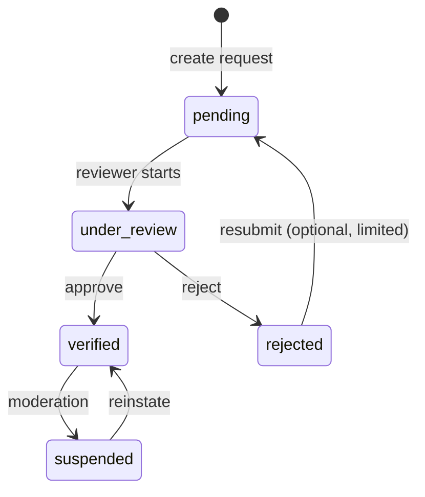
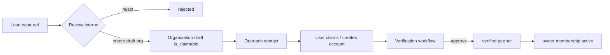
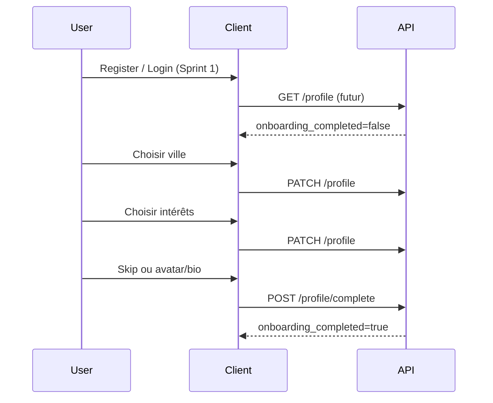
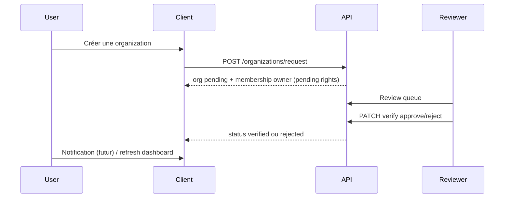

# PRD-201 — User Profile + Organizations

> **Phase :** DISCOVER + DESIGN  
> **Ticket :** SPRINT-2 / TICKET-201  
> **Workflow :** `docs/workflow/YUNICITY-OFFICIAL-WORKFLOW.md` — **BMAD :** `docs/bmad/BMAD.md`  
> **Ce document ne déclenche aucun code** — il guide TICKET-202+ (profil, organisations, onboarding partenaire).

---

## 0. Métadonnées

| Champ | Valeur |
|-------|--------|
| **ID** | PRD-201 |
| **Nom** | User Profile + Organizations |
| **Statut** | **DESIGN_READY** |
| **Phase officielle** | DISCOVER → DESIGN (terminé pour ce ticket) |
| **Phase BMAD** | — (BUILD démarre au TICKET-202+) |
| **Sprint** | Sprint 2 |
| **Priorité** | **P0** |
| **Scope** | Profils utilisateurs + organisations locales + memberships + vérification + onboarding partenaire (foundation) |
| **Auteur** | product-architect + backend-architect + frontend-architect + security-reviewer |
| **Owner technique** | tech-lead backend + tech-lead frontend |
| **Date création** | 2026-05-17 |
| **Dernière mise à jour** | 2026-05-17 |
| **Environnement cible** | dev → recette |

### Dépendances amont (acquis Sprint 1)

| Acquis | Référence |
|--------|-----------|
| Auth (register, login, refresh, logout, `/me`) | PRD-101, TICKET-103 |
| RBAC global (`USER`, `MODERATOR`, `CITY_ADMIN`, `SUPER_ADMIN`) | PRD-101, TICKET-102–104 |
| Frontend auth foundation (web, admin, mobile) | TICKET-105 |
| Table `users` (identité auth : email, `full_name`, `city` stub) | TICKET-102 |

### Tickets aval (hors scope PRD-201)

| Ticket | Objectif prévu |
|--------|----------------|
| **TICKET-202** | User Profile — modèles DB + API `/profile` foundation |
| **TICKET-203+** | Organizations DB + API + onboarding org (à découper en BUILD) |
| **TICKET-2xx** | Partner leads, vérification workflow admin, pages publiques org |

---

# 1. Objectif produit

## 1.1 Vision

Yunicity est un **réseau social local structuré** (démarrage Reims) où :

- une **personne** (user) possède une identité d’authentification et un **profil social** distincts ;
- un **acteur local** (organization) représente un commerce, une association, une école, un freelance, etc. ;
- les **memberships** relient users et organizations avec des rôles métier (owner, admin, staff, member) ;
- l’**onboarding partenaire** permet à des acteurs physiques de rejoindre la plateforme après **vérification** contrôlée.

Ce PRD pose la fondation pour :

| Brique future | Dépend de |
|---------------|-----------|
| Offres locales | Organization `verified` |
| QR codes / scan | Organization + offre |
| Points / fidélité | User + organization + transaction future |
| Pages publiques org | `organizations.slug` + `visibility` |
| Événements locaux | Organization + geo/city |
| Modération locale | RBAC ville + org context |

## 1.2 Problème

Après Sprint 1, Yunicity sait **authentifier** un citoyen mais ne sait pas encore :

- présenter un **profil public** riche (username, bio, intérêts, visibilité) ;
- représenter des **commerces et associations** comme entités de première classe ;
- gérer **qui administre** quelle organization (anti-usurpation) ;
- **vérifier** qu’un partenaire est légitime avant activation ;
- convertir des **leads** (landing, import manuel) en organizations actives.

## 1.3 Résultat attendu (observable, post-implémentation tickets aval)

- Un citoyen complète son **profil** (ville, intérêts, visibilité) après inscription.
- Un responsable local **demande la création** d’une organization ; elle reste `pending` jusqu’à revue.
- Un admin ville / modérateur peut **approuver ou rejeter** une organization (workflow documenté).
- Un user `owner` gère les informations de son organization sans accéder aux données d’une autre.
- Une **page publique foundation** (spec) est adressable par `slug` (contenu minimal avant offres).

## 1.4 Principes directeurs

| Principe | Implication |
|----------|-------------|
| **Auth ≠ profil** | `users` = credentials + état compte ; `user_profiles` = identité sociale |
| **User ≠ organization** | Pas de « compte commerce » séparé : un humain agit via membership |
| **Ville d’abord** | `city` / geo ancrent découverte et modération locale |
| **Vérification avant confiance** | Pas d’offres publiques ni QR tant que `verification_status != verified` |
| **Server-side truth** | Slug, ownership, transitions de statut validés côté API |
| **Extensibilité** | Champs `onboarding_step`, JSON préférences, audit table dédiée |

---

# 2. Scope MVP (Sprint 2 foundation)

## 2.1 Inclus (design + tickets BUILD associés)

| Domaine | Livrable design |
|---------|-----------------|
| **User profile** | Modèle conceptuel `user_profiles`, champs sociaux, visibilité, onboarding user |
| **Organizations** | Types, champs, slug, geo, visibilité, claim |
| **Memberships** | `organization_members`, rôles owner/admin/staff/member |
| **Vérification** | Statuts, méthodes, workflow review, table `organization_verifications` |
| **Onboarding org** | Demande création → review → activation |
| **Partner leads** | Modèle `partner_leads` + workflow lead → org |
| **RBAC futur** | Spec `PARTNER_*` lié au membership (non implémenté Sprint 2 initial) |
| **Pages publiques** | Foundation conceptuelle (slug, champs publics) |

## 2.2 Exclus (explicitement)

| Exclusion | Sprint / note |
|-----------|----------------|
| QR codes, scan, deep links physiques | Sprint fidélité / offres |
| Points, wallets, récompenses | Sprint gamification |
| Paiement, Stripe, abonnements | PRD paiements dédié |
| Analytics, dashboards BI | Post-MVP |
| Messagerie, DM, notifications push riches | Sprint social |
| Feed social, tribus, posts | Sprint contenu |
| Événements (CRUD, billetterie) | Sprint events |
| Modération avancée (files, auto-mod) | Extension modération |
| Sponsoring, publicité | Business futur |
| Upload avatar/logo avancé (CDN, modération image) | Foundation URL stub ; upload TICKET dédié |
| OCR Kbis, automation documentaire | Manuel / review humaine MVP |
| Google Maps / Places API | Geo manuelle ou PostGIS point MVP |
| Invitations email membership | Spec ; implémentation post-MVP |
| OAuth « login as organization » | Interdit — toujours user + membership |

---

# 3. Modèle User Profile

## 3.1 Séparation Auth Identity vs Social Profile

| Couche | Table / concept | Responsabilité |
|--------|-----------------|----------------|
| **Auth identity** | `users` (existant) | Email, mot de passe, `is_active`, `is_verified` (email), sessions |
| **Social profile** | `user_profiles` (nouveau) | Username, bio, avatar, intérêts, visibilité, onboarding UX |

**Règle :** `GET /auth/me` continue de retourner l’identité auth + RBAC global.  
`GET /profile` (futur) retourne le profil social (et peut fusionner une vue « me » pour le client).

**Migration conceptuelle :** les champs `users.full_name` et `users.city` (Sprint 1) deviennent **source initiale** à la création du profil, puis le profil devient source de vérité pour l’affichage social (TICKET-202 précisera la stratégie de migration sans rupture).

## 3.2 Champs conceptuels `user_profiles`

| Champ | Type conceptuel | Contraintes / notes |
|-------|-----------------|---------------------|
| `id` | UUID | PK |
| `user_id` | UUID | FK `users.id`, **UNIQUE** (1:1) |
| `username` | string | Unique, format `[a-z0-9_]{3,32}`, réservé mots interdits |
| `display_name` | string | Nom affiché (peut diverger de `users.full_name`) |
| `bio` | text | Max 500 caractères MVP |
| `avatar_url` | string nullable | URL HTTPS ; upload réel hors MVP |
| `city` | string | Ville de rattachement (ex. `Reims`) — alignement découverte locale |
| `interests` | string[] ou JSON | Tags contrôlés (enum catalogue MVP) + option « autre » limité |
| `visibility` | enum | `public`, `friends_only` (futur), `private` — MVP : `public` \| `private` |
| `preferred_language` | enum | `fr`, `en` — défaut `fr` |
| `notification_preferences` | JSON | Structure versionnée ex. `{ "email_marketing": false }` |
| `onboarding_completed` | boolean | `false` jusqu’à fin du wizard |
| `onboarding_step` | string | ex. `city`, `interests`, `avatar`, `done` |
| `created_at` / `updated_at` | timestamptz | |

## 3.3 Visibilité profil

| Valeur | Comportement MVP |
|--------|------------------|
| `public` | Username + display_name + bio + avatar + city visibles (foundation) |
| `private` | Seul le user (et admins) voient le détail ; public = username minimal ou 404 |

## 3.4 Onboarding user (flow — §9)

Étapes minimales après register :

1. Choisir / confirmer **ville**
2. Choisir **intérêts** (catalogue)
3. Optionnel : **display_name**, **bio**, **avatar_url** (skip autorisé)
4. `onboarding_completed = true`

---

# 4. Modèle Organizations

## 4.1 Définition

Une **organization** est un acteur local **institutionnel** (pas une personne). Elle a :

- une identité publique (`slug`, nom, description, médias) ;
- un statut de **vérification** ;
- des **membres** humains qui agissent en son nom.

## 4.2 Types d’organization (`organization_type`)

| Code | Label FR | Exemples |
|------|----------|----------|
| `commerce` | Commerce | Café, restaurant, boutique |
| `association` | Association | Club sport, culturel |
| `school` | École / formation | Université, école privée |
| `freelance` | Indépendant | Artisan, consultant local |
| `public_agency` | Acteur public local | Mairie annexe, office tourisme |
| `creator` | Créateur / média local | Podcast, artiste local pro |
| `other` | Autre | Cas limité, review renforcée |

## 4.3 Champs conceptuels `organizations`

| Champ | Type | Notes |
|-------|------|-------|
| `id` | UUID | PK |
| `slug` | string | Unique, URL-safe, généré depuis name + disambiguation |
| `name` | string | Nom légal ou public (160 car. MVP) |
| `description` | text | Description publique, max 2000 |
| `organization_type` | enum | Voir §4.2 |
| `logo_url` | string nullable | Stub URL MVP |
| `banner_url` | string nullable | Stub URL MVP |
| `category` | string nullable | Sous-catégorie libre (ex. `bakery`, `sport`) — catalogue futur |
| `city` | string | Obligatoire — ancrage local |
| `address` | string nullable | Adresse postale affichée |
| `location` | geography(Point) nullable | PostGIS — lat/lng ; saisie manuelle MVP |
| `phone` | string nullable | Format E.164 recommandé |
| `website` | string nullable | URL validée |
| `social_links` | JSON | ex. `{ "instagram": "...", "facebook": "..." }` |
| `verification_status` | enum | §6 |
| `verification_method` | enum nullable | §6 — renseigné à l’approbation |
| `visibility` | enum | `draft`, `private`, `public` — public seulement si `verified` |
| `onboarding_completed` | boolean | Parcours création terminé côté demandeur |
| `onboarding_step` | string | Étapes wizard org |
| `is_claimable` | boolean | `true` si fiche pré-créée (lead/import) sans owner |
| `claimed_at` | timestamptz nullable | Date prise de contrôle par un owner |
| `created_by_user_id` | UUID nullable | User ayant initié la demande |
| `created_at` / `updated_at` | timestamptz | |

## 4.4 Slug

- Format : `^[a-z0-9]+(?:-[a-z0-9]+)*$`, longueur 3–64.
- Unicité **globale** (pas par ville) — simplicité MVP ; index unique DB.
- Collision : suffixe numérique (`cafe-martin-2`).
- **Réservés :** `admin`, `api`, `login`, `www`, `yunicity`, etc.

## 4.5 Claim (anti-hijacking foundation)

| État | Signification |
|------|----------------|
| `is_claimable = true` | Fiche créée par Yunicity (lead, import) — **aucun owner** |
| User démarre « Revendiquer cette fiche » | Crée une **demande** liée au lead/org |
| Après vérification | `owner` membership + `claimed_at` + `is_claimable = false` |

**Règle sécurité :** impossible de devenir `owner` sans passer par review si la fiche n’a pas été créée par le même user en flux « création directe » avec preuve forte (voir §11).

---

# 5. Modèle Verification

## 5.1 `verification_status` (organization)

| Statut | Signification | Visible publiquement |
|--------|---------------|----------------------|
| `pending` | Demande soumise, en attente | Non (404 ou page « en attente » owner only) |
| `under_review` | Pris en charge par un reviewer | Non |
| `verified` | Approuvé — partenaire actif | Oui (si `visibility = public`) |
| `rejected` | Refusé (motif stocké) | Non |
| `suspended` | Compte org suspendu (modération) | Non |

**Transitions autorisées (MVP) :**



## 5.2 `verification_method`

| Méthode | Usage MVP | Preuve |
|---------|-----------|--------|
| `manual` | **Défaut MVP** | Review humaine CITY_ADMIN / MODERATOR |
| `email_domain` | Futur | DNS / email sur domaine du site déclaré |
| `document` | Futur | Upload Kbis / pièce (hors MVP auto) |
| `phone` | Futur | OTP téléphone du commerce |
| `video` | Futur | Visio identification |
| `postcard` | Futur | Courrier code à l’adresse |
| `trusted_partner` | Futur | Ville de Reims / partenaire institutionnel signe |

## 5.3 Acteurs et audit

| Action | Qui (RBAC global) | Trace |
|--------|-------------------|-------|
| Soumettre demande | User authentifié | `organization_verifications` + `created_by_user_id` |
| Passer `under_review` | `MODERATOR`, `CITY_ADMIN`, `SUPER_ADMIN` | audit row |
| Approuver / rejeter | `CITY_ADMIN`, `SUPER_ADMIN` ; `MODERATOR` peut recommander | audit row obligatoire |
| Suspendre | `CITY_ADMIN`, `SUPER_ADMIN` | audit row |

**Table `organization_verifications` (concept) :**

| Champ | Description |
|-------|-------------|
| `id` | UUID |
| `organization_id` | FK |
| `status` | Statut après transition |
| `method` | Méthode appliquée à l’approbation |
| `reviewer_user_id` | Qui a décidé |
| `notes` | Commentaire interne / motif rejet public optionnel |
| `evidence` | JSON (liens, refs documents) — pas de fichiers binaires MVP |
| `created_at` | Horodatage |

## 5.4 Future-proofing

- Séparer **état courant** sur `organizations.verification_status` et **historique** dans `organization_verifications`.
- Ne jamais supprimer l’historique — conformité et litiges.

---

# 6. Organization Memberships

> Table conceptuelle : `organization_members`

## 6.1 Rôles membership

| Rôle | Description | Permissions conceptuelles |
|------|-------------|---------------------------|
| `owner` | Propriétaire légal / responsable principal | Tout sur l’org, transfert ownership, nommer admin |
| `admin` | Co-administration | Éditer fiche, gérer staff/member, pas supprimer org |
| `staff` | Employé / équipe | Éditer contenu limité (horaires, description) — futur |
| `member` | Affiliation légère | Voir dashboard interne minimal — futur |

## 6.2 Règles MVP (décision produit)

| Règle | Décision |
|-------|----------|
| Plusieurs `owner` ? | **Non en MVP** — un seul `owner` actif ; champ `primary_owner` implicite via rôle unique |
| Plusieurs `admin` ? | **Oui** (max 5 suggéré) |
| `owner` peut transférer ? | **Spec** pour TICKET futur ; MVP : demande manuelle support |
| Créateur devient `owner` ? | User qui crée l’org en flux direct → `owner` **après** `verified` uniquement |
| Membership sans vérif org ? | **Non** — membership actif si `verification_status in (pending, under_review, verified)` ; droits édition publics seulement si `verified` |

## 6.3 Invitations (futur)

- Table `organization_invitations` (hors MVP) : email, rôle cible, token, expiration.
- MVP : ajout manuel d’un user existant par `owner`/`admin` si email déjà inscrit.

## 6.4 Relation RBAC global vs membership

| Couche | Exemple | Scope |
|--------|---------|-------|
| RBAC global | `MODERATOR`, `CITY_ADMIN` | Plateforme |
| Membership | `owner`, `admin` | Une organization donnée |

**Ne pas confondre :** un `USER` global peut être `owner` d’une org sans être `CITY_ADMIN`.

---

# 7. Partner Leads

## 7.1 Objectif

Capturer l’intérêt des commerces **avant** qu’ils aient un compte ou une fiche complète — conversion progressive vers `organizations`.

## 7.2 Champs conceptuels `partner_leads`

| Champ | Description |
|-------|-------------|
| `id` | UUID |
| `source` | `landing_page`, `manual_import`, `referral`, `event`, `other` |
| `business_name` | Nom brut |
| `contact_email` | Email |
| `contact_phone` | Téléphone optionnel |
| `city` | Ville |
| `organization_type` | Type suggéré |
| `status` | `interested`, `contacted`, `converted`, `rejected` |
| `notes` | Notes internes staff Yunicity |
| `organization_id` | FK nullable — rempli après conversion |
| `created_at` / `updated_at` | |

## 7.3 Workflow lead → organization → verified partner



| Étape | Acteur | Résultat |
|-------|--------|----------|
| 1. Capture | Marketing / CITY_ADMIN | `partner_leads.status = interested` |
| 2. Qualification | Staff Yunicity | `contacted` |
| 3. Création fiche | CITY_ADMIN | `organizations` avec `is_claimable=true`, slug réservé |
| 4. Conversion | Commerce + user | Claim + demande vérif |
| 5. Activation | Reviewer | `verified` + `owner` |

---

# 8. Onboarding Flows

## 8.1 User flow (post-register)



| Étape | Champ `onboarding_step` | Bloquant |
|-------|-------------------------|----------|
| Ville | `city` | Oui |
| Intérêts | `interests` | Oui (≥1) |
| Profil optionnel | `profile_optional` | Non |
| Terminé | `done` | — |

**UX :** mobile-first, progress indicator, sauvegarde brouillon à chaque étape.

## 8.2 Organization flow (demande partenaire)



| Étape | `onboarding_step` (org) | Statut org |
|-------|-------------------------|------------|
| Type + nom | `type_name` | `pending` |
| Coordonnées | `location` | `pending` |
| Médias / liens | `media` | `pending` |
| Soumission | `submitted` | `pending` → file review |
| Review | — | `under_review` |
| Décision | — | `verified` \| `rejected` |

**Règle :** pas de `visibility = public` tant que `verification_status != verified`.

## 8.3 Claim flow (fiche pré-créée)

1. User trouve une fiche publique minimale ou lien « Revendiquer »
2. Vérifie identité (email domaine futur ; MVP : déclaration + review)
3. Demande de claim → reviewer valide lien user ↔ commerce
4. Attribution `owner` + `claimed_at`

---

# 9. Permissions / RBAC futur (non implémenté Sprint 2 initial)

## 9.1 Nouveaux rôles globaux (spec PRD-101 suite)

| Rôle global | Déclencheur futur |
|-------------|-------------------|
| `PARTNER_OWNER` | Attribué quand user a membership `owner` sur ≥1 org `verified` (option design) |
| `PARTNER_ADMIN` | Membership `admin` sur org verified |
| `PARTNER_STAFF` | Membership `staff` |

**Décision recommandée (à trancher en TICKET-203 BUILD) :**

| Option | Avantages | Inconvénients |
|--------|-----------|---------------|
| **A — Permissions scoped uniquement** | Pas de pollution RBAC global ; checks `organization_id` + role membership | Plus de code par endpoint |
| **B — Rôles globaux PARTNER_*** | Réutilise guards existants | Risque confusion ville vs org |

**Recommandation DESIGN :** **Option A** pour MVP org — permissions ex. `org.read`, `org.update`, `org.manage_members` évaluées via **membership + organization_id** dans le path, sans nouveau rôle global. Les rôles `PARTNER_*` restent **alias documentés** pour le produit mais **non seedés** tant que le modèle membership n’est pas stable.

## 9.2 Matrice conceptuelle (membership × action)

| Action | owner | admin | staff | member |
|--------|:-----:|:-----:|:-----:|:------:|
| Voir dashboard org | ✓ | ✓ | ✓ | ✓ |
| Éditer name/description | ✓ | ✓ | △ | |
| Gérer membres | ✓ | ✓ | | |
| Soumettre vérif / resubmit | ✓ | ✓ | | |
| Supprimer organization | ✓ | | | |
| Publier offres (futur) | ✓ | ✓ | ✓ | |

---

# 10. Sécurité

## 10.1 Exigences

| Contrôle | Implémentation attendue |
|----------|-------------------------|
| **Anti-claim hijacking** | Claim review + preuves ; pas d’auto-claim sur fiche tierce sans review |
| **Ownership verification** | Un seul owner ; transfert tracé |
| **Moderation hooks** | Transition vers `suspended` ; CITY_ADMIN |
| **Slug uniqueness** | Contrainte DB + réservation à la création lead |
| **No trust client** | `organization_id`, `user_id`, rôles depuis JWT + DB uniquement |
| **Anti-spam onboarding** | Rate limit création org / jour / user ; CAPTCHA futur |
| **Rate limits** | create org, update profile, claim request |
| **Upload moderation** | Hors MVP ; URLs externes validées (schéma HTTPS) |
| **Audit logs** | `organization_verifications` + audit_events futur |
| **IDOR** | Toute lecture/écriture org vérifie membership ou rôle modération |
| **Énumération slug** | Réponses 404 homogènes pour org privée / non verified |
| **Données PII** | Phone/email org publics — opt-in explicite |

## 10.2 Menaces principales

| Menace | Mitigation |
|--------|------------|
| Usurpation commerce | Review + claim contrôlé ; pas d’owner sans verified |
| Fiches doublons | Détection fuzzy name+address+city ; review |
| Scraping leads | Pas d’export public leads ; auth admin |
| Élévation privilèges | Membership checks serveur ; pas de param `role` client fiable seul |

---

# 11. Public Pages Concept (foundation)

## 11.1 Routes futures (web/mobile)

| Route | Contenu | Condition |
|-------|---------|-----------|
| `/o/{slug}` | Profil public organization | `verified` + `visibility=public` |
| `/o/{slug}/offers` | Liste offres | Futur — Sprint offres |
| `/o/{slug}/events` | Événements | Futur |
| `/u/{username}` | Profil public user | `visibility=public` |
| `/explore/reims` | Découverte ville | Futur carte |

## 11.2 Données exposées publiquement (organization)

- name, slug, description, logo, banner, category, city, address (option), website, social_links, location approximée (option floue carte — futur).

**Non exposé :** phone/email internes leads, notes review, statuts pending.

---

# 12. Modèle de données conceptuel

## 12.1 Diagramme entités

```mermaid
erDiagram
    users ||--o| user_profiles : has
    users ||--o{ organization_members : member_of
    organizations ||--o{ organization_members : has
    organizations ||--o{ organization_verifications : history
    partner_leads |o--o| organizations : converts_to
    users ||--o{ organization_verifications : reviewed_by

    users {
        uuid id PK
        string email UK
    }
    user_profiles {
        uuid id PK
        uuid user_id UK FK
        string username UK
        string visibility
    }
    organizations {
        uuid id PK
        string slug UK
        string verification_status
        boolean is_claimable
    }
    organization_members {
        uuid id PK
        uuid user_id FK
        uuid organization_id FK
        string role
    }
    organization_verifications {
        uuid id PK
        uuid organization_id FK
        string status
    }
    partner_leads {
        uuid id PK
        string status
        uuid organization_id FK
    }
```

## 12.2 Responsabilités tables

| Table | Responsabilité |
|-------|----------------|
| `users` | Auth (existant Sprint 1) |
| `user_profiles` | Identité sociale 1:1 |
| `organizations` | Fiche acteur local + état courant vérif/visibilité |
| `organization_members` | Lien user ↔ org + rôle |
| `organization_verifications` | Historique décisions review |
| `partner_leads` | Pipeline acquisition partenaires |

## 12.3 Index conceptuels

- `user_profiles.username` UNIQUE
- `user_profiles.user_id` UNIQUE
- `organizations.slug` UNIQUE
- `organizations(city, verification_status)`
- `organization_members(user_id, organization_id)` UNIQUE
- `organization_members(organization_id, role)` — filtrage owners
- `partner_leads(status, city)`
- `organizations.location` GIST (PostGIS)

---

# 13. Vision API (conceptuelle — pas de contrats détaillés)

Prefix : `/api/v1`

## 13.1 Profile

| Méthode | Chemin | Description |
|---------|--------|-------------|
| GET | `/profile/me` | Profil du user connecté |
| PATCH | `/profile/me` | Mise à jour partielle |
| GET | `/profile/{username}` | Profil public (si visibility) |
| POST | `/profile/complete` | Marquer onboarding terminé |

## 13.2 Organizations

| Méthode | Chemin | Description |
|---------|--------|-------------|
| POST | `/organizations/request` | Créer demande org (+ owner pending) |
| GET | `/organizations/me` | Liste orgs où user est membre |
| GET | `/organizations/{slug}` | Détail (auth selon droits) |
| PATCH | `/organizations/{slug}` | Mise à jour (membership owner/admin) |
| GET | `/organizations/{slug}/public` | Vue publique (sans auth, si verified) |
| POST | `/organizations/{slug}/claim` | Demande revendication |
| GET | `/organizations/review-queue` | Admin modération (RBAC ville) |
| POST | `/organizations/{id}/verify` | Approve/reject (reviewer) |

## 13.3 Partner leads (admin)

| Méthode | Chemin | Description |
|---------|--------|-------------|
| GET | `/partner-leads` | Liste (staff) |
| POST | `/partner-leads` | Import manuel |
| POST | `/partner-leads/{id}/convert` | Créer org draft |

**Note :** les contrats request/response détaillés seront rédigés dans les PRD/TICKETs BUILD (202+).

---

# 14. Vision UX / Frontend

## 14.1 Principes

- **Mobile-first** pour onboarding user et claim org
- **Multi-step wizards** avec sauvegarde progressive
- **City-first** : sélection ville tôt (filtre découverte)
- **États clairs** : pending / under review / verified / rejected
- **Pas de UI finale** — wireframes fonctionnels suffisants en BUILD

## 14.2 Écrans foundation

| App | Écrans |
|-----|--------|
| Web/Mobile | Onboarding profil (ville, intérêts) |
| Web/Mobile | « Mes organizations » (liste) |
| Web/Mobile | Création organization (wizard) |
| Web | Page publique `/o/[slug]` (minimal) |
| Admin | File de review organizations + partner leads |

## 14.3 États UI obligatoires

| État | Cas |
|------|-----|
| loading | Chargement profil / org |
| empty | Aucune org |
| pending | Org en attente de vérif |
| rejected | Motif affiché au demandeur |
| error | Erreur API |
| success | Onboarding terminé |

---

# 15. Tests & validation future

| # | Cas | Attendu |
|---|-----|---------|
| T1 | Username unique | 409 si collision |
| T2 | Slug unique | 409 ; génération suffixe auto |
| T3 | Org duplicate (name+address+city) | Flag review ou merge manuel |
| T4 | User sans membership tente PATCH org | 403 |
| T5 | staff tente delete org | 403 |
| T6 | Claim org déjà claimée | 409 |
| T7 | Public page org pending | 404 ou message attente |
| T8 | verified → suspended | Page publique disparaît |
| T9 | owner unique | Impossible 2 owners actifs |
| T10 | Transition vérif invalide | 422 (ex. pending → verified sans reviewer) |
| T11 | Profile private | GET public minimal / 404 |
| T12 | Lead convert twice | Idempotent |

---

# 16. BMAD

## 16.1 BUILD — attendu (TICKET-202+)

| Gate | Critère |
|------|---------|
| PRD validé | Ce document `DESIGN_READY` |
| Architecture | §12 + diagrammes |
| Sécurité | §10 |
| Découpage tickets | 202 profile, 203 org, … |
| Pas de scope creep | QR/points/feed exclus |

## 16.2 MEASURE — métriques cibles

| Domaine | Métrique |
|---------|----------|
| Produit | % users `onboarding_completed` J+7 |
| Produit | Nombre org `pending` vs `verified` / semaine |
| Produit | Délai médian review → verified |
| Technique | p95 `GET /profile/me` |
| Sécurité | Nombre claims rejetés / tentatives suspectes |

## 16.3 ANALYZE — questions

- Option A vs B pour permissions org (§9) ?
- Un ou plusieurs owners en production ?
- Faut-il fusionner `users.city` dans `user_profiles` immédiatement ?
- Quel catalogue `interests` minimum pour Reims ?

## 16.4 DECIDE — critères

- Valider **Option A** (permissions scoped membership) avant TICKET-203.
- Reporter **multi-owner** si pas de demande métier J+30 après lancement Reims.
- **Ne pas** lancer QR/offres avant ≥ N organizations `verified` (seuil à définir en MEASURE).

---

# 17. Definition of Done (PRD-201 — document)

- [x] Métadonnées PRD-201 complètes, statut `DESIGN_READY`
- [x] Objectif produit : user vs organization, onboarding partenaire, base QR/offres
- [x] Scope MVP / hors scope explicites
- [x] Modèle user profile (auth ≠ social)
- [x] Modèle organizations + types + champs
- [x] Modèle verification (statuts, méthodes, audit)
- [x] Memberships (rôles, règles owner unique MVP)
- [x] Partner leads + workflow
- [x] Flows onboarding user et organization
- [x] RBAC futur PARTNER_* documenté (non implémenté)
- [x] Sécurité anti-hijacking, rate limits, audit
- [x] Pages publiques conceptuelles
- [x] Modèle de données conceptuel (6 tables/entités)
- [x] Vision API conceptuelle
- [x] Vision UX / frontend
- [x] Tests futurs listés
- [x] Section BMAD complète
- [ ] Validation CTO / security-reviewer (signature humaine)

## 17.1 Definition of Done — implémentation (tickets aval)

- [ ] TICKET-202 : `user_profiles` + API profile foundation
- [ ] TICKET-203+ : organizations + memberships + verification
- [ ] Tests intégration IDOR / slug / vérif
- [ ] Frontend onboarding user + org wizard foundation

---

# 18. Décisions produit clés (synthèse)

| # | Décision | Justification |
|---|----------|---------------|
| D1 | `users` ≠ `user_profiles` | Séparation auth / social ; évolution sans casser JWT |
| D2 | Organization entité distincte | Commerce n’est pas un « user » |
| D3 | Un seul `owner` MVP | Simplifie sécurité et litiges |
| D4 | Vérification manuelle MVP | Pas d’OCR/Kbis Sprint 2 |
| D5 | `is_claimable` + claim workflow | Onboarding partenaires physiques réaliste |
| D6 | Permissions org scoped (reco.) | Évite explosion RBAC global |
| D7 | Slug global unique | Simplicité URLs partageables |
| D8 | Pas de public sans `verified` | Confiance marque locale |
| D9 | PostGIS `location` optional | Prépare carte sans Google Maps |
| D10 | Partner leads séparés | Pipeline commercial ≠ org active |

---

# 19. Risques ouverts

| # | Risque | Impact | Mitigation |
|---|--------|--------|------------|
| R1 | Usurpation commerce | Élevé | Review + claim ; audit |
| R2 | Fiches doublons | Moyen | Dédup review ; outil admin |
| R3 | Complexité RBAC double (global + org) | Moyen | Option A scoped ; doc claire |
| R4 | Migration `users.full_name` → profile | Moyen | TICKET-202 plan migration |
| R5 | Scope creep QR/offres | Élevé | Hors scope strict PRD |
| R6 | Review queue sous-staffée | Moyen | Seuil lancement ; process CITY_ADMIN |
| R7 | Données publiques phone/email | Moyen | Opt-in + masquage par défaut |

---

# 20. Open questions

| # | Question | Décision provisoire |
|---|----------|---------------------|
| Q1 | Permissions org : Option A ou B ? | **Option A** (reco.) — valider CTO |
| Q2 | Resubmit après `rejected` ? | Oui, max 1 / 30 jours |
| Q3 | `friends_only` visibility ? | Post-MVP |
| Q4 | Seuil org verified avant QR sprint ? | MEASURE (ex. 50) |
| Q5 | Catalogue intérêts Reims | Liste v1 produit + CITY_ADMIN seed |

---

# 21. Historique

| Date | Auteur | Changement |
|------|--------|------------|
| 2026-05-17 | agents PRD-201 | Création DESIGN_READY — User Profile + Organizations |

---

## Annexes

### Liens

- [PRD-101 — Auth + RBAC](PRD-101-auth-users-rbac.md)
- [YUNICITY-OFFICIAL-WORKFLOW.md](../workflow/YUNICITY-OFFICIAL-WORKFLOW.md)
- [BMAD.md](../bmad/BMAD.md)

### Arborescence tickets suggérée

```
TICKET-202  user_profiles + /profile API
TICKET-203  organizations + memberships schema
TICKET-204  verification workflow + admin review API
TICKET-205  partner_leads + convert
TICKET-206  frontend onboarding user + org wizard
TICKET-207  public org page foundation
```
