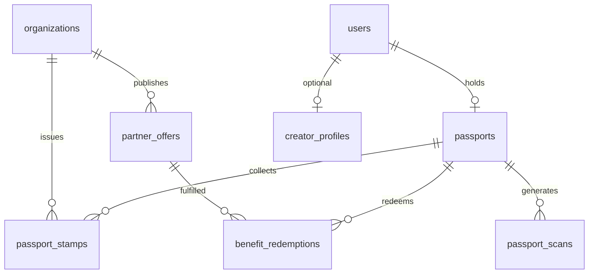

# PRD-301 — Passport + Benefits Foundation

> **Phase :** DISCOVER + DESIGN  
> **Ticket :** SPRINT-3 / TICKET-301  
> **Workflow :** `docs/workflow/YUNICITY-OFFICIAL-WORKFLOW.md` — **BMAD :** `docs/bmad/BMAD.md`  
> **Ce document ne déclenche aucun code** — il guide les tickets BUILD Sprint 3+.

---

## 0. Métadonnées

| Champ | Valeur |
|-------|--------|
| **ID** | PRD-301 |
| **Nom** | Passport + Benefits Foundation |
| **Statut** | **DESIGN_READY** |
| **Phase officielle** | DISCOVER → DESIGN (terminé pour ce ticket) |
| **Phase BMAD** | — (BUILD démarre aux tickets Sprint 3 dérivés) |
| **Sprint** | Sprint 3 |
| **Priorité** | **P0** (fondation produit stratégique) |
| **Scope** | Vision Passport, benefits territoriaux, tampons/QR (spec), creator territorial (spec), gamification (spec), découpage MVP/V2/V3 |
| **Auteur** | product-architect + ux-strategist + business-designer + territorial-platform-architect |
| **Owner technique** | tech-lead backend + tech-lead frontend (à nommer au kickoff BUILD) |
| **Date création** | 2026-05-18 |
| **Dernière mise à jour** | 2026-05-18 |
| **Environnement cible** | dev → recette (pilote Reims) |

### Dépendances amont (acquis)

| Acquis | Référence |
|--------|-----------|
| Auth + RBAC | PRD-101, Sprint 1 |
| Profils + organizations + memberships + vérification | PRD-201, Sprint 2 |
| Partner leads CRM + import terrain / Supabase | TICKET-205–260, Sprint 2–2.5 |
| Admin cockpit partenaires + RBAC staff | TICKET-207/207B |
| Onboarding foundation (profil, demande org) | TICKET-206 |

### Tickets aval (indicatif — hors scope PRD-301)

| Domaine | Objectif prévu (à découper en BUILD) |
|---------|--------------------------------------|
| **TICKET-302+** | Modèle données Passport + migrations |
| **TICKET-303+** | API benefits / offers / redemption foundation |
| **TICKET-304+** | QR + scan + anti-fraude MVP |
| **TICKET-305+** | UI Passport web/mobile |
| **TICKET-306+** | Admin offres partenaires + modération |
| **TICKET-307+** | Creator territorial MVP |

### Exclusions explicites (ce PRD)

| Exclusion | Note |
|-----------|------|
| Code, migrations SQL, endpoints | Tickets BUILD dédiés |
| UI / maquettes Figma finales | Spec UX §12 ; design system existant |
| Monétisation figée (abonnements, pricing) | Hypothèses business uniquement |
| NFT / blockchain / crypto wallet | Hors vision |
| Couponing national type marketplace | Hors vision territoriale |
| Tribes / feed social complet | Autres epics ; Passport peut s’y connecter plus tard |

---

# 1. Vision produit

## 1.1 Identité Yunicity

Yunicity est une **plateforme de citoyenneté locale** : reconnecter les habitants à leur ville par l’identité, la découverte et la confiance — pas par le scroll infini national.

Le **Passeport Yunicity** est la **couche d’appartenance** qui matérialise cette relation :

- Je **vis** ici (ville, quartier).
- Je **découvre** des lieux et des gens réels.
- Je **progresse** par l’engagement authentique (visites, événements, création locale).
- Je **bénéficie** d’avantages offerts par des partenaires **vérifiés** — pas de codes promo anonymes.

## 1.2 Philosophie du Passport

| Ce n’est pas | C’est |
|--------------|-------|
| Carte de fidélité générique | **Identité territoriale** exportable ville par ville |
| Couponing / cashback | **Avantages expérientiels** locaux (accès, réduction, invitation) |
| Gadget NFT | **Preuve d’engagement** lisible humainement (tampons, niveau) |
| Casino / loot boxes | **Progression méritocratique** lente et transparente |
| Profil Instagram dupliqué | **Couche complémentaire** au profil social (PRD-201) |

**Mantra produit :** *« Mon passeport, ma ville, mes lieux. »*

## 1.3 Citoyenneté locale

Le Passport formalise trois cercles :

```text
                    ┌─────────────────────────┐
                    │   Ville (Reims pilote)   │
                    └───────────┬─────────────┘
                                │
              ┌─────────────────┼─────────────────┐
              ▼                 ▼                 ▼
        Citoyen            Partenaire         Creator
     (détenteur)         (organization          (presse
                         verified)            locale)
```

- **Citoyen** : détient un Passport lié à son `user` + `user_profile`, ancré sur une **ville active**.
- **Partenaire** : une `organization` **vérifiée** publie des **benefits** ; valide des **scans/tampons** dans son périmètre.
- **Creator territorial** : produit du contenu local qualifié ; peut détenir un tier **Press/Creator** avec droits éditoriaux limités au MVP.

## 1.4 Rôle territorial

| Dimension | Rôle du Passport |
|-----------|------------------|
| **Géographique** | Offres et tampons **scopés ville** (extension multi-ville = V2/V3) |
| **Temporel** | Saisonnalité, événements, « neo-arrivant » premiers mois |
| **Social** | Signal de confiance (« membre Yunicity Reims ») sans exposer PII inutile |
| **Business** | Canal fidélisation **éthique** pour commerces vérifiés |
| **Creator** | Amplification du récit local (articles, micro-trottoirs) |

## 1.5 Résultat attendu (post-implémentation Sprint 3+)

Un habitant de Reims peut :

1. **Voir** son Passport numérique (identité, tier, tampons, QR).
2. **Découvrir** des benefits chez des partenaires vérifiés.
3. **Scanner** (ou présenter) un QR pour obtenir un tampon / débloquer une offre (MVP limité).
4. **Progresser** vers un tier supérieur par engagement mesuré — sans pay-to-win obligatoire.

Un partenaire vérifié peut :

1. **Publier** des offres Passport (soumises à règles + modération légère).
2. **Valider** une visite / redemption selon workflow anti-abus MVP.

---

# 2. Types de Passeports (tiers)

> **Hypothèses business** — aucun pricing final. Les tiers décrivent **droits produit** et **plafonds**, pas des contrats commerciaux.

## 2.1 Matrice synthétique

| Tier | Cible | Accès benefits | Tampons / QR | Visibilité | Limitations clés |
|------|-------|----------------|--------------|------------|------------------|
| **Basic** | Tout citoyen inscrit | Offres « ouvertes » partenaires | QR standard, tampons base | Profil Passport public minimal (opt-in) | Pas VIP ; plafond redemptions/jour |
| **Silver** | Engagement régulier | Basic + offres « silver » | Tampons thématiques | Badge Silver sur Passport | Conditions points/tampons |
| **Gold** | Ambassadeurs locaux | Silver + VIP limités | Tampons rares / événements | Mise en avant découverte (V2) | Quotas stricts ; revue modération |
| **Neo-arrivant** | Nouveaux résidents (< N mois) | Pack découverte ville | Parcours tampons « bienvenue » | Label temporaire visible | **Durée limitée** ; non cumulable Gold |
| **Business** | Représentant org vérifiée | Gestion offres côté org (via membership) | QR **partenaire** (scan entrant) | Page org liée | Pas benefits perso citoyen |
| **Press / Creator** | Médias / créateurs validés | Accès studio / publication (V2+) | Tampons « couverture » (V3) | Byline creator | Validation manuelle ; charte éditoriale |

## 2.2 Basic

| Attribut | Détail |
|----------|--------|
| **Accès** | Catalogue benefits `tier <= basic` ; événements publics ville |
| **Avantages** | Réductions légères, découvertes, 1ère visite partenaire |
| **Conditions** | Compte actif + profil ville renseignée + CGU Passport |
| **Visibilité** | QR personnel ; compteur tampons ; tier affiché |
| **Limitations** | Max redemptions / fenêtre ; pas d’offres VIP ; pas creator tools |

**Hypothèse :** gratuit, inclus à l’inscription.

## 2.3 Silver

| Attribut | Détail |
|----------|--------|
| **Accès** | Basic + pool offres Silver |
| **Avantages** | Réductions renforcées, invitations événements partenaires |
| **Conditions** | Seuil tampons **ou** points engagement (MVP : tampons uniquement) |
| **Visibilité** | Badge Silver ; historique tampons enrichi |
| **Limitations** | Renouvellement périodique si inactivité (V2) |

**Hypothèse :** merit-based ; pas d’abonnement obligatoire au MVP.

## 2.4 Gold

| Attribut | Détail |
|----------|--------|
| **Accès** | Silver + offres VIP (capacité limitée) |
| **Avantages** | Expériences exclusives (dégustation, accès coulisses) |
| **Conditions** | Seuil élevé + comportement sain (pas de flags fraude) |
| **Visibilité** | Statut Gold discret (pas leaderboard agressif) |
| **Limitations** | Invitations sur candidature ou tirage contrôlé (V2) |

**Hypothèse :** réserve pour ambassadeurs ; modération renforcée.

## 2.5 Neo-arrivant

| Attribut | Détail |
|----------|--------|
| **Accès** | Parcours « Découvrir Reims » (5–10 tampons guidés) |
| **Avantages** | Pack partenaires bienvenue (non cumulable 100 %) |
| **Conditions** | Déclaration arrivée récente **ou** code onboarding ville (V2) |
| **Visibilité** | Bandeau « Nouveau à Reims » (durée limitée) |
| **Limitations** | Expire à J+90 (hypothèse) ; revert vers Basic |

**Hypothèse :** objectif rétention nouveaux habitants / étudiants.

## 2.6 Business (partenaire)

| Attribut | Détail |
|----------|--------|
| **Accès** | Console org : créer benefits, voir scans, stats agrégées |
| **Avantages** | N/A (tier **organisationnel**, pas citoyen) |
| **Conditions** | `organization.verification_status = verified` + membership `owner/admin` |
| **Visibilité** | QR vitrine partenaire (statique ou rotatif V2) |
| **Limitations** | Pas de tier Business sur compte perso sans org |

**Hypothèse :** inclus dans partenariat terrain signé (hors scope pricing ici).

## 2.7 Press / Creator

| Attribut | Détail |
|----------|--------|
| **Accès** | Publication contenu local (MVP : liens / articles simples V2) |
| **Avantages** | Accès événements presse ; tampons « couverture » (V3) |
| **Conditions** | Candidature + validation modération + charte |
| **Visibilité** | Profil creator lié au Passport |
| **Limitations** | Pas de monétisation creator au MVP ; pas UGC illimité |

**Hypothèse :** petit cercle initial (5–20 creators pilote Reims).

---

# 3. Structure identité

## 3.1 Passport numérique (citoyen)

| Élément | Description | MVP | V2 | V3 |
|---------|-------------|-----|----|----|
| **Photo** | Avatar profil réutilisé (`user_profile`) | ✓ | | |
| **Identité** | Nom affiché, username, ville | ✓ | | |
| **QR unique** | Token signé / rotatif (spec sécu TICKET-304) | ✓ statique | rotation | |
| **Niveau / tier** | Basic → Silver → Gold | Basic seul | Silver | Gold |
| **Ville** | Ville active (Reims) | ✓ | multi-ville | export |
| **Tampons** | Collection visuelle (pages) | ✓ simple | thèmes | rares |
| **Benefits débloqués** | Liste offres éligibles / utilisées | ✓ | historique | recommandations |
| **Numéro Passport** | Identifiant lisible (ex. YUN-REIMS-XXXX) | V2 | | |

**Principes UX :** lisible en 3 secondes ; fierté locale ; pas de surcharge métriques.

## 3.2 Passport physique (imprimé)

| Élément | Description | MVP | V2 |
|---------|-------------|-----|-----|
| **Format** | Livret type passeport (A6 / A7) | | spec design |
| **Impression** | PDF génééré ou partenaire imprimeur local | | ✓ |
| **Tampons physiques** | Encre chez partenaires (stickers Yunicity) | | ✓ |
| **QR imprimé** | Lien vers Passport numérique | | ✓ |
| **Design ville** | Variante visuelle Reims (couleurs, motifs) | | ✓ |

**MVP :** numérique uniquement ; physique = **V2** (événement lancement, partenaires culturels).

**Inspiration :** passeport réel, carnet de timbres, Pass Culture (rituel, pas transaction froide).

---

# 4. Benefits System

## 4.1 Principes

Les **benefits** sont des **avantages territoriaux** proposés par une **organization vérifiée** :

| Type | Exemple | Territorial ? |
|------|---------|---------------|
| **Réduction** | −10 % sur place (horaires définis) | ✓ |
| **Accès VIP** | Visite coulisse, file prioritaire événement | ✓ |
| **Cadeau** | Boisson offerte, goodie local | ✓ |
| **Événement** | Invitation soirée découverte quartier | ✓ |
| **Découverte** | « Première visite » chez un commerce | ✓ |

**Interdit produit :** codes Amazon, cashback générique, publicité déguisée, offres sans lien géographique.

## 4.2 Cycle de vie d’une offre (concept)

```text
draft (org) → submitted → approved (mod/auto) → active → paused → expired
                                    ↓
                              rejected (raison)
```

| État | Qui | Visible citoyen |
|------|-----|-----------------|
| `draft` | Staff org | Non |
| `submitted` | Staff org | Non |
| `active` | Modération OK | Oui (si tier OK) |
| `paused` | Org / mod | Non |
| `expired` | Système / org | Non |

**MVP :** workflow simple ; modération manuelle ou règles heuristiques (org déjà verified).

## 4.3 Redemption (échange)

| Mode | Description | MVP |
|------|-------------|-----|
| **Scan QR citoyen** | Partenaire scanne QR user → tampon + éligibilité offre | ✓ pilote |
| **Scan QR vitrine** | Citoyen scanne QR org → tampon visite | ✓ pilote |
| **Code oral / PIN** | Fallback si pas de caméra (V2) | |
| **Validation manuelle** | Staff org approuve dans console | ✓ |

**Règle :** une redemption = événement auditable (`benefit_redemption` future).

## 4.4 Plafonds anti-abus (MVP)

| Plafond | Valeur hypothèse |
|---------|------------------|
| Redemptions / user / jour | 3 |
| Même offre / user / semaine | 1 |
| Benefits actifs / org | 10 |

---

# 5. Stamps / QR

## 5.1 Concepts

| Concept | Définition |
|---------|------------|
| **Tampon (stamp)** | Preuve visuelle et métier d’une interaction locale réussie |
| **Scan** | Événement technique liant user, lieu/org, timestamp, géo optionnelle |
| **QR citoyen** | Identifie le détenteur Passport (présentation chez partenaire) |
| **QR lieu** | Identifie un point de validation (vitrine, comptoir) |

## 5.2 Logique gamification (tampons)

| Mécanique | Description | MVP | V2 |
|----------|-------------|-----|-----|
| **Tampon visite** | 1 scan valide = 1 tampon org | ✓ | |
| **Tampon quartier** | Collection N orgs d’un quartier | | ✓ |
| **Tampon événement** | Participation event check-in | | ✓ |
| **Progression tier** | X tampons → Silver | | ✓ |
| **Tampons rares** | Édition limitée (festival) | | V3 |

**Pas de :** streaks addictifs, notifications spam, classements publics humiliants.

## 5.3 Validation lieu

| Signal | Poids MVP | Note |
|--------|-----------|------|
| Scan QR lieu | Fort | QR signé org |
| Géolocalisation | Faible (opt-in) | Rayon ~100 m, pas bloquant seul |
| Horaires ouverture | Moyen | V2 |
| Staff confirmation | Fort | Fallback humain |

## 5.4 Anti-fraude (spec haute niveau)

- QR signés, TTL optionnel (V2 rotation).
- Rate limit scans / device / IP.
- Détection scans impossibles (vitesse, distance).
- Révocation tampon par modération.

*Implémentation détaillée : tickets BUILD sécurité (TICKET-304+).*

---

# 6. Creator Territorial Program

## 6.1 Vision

Les **creators territoriaux** racontent la ville — micro-trottoirs, portraits commerçants, lives quartier — **sans** devenir un TikTok générique.

Ils portent le tier **Press/Creator** (validation manuelle).

## 6.2 Formats

| Format | Description | MVP | V2 | V3 |
|--------|-------------|-----|----|----|
| **Article court** | Texte + photo sur lieu partenaire | | ✓ | |
| **Vidéo courte** | 60–90 s, quartier | | | ✓ |
| **Live local** | Stream événement | | | ✓ |
| **Micro-trottoir** | Interviews rue | | ✓ | |
| **Carte découverte** | Liste lieux curator | | ✓ | |

## 6.3 Droits & devoirs

| Droit | Devoir |
|-------|--------|
| Badge Creator sur Passport | Charte éditoriale (pas diffamation, pas spam) |
| Accès événements presse | Mention partenaires si offre commerciale |
| Lien vers profil public | Modération rétroactive possible |

## 6.4 Distinction MVP vs creator economy

| MVP (Sprint 3 foundation) | Creator economy (V3+) |
|---------------------------|------------------------|
| Spec + rôles + charte | Monétisation, tips, sponsors |
| 0–5 creators pilote manuels | Marketplace creators |
| Republication manuelle admin | Flux UGC ouvert |
| Pas de algorithm feed | Ranking, viralité |

---

# 7. Organizations & Partners

## 7.1 Rôle des partenaires

Un **partenaire Passport** = `organization` avec :

- `verification_status = verified`
- Au moins un benefit actif (MVP : optionnel au début, objectif J+30)
- QR vitrine activé

**Lien CRM :** un `partner_lead` converti peut devenir org ; Passport **ne remplace pas** la vérification (PRD-201).

## 7.2 Participation Passport

| Action | Acteur | MVP |
|--------|--------|-----|
| Créer benefit | Owner/admin org | ✓ |
| Scanner citoyen | Staff org | ✓ |
| Voir stats agrégées | Owner/admin | ✓ basique |
| Répondre signalement | Modération ville | V2 |

## 7.3 Validation

| Niveau | Contrôle |
|--------|----------|
| **Org** | Déjà verified avant toute offre publique |
| **Offre** | Modération texte + conformité charte |
| **Scan** | Anti-fraude automatique + audit |

## 7.4 Visibilité

- Page publique org (slug) affiche benefits actifs (MVP : liste simple).
- Passport citoyen ne expose **pas** l’email du commerçant.

---

# 8. Gamification

## 8.1 Progression

```text
Engagement mesurable → tampons → seuils → tier (Silver/Gold)
```

| Principe | Application |
|----------|-------------|
| **Lent** | Silver = semaines/mois, pas heures |
| **Transparent** | Règles visibles (« encore 3 tampons ») |
| **Local** | Progression par ville |
| **Réversible** | Inactivité → pas de punition harsh (V2 decay doux) |

## 8.2 Badges

| Badge | Déclencheur | MVP |
|-------|-------------|-----|
| Premier tampon | 1 scan valide | ✓ |
| Explorateur | 5 orgs distinctes | ✓ |
| Neo-arrivant | Parcours bienvenue complété | ✓ |
| Ambassadeur | V3 / manuel | |

## 8.3 Niveaux & engagement

- **Niveau affiché** = tier Passport (Basic/Silver/Gold), pas level 9999.
- **Engagement score** interne (V2) — pas affiché publiquement au MVP.

## 8.4 Ce qu’on évite (casino UX)

- Pas de roue de la fortune.
- Pas de loot boxes payantes.
- Pas de classement public agressif entre citoyens.
- Pas de dark patterns « streak or lose ».

**Inspiration positive :** badges Pokémon (collection), exploration Foursquare early, appartenance Soho House.

---

# 9. Data Model Preview (concepts)

> **Aucun schéma SQL** — entités conceptuelles pour guider les tickets BUILD.

## 9.1 Entités principales

| Entité | Rôle | Relations clés |
|--------|------|----------------|
| `passports` | Instance Passport d’un user en une ville | `user_id`, `city`, `tier`, `qr_token` |
| `passport_tiers` | Référentiel tiers (basic, silver, …) | config seuils |
| `passport_stamps` | Tampon obtenu | `passport_id`, `organization_id`, `stamp_type` |
| `partner_offers` | Benefit publié | `organization_id`, règles, dates |
| `benefit_redemptions` | Utilisation d’une offre | `passport_id`, `offer_id`, `status` |
| `passport_scans` | Événement scan QR | `scanner_type`, `subject`, geo optionnel |
| `creator_profiles` | Extension creator | `user_id`, `status`, charte_accepted_at` |
| `creator_posts` | Contenu local | V2 |
| `passport_badges` | Badges débloqués | `passport_id`, `badge_code` |

## 9.2 Diagramme conceptuel (simplifié)



## 9.3 Séparation des concerns

| Domaine | Table(s) future | Ne pas mélanger avec |
|---------|-----------------|----------------------|
| Auth | `users` | Passport tiers |
| Profil social | `user_profiles` | Benefits |
| Org métier | `organizations` | Passport citoyen |
| CRM leads | `partner_leads` | Redemptions |

---

# 10. Risques

| Risque | Probabilité | Impact | Mitigation |
|--------|-------------|--------|------------|
| **Fraude QR** (screenshot, partage) | Élevée | Élevé | QR signés, TTL, rate limit, révocation |
| **Faux scans** (distance, bot) | Moyenne | Moyen | Géo opt-in + seuils + audit |
| **Abus creator** (diffamation, pub déguisée) | Moyenne | Élevé | Validation manuelle MVP ; charte ; modération |
| **Surcharge modération** | Élevée | Moyen | Workflow auto org verified ; plafonds offres |
| **Complexité produit** | Élevée | Élevé | MVP strict §11 ; pas de parallel features |
| **Privacy / RGPD** | Moyenne | Élevé | Minimisation données scan ; DPIA avant géo |
| **Partenaires non digitaux** | Moyenne | Moyen | Fallback validation staff |
| **Attentes monétisation** | Moyenne | Moyen | Communication « hypothèses » §2 |
| **Confusion profil / Passport** | Moyenne | Faible | UX distincte ; doc utilisateur |
| **Coupons perçus cheap** | Moyenne | Moyen | Charte benefits territoriaux §4 |

---

# 11. MVP vs V2 vs V3

## 11.1 MVP (Sprint 3 — foundation)

**Objectif :** prouver la boucle **découverte → visite → tampon → benefit** à Reims.

| Capacité | Inclus |
|----------|--------|
| Passport numérique Basic | ✓ |
| QR citoyen (affichage + scan partenaire pilote) | ✓ |
| QR vitrine org (scan citoyen) | ✓ |
| Tampons simples (visite org) | ✓ |
| Catalogue benefits (CRUD org + liste citoyen) | ✓ |
| Redemption simple (scan → tampon + 1 benefit) | ✓ |
| Console org minimale (benefits + scans) | ✓ |
| Modération offres (staff) | ✓ |
| Tier Basic uniquement (+ Neo-arrivant optionnel) | ✓ |
| Admin stats basiques | ✓ |

| Exclu MVP | Reporté |
|-----------|---------|
| Passport physique | V2 |
| Silver / Gold automatiques | V2 |
| Creator posts UGC | V2 |
| Géolocalisation forte | V2 |
| Multi-ville | V3 |
| Monétisation / abonnements | V3 |
| Recommandations ML | V3 |
| NFT / blockchain | Jamais |

## 11.2 V2 (engagement & élargissement)

- Tiers Silver + règles progression automatiques.
- Passport physique (PDF + tampons stickers).
- Creator articles + micro-trottoirs (cercle validé).
- Tampons quartier / événements.
- QR rotatif + géo renforcée.
- Dashboard partenaire analytics.
- Neo-arrivant parcours guidé complet.

## 11.3 V3 (échelle & creator economy)

- Multi-ville (Passport exportable).
- Gold + expériences VIP à échelle.
- Creator economy (sponsors, revenus, UGC modéré).
- Lives, vidéo, carte collaborative.
- Intégration tribus / feed (si epic validé).
- Partenariats institutionnels (ville, université).

## 11.4 Expérimental (hors engagement sans DECIDE)

- Token blockchain.
- Marketplace national.
- Publicité programmatique dans Passport.
- Jeux argent réel.

---

# 12. UX Principles

## 12.1 Émotion

| Émotion cible | Manifestation UI |
|---------------|------------------|
| **Appartenance** | « Je fais partie de Reims Yunicity » |
| **Fierté** | Tampons collectionnables, livret visuel |
| **Curiosité** | Découverte lieux non connus |
| **Confiance** | Badge « Partenaire vérifié » |
| **Calme** | Pas de rouge urgence, pas de countdown agressif |

## 12.2 Parcours MVP (citoyen)

```text
Onboarding profil → Activer Passport → Voir QR
    → Explorer benefits carte/liste
    → Visiter partenaire → Scan → Tampon + benefit
    → Collection tampons
```

## 12.3 Parcours MVP (partenaire)

```text
Org verified → Créer benefit → Modération OK
    → Afficher QR vitrine → Scanner citoyens
    → Voir redemptions / tampons agrégés
```

## 12.4 Identité visuelle (direction)

| Élément | Direction |
|---------|-----------|
| Typographie | Lisible, légèrement officielle (passeport) |
| Couleurs | Palette Yunicity + accent ville (Reims) |
| Iconographie | Tampons, sceaux, cartes — pas slots casino |
| Ton | Chaleureux, local, premium accessible |

## 12.5 Accessibilité & inclusivité

- Contraste suffisant (QR, tampons).
- Pas de mécanique pay-to-win affichée au MVP.
- Alternative sans smartphone : validation staff (V2 renforcé).

---

# 13. User Stories (foundation)

## Story 1 — Activer mon Passport

En tant que **citoyen inscrit à Reims**  
Je veux **activer mon Passport numérique**  
Afin de **accéder aux avantages locaux et collectionner mes tampons**

### Critères d’acceptation (post-BUILD)

- [ ] Mon Passport affiche ma ville, mon tier Basic, mon QR.
- [ ] Je comprends la différence profil social / Passport.
- [ ] Je peux refuser l’activation (opt-in explicite).

## Story 2 — Découvrir une offre

En tant que **citoyen**  
Je veux **voir les offres des partenaires vérifiés près de moi / ma ville**  
Afin de **découvrir des lieux locaux avec un avantage réel**

### Critères d’acceptation

- [ ] Seules orgs `verified` apparaissent.
- [ ] Offre affiche conditions claires (horaires, limite).
- [ ] Pas d’offre expirée ou rejetée.

## Story 3 — Obtenir un tampon

En tant que **citoyen chez un partenaire**  
Je veux **scanner le QR du lieu (ou montrer mon QR)**  
Afin de **prouver ma visite et débloquer ma progression**

### Critères d’acceptation

- [ ] Un tampon apparaît dans ma collection.
- [ ] Plafonds anti-abus respectés.
- [ ] Échec scan expliqué (fraude, limite).

## Story 4 — Publier une offre

En tant que **owner d’organization vérifiée**  
Je veux **créer une offre Passport**  
Afin de **attirer des visiteurs locaux engagés**

### Critères d’acceptation

- [ ] Workflow draft → submit → active.
- [ ] Offre conforme charte territoriale.
- [ ] Je ne peux pas cibler hors ville pilote (MVP).

## Story 5 — Modérer une offre

En tant que **modérateur ville**  
Je veux **approuver ou rejeter une offre**  
Afin de **protéger les citoyens du spam**

### Critères d’acceptation

- [ ] Raison de rejet obligatoire.
- [ ] Audit qui a modéré.

---

# 14. Sécurité & conformité (design gates)

Avant BUILD production :

- [ ] Revue `docs/ai/security-checklist.md` (QR, PII scans, IDOR offers).
- [ ] Threat model QR / redemption documenté (ticket BUILD).
- [ ] DPIA si géolocalisation activée (V2).
- [ ] CGU Passport (mention benefits, données scan).

---

# 15. Métriques (MEASURE — post-MVP)

| Métrique | Cible indicative pilote Reims |
|----------|-------------------------------|
| Passports activés | 500 (3 mois) |
| Tampons / passport actif / mois | ≥ 2 |
| Benefits actifs / org verified | ≥ 1 |
| Taux redemption / benefit view | ≥ 5 % |
| Signalements fraude / 1000 scans | < 2 |

---

# 16. DECIDE & prochaines étapes

| Décision | Statut |
|----------|--------|
| Passport = identité locale (pas fidélité générique) | **Validé design** |
| MVP Reims, Basic tier, scan QR simple | **Validé design** |
| Creator economy complet | **Reporté V3** |
| Monétisation | **Hypothèses seulement** |

**Prochaine action :** découper Sprint 3 BUILD (TICKET-302+) à partir de §11.1 — **aucun code dans PRD-301**.

---

*Document source de vérité Sprint 3 — Passport + Benefits Foundation. Toute implémentation doit référencer ce PRD et respecter le découpage MVP.*
