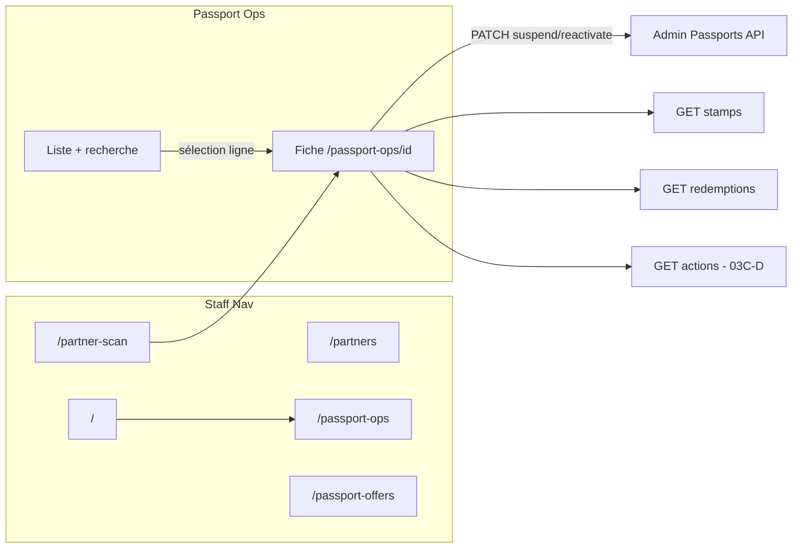

# ADMIN-03C — Discovery Passport Ops UI (staff workspace)

**Phase BMAD :** DISCOVER (pré-BUILD)  
**Feature :** FEATURE-ADMIN-V1 / ADMIN-03 Passport Ops  
**Ticket :** ADMIN-03C-DISCOVERY  
**Date :** 2026-06-03  
**Statut :** Spec produit + UX + frontend — **aucun code** dans ce ticket

**Prérequis livrés :**

| Ticket | Statut |
|--------|--------|
| ADMIN-03A Read API | ✅ PR #35 |
| ADMIN-03B PATCH + `passport_admin_actions` | ✅ PR #36 (`725ed40`) |
| ADMIN-02 Partners workspace | ✅ `/partners` |
| ADMIN-02D Partner detail + actions | ✅ `/partners/organizations/[id]` |

**Décisions CTO héritées (inchangées) :**

| Sujet | Décision |
|--------|----------|
| Statuts staff V1 | `active` \| `suspended` uniquement |
| `revoked` | Hors UI / PATCH V1 |
| Scan terrain | `/partner-scan` — inchangé |
| Offres | `/passport-offers` — ADMIN-04, hors 03C |
| Audit lecture | Table `passport_admin_actions` existe — **pas encore d’endpoint GET** |

**Base code auditée :** `main` post-merge PR #36.

---

## 1. Synthèse exécutive

**Problème :** le staff peut lire et muter les passports via API, mais l’admin n’a pas de workspace dédié. Aujourd’hui, « Passport Ops » dans la nav pointe vers **`/partner-scan`** (validation terrain), ce qui crée une confusion produit majeure.

**Recommandation globale :** **Option C — expérience inspirée du module Partners**, adaptée au flux **recherche → fiche → action**.

| Option | Description | Verdict |
|--------|-------------|---------|
| A — Workspace simple | Liste + fiche minimale, peu de KPIs | Trop pauvre pour la modération |
| B — Workspace avancé | Master-detail permanent, KPIs lourds, audit riche jour 1 | Surcoût UX + appels API |
| **C — Pattern Partners (recommandé)** | Liste `/passport-ops` + fiche `/passport-ops/[id]`, réutilisation dialogs/composants staff | **Choix V1** |

---

## 2. Réponses produit

### 2.1 Workspace : liste vs détail

| Option | Pattern | Verdict |
|--------|---------|---------|
| A | Liste gauche + détail droite (split persistant) | ❌ Trop étroit pour QR, tables stamps/redemptions, audit |
| B | Liste puis **page détail dédiée** | ✅ Aligné Partners (`/partners` → `/partners/organizations/[id]`) |
| C | Hybride (split sur desktop, page sur mobile) | ⚠️ Complexité sans gain pilote |

**Recommandation : Option B** (détail = route dédiée), avec **retour explicite** et **préservation des query params** de recherche (`?q=…&status=…`) au retour liste.

**Routes proposées :**

```txt
/passport-ops                    → workspace recherche + liste
/passport-ops/[passportId]       → fiche citoyen complète
```

**Non retenu V1 :** onglets multiples type `/partners?tab=…` — un seul domaine, pas de files parallèles (leads / activation).

---

### 2.2 Recherche

**API actuelle :** `GET /admin/passports` avec `q`, `search_mode` (`email` \| `passport_number` \| `display_name` \| `qr_fragment`), `status`, `city`, pagination.

**Auto-détection backend (sans `search_mode`) :**

1. `q` contient `@` → email (égalité insensible à la casse)
2. sinon match exact `passport_number` en scope ville
3. sinon `display_name` ILIKE si `len(q) ≥ 2`
4. `qr_fragment` via `search_mode` explicite uniquement (min 12 caractères)

**Recommandation UI V1 :**

| Élément | Choix |
|---------|--------|
| Champ principal | **Une seule barre de recherche** (« Email, n° passport, nom, fragment QR… ») |
| Mode avancé | **Repliable** (accordéon « Recherche avancée ») : select `search_mode` + aide contextuelle |
| Filtre statut | **Chips** : Tous \| Actifs \| Suspendus — mappe `status` query |
| Ville | Fixe **Reims** (hidden default = cockpit) — pas d’éditeur ville V1 |
| Tabs par mode | ❌ — surcharge cognitive ; le select avancé suffit |
| Soumission | Bouton « Rechercher » + **Enter** ; debounce **non** sur première frappe (éviter rafales ILIKE) |

**États liste :**

| État | Comportement |
|------|----------------|
| Landing (pas de `q`) | Browse paginé `updated_at DESC` — file ops « derniers passports touchés » |
| Recherche active | Liste filtrée ; bandeau « X résultat(s) pour … » |
| Recherche vide | Empty dédié + suggestions (vérifier email, n° complet, ≥2 car. nom, QR ≥12) |
| QR fragment | Encart warning : ne jamais coller le token complet en log support |

**Priorité staff (alignée 03A-DISCOVERY-TECH) :** email → passport_number → display_name → qr_fragment.

---

### 2.3 KPIs en tête de workspace

| KPI proposé | Valeur ops | Verdict V1 |
|-------------|------------|------------|
| Passports actifs (ville) | File modération, santé pilote | ✅ **Oui** — via `GET ?status=active&page_size=1` → `total` |
| Passports suspendus | Queue réactivation | ✅ **Oui** — idem `status=suspended` |
| Tampons totaux (ville) | Déjà au **Cockpit** (`stamps_total`) | ❌ Dupliquer — lien vers Cockpit |
| Redemptions totales / complétées | Agrégat territoire, pas actionnable par passport | ❌ Sur la **fiche** uniquement (`stats` detail) |
| Résultats recherche (`total`) | Contexte recherche | ✅ Bandeau contextuel, pas KPI global |

**Recommandation :** **2 cartes KPI** fixes (actifs / suspendus) + **compteur de résultats** quand `q` ou filtre actif. Pas de 5e ligne de métriques sur la liste.

**Chargement KPI :** 2 requêtes parallèles légères au mount liste (cache 60s session optionnel en 03D si perf).

---

### 2.4 Passport Detail — sections et ordre

Ordre vertical recommandé (mobile-first, `max-w-5xl` comme Partner detail) :

| # | Section | Contenu | Source API |
|---|---------|---------|------------|
| 1 | **En-tête + statut** | `passport_number`, badge `active`/`suspended`, dates `activated_at` / `suspended_at`, tier | GET detail |
| 2 | **Actions staff** | Suspendre / Réactiver (capabilities dérivées du statut) | PATCH 03B |
| 3 | **Identité citoyen** | email, `display_name`, `user.is_active` (lecture seule, lien futur user admin) | GET detail |
| 4 | **QR staff** | `qr_token` masqué par défaut (révéler + copier), avertissement PII | GET detail |
| 5 | **Stats passport** | tampons total, redemptions total / complétées | GET detail `stats` |
| 6 | **Tampons** | Table paginée, lien org → `/partners/organizations/[id]` | GET `…/stamps` |
| 7 | **Redemptions** | Table paginée, lien offre modération si pertinent | GET `…/redemptions` |
| 8 | **Historique audit** | Table actions staff | **GET `…/actions` à ajouter** (voir §6) |

**Liens sortants (carte « Raccourcis ») :**

- Scanner une offre → `/partner-scan` (terrain)
- Modération offres → `/passport-offers`
- Partenaire (depuis ligne stamp) → fiche org

---

### 2.5 Suspend / Reactivate — exposition et sécurité UX

**Pattern cible :** calque **ADMIN-02D** (`PartnerDetailActionsSection` + `PartnerActionReasonDialog`).

| Élément | Recommandation |
|---------|----------------|
| Placement | Section **« Actions staff »** sous l’en-tête, avant identité |
| Suspendre | Bouton **danger** visible si `status === active` |
| Réactiver | Bouton **primary** si `status === suspended` |
| Menu ⋮ seul | ❌ — action trop critique pour être cachée |
| Modal | **Obligatoire** — titre + description conséquence + textarea motif (min 3) |
| Confirm suspend | Texte explicite : « Le scan QR et les redemptions seront refusés jusqu’à réactivation. » |
| Double saisie passport_number | ❌ V1 — motif + ton danger suffisent |
| Succès | Toast / bandeau vert 4s + refresh detail (PATCH retourne déjà le detail) |
| Erreur | Bandeau rose — codes : `PASSPORT_STATUS_UNCHANGED`, `PASSPORT_STATUS_NOT_MUTABLE`, `INVALID_PASSPORT_REASON` |

**Réduction erreur staff :**

1. Badge statut très visible (couleur sémantique : vert / ambre).
2. Libellés actionnables (« Suspendre le passport » / « Réactiver le passport »), pas « PATCH ».
3. Motif obligatoire avec compteur caractères (3–1000).
4. Désactiver bouton pendant `isSubmitting`.
5. Pas d’action si statut déjà cible (bouton absent, pas seulement disabled).

---

### 2.6 Audit — format d’affichage

| Format | Avantages | Verdict |
|--------|-----------|---------|
| Timeline | Lecture narrative, mobile friendly | 03D polish |
| **Tableau** | Tri date, colonnes action / acteur / motif | **V1** |
| Section repliable | Réduit bruit si historique long | Optionnel V1 |

**Colonnes tableau V1 :** `created_at`, `action` (suspend / reactivate), `actor` (email staff si dispo), `previous_status` → `new_status`, `reason` (truncate + expand).

**Prérequis backend :** `GET /api/v1/admin/passports/{passport_id}/actions` paginé — **hors 03A/03B**, ticket **03C-D-BACKEND** ou inclus en tête de 03C-D frontend.

---

### 2.7 Navigation

**Problème actuel (`admin-shell.tsx`) :**

- Entrée nav « Passport Ops » → `/partner-scan`
- Titre page scan = « Passport Ops »

**Cible V1 :**

| Entrée | Route | Rôle |
|--------|-------|------|
| **Passport Ops** | `/passport-ops` | Workspace citoyen (03C) |
| **Scanner** (ou « Valider sur place ») | `/partner-scan` | Terrain scan/redemption |
| Offres | `/passport-offers` | Modération offres |
| Partenaires | `/partners` | Workspace partenaires |

**Accès rapides à documenter dans BUILD :**

| Depuis | Lien proposé |
|--------|----------------|
| **Cockpit** | Carte Passport : CTA « Ouvrir Passport Ops » → `/passport-ops` ; conserver « Scanner » → `/partner-scan` |
| **Partner Scan** | Après resolve : lien « Fiche passport staff » → `/passport-ops/[id]` si `passport_id` dans réponse scan (à vérifier contrat scan) |
| **Passport Offers** | Header breadcrumb staff → Passport Ops |
| **Partner Detail** | Lien contextuel depuis stamp/redemption cross-org (déjà pattern liens) |

**Deep link recherche :** `/passport-ops?q=user@example.com` pour support.

---

## 3. Architecture UX (schéma)



---

## 4. Architecture frontend

### 4.1 Réutilisation (ADMIN-02 / existant)

| Composant / pattern | Réutilisation Passport Ops |
|---------------------|----------------------------|
| `AdminShell` | Étendre nav + titres `/passport-ops` |
| `PartnerActionReasonDialog` | **Copier ou extraire** `StaffActionReasonDialog` partagé (motif obligatoire) |
| `PartnerDetailView` structure | Loading / 404 / error / `max-w-5xl` / breadcrumb retour |
| `verification-badge` / badges statut | Variante `passport-status-badge` |
| Tables admin (partners directory) | Style table stamps/redemptions |
| `formatAdminMetric`, cartes KPI | Style `CockpitPassportSnapshot` / partner counters |
| `useAuth` + pattern hooks partner | Nouveau `adminPassportsApi` dans provider |

**Ne pas réutiliser tel quel :**

- `PartnersWorkspace` / tabs — domaine différent
- `PartnersDirectoryTab` — API publique partners ≠ admin passports
- `useAdminPartnerDetail` — logique actions différente (1 PATCH vs multi endpoints)

### 4.2 Hooks à créer

| Hook | Responsabilité |
|------|----------------|
| `useAdminPassportList` | `q`, `status`, `search_mode`, `page` — sync URL `searchParams` |
| `useAdminPassportDetail` | GET detail, 404, reload |
| `useAdminPassportStamps` | GET stamps paginé, lazy quand section visible |
| `useAdminPassportRedemptions` | GET redemptions paginé, lazy |
| `useAdminPassportStatusPatch` | PATCH suspend/reactivate, feedback, merge detail |
| `useAdminPassportActions` | GET audit paginé (**après endpoint**) |
| `useAdminPassportKpis` | 2× list `total` par statut (optionnel hook dédié) |

### 4.3 Découpage fichiers recommandé

```txt
frontend/apps/admin/
  app/(protected)/passport-ops/
    page.tsx                          # liste
    [passportId]/page.tsx             # détail
  components/passport-ops/
    passport-ops-workspace.tsx        # header + KPIs + search + list
    passport-ops-search-bar.tsx
    passport-ops-list.tsx
    passport-ops-kpi-strip.tsx
    passport-detail-view.tsx
    passport-detail-header.tsx
    passport-detail-identity-card.tsx
    passport-detail-qr-card.tsx
    passport-detail-stats.tsx
    passport-detail-actions-section.tsx
    passport-detail-stamps-section.tsx
    passport-detail-redemptions-section.tsx
    passport-detail-audit-section.tsx
    passport-status-badge.tsx
  lib/
    admin-passports-api.ts            # createAdminPassportsApi
    hooks/use-admin-passport-*.ts
    passport-ops-url.ts               # parse/build searchParams
frontend/packages/types/
  admin-passport.ts                   # miroir schemas backend
frontend/packages/utils/
  admin-passport.ts                   # labels, paths, error copy
```

### 4.4 Limitation appels API

| Risque | Mitigation |
|--------|------------|
| KPI + liste + detail en parallèle | KPI : `page_size=1` ; liste : une seule requête ; detail : une fois à l’ouverture fiche |
| Stamps + redemptions au load fiche | **Lazy load** : fetch quand section entre viewport ou onglet activé |
| Re-fetch après PATCH | PATCH **retourne** `AdminPassportDetailResponse` — mettre à jour state sans GET |
| Pagination stamps/redemptions | `page_size=20`, bouton « Charger plus » ou pagination simple |
| Recherche à chaque keystroke | Submit explicite uniquement |
| Audit | Charger uniquement si section dépliée / onglet Audit |

---

## 5. États UX (matrice)

| Cas | État UI |
|-----|---------|
| Liste loading | Skeleton 3 lignes ou spinner texte |
| Liste error | Bandeau rose + Réessayer |
| Liste empty (browse) | « Aucun passport à Reims » |
| Recherche vide | Empty + checklist critères |
| Detail loading | Skeleton header + cartes |
| Passport introuvable | 404 dédié + retour liste |
| Suspend réussi | Success + badge suspendu + `suspended_at` affiché |
| Réactivation réussie | Success + badge actif |
| PATCH no-op | Message `PASSPORT_STATUS_UNCHANGED` |
| PATCH revoked DB | Message `PASSPORT_STATUS_NOT_MUTABLE` |
| Motif trop court | Validation inline modal + API 422 |

---

## 6. Gap backend pour UI complète

| Besoin UI | Existant | Action |
|-----------|----------|--------|
| Liste / detail / stamps / redemptions / PATCH | ✅ | Consommer tel quel |
| Historique audit en fiche | ❌ GET actions | **03C-D-BACKEND** (recommandé avant section audit) |
| `capabilities` dans detail | ❌ | Dériver côté UI : `can_suspend = status===active`, etc. (03B reporté 03C) |
| Lien scan → fiche | ⚠️ | Vérifier si `resolve` expose `passport_id` ; sinon recherche par fragment |

**Hors scope 03C :** `revoked`, tier change, redemption cancel, batch, désactivation user.

---

## 7. Risques

| Risque | Impact | Mitigation |
|--------|--------|------------|
| Confusion nav Passport Ops / Scan | Staff au mauvais outil | Split nav + titres distincts (BUILD 03C-A) |
| Fuite `qr_token` (screenshot, logs) | PII / fraude | Masquage par défaut, copie explicite, pas dans URL |
| Suspension sans compréhension | Support citoyen | Copy modal + lien doc interne |
| Appels KPI doublons | Charge API | 2 GET légers, cache session optionnel |
| Audit sans endpoint | Section vide | Feature-flag section ou ticket 03C-D backend d’abord |
| `revoked` affiché `suspended` | Mauvaise décision staff | Badge + tooltip « statut technique » en 03D si besoin |

---

## 8. Découpage BUILD recommandé

### Option retenue : **C — Inspiré Partners**, livré en 4 sous-tickets

---

### ADMIN-03C-A — Workspace liste + navigation

**Objectif :** Staff peut trouver un passport et ouvrir sa fiche.

| Livrable | Détail |
|----------|--------|
| Routes | `/passport-ops`, placeholder detail route |
| API client + types | `createAdminPassportsApi`, list + detail GET |
| `PassportOpsWorkspace` | Header, search bar, chips statut, liste paginée |
| KPI strip | Actifs / suspendus (2 GET `total`) |
| Nav | `admin-shell` : Passport Ops → `/passport-ops` ; Scan libellé distinct |
| Cockpit | Lien « Passport Ops » sur snapshot |
| États | loading, empty, error, recherche vide |

**Hors scope :** PATCH, stamps/redemptions tables, audit.

---

### ADMIN-03C-B — Fiche passport (lecture)

**Objectif :** Vue 360° lecture seule avant actions.

| Livrable | Détail |
|----------|--------|
| Route | `/passport-ops/[passportId]` |
| `PassportDetailView` | Header, identité, QR card, stats |
| Breadcrumb | Retour liste avec query préservés |
| 404 / error | Pattern `PartnerDetailView` |
| Liens | partner org, passport-offers, partner-scan |

**Hors scope :** PATCH, audit, tables longues.

---

### ADMIN-03C-C — Actions suspend / reactivate

**Objectif :** Modération terrain sécurisée.

| Livrable | Détail |
|----------|--------|
| `PassportDetailActionsSection` | Boutons + capabilities dérivées |
| `StaffActionReasonDialog` | Réutilisation pattern partner (motif 3–1000) |
| `useAdminPassportStatusPatch` | PATCH + merge state + toasts |
| Copy conséquences | Scan bloqué (aligné test 03B) |
| Feedback | success / error tous codes métier |

**Hors scope :** audit UI, lazy stamps.

---

### ADMIN-03C-D — Sous-ressources + audit + polish

**Objectif :** Fiche complète ops + traçabilité.

| Livrable | Détail |
|----------|--------|
| **Backend** | `GET /admin/passports/{id}/actions` paginé (si pas fait avant) |
| Sections | Stamps + redemptions tables paginées (lazy) |
| Audit | Tableau historique |
| Deep links | Scan → fiche ; offers header |
| Polish | Refresh liste après action ; optional session cache KPI |

---

## 9. Séquencement suggéré

```txt
03C-A (nav + liste)  →  03C-B (fiche lecture)  →  03C-C (actions)  →  03C-D (tables + audit)
```

**Parallélisable :** 03C-D-BACKEND (GET actions) en parallèle de 03C-A/B.

**GO BUILD attendu :**

```txt
GO ADMIN-03C-A
```

après validation CTO de ce document.

---

## 10. Checklist review CTO (pré-BUILD)

| Critère | Statut discovery |
|---------|------------------|
| 1 feature claire (`/passport-ops`) | ✅ |
| Pattern liste + fiche dédiée | ✅ Option B dans C |
| Recherche unique + avancé repliable | ✅ |
| KPIs utiles (actifs/suspendus) | ✅ |
| Sections fiche ordonnées | ✅ |
| Actions modal motif obligatoire | ✅ |
| Audit tableau (+ endpoint manquant signalé) | ✅ |
| Navigation déconfliction scan | ✅ |
| Réutilisation Partners | ✅ |
| Pas de scope creep (revoked, tier, user) | ✅ |

---

## 11. Références code

| Zone | Fichier |
|------|---------|
| API passports | `backend/app/api/v1/admin_passports.py` |
| Partner detail pattern | `frontend/apps/admin/components/partners/detail/partner-detail-view.tsx` |
| Reason dialog | `frontend/apps/admin/components/partners/detail/partner-action-reason-dialog.tsx` |
| Nav actuelle | `frontend/apps/admin/components/admin-shell.tsx` |
| Cockpit passport | `frontend/apps/admin/components/cockpit/cockpit-passport-snapshot.tsx` |
| Discovery 03A/03B | `docs/product-review/ADMIN-03A-DISCOVERY-TECH.md`, `ADMIN-03B-DISCOVERY.md` |
