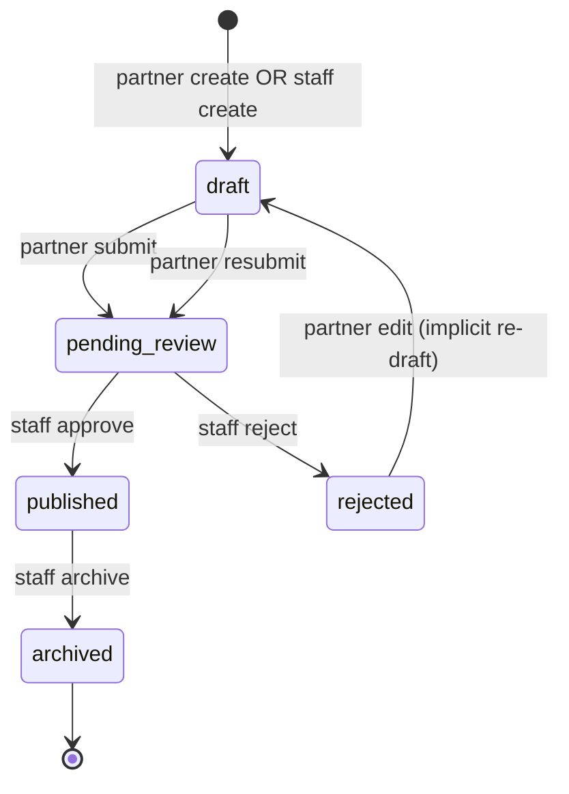

# ADMIN-04A — Discovery Offers (modération & cycle de vie)

**Phase BMAD :** DISCOVER  
**Feature :** FEATURE-ADMIN-V1 / ADMIN-04 Offers  
**Ticket :** ADMIN-04A-OFFERS-DISCOVERY  
**Date :** 2026-06-04  
**Statut :** Audit read-only — **aucun code modifié**

**Prérequis livrés :**

| Module | Statut |
|--------|--------|
| ADMIN-01 Cockpit | ✅ KPI offres + attention `offers_pending` |
| ADMIN-02 Partners | ✅ Compteurs offres + lien `offers_admin` |
| ADMIN-03 Passport Ops | ✅ Redemptions par passport + lien offre admin |
| TICKET-305A Partner offers (backend) | ✅ Modération + self-service partenaire |
| `/passport-offers` (admin UI partielle) | ✅ Liste + détail + approve/reject/archive |

**Base code auditée :** `main` post-merge PR #40 (Passport Ops complet).

---

## 1. Synthèse exécutive

Le domaine **Offers** est déjà **partiellement opérationnel** : backend modération (305A), UI staff `/passport-offers`, self-service partenaire `/partner-offers` (même app admin), catalogue public + redemption Passport. ADMIN-04 ne part **pas de zéro** — il s’agit de **consolider, combler les gaps admin** et aligner UX avec les modules Partners / Passport Ops.

**Constat clé :** la route UI `/passport-offers` et l’API `/admin/partner-offers` couvrent ~80 % du cycle modération V1, mais avec des **trous produit** (query params ignorés, champs tier/quota absents, pas de vue redemptions par offre, pas d’audit staff, incohérences flash).

**Recommandation CTO (preview) :** conserver **`/passport-offers`** pour la modération staff ; enchaîner **BUILD direct** sur consolidation workspace (04B) sans discovery-tech séparée — le backend est documenté et testé.

---

## 2. Inventaire backend

### 2.1 Tables structurantes

| Table | Fichier modèle | Rôle Offers |
|-------|----------------|-------------|
| `partner_offers` | `backend/app/models/passport.py` | Offre partenaire (contenu, statut, tier, quotas, flash, modération) |
| `passport_offer_redemptions` | idem | Utilisation offre ↔ passport (unique `(passport_id, partner_offer_id)`) |
| `organizations` | `backend/app/models/organization.py` | Propriétaire ; `verification_status`, `visibility` |
| `partner_profiles` | `backend/app/models/partner_profile.py` | `partner_status` filtre catalogue public |
| `passports` | `backend/app/models/passport.py` | Citoyen ; tier, compteur `redemptions_count` |
| `passport_tiers` | idem | Codes tier (`basic`, `silver`, …) |
| `passport_stamps` | idem | Tampon org créé à la redemption si absent |

**Pas de table `offer_admin_actions`** — contrairement à Passport Ops (03B), **aucun audit trail staff** sur les offres.

### 2.2 Statuts réels

#### Offre — `PartnerOfferStatus` (`passport_constants.py`)

| Valeur | Label métier | `is_active` typique |
|--------|--------------|---------------------|
| `draft` | Brouillon | `false` |
| `pending_review` | En attente modération | `false` |
| `published` | Publiée | `true` |
| `rejected` | Rejetée | `false` |
| `archived` | Archivée | `false` |

**Pas de `moderation_status` distinct** — une seule colonne `status`.

#### Redemption — `OfferRedemptionStatus`

| Valeur | Usage réel |
|--------|------------|
| `pending` | Défaut DB, **jamais créé** par les services actuels |
| `completed` | **Seul statut créé** (self-redeem + scan) |
| `cancelled` | Défini, **non implémenté** |
| `failed` | Défini, **non implémenté** |

#### Contexte partenaire / org

- `PartnerStatus` : `signed`, `active`, `paused`, `premium`, `founding_partner` — catalogue public = `active`, `premium`, `founding_partner`
- `VerificationStatus` org : `verified` requis pour créer offre
- `OrganizationVisibility` : passage à `public` à l’**approve**

### 2.3 Endpoints staff existants

Guard : `moderation.manage` **ou** `system.admin` — `admin_partner_offers.py`

| Method | Path | Action |
|--------|------|--------|
| GET | `/admin/partner-offers/verified-organizations` | Orgs vérifiées (création staff) |
| POST | `/admin/partner-offers` | Créer offre → **`draft`** |
| GET | `/admin/partner-offers` | Liste (filtres `status`, `offer_type`, `organization_id`, pagination) |
| GET | `/admin/partner-offers/{id}` | Détail |
| PATCH | `/admin/partner-offers/{id}` | Édition contenu (**pas** transition statut) |
| POST | `/admin/partner-offers/{id}/approve` | `pending_review` → `published` |
| POST | `/admin/partner-offers/{id}/reject` | → `rejected` + `reason` |
| POST | `/admin/partner-offers/{id}/archive` | → `archived` |

**Lecture redemptions (indirecte) :**

| Method | Path | Scope |
|--------|------|-------|
| GET | `/admin/passports/{id}/redemptions` | Par passport, pas par offre |

**Agrégats (cockpit / partner detail) :** compteurs `offers_*`, `redemptions_*` — pas de CRUD.

### 2.4 Endpoints non-admin (contexte)

| Domaine | Routes clés |
|---------|-------------|
| Partenaire self-service | `POST/GET/PATCH /organizations/me/offers`, `POST …/submit` |
| Public catalogue | `GET /partner-offers`, `GET /partners/{slug}/offers` |
| Passport citoyen | `GET /passport/offers`, `POST /passport/offers/{id}/redeem` |
| Scan terrain | `POST /scan/resolve`, `POST /scan/redeem` |

### 2.5 Services / repositories

| Fichier | Rôle |
|---------|------|
| `partner_offer_service.py` | CRUD, modération, transitions |
| `partner_offer_repository.py` | Filtres visibilité publique, list admin |
| `partner_offer_workflow.py` | Machine à états transitions |
| `public_partner_offer_service.py` | Catalogue + filtre tier côté API passport |
| `scan_redemption_service.py` | Resolve + redeem scan partenaire |
| `passport_service.py` | Self-redeem citoyen |
| `feed_offer_sync.py` | Post feed à la publication |
| `passport_repository.py` | Persistence redemptions |

### 2.6 Tests backend (synthèse)

| Fichier | Couverture |
|---------|------------|
| `test_partner_offer_workflow.py` | Transitions, éditabilité |
| `test_partner_offer_moderation.py` | Flux draft → submit → approve/reject |
| `test_admin_partner_offers.py` | CRUD admin, RBAC, archive |
| `test_partner_offers_api.py` | Catalogue public, dates, featured |
| `test_passport_redemptions.py` | Self-redeem, duplicate |
| `test_scan_redemption.py` | Scan resolve/redeem, isolation org |
| `test_admin_passports_api.py` | Redemptions par passport |
| `test_admin_cockpit_api.py` | KPI offres |
| `test_feed.py` | Offre publiée → feed |

**Gaps tests :** tier required, offer exhausted, `max_redemptions_per_passport` > 1, cancel redemption, admin publish-from-draft, flash visibility.

---

## 3. Inventaire frontend admin

### 3.1 UI existante

#### Surface staff — `/passport-offers`

| Route | Fichier | Capacités |
|-------|---------|-----------|
| `/passport-offers` | `app/(protected)/passport-offers/page.tsx` | Liste, filtres statut/type/org, recherche locale, CTA création |
| `/passport-offers/new` | `…/new/page.tsx` | Création staff (org vérifiée) |
| `/passport-offers/[id]` | `…/[id]/page.tsx` | Détail, approve/reject/archive, édition contenu |

Protection : `StaffRoute` + layout — `moderation.manage` / `system.admin`.

**Composants :** `offer-status-badge.tsx`, logique inline (pas de hook admin dédié).

#### Surface partenaire — `/partner-offers` (même app, autre persona)

| Route | Capacités |
|-------|-----------|
| `/partner-offers` | Hub « Tes offres pour la ville » |
| `/partner-offers/new` | Création + submit optionnel |
| `/partner-offers/[id]` | Édition draft/rejected, submit review |

Hooks : `use-partner-offers.ts`. Composants : `partner-offer-access-panel.tsx`, `partner-flash-fields.tsx`.

### 3.2 Client API staff

`PartnerOffersAdminApi` — `frontend/packages/utils/src/partner-offers-admin-api.ts`

Méthodes : `listVerifiedOrganizations`, `listOffers`, `getOffer`, `createOffer`, `updateOffer`, `approveOffer`, `rejectOffer`, `archiveOffer`.

Types : `frontend/packages/types/src/admin_partner_offer.ts`.

### 3.3 Liens inter-modules

| Source | Cible | État |
|--------|-------|------|
| Cockpit attention | `/passport-offers?status=pending_review` | ⚠️ Query **ignorée** par la page |
| Cockpit quick actions | Modérer / Créer offre | ✅ |
| Partner detail | `/passport-offers?organization_id={uuid}` | ⚠️ Query **ignorée** |
| Partner counters | Affichage offres total/review/published | Non cliquables |
| Passport Ops redemptions | `buildPassportOfferAdminPath` → `/passport-offers/{id}` | ✅ |
| Admin shell nav | « Offres » → `/passport-offers` | ✅ |

### 3.4 Actions staff possibles vs manquantes

| Action | UI | API |
|--------|----|-----|
| Lister / filtrer | ✅ (filtres locaux) | ✅ |
| Créer (staff) | ✅ | ✅ |
| Voir / éditer contenu | ✅ | ✅ |
| Approve / reject / archive | ✅ | ✅ |
| Éditer `tier_code_required` | ❌ | ✅ (schema) |
| Éditer `max_redemptions_total` | ❌ | ✅ (schema) |
| Pagination serveur | ❌ (`page_size: 100` en dur) | ✅ |
| Lire query params URL | ❌ | — |
| Lien org → fiche partenaire | ❌ | — |
| Redemptions par offre | ❌ | ❌ endpoint |
| Audit timeline staff | ❌ | ❌ table |
| Offres flash (staff) | ❌ | Partenaire seulement |
| Unpublish / republish | ❌ | ❌ transition |
| Hard delete | ❌ | ❌ |

### 3.5 Incohérences UX

1. **Double nomenclature** : nav « Offres » vs route `/passport-offers` vs API `/admin/partner-offers` vs partenaire `/partner-offers`.
2. **Styles divergents** : staff (design system) vs partenaire (stone/amber).
3. **Liens cockpit/partner trompeurs** : query params non appliqués.
4. **Compteurs partner detail** : informatifs sans deep link filtré.
5. **Détail partenaire offre** : charge liste `page_size: 100` puis `find` — fragile.

---

## 4. Inventaire web / public (citoyen)

### 4.1 Surfaces de visibilité

| Surface | Route | API |
|---------|-------|-----|
| Hub Passport | `/passport` | `GET /passport/offers` + redeem |
| Fiche partenaire | `/places/[slug]` | `GET /partners/{slug}/offers` |
| Fil social | `/feed` | Posts type `offer` |
| Recherche | `/search` | Explorer + FTS (mix auth/public) |
| Carte / événements / quartiers | `/map`, `/events`, `/neighborhoods/[slug]` | `GET /partner-offers?city=` |

### 4.2 Conditions visibilité (backend — UI trust-the-API)

Repository `_visible_offer_filters` :

1. Org `verification_status = verified`
2. Org `visibility = public`
3. Offre `status = published` **et** `is_active = true`
4. `valid_from` / `valid_until` dans la fenêtre
5. Catalogue : `PartnerProfile.partner_status ∈ {active, premium, founding_partner}`
6. Ville scope (défaut Reims)

**Filtre tier** : appliqué sur `GET /passport/offers`, **pas** sur le catalogue public brut.

### 4.3 Risques publication mal configurée

| Scénario | Impact citoyen |
|----------|----------------|
| Dates invalides | Affichage possible ; redeem échoue (message générique) |
| Tier incorrect | Visible ; redeem refusé sans explication tier en UI |
| Quota global épuisé | Visible jusqu’à échec redeem |
| `max_redemptions_per_passport` > 1 | Champ ignoré — contrainte unique impose 1 seule redemption |
| Deep link `#passport-offer-{slug}` | **Ancre absente** sur fiche partenaire |
| Brouillon fuité côté API | Web affiche sans garde locale |
| Flash expiré | Badge masqué ; contenu peut rester visible si dates OK |

---

## 5. Data map Offer

### 5.1 Identity

| Champ | Table | Exposé admin | Exposé public |
|-------|-------|--------------|---------------|
| `id` | partner_offers | ✅ | ❌ (list only) |
| `title` | ✅ | ✅ | ✅ |
| `description` | ✅ | ✅ | ✅ |
| `offer_type` | ✅ | ✅ | ✅ |
| `organization_id` | ✅ | ✅ | via org |
| `partner_profile_id` | — (via org 1:1) | indirect | indirect |
| `city` | via org | ✅ | ✅ |
| `slug` | ✅ | partiel | ✅ (catalogue) |
| `value_label`, `conditions` | ✅ | ✅ | ✅ |

### 5.2 Lifecycle

| Champ | Existe | Notes |
|-------|--------|-------|
| `status` | ✅ | Machine à états unique |
| `moderation_status` | ❌ | Fusionné dans `status` |
| `published_at` | ❌ | Proxy : `moderated_at` à l’approve |
| `starts_at` / `ends_at` | ✅ | `valid_from`, `valid_until` |
| `archived_at` | ❌ | Statut `archived` seulement |
| `is_active` | ✅ | Redondant avec `published` (compat MVP) |
| `moderated_by_user_id`, `moderated_at` | ✅ | Approve/reject |
| `rejection_reason` | ✅ | Reject |
| `created_by_user_id` | ✅ | Création |

### 5.3 Passport

| Champ | Existe | Enforced |
|-------|--------|----------|
| `tier_code_required` | ✅ | ✅ (redeem + scan) |
| `max_redemptions_total` | ✅ | ✅ |
| `max_redemptions_per_passport` | ✅ (default 1) | ❌ (unique constraint = 1 max anyway) |
| `redemption_count` | dénormalisé passport | +1 à chaque redemption |
| Redemption statuses | ✅ enum | Seul `completed` utilisé |

### 5.4 Public exposure (conjuction)

```
visible_public =
  org.verified
  AND org.visibility = public
  AND offer.status = published AND offer.is_active
  AND valid_from ≤ now ≤ valid_until (si définis)
  AND partner_status ∈ PUBLIC_PARTNER_STATUSES
  AND city match
```

Side effect approve : feed post + org visibility public.

### 5.5 Actions staff (mapping)

| Action produit | Backend | UI staff |
|----------------|---------|----------|
| Approve | ✅ `POST …/approve` | ✅ |
| Reject | ✅ `POST …/reject` | ✅ |
| Publish | = approve | ✅ |
| Unpublish | ❌ | ❌ |
| Archive | ✅ `POST …/archive` | ✅ |
| Edit | ✅ PATCH | ✅ (champs partiels) |
| Delete / hard delete | ❌ | ❌ |
| Submit (draft → pending) | Partenaire only | N/A staff |

---

## 6. Cycle de vie réel



**Écarts critiques :**

1. **Staff create → `draft`** sans endpoint submit admin → approve **impossible** sans hack DB ou flux partenaire.
2. **Pas de unpublish** (`published` → `draft` / `pending_review`).
3. **Reject depuis `published`** possible en UI staff — vérifier règle métier backend (transition workflow : reject depuis published **non** dans `ALLOWED_OFFER_TRANSITIONS` — incohérence UI/API à valider en BUILD).
4. Redemption = **immédiate `completed`** — pas de file pending validation.

---

## 7. Gaps (existant vs cible ADMIN-04)

| Capacité cible | État | Priorité V1 |
|----------------|------|-------------|
| **1. Offers Workspace** (filtres pending/published/rejected/expired/partner/city) | Partiel — filtres API OK, UI ignore query params, pas expired, pas pagination | P0 |
| **2. Offer Detail 360°** | Partiel — contenu + modération, manque tier/quota/redemptions/liens | P0 |
| **3. Moderation Actions** | Core OK — gaps submit admin, unpublish | P1 |
| **4. Redemptions View** | Manquant par offre | P1 |
| **5. Audit Timeline** | Manquant (table + API + UI) | P2 |

### Backend manquant

- `GET /admin/partner-offers/{id}/redemptions`
- Filtre `expired` / `active_window` en list admin
- Admin submit draft → pending (ou approve-from-draft explicite)
- Table `offer_admin_actions` (mirror passport_admin_actions)
- Cancel redemption (si produit le demande)
- GET offre par id/slug public (hors scope admin strict)

### Frontend manquant

- Hook `use-admin-partner-offers-*`
- Lecture `useSearchParams` (`status`, `organization_id`)
- Pagination serveur
- Champs tier + max_redemptions dans forms staff
- Section redemptions + liens partner/passport ops
- Tests admin offers (vitest + e2e léger)

---

## 8. Risques

| Risque | Sévérité | Mitigation BUILD |
|--------|----------|------------------|
| Publier offre tier/quota mal configurée | **Haute** | Exposer champs staff + preview conditions |
| Approve offre staff en draft (impossible) | **Moyenne** | Workflow admin submit ou CTA « forcer review » |
| UI reject sur published vs workflow | **Moyenne** | Aligner boutons sur `ALLOWED_OFFER_TRANSITIONS` |
| Pas d’audit modération offre | **Moyenne** | 04E ou ticket dédié post-V1 |
| Redemption irréversible `completed` | **Haute** | Zone rouge — pas de cancel sans règles métier + tests |
| Query params ignorés (ops friction) | **Moyenne** | 04B quick win |
| `max_redemptions_per_passport` schéma trompeur | **Basse** | Doc + enforcement ou retrait champ V1 |
| Citoyen trust-the-API | **Haute** | Backend gates + admin validation champs obligatoires |

---

## 9. Questions produit — réponses

### 9.1 « Passport Offers » vs « Offers » ?

**Recommandation : garder `/passport-offers`** pour la modération staff.

- `/partner-offers` existe déjà (self-service partenaire, même app).
- `buildPassportOfferAdminPath` et `AdminPartnerLinks.offers_admin` pointent déjà vers `/passport-offers`.
- Renommer en `/offers` créerait une ambiguïté persona.

**Amélioration sans rename :** label nav **« Modération offres »** (vs « Mes offres » partenaire).

### 9.2 Séparer offres Passport vs offres classiques ?

**Non en V1.** Un seul modèle `partner_offers` — toutes les offres sont **Passport-native** (tier, redemption). Pas de second catalogue.

### 9.3 Statuts visibles staff V1

| Statut | Visible | Action |
|--------|---------|--------|
| `pending_review` | ✅ | Approve / reject |
| `published` | ✅ | Archive (+ edit limité ?) |
| `rejected` | ✅ | Archive |
| `draft` | ✅ | Archive ; pas approve direct |
| `archived` | ✅ | Lecture seule |
| Expiré (date) | ⚠️ à ajouter | Filtre dérivé, pas statut DB |

### 9.4 Actions risquées (zone rouge)

1. **Approve** → org public + feed + visible citoyen
2. **Reject published** (si autorisé) → retrait catalogue + feed
3. **Archive published** → idem
4. **Edit champs post-publication** (tier, dates, quota) → impact citoyens en cours
5. **Cancel redemption** — inexistant ; à ne pas improviser

### 9.5 Liens inter-modules V1

| Depuis | Vers Offers |
|--------|-------------|
| Cockpit | `/passport-offers?status=pending_review` (fix query) |
| Partner detail | `/passport-offers?organization_id=` + compteurs cliquables |
| Passport Ops | `/passport-offers/{offer_id}` (existe) |
| Activation Waves | Lien optionnel « offres partenaire » — **P2**, pas bloquant V1 |

---

## 10. Recommandation CTO

### 10.1 Route UI

| Décision | Choix |
|----------|-------|
| Route modération staff | **Garder `/passport-offers`** |
| API prefix | Inchangé `/admin/partner-offers` |
| Self-service partenaire | Inchangé `/partner-offers` |

### 10.2 BUILD direct ou discovery-tech ?

**BUILD direct** — pas de ticket discovery-tech séparé.

Justification :

- Backend 305A documenté, testé, machine à états explicite.
- UI staff existe — travail = **consolidation + gaps**, pas invention domaine.
- Risques identifiés sont **produit/UX**, pas inconnus architecturaux.

**Gate BUILD 04B :** lire ce document + `partner_offer_workflow.py` + valider règle reject/archive sur `published`.

### 10.3 Découpage tickets proposé

| Ticket | Scope | Livrable |
|--------|-------|----------|
| **ADMIN-04A** | Discovery | Ce document ✅ |
| **ADMIN-04B** | Offers Workspace Consolidation | Query params, pagination, filtres expired, hook admin, liens cockpit/partner, KPI strip |
| **ADMIN-04C** | Offer Detail Page | Fiche 360° : tier, quotas, dates, partenaire, liens, états loading/empty/error |
| **ADMIN-04D** | Moderation / Lifecycle Actions | Alignement workflow UI/API, champs staff complets, admin submit-or-approve path, confirm dialogs |
| **ADMIN-04E** | Redemptions & Audit | `GET …/redemptions` par offre, section UI, table `offer_admin_actions` + timeline (si validé) |

**Ordre suggéré :** 04B → 04C → 04D → 04E (04E peut être scindé : redemptions P1, audit P2).

### 10.4 Hors scope ADMIN-04 V1

- Refonte `/partner-offers` partenaire (styles)
- Cancel redemption / remboursement
- Unpublish sans archive
- Hard delete offre
- Refonte web citoyen (deep links, tier badge) — ticket web séparé
- `max_redemptions_per_passport` > 1 (migration contrainte)

---

## 11. Annexes — fichiers pivot

### Backend

- `backend/app/models/passport.py` — `PartnerOffer`, `PassportOfferRedemption`
- `backend/app/core/passport_constants.py` — enums
- `backend/app/core/partner_offer_workflow.py` — transitions
- `backend/app/repositories/partner_offer_repository.py`
- `backend/app/services/partner_offer_service.py`
- `backend/app/api/v1/admin_partner_offers.py`

### Frontend admin

- `frontend/apps/admin/app/(protected)/passport-offers/**`
- `frontend/apps/admin/app/(protected)/partner-offers/**`
- `frontend/packages/utils/src/partner-offers-admin-api.ts`
- `frontend/packages/types/src/admin_partner_offer.ts`

### Frontend web (citoyen)

- `frontend/apps/web/components/passport/passport-partner-offers-section.tsx`
- `frontend/apps/web/hooks/use-passport-offers.ts`
- `frontend/packages/utils/src/partner-offer-public.ts`

---

**Prochaine étape :** validation CTO de ce discovery → ouverture **ADMIN-04B Offers Workspace Consolidation** (BUILD).
