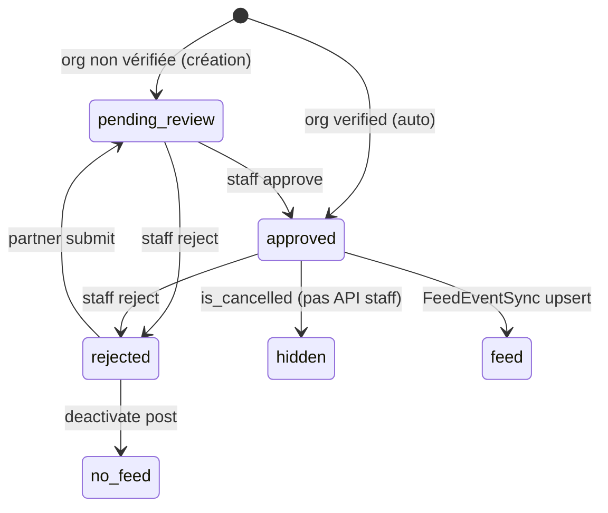

# ADMIN-05A — Discovery Events (staff)

**Phase BMAD :** DISCOVER  
**Feature :** FEATURE-ADMIN-V1 / ADMIN-05 Events  
**Ticket :** ADMIN-05A-EVENTS-DISCOVERY  
**Date :** 2026-06-04  
**Statut :** Audit read-only — **aucun code modifié, aucun commit**

**Prérequis livrés :**

| Module | Statut |
|--------|--------|
| ADMIN-01 Cockpit | ✅ |
| ADMIN-02 Partners | ✅ |
| ADMIN-03 Passport Ops | ✅ |
| ADMIN-04 Offers | ✅ (workspace, detail 360°, redemptions, audit B1/B2) |

**Base code auditée :** `main` post-merge PR #46 (`35a0893`).

**Références produit / technique :**

- `docs/product/local-events.md` (TICKET-505)
- `docs/ux/local-events-intent.md`
- `docs/technical/event-map-technical-spec.md`
- `docs/superpowers/plans/2026-05-31-web-partners-05a-partner-events.md`
- `docs/superpowers/plans/2026-05-31-web-partners-05b-partner-event-visibility.md`

---

## 1. Synthèse exécutive

Le domaine **Events** est **mature côté citoyen et partenaire** (API TICKET-505, feed, carte, intérêts), mais **immature côté admin** : le backend expose une **file de modération minimale** (`GET` liste + `approve` / `reject`), sans fiche staff, sans audit, sans client TypeScript admin.

Le cockpit et la fiche partenaire **comptent déjà** les events en attente, mais les liens UI sont **désactivés** (« route à venir »).

**Recommandation CTO :** construire un **workspace Events dédié** (miroir ADMIN-04 Offers / ADMIN-03 Creator Content), **sans** hub « Moderation » transversal en V1. Séparer **liste + actions** (05B) puis **fiche 360°** (05C) ; reporter **audit staff** (05D) tant qu’il n’existe pas de table `event_admin_actions`.

---

## 2. Réponses aux 10 questions discovery

### 1. Quelles tables structurent les events ?

| Table | Rôle | FK / liens |
|-------|------|------------|
| **`local_events`** | Moment local (titre, dates, lieu, modération, org) | `organization_id` → `organizations` (nullable SET NULL), `created_by_user_id` → `users`, `moderated_by_user_id` → `users`, `neighborhood_id` → `neighborhoods` |
| **`event_interests`** | Intérêt citoyen (« je suis intéressé ») — pas RSVP | `user_id`, `event_id` (unique pair) |
| **`posts`** (indirect) | Carte feed `PostType.EVENT` | `local_event_id` via `FeedEventSyncService` |

**Pas de table** : `event_admin_actions`, billets, présence, RSVP.

**Migration fondatrice :** `backend/alembic/versions/20260527_0013_local_events.py` (+ `neighborhood_id`, FTS, index carte dans migrations ultérieures).

---

### 2. Quels statuts existent ?

**Modération** (`moderation_status`) — enum `LocalEventModerationStatus` :

| Valeur | Signification |
|--------|----------------|
| `pending_review` | En attente staff (org non vérifiée ou resoumission) |
| `approved` | Publiable citoyen / feed / carte |
| `rejected` | Refusé (motif `rejection_reason`) |

**Transitions** (`backend/app/core/local_event_workflow.py`) :

```txt
pending_review → approved | rejected
approved       → rejected
rejected       → pending_review   (via submit partenaire uniquement)
```

**Autres champs d’état :**

| Champ | Rôle |
|-------|------|
| `visibility` | MVP : seule valeur `public` (`LocalEventVisibility.PUBLIC`) |
| `is_cancelled` | Masque le public (410 sur GET) — **aucune route API** pour annuler en prod aujourd’hui (seeds / tests) |
| `event_type` | Catégorie libre parmi `MVP_LOCAL_EVENT_TYPES` (dont `partner_event`, `creator_meetup`) |

**Pas de statut** type `draft` / `published` / `archived` comme les offres — le cycle est **modération + annulation booléenne**.

---

### 3. Comment un event devient public ?

Conditions cumulatives pour visibilité citoyenne (`list_public_*`, `get_public`, carte, recherche) :

1. `moderation_status == approved`
2. `is_cancelled == false`
3. `visibility == public`
4. Listes « à venir » : souvent `starts_at >= now` (liste ville, carte bbox, page partenaire si `upcoming_only`)
5. **Création / soumission** : si `organization.verification_status == verified` → **auto-approval** (`_initial_moderation_status` → `approved` + feed sync immédiat). Sinon → `pending_review` jusqu’à `POST /admin/local-events/{id}/approve`.
6. **Page partenaire publique** (`GET /partners/{slug}/events`) : en plus, `PartnerProfile.partner_status` ∈ `PUBLIC_PARTNER_STATUSES`.
7. **Création partenaire** : gate `_check_partner_status_gate` (org avec profil partenaire doit être « actif » public).

Effets à l’approbation staff : `FeedEventSyncService.upsert_event_post`, notification `LOCAL_EVENT_PUBLISHED` au `created_by_user_id`.

---

### 4. Qui peut créer / modérer ?

| Acteur | Créer | Modifier | Soumettre | Modérer (approve/reject) |
|--------|-------|----------|-----------|---------------------------|
| **Membre org** (`require_offer_manager` via `OrganizationMembershipService`) | `POST /organizations/me/events` | `PATCH /organizations/me/events/{id}` | `POST .../submit` | — |
| **Staff** (`moderation.manage` \| `system.admin`) | — | — | — | `GET /admin/local-events`, `POST .../approve`, `POST .../reject` |
| **Citoyen** | — | — | — | — (lecture + intérêt) |

**Créateur** : `created_by_user_id` sur l’event (user membre org). Pas de lien FK vers `partner_creator_content` — le type `creator_meetup` est une **catégorie**, pas une modération créateur.

---

### 5. Quels endpoints staff existent ?

Fichier : `backend/app/api/v1/admin_local_events.py` — préfixe **`/api/v1/admin/local-events`**

| Méthode | Route | Rôle |
|---------|-------|------|
| GET | `` | Liste paginée (`status` = filtre `moderation_status`, `city`, `page`, `page_size` max 50) |
| POST | `/{event_id}/approve` | Approuver |
| POST | `/{event_id}/reject` | Rejeter + body `{ reason }` (3–500 car.) |

**Manquants vs Offers / Passport Ops :**

- Pas de `GET /{event_id}` (détail staff)
- Pas d’audit `GET .../actions`
- Pas d’archive / unpublish / cancel API
- **Aucun test d’intégration** référençant `/admin/local-events` dans `backend/tests/`

---

### 6. Quelles pages admin existent ?

| Zone | Existant |
|------|----------|
| **Nav staff** (`admin-shell.tsx`) | Entrée **« Events » désactivée** — hint « Bientôt » |
| **Cockpit** (`cockpit-attention.tsx`) | Carte `events_pending` avec compteur réel mais **lien désactivé** |
| **Fiche partenaire** (`partner-detail-counters.tsx`) | Compteurs `events_total` / `events_pending` — **pas de lien** vers file events |
| **Route `/events` ou `/local-events`** | **Aucune** page admin |
| **Client API admin** (`auth-provider.tsx`) | **Pas** de `LocalEventsAdminApi` (contrairement `partnerOffersAdminApi`, `partnerCreatorContentAdminApi`) |
| **Types / utils admin events** | Types citoyen `LocalEvent` dans `@yunicity/types` ; **pas** de payload `LocalEventReject` côté frontend |

**Pattern le plus proche en admin aujourd’hui :** `creator-content/page.tsx` (liste + filtres + modération inline) et `passport-offers` (workspace + detail).

---

### 7. Quels gaps empêchent un vrai workspace Events ?

| Gap | Impact |
|-----|--------|
| **Zéro UI admin** | Impossible de modérer sans API brute / Swagger |
| **Pas de client TS admin** | Pas d’intégration auth-provider |
| **Pas de GET détail staff** | Fiche 360° impossible sans enrichir liste ou ajouter endpoint |
| **File cockpit non branchée** | Métrique `events_pending` sans workflow |
| **Auto-approval org vérifiée** | File `pending_review` peut être **vide en démo** — UX staff à calibrer (filtres, indicateur auto-approved) |
| **Pas d’audit trail** | Seuls `moderated_by/at` + dernier `rejection_reason` |
| **Pas d’API cancel** | `is_cancelled` invisible pour le staff |
| **Pas de tests admin** | Risque régression modération |
| **Rejet → republication** | Staff ne peut pas re-approuver depuis `rejected` ; le partenaire doit `submit` → `pending_review` |
| **Lien partenaire → events** | Compteurs sans navigation |

---

### 8. Faut-il séparer Events et Moderation ?

**Oui, en V1.**

- La nav admin prévoit déjà **Events** et **Moderation** comme entrées **distinctes** (Moderation = hub « à venir », désactivé).
- Aujourd’hui la modération est **par domaine** : `/passport-offers`, `/creator-content`, (futur) `/local-events` ou `/events`.
- Un hub transversal mélangerait des modèles, statuts et actions différents (offers : archive ; events : pas d’archive ; passport : suspend/reactivate).

**Recommandation :** workspace **`/local-events`** (ou `/events` staff) dédié ; laisser **Moderation** hub pour une phase ultérieure (vue agrégée optionnelle), pas bloquant ADMIN-05.

---

### 9. Quels liens avec Partners / Creators / Passport ?

| Lien | Détail |
|------|--------|
| **Partners** | `local_events.organization_id` ; compteurs sur `GET /admin/partners/...` ; events publics sur `GET /partners/{slug}/events` ; gate statut partenaire à la création |
| **Creators** | Modération **séparée** (`partner_creator_contents`, page `/creator-content`). Type event `creator_meetup` = taxonomie, pas le même objet |
| **Passport / Offres** | **Aucun** redemption ou stamp sur event. Proximité produit : feed, carte, « sortir », intérêts citoyens |
| **Cockpit** | `events_pending`, `events_total` dans summary |
| **Feed** | `Post` lié par `local_event_id` ; sync à l’approve |
| **Carte** | `GET /map/events` (bbox, events approuvés non annulés) |
| **Web public** | `/sortir`, `/events/[id]` (redirect agenda → sortir), portail partenaire `/organizations/me/partner/events` |

---

### 10. Quel découpage BUILD recommander ?

Aligné sur ADMIN-04 et l’existant backend :

| Ticket | Scope | Priorité |
|--------|--------|----------|
| **ADMIN-05B** — Events Workspace | Nav + route liste ; `LocalEventsAdminApi` ; types reject ; hooks liste ; filtres `pending_review` / ville ; approve/reject depuis la liste ; brancher cockpit `events_pending` → `/local-events?status=pending_review` | **P0** |
| **ADMIN-05C** — Event Detail 360° | Backend : `GET /admin/local-events/{id}` (recommandé) ; fiche staff : identité, org/partenaire, lieu/dates, exposition publique, intérêts (read-only si endpoint ou agrégat), modération, lien web public | **P1** |
| **ADMIN-05D** — Audit & polish (optionnel V1.1) | Table `event_admin_actions` + GET actions + timeline UI (si parité Offers) ; API cancel staff ; tests admin ; lien depuis fiche partenaire | **P2** |

**Hors scope ADMIN-05 initial :** refonte web `/sortir`, billetterie, hub Moderation global, modification workflow auto-approval (décision produit séparée).

---

## 3. Inventaire backend

### 3.1 Modèle & constantes

- `backend/app/models/local_event.py` — `LocalEvent`, `EventInterest`
- `backend/app/core/local_event_constants.py` — statuts, types MVP, pagination
- `backend/app/core/local_event_workflow.py` — transitions modération
- `backend/app/schemas/local_event.py` — DTO public + management + `LocalEventRejectRequest`

### 3.2 Services & repositories

- `backend/app/services/local_event_service.py` — logique métier (public, org, admin, partner list)
- `backend/app/repositories/local_event_repository.py` — requêtes (public, admin, org, saved, partner org)
- `backend/app/services/feed_event_sync.py` — sync feed
- `backend/app/services/map_event_service.py` — carte
- `backend/app/services/neighborhood_summary.py` — résumé quartier sur event

### 3.3 Routes API (hors admin)

| Préfixe | Fichier | Endpoints clés |
|--------|---------|----------------|
| `/api/v1/events` | `events.py` | types, list, get, interest, saved |
| `/api/v1/organizations/me` | `organization_local_events.py` | CRUD + submit |
| `/api/v1/partners/{slug}` | `partners.py` | `GET .../events` |
| `/api/v1/map` | `map.py` | `GET .../events` (bbox) |

### 3.4 Admin & cockpit

- `admin_local_events.py` — liste + approve/reject
- `admin_cockpit_repository.py` — `_count_events`, `events_pending`
- `admin_partner_repository.py` — compteurs events par org

### 3.5 Tests backend (repère)

- `test_local_events.py` — public, auto-approve org vérifiée, intérêt
- `test_partner_events_api.py` — visibilité page partenaire
- `test_event_map.py` — carte + cancelled
- `test_admin_cockpit_api.py` / `test_admin_partner_detail_api.py` — compteurs
- **Absent :** tests routes `/admin/local-events`

---

## 4. Inventaire frontend admin

| Élément | État |
|---------|------|
| Pages `apps/admin/app/**/events*` | **Aucune** |
| Composants `passport-offers`-like pour events | **Aucun** |
| Hooks `use-admin-*-event*` | **Aucun** |
| API dans `auth-provider` | **Aucune** |
| Utils `admin-event.ts` | **Aucun** (helpers citoyen : `event-labels`, `event-detail`, `partner-events`) |
| Cockpit / nav | Compteurs + placeholders « Bientôt » |

**Réutilisable tel quel :**

- `PassportOpsPagination`, patterns `creator-content` (liste + badge statut), `offer-detail` (sections, refresh, modération dialog)
- RBAC staff existant : `moderation.manage`, `system.admin`

---

## 5. Inventaire web public (hors admin)

| Surface | Chemin / module | API |
|---------|-----------------|-----|
| Agenda / Sortir | `/sortir`, redirect `/events` → `/sortir` | `GET /events` |
| Détail event | `/events/[id]` | `GET /events/{id}` |
| Portail partenaire | `/organizations/me/partner/events` | `POST/PATCH/GET /organizations/me/events` |
| Fiche partenaire publique | `partner-detail-screen` + events | `GET /partners/{slug}/events` |
| Feed | `EventFeedCard` | posts EVENT |
| Carte | map live discovery | `GET /map/events` |
| Explorer / recherche | `search-explorer` | search repo events approuvés |
| Mobile | `(tabs)/events` | même API citoyen |

---

## 6. Cycle de vie réel (diagramme)



---

## 7. Risques

| Risque | Sévérité | Mitigation BUILD |
|--------|----------|------------------|
| File `pending_review` vide (auto-approve) | UX | Filtres « Tous / En attente / Approuvés / Rejetés », copy cockpit |
| Modération sans tests admin | Technique | Tests intégration approve/reject + RBAC dans 05B |
| Pas de GET détail | Produit | Endpoint + 05C ou payload liste riche |
| Confusion Offers vs Events | UX | Workspace séparé, libellés « Moments / Événements locaux » |
| Re-soumission après rejet | Support | Afficher `rejection_reason` + CTA doc partenaire |
| `is_cancelled` non exposé staff | Opérations | 05D ou champ read-only en 05C |
| Dette : pas d’audit | Conformité | 05D si exigence parité Offers |

---

## 8. Recommandation CTO

1. **GO BUILD ADMIN-05B** en priorité — débloquer la file cockpit et la nav Events avec le backend **déjà prêt** (liste + approve/reject).
2. **Ajouter `GET /admin/local-events/{id}`** en même temps que 05C (petit delta backend, grand gain fiche).
3. **Ne pas** fusionner Events dans un hub Moderation V1.
4. **Reporter l’audit** (`event_admin_actions`) — pas de table aujourd’hui ; copier le pattern Offers seulement si besoin compliance explicite.
5. **Ne pas changer** l’auto-approval org vérifiée dans ADMIN-05 sans décision produit — documenter dans l’UI staff.

**Critères « ADMIN-05 complet » (proposition) :**

- Staff peut lister, filtrer et modérer (approve/reject) depuis l’admin
- Cockpit `events_pending` → workspace
- Fiche event 360° avec contexte org + lien public
- Tests admin + build admin verts

---

## 9. Découpage tickets proposé (ADMIN-05B / C / D)

### ADMIN-05B — Events Workspace (P0)

- Route `/local-events` (ou `/events-moderation`)
- `LocalEventsAdminApi` : `list`, `approve`, `reject`
- Types : `LocalEventRejectPayload`, réutilisation `LocalEventManagement`
- Page liste : filtres statut/ville, tableau, actions modération, empty/error/loading
- Activer nav + lien cockpit
- Tests utils + intégration backend admin (si absents)

### ADMIN-05C — Event Detail 360° (P1)

- Backend : `GET /admin/local-events/{event_id}`
- Page `/local-events/[id]` : header, org/partner card, pratique (dates/lieu), check exposition publique, modération, intérêts (si API), lien `/events/{id}` web
- Refresh global (pattern offer detail)

### ADMIN-05D — Audit & extensions (P2)

- `event_admin_actions` + écriture approve/reject + GET actions (si parité Offers)
- Section audit UI
- Lien compteurs fiche partenaire → liste filtrée par `organization_id` (si filtre backend ajouté)
- API staff cancel (optionnel)

---

## 10. Annexes — comparaison Offers vs Events

| Dimension | Offers (ADMIN-04) | Events (ADMIN-05) |
|-----------|---------------------|-------------------|
| Statuts | draft, pending_review, published, rejected, archived | pending_review, approved, rejected |
| Auto-publish | Non (sauf workflow org) | **Oui** si org `verified` |
| Admin liste | ✅ | ✅ |
| Admin détail GET | ✅ | ❌ |
| Admin audit | ✅ `offer_admin_actions` | ❌ |
| Feed sync | ✅ | ✅ |
| Partenaire self-service | ✅ | ✅ (`/organizations/me/events`) |
| Annulation | archive | `is_cancelled` (sans API) |

---

*Document généré en phase DISCOVER — aucune modification de code. Validation CTO requise avant tout ticket BUILD.*
