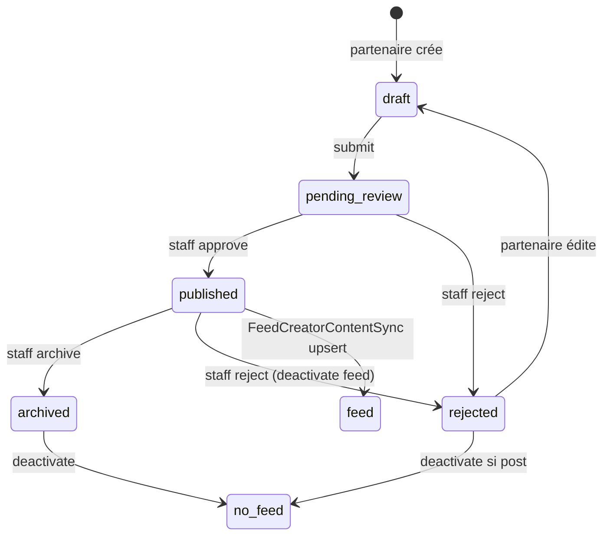

# ADMIN-06A — Discovery Creators (staff)

**Phase BMAD :** DISCOVER  
**Feature :** FEATURE-ADMIN-V1 / ADMIN-06 Creators  
**Ticket :** ADMIN-06A-CREATORS-DISCOVERY  
**Date :** 2026-06-04  
**Statut :** Audit read-only — **aucun code modifié, aucun commit**

**Prérequis livrés :**

| Module | Statut |
|--------|--------|
| ADMIN-01 Cockpit | ✅ |
| ADMIN-02 Partners | ✅ |
| ADMIN-03 Passport Ops | ✅ |
| ADMIN-04 Offers | ✅ |
| ADMIN-05 Events | ✅ |

**Base code auditée :** `main` post-merge PR #53 (`838865c`).

**Références produit / technique :**

- `docs/superpowers/plans/2026-06-01-web-partners-06-partner-creator-content.md` (WEB-PARTNERS-06A/B/C)
- `docs/superpowers/specs/2026-06-01-web-partners-08-pilot-readiness-design.md` (pilote + modération admin)
- `docs/prd/PRD-301-passport-benefits-foundation.md` (`creator_profiles` / `creator_posts` — **futur**)
- Implémentation admin existante : routes `/creator-content` (ticket historique **ADMIN-CREATOR-01**)

---

## 1. Synthèse exécutive

Le domaine **Creators** dans le code actuel = **`partner_creator_contents`** : contenus éditoriaux soumis par des **organisations partenaires vérifiées**, modérés par le staff, publiés sur la **fiche partenaire publique** et le **feed local** (`PostType.PARTNER_CREATOR`).

**Différence majeure vs ADMIN-05 Events :** le socle **existe déjà** (backend WEB-PARTNERS-06 + UI admin liste/détail/approve/reject). ADMIN-06 n’est **pas** un greenfield : c’est une **montée en gamme opérationnelle** vers la parité Offers/Events (workspace, fiche 360°, liens cockpit/partenaires, audit).

**Il n’existe pas** aujourd’hui :

- table `creators` / `creator_profiles` (hors PRD futur)
- lien FK event / place / neighborhood sur le contenu
- programme territorial V2 (missions, badges créateur, rémunération)
- table `creator_content_admin_actions` (audit staff)

**Recommandation CTO :** ADMIN-06 V1 = **Creator Content Moderation** uniquement (contenus partenaires). Renommer/clarifier la nav « Creators » vs route `/creator-content`. Ne pas lancer le **programme créateurs territoriaux** dans ADMIN-V1 — le reporter à **FEATURE-CREATORS-V1**.

---

## 2. Inspection backend — inventaire

### 2.1 Tables et modèles

| Artefact | Rôle |
|----------|------|
| **`partner_creator_contents`** | Source de vérité : titre, body, media_url, statut, modération, org |
| **`posts.partner_creator_content_id`** | Lien 1–1 optionnel feed (unique FK) |
| **`organizations`** | Propriétaire du contenu (`organization_id` CASCADE) |
| **`users`** | `created_by_user_id`, `moderated_by_user_id` |
| **`partner_profiles`** | Gate « partenaire actif » à la création côté org |

**Pas de tables** : `creators`, `creator_profiles`, `creator_missions`, `creator_content_admin_actions`, lien `local_event_id` / `place_id`.

**Migration :** `backend/alembic/versions/20260601_0028_partner_creator_contents.py`

**Modèle ORM :** `backend/app/models/partner_creator_content.py`

### 2.2 Types de contenus

Un seul type métier en V1 :

| Type | Description |
|------|-------------|
| **Partner creator content** | Article/story partenaire : `title` (160), `body` (5000), `media_url` (500) |

Pas de distinction live / video / sponsored / article dans le schéma. Le feed utilise `PostType.PARTNER_CREATOR` (carte organisation).

### 2.3 Statuts et workflow

Enum `PartnerCreatorContentStatus` (`backend/app/core/partner_creator_content_constants.py`) :

| Statut | Signification |
|--------|----------------|
| `draft` | Brouillon partenaire, non soumis |
| `pending_review` | En file staff |
| `published` | Approuvé, `is_active=true`, visible public + feed |
| `rejected` | Refusé (`rejection_reason`), rééditable partenaire |
| `archived` | Retiré du public (staff via archive) |

**Transitions** (`partner_creator_content_workflow.py`) :

```txt
draft           → pending_review     (submit partenaire)
pending_review  → published | rejected   (staff)
rejected        → draft              (édition + resubmit implicite via draft path)
published       → archived           (staff archive)
archived        → (terminal)
```

**Édition partenaire :** uniquement `draft` et `rejected`.

### 2.4 Services / repositories

| Fichier | Rôle |
|---------|------|
| `PartnerCreatorContentService` | CRUD org, submit, modération staff, side-effects |
| `PartnerCreatorContentRepository` | list admin, list org, list published public |
| `PublicPartnerCreatorContentService` | `GET /partners/{slug}/creator-content` |
| `FeedCreatorContentSyncService` | upsert / deactivate post feed |

### 2.5 Tests backend existants

| Fichier | Couverture |
|---------|------------|
| `test_admin_partner_creator_content_api.py` | list filtre pending, GET détail, approve, reject + RBAC |
| `test_partner_creator_content_api.py` | self-service org |
| `test_partner_creator_content_public_api.py` | liste publique partenaire |
| `test_partner_creator_content_feed_sync.py` | sync post après approve |

**Manques tests :** `archive` admin, rejet d’un `published`, RBAC négatif archive, non-régression « contenu pending invisible feed ».

---

## 3. Réponses backend (10 questions)

### 1. Quelles tables structurent le domaine creators ?

Voir §2.1. En pratique **une table métier** + **`posts`** pour distribution feed.

### 2. Quels types de contenus existent ?

Contenu éditorial partenaire texte + média URL optionnel. Pas de typologie multi-format en DB.

### 3. Quels statuts existent ?

Cinq statuts (§2.3). Pas de statut « modération » séparé du cycle publication — `pending_review` = file staff.

### 4. Qui peut créer du contenu ?

| Acteur | Action |
|--------|--------|
| **Membre org** `OWNER` / `ADMIN` | `require_offer_manager` — create, update (draft/rejected), submit |
| **Staff** | approve, reject, archive (`moderation.manage` \| `system.admin`) |
| **Citoyen** | Lecture seule (fiche partenaire, feed) |

**Gates création :** organisation `verification_status == verified` ; si `PartnerProfile` existe → `partner_status` ∈ `PUBLIC_PARTNER_STATUSES`.

### 5. Comment le contenu devient public ?

1. Partenaire : `POST .../creator-content` → `draft`
2. Partenaire : `POST .../submit` → `pending_review`
3. Staff : `POST /admin/partner-creator-content/{id}/approve` → `published`, `is_active=true`
4. **Effets approve :**
   - `FeedCreatorContentSyncService.upsert_creator_content_post` → post `PARTNER_CREATOR` actif
   - **`organization.visibility = PUBLIC`** (side-effect fort — même org entière)
5. **Visibilité fiche partenaire** (`list_published_for_organization`) : `published` + `is_active` + org verified + org public
6. **Visibilité feed** : post lié avec `is_active=true` (repository feed filtre `Post.is_active`)

**Pas d’auto-publish** org vérifiée (contrairement aux events) — passage staff obligatoire via `pending_review`.

### 6. Comment il est modéré ?

- Champs : `moderated_by_user_id`, `moderated_at`, `rejection_reason`
- Actions staff : approve, reject (motif obligatoire), archive (published → archived + deactivate feed)
- **Pas d’historique d’actions persisté** (pas de table audit)

### 7. Quels endpoints staff existent déjà ?

Préfixe **`/api/v1/admin/partner-creator-content`** (`admin_partner_creator_contents.py`) :

| Méthode | Route | Rôle |
|---------|-------|------|
| GET | `` | Liste paginée (`status`, `sort`, `page`, `page_size` max 100) |
| GET | `/{content_id}` | Détail |
| POST | `/{content_id}/approve` | Publier + feed sync |
| POST | `/{content_id}/reject` | Rejeter (+ deactivate feed si post existait) |
| POST | `/{content_id}/archive` | Archiver (+ deactivate feed) |

**Permissions :** `moderation.manage` ou `system.admin`.

### 8. Quels endpoints manquent ?

| Besoin ADMIN-06 | Priorité | Note |
|-----------------|----------|------|
| Filtre `organization_id` sur liste admin | P0 | Parité lien fiche partenaire (offers a `?organization_id` côté UI passport-offers) |
| `GET .../actions` ou table audit | P1 (06D) | Comme `offer_admin_actions` / `event_admin_actions` |
| Exposer `moderated_by` / `moderated_at` dans schema admin | P1 | Champs DB existants, absents du `PartnerCreatorContentAdminResponse` |
| Lien post feed (`post_id`) dans réponse admin | P2 | Debug staff « visible feed ? » |
| Filtre `city` | P2 | Si multi-ville staff |
| Endpoints **profils creators** / missions | — | **FEATURE-CREATORS-V1** |

### 9. Quels liens existent avec partners / events / offers / passport ?

| Domaine | Lien actuel |
|---------|-------------|
| **Partners** | FK `organization_id` ; compteurs `creator_contents_total` / `pending` sur fiche admin partenaire ; lien `creator_content_admin: "/creator-content"` (**sans filtre org**) |
| **Offers** | Même permission gate (`require_offer_manager`), pattern workflow similaire — **pas de FK** |
| **Events** | Aucun — type event `creator_meetup` = catégorie event, pas contenu creator |
| **Places** | Indirect via org / fiche partenaire publique |
| **Passport** | Aucun lien tampon/redemption |
| **Feed** | Post 1–1 via `partner_creator_content_id` |
| **Cockpit** | `creator_contents_pending`, `creator_contents_total`, quick action `/creator-content` |

### 10. Quels risques RGPD / image / droits / modération ?

| Risque | Sévérité | Détail |
|--------|----------|--------|
| **Média URL arbitraire** | Haute | Pas de scan MIME / hébergement contrôlé ; admin affiche `` — SSRF/XSS mitigé par `rel=noopener` mais charge contenu tiers |
| **PII auteur** | Moyenne | Email auteur exposé staff (`PartnerCreatorContentAuthorSummary`) — OK modération, pas exposé public |
| **Approve → org PUBLIC** | Haute | Effet de bord : tout le contenu org peut devenir visible selon autres règles org |
| **Contenu non validé public** | Basse* | Workflow empêche `published` sans staff ; public API filtre `published`+`is_active` — *risque DB manuelle / bug |
| **Droit à l’image / copyright** | Moyenne | Pas de champ déclaration droits ; modération manuelle seule |
| **RGPD effacement** | Moyenne | CASCADE org ; pas de procédure documentée effacement auteur |
| **Modération sans audit** | Moyenne | Conformité ops / litiges sans timeline staff |

---

## 4. Inspection frontend admin — inventaire

### 4.1 Routes et composants

| Élément | Chemin / fichier |
|---------|------------------|
| Liste | `frontend/apps/admin/app/(protected)/creator-content/page.tsx` |
| Détail | `frontend/apps/admin/app/(protected)/creator-content/[id]/page.tsx` |
| Badge statut | `components/creator-content-status-badge.tsx` |
| Hooks | `lib/hooks/use-admin-creator-content.ts` |
| API client | `packages/utils/src/partner-creator-content-admin-api.ts` (list, get, approve, reject — **pas archive**) |
| Helpers | `packages/utils/src/admin-creator-content.ts` (+ tests) |
| Nav | `admin-shell.tsx` — label **« Creators »**, href `/creator-content` |
| Cockpit | `cockpit-attention` → `/creator-content?status=pending_review` ; `cockpit-quick-actions` ; métrique executive « Créateurs » |
| Fiche partenaire | `partner-detail-counters` (total / pending) ; `partner-detail-links` → modération contenus |

### 4.2 Réponses frontend admin (7 questions)

#### 1. Quelle UI existe déjà ?

- **Workspace liste** : tableau, filtre statut (select), tri newest/oldest, recherche **client-side** (titre, org, auteur), `page_size: 100` fixe page 1
- **Fiche détail** : titre, org, auteur, statut, dates, body, média (lien + preview image si extension connue), modération approve/reject
- **États** : loading, empty, error basiques

#### 2. Quelles actions staff existent ?

| Action | UI | API |
|--------|-----|-----|
| Approuver | ✅ si `pending_review` | ✅ |
| Rejeter (motif) | ✅ si `pending_review` ou `published` | ✅ |
| Archiver | ❌ | ✅ backend seul |
| Actualiser liste | ✅ | — |

#### 3. Quelles actions manquent ?

- **Archiver** (UI + client API)
- **Lecture query URL** `?status=` et `?organization_id=` (cockpit / partenaire cassent le deep-link)
- **Pagination serveur** (au-delà de 100 items)
- **Liens 360°** : fiche partenaire admin, fiche publique web, post feed (si exposé)
- **Affichage modérateur** (`moderated_by`, `moderated_at`)
- **Timeline audit** (06D)

#### 4. La fiche détail existe-t-elle vraiment ?

**Oui** — route `/creator-content/[id]` fonctionnelle, branchée sur `GET /admin/partner-creator-content/{id}`. Niveau « 360° » **incomplet** vs offer/event detail (pas de liens contextuels, pas d’audit, pas archive).

#### 5. Y a-t-il audit/timeline ?

**Non** — ni table backend ni section UI.

#### 6. Y a-t-il pagination/filtres ?

- **Backend :** pagination `page` / `page_size` (max 100), filtre `status`, tri `sort`
- **UI :** filtre statut OK ; **pas** de pagination UI ; **pas** filtre org/city ; recherche locale uniquement
- **URL cockpit** `?status=pending_review` **non lue** par la page liste (gap UX)

#### 7. Le module doit-il rester « Creator Content » ou devenir « Creators » ?

| Option | Recommandation |
|--------|----------------|
| **Nav « Creators » + routes `/creator-content`** | État actuel — **confus** pour V2 programme |
| **V1 ADMIN-06** | Libellés UI : **« Contenus créateurs »** / sous-titre « Modération partenaires » ; garder routes stables `/creator-content` |
| **V2 FEATURE-CREATORS-V1** | Hub **« Programme créateurs »** distinct (profils, missions) — ne pas surcharger la route modération |

---

## 5. Inspection web / public — inventaire

### 5.1 Surfaces citoyen

| Surface | Fichier / route | API |
|---------|-----------------|-----|
| Fiche partenaire | `partner-detail-screen.tsx` + `PartnerCreatorContentCard` | `GET /partners/{slug}/creator-content?city=&limit=&offset=` |
| Feed local | `feed-card.tsx` → `partner_creator` → `OrganizationPostCard` | `GET /feed` (posts actifs) |
| Portail partenaire | `partner-portal-creator-content.tsx`, `/organizations/me/partner/creator-content` | `/organizations/me/creator-content` |

**Pas de** : page profil créateur citoyen, hub « créateurs Reims », recherche dédiée creator content, carte dédiée.

### 5.2 Réponses web public (5 questions)

#### 1. Où les contenus creators apparaissent ?

- Section **fiche partenaire** (max 6 items chargés)
- **Feed ville** (carte type organisation / partner_creator)
- **Portail partenaire** (gestion brouillons / soumission) — pas public

#### 2. Quelles conditions rendent un contenu visible ?

Cumulatif :

1. Staff a approuvé → `status=published`, `is_active=true`
2. Organisation `verified` + `visibility=public` (approve force public)
3. Partenaire `partner_status` ∈ statuts publics (pour endpoint slug)
4. Post feed `is_active=true` si distribution feed

#### 3. Quel impact sur le feed local ?

Chaque contenu publié crée/met à jour un **post organisation** — même ranking que autres posts (pas de boost sponsorisé V1). Désactivation sur reject/archive.

#### 4. Quel impact pour partenaires / commerces ?

Contenu = **image de marque locale** sur fiche établissement ; renforce lien partenaire ↔ storytelling ; pas de conversion passport directe.

#### 5. Risque contenu non validé public ?

**Faible en nominal** — pas de chemin API public pour `pending_review` / `draft`. **Risques résiduels :** manipulation DB, bug sync feed, org rendue public par approve sans revue globale org.

---

## 6. Vision produit — deux niveaux

### V1 — Creator Content Moderation (ADMIN-06 scope)

Aligné sur l’existant :

- File modération staff (déjà là → **polish**)
- Approve / reject / **archive** (UI manquante)
- Fiche contenu enrichie (liens partenaire, modérateur, feed)
- Liens cockpit + fiche partenaire **filtrés**
- Historique staff (06D si exigence parité Offers)

### V2 — Territorial Creators Program (FEATURE-CREATORS-V1)

Hors ADMIN-V1 :

- `creator_profiles` (PRD-301)
- Profils créateurs individuels / ambassadeurs
- Zones / quartiers / missions
- Badges, avantages, rémunération
- Formats live / articles / vidéos
- Média local Yunicity, publications sponsorisées
- Analytics programme

---

## 7. Questions produit — réponses

| # | Question | Réponse discovery |
|---|----------|-------------------|
| 1 | ADMIN-06 : contenus seulement ou profils ? | **Contenus seulement** (`partner_creator_contents`). Profils = FEATURE-CREATORS-V1. |
| 2 | Séparer moderation / profiles / missions ? | **Oui.** Trois produits distincts ; ADMIN-06 = moderation content. |
| 3 | Vrai MVP admin ? | Liste fiable + file pending + détail + approve/reject + **archive** + liens partenaire/cockpit + (optionnel) audit léger. |
| 4 | Statuts V1 ? | Conserver les **5 statuts actuels** — pas d’ajout sans PRD. |
| 5 | Actions risquées ? | **Approve** (public + feed + org PUBLIC), **reject published**, **archive**, preview média tiers. |
| 6 | Liens depuis Cockpit / Partners / Events / Places / Feed ? | Cockpit → file pending (**fix URL**). Partners → liste **filtrée par org**. Events/Places → **lien contextuel read-only** (org slug) en 06C, pas FK event. Feed → indicateur « synchronisé feed » en 06C. |
| 7 | Reporté FEATURE-CREATORS-V1 ? | Profils, missions, quartiers, badges, sponsor, multi-format, analytics, rémunération, charte créateur, hub citoyen créateurs. |

---

## 8. Cycle de vie réel



---

## 9. Gaps (synthèse)

| Zone | Gap | Ticket cible |
|------|-----|--------------|
| Admin API | Pas de filtre `organization_id` | 06B |
| Admin API | `moderated_*` non exposés | 06C |
| Admin API | Pas d’audit actions | 06D |
| Admin UI | Query `?status=` ignorée | 06B |
| Admin UI | Lien partenaire sans filtre org | 06B |
| Admin UI | Pas archive | 06C |
| Admin UI | Pagination / pas de page 2+ | 06B |
| Admin UI | Pas lien fiche partenaire / public / feed | 06C |
| Client TS | `archiveContent` absent | 06C |
| Produit | Nav « Creators » vs contenu partenaire | 06B copy |
| Stratégie | Programme territorial V2 | FEATURE-CREATORS-V1 |
| Data model | Pas de lien event/place | REPORTÉ (sauf décision PRD) |

---

## 10. Risques (BUILD)

| Risque | Mitigation |
|--------|------------|
| Side-effect `org.visibility=PUBLIC` sur approve | Documenter en UI ; décision produit : retirer ou confirmer en 06C |
| Média non contrôlé | Copy modération + option future proxy CDN |
| Deep-links cockpit cassés | `useSearchParams` + sync filtre (pattern `passport-offers-url.ts`) |
| Dette sans audit | 06D ou accepter dette documentée |
| Confusion nom module | Renommer libellés, pas routes |

---

## 11. Recommandation CTO

1. **GO BUILD ADMIN-06B** — workspace : URL state, pagination, filtre org backend + UI, libellés « Contenus créateurs », activer deep-links cockpit/partenaire.
2. **GO BUILD ADMIN-06C** — fiche 360° : liens admin partner + web public, modérateur, archive UI + API client, indicateur feed/post.
3. **GO BUILD ADMIN-06D** si parité compliance Offers — `creator_content_admin_actions` + timeline ; sinon **REPORTER** avec ticket daté.
4. **NE PAS** implémenter profils creators / missions dans ADMIN-V1.
5. **NE PAS** renommer routes `/creator-content` sans migration coordonnée (bookmarks staff).

**Critères « ADMIN-06 complet » (proposition) :**

- Staff : file pending depuis cockpit en 1 clic (filtre actif)
- Staff : liste filtrable par organisation depuis fiche partenaire
- Staff : détail avec approve / reject / archive + contexte partenaire + public
- Tests admin archive + deep-link regressions
- Build admin vert

---

## 12. Découpage tickets ADMIN-06B / C / D

### ADMIN-06B — Creator Content Workspace (P0)

- Lire `?status=` / `?organization_id=` (pattern passport-offers)
- Backend : `organization_id` query sur `GET /admin/partner-creator-content`
- Pagination UI (page suivante si `total > page_size`)
- Filtre ville (optionnel si multi-city actif staff)
- Copy : titre page « Contenus créateurs », nav cohérente
- Mettre à jour `creator_content_admin` lien partenaire → `/creator-content?organization_id={uuid}`
- Tests : liste filtrée par org

### ADMIN-06C — Creator Content Detail 360° (P1)

- Schema admin : `moderated_at`, `moderated_by` (summary), `post_id` optionnel
- UI : carte organisation (lien `/partners/...`), lien fiche publique web, section modération enrichie
- **Archive** : bouton + `archiveContent` dans API client + tests
- Avertissement side-effect visibilité org sur approve
- Preview média sécurisée (fallback si URL non image)

### ADMIN-06D — Audit / Polish / Links (P2)

- Migration `creator_content_admin_actions` (approve, reject, archive)
- `GET /admin/partner-creator-content/{id}/actions`
- Section timeline UI (pattern offer audit)
- Compteurs fiche partenaire → lien liste pré-filtrée
- Tests intégration audit + reject published

---

## 13. Explicitement reporté à FEATURE-CREATORS-V1

| Élément | Raison |
|---------|--------|
| Table / API `creator_profiles` | PRD-301 — hors schéma actuel |
| Créateurs individuels (non org) | Nouveau modèle identité |
| Missions, quartiers, ambassadeurs | Programme V2 |
| Badges créateur, rémunération, avantages | Monétisation / legal |
| Live, vidéo, articles sponsorisés | Typologie contenu + infra média |
| Hub citoyen « Créateurs Reims » | Produit consommateur |
| Analytics programme / ranking sponsor | MEASURE post-lancement |
| FK contenu → event / place | Nécessite PRD liaison contenu↔lieu |
| Renommage route `/creators` | Breaking change — seulement si hub unifié V2 |

---

## 14. Comparaison Offers / Events / Creator Content (admin)

| Dimension | Offers (ADMIN-04) | Events (ADMIN-05) | Creator content (ADMIN-06) |
|-----------|-------------------|-------------------|----------------------------|
| Entité | `partner_offers` | `local_events` | `partner_creator_contents` |
| Statuts | 5 (draft…archived) | 3 modération + cancel | 5 (draft…archived) |
| Auto-publish | Non | Oui si org verified | **Non** — staff obligatoire |
| Admin liste | ✅ + filtres URL | ✅ | ✅ (gaps URL/org) |
| Admin détail | ✅ 360° | ✅ 360° | ✅ basique |
| Admin audit | ✅ | ✅ (05D) | ❌ |
| Archive staff | ✅ | N/A (cancel) | API ✅ / UI ❌ |
| Feed sync | ✅ | ✅ | ✅ |
| Lien event/place | — | lieu event | — (org only) |

---

## 15. Annexes — endpoints complets

### Organisation (partenaire)

`/api/v1/organizations/me/creator-content` — POST, GET  
`/api/v1/organizations/me/creator-content/{id}` — PATCH  
`/api/v1/organizations/me/creator-content/{id}/submit` — POST  

### Public

`/api/v1/partners/{slug}/creator-content` — GET (city, limit, offset)  

### Admin

`/api/v1/admin/partner-creator-content` — GET  
`/api/v1/admin/partner-creator-content/{id}` — GET  
`/api/v1/admin/partner-creator-content/{id}/approve|reject|archive` — POST  

---

*Document généré en phase DISCOVER — aucune modification de code. Validation CTO requise avant tout ticket BUILD (ADMIN-06B).*
