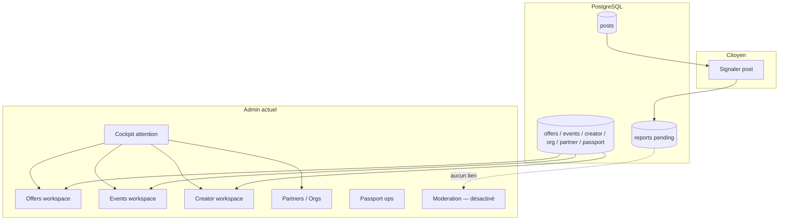

# ADMIN-07A — Discovery Moderation (staff)

**Phase BMAD :** DISCOVER  
**Feature :** FEATURE-ADMIN-V1 / ADMIN-07 Moderation  
**Ticket :** ADMIN-07A-MODERATION-DISCOVERY  
**Date :** 2026-06-04  
**Statut :** Audit read-only — **aucun code modifié, aucun commit**

**Prérequis livrés :**

| Module | Statut |
|--------|--------|
| ADMIN-01 Cockpit | ✅ |
| ADMIN-02 Partners | ✅ |
| ADMIN-03 Passport Ops | ✅ |
| ADMIN-04 Offers | ✅ |
| ADMIN-05 Events | ✅ |
| ADMIN-06 Creators | ✅ |

**Base code auditée :** `main` post-merge PR #58 (`24c8fa3`).

**Références :**

- `backend/app/models/report.py` (TICKET-402)
- `docs/technical/tribes-technical-spec.md` (§5.5 admin tribes — partiellement implémenté)
- `docs/product-review/ADMIN-05A-EVENTS-DISCOVERY.md` (recommandation : pas de hub Moderation transversal en V1 pour events — à réévaluer pour ADMIN-07)

---

## 1. Synthèse exécutive

La **modération** dans Yunicity aujourd’hui est **fragmentée** :

1. **Signalements citoyens** — table `reports` (posts feed/tribu/discussions uniquement), **sans file staff ni API admin**.
2. **Modération éditoriale partenaire** — files dédiées dans admin : offres, events, creator content, organisations (vérification), partenaires (statut), passport (suspend).
3. **Modération communautaire tribu** — logs `tribe_moderation_logs`, actions owner/mod (delete post, remove member), **sans queue signalements staff** (endpoint spec non livré).

Le libellé RBAC `moderation.manage` est le **garde-fou staff générique** de presque tout l’admin — ce n’est **pas** un module « Moderation » unifié.

**Nav admin :** entrée **« Moderation » désactivée** (`Hub à venir` dans `admin-shell.tsx`).

**Recommandation CTO (MVP ADMIN-07) :** ne pas fusionner tout le transversal en un seul écran. **V1 = Moderation Reports** : file opérationnelle des **signalements citoyens** (`reports` pending) + fiche décision + actions minimales (dismiss / hide post / marquer traité). Conserver les modules 04–06 pour la **pré-publication partenaire**. Reporter Trust & Safety unifié (comptes, récidive, IA) en **V2**.

---

## 2. Inspection backend — inventaire

### 2.1 Signalement citoyen (`reports`)

| Question | Réponse |
|----------|---------|
| Système de signalement ? | **Oui**, limité aux **posts** |
| Table dédiée ? | **`reports`** (`backend/alembic/versions/20260522_0008_feed_foundation.py`) |
| API citoyen | `POST /api/v1/posts/{post_id}/report` → 204 (`ReportService.report_post`) |
| API admin | **Aucune** (pas de list / get / resolve) |
| Idempotence | Un signalement **pending** max par `(user_id, post_id)` ; doublon ignoré silencieusement |

**Schéma `Report` :**

| Colonne | Rôle |
|---------|------|
| `user_id` | Reporter (FK CASCADE) |
| `post_id` | Cible (FK CASCADE) |
| `reason` | `spam` \| `inappropriate` \| `other` (String 20) |
| `status` | `pending` (default), `reviewed`, `dismissed`, `action_taken` |
| `resolved_at`, `resolved_by` | Résolution staff — **jamais alimentés par le code actuel** |
| `created_at` | Horodatage |

**Constantes :** `ReportReason`, `ReportStatus` — `backend/app/core/feed_constants.py`

**Repository :** `ReportRepository` — `add`, `get_pending_by_user_and_post` uniquement.

**Tests :** `test_report_post` dans `backend/tests/test_feed.py` ; `test_reports.py` = placeholder vide.

### 2.2 Tables « moderation » / audit staff (par domaine)

Il n’existe **pas** de table centrale `moderation_cases` ou `moderation_queue`.

| Table | Domaine | Actions typiques |
|-------|---------|------------------|
| `offer_admin_actions` | Offres partenaires | approve, reject, archive |
| `event_admin_actions` | Events locaux | approve, reject, cancel |
| `creator_content_admin_actions` | Contenus créateurs | approve, reject, archive |
| `partner_admin_actions` | Fiche partenaire | create_profile, activate, pause, upgrade_premium, update_settings |
| `passport_admin_actions` | Passport citoyen | suspend, reactivate |
| `tribe_moderation_logs` | Tribus (communauté) | actions tribales (log append-only) |

### 2.3 Statuts « review » par type de contenu

| Entité | Champ statut | Workflow staff admin |
|--------|--------------|----------------------|
| **Post feed** | `is_active` (soft delete auteur/mod) | Pas d’API staff delete/hide |
| **Comment** | `is_active` | Idem |
| **Partner offer** | `status` (pending_review → published / rejected / archived) | `/admin/partner-offers` ✅ |
| **Local event** | `moderation_status` | `/admin/local-events` ✅ |
| **Creator content** | `status` | `/admin/partner-creator-content` ✅ |
| **Organization** | `verification_status` | Liste admin orgs + `POST /organizations/{id}/review` ✅ |
| **Partner profile** | `partner_status` (signed, active, paused, …) | Fiche `/partners/...` ✅ |
| **Passport** | dérivé + `suspended_at` | `/passport-ops/{id}` suspend/reactivate ✅ |
| **Tribe** | `status` (active, archived, …) | `/admin/tribes` list/create/archive — pas de file reports |
| **Report** | `status` | **Aucun workflow implémenté côté staff** |
| **User** | `is_active` + auth | Permission `users.manage.status` en RBAC — **pas d’API admin users** |
| **Lieux / cultural places** | — | Pas de modération citoyenne identifiée |
| **Médias** | URLs sur entités | Pas de pipeline modération média dédié |

### 2.4 Soft delete, visibility, blocklist

| Mécanisme | Existe ? | Détail |
|-----------|----------|--------|
| Soft delete post | Oui | `PostService.soft_delete_post`, `DELETE /posts/{id}`, tribu `DELETE /tribes/{slug}/posts/{id}` |
| Soft delete comment | Oui | `CommentService.soft_delete_comment` |
| Feed sync deactivate | Oui | Offres / events / creator content archivés → `is_active=false` sur post lié |
| Visibilité org | Oui | `OrganizationVisibility` PUBLIC/PRIVATE (+ side-effect approve) |
| Blocklist utilisateur | **Non** | Pas de table block / mute |
| Blocklist contenu global | **Non** | |
| Blocklist import leads | Oui | `is_blocked_tribu_name` (import CRM, hors modération) |
| Sanctions compte | Partiel | Passport suspend ; `User.is_active` + message auth « compte suspendu » |

### 2.5 APIs admin existantes (liées modération)

Toutes protégées par `require_any_permission("moderation.manage", "system.admin")` sauf mention.

| Préfixe | Rôle modération |
|---------|-----------------|
| `/admin/cockpit/summary` | KPIs attention (files **pré-publication**, pas reports) |
| `/admin/partner-offers` | File + approve/reject/archive + redemptions + **actions audit** |
| `/admin/local-events` | File + approve/reject/cancel + **actions audit** |
| `/admin/partner-creator-content` | File + approve/reject/archive + **actions audit** |
| `/admin/organizations` | File verification |
| `/admin/partners` | Lifecycle partenaire + **partner_admin_actions** |
| `/admin/passports` | Ops + suspend/reactivate + **passport_admin_actions** |
| `/admin/tribes` | List/create/archive — **pas** `/admin/tribes/reports` |
| `/organizations/{id}/review` | Décision vérification org (verified / rejected / suspended) |
| `/admin/partner-leads` | CRM leads (hors signalement citoyen) |
| `/admin/neighborhoods` | deactivate (contenu éditorial territoire) |

**Absent :** `/admin/reports`, `/admin/moderation`, `/admin/users`, hide post staff.

### 2.6 Workflows existants

```text
[Citoyen] POST /posts/{id}/report
    → INSERT reports (status=pending)
    → FIN (aucune notification staff, aucune file)

[Partenaire] submit offer/event/creator content
    → pending_review
    → [Staff] module dédié approve/reject/archive
    → audit *_admin_actions + feed sync + commit

[Staff] Organization review
    → verification_status transition + raison optionnelle

[Staff] Partner pause / activate
    → partner_admin_actions

[Staff] Passport suspend / reactivate
    → passport_admin_actions

[Tribe owner/mod] delete post / remove member
    → tribe_moderation_logs (pas lié à reports)
```

### 2.7 Sanctions existantes

| Sanction | Portée | Admin UI |
|----------|--------|----------|
| Reject / archive contenu partenaire | Offre, event, creator content | ✅ modules 04–06 |
| Suspend passport | Citoyen (benefits) | ✅ passport-ops |
| Pause partenaire | Organisation partenaire | ✅ partners detail |
| Org rejected / suspended | Organisation | ✅ review API + liste orgs |
| Post soft delete | Contenu | Auteur / mod tribu seulement |
| Report status `action_taken` | Signalement | **Non implémenté** |
| Ban user global | Compte | **Non** (RBAC prêt, API absente) |

### 2.8 Événements déclencheurs

| Déclencheur | Effet modération |
|-------------|------------------|
| Citoyen signale un post | Row `reports` pending |
| Partenaire soumet contenu | pending_review dans silo métier |
| Staff approve partenaire | org visibility, feed |
| Auth login compte inactif/suspendu | Refus connexion |
| Expo push invalid token | deactivate subscription (hors scope) |

**Pas de :** webhooks modération, queues Redis dédiées, notifications staff sur report.

### 2.9 Logs / audit

| Log | Contenu |
|-----|---------|
| `*_admin_actions` | Transitions staff par domaine (offers, events, creator, partner, passport) |
| `tribe_moderation_logs` | Actions tribales |
| `reports.resolved_by` | Colonne prévue, **non utilisée** |
| Logs applicatifs | Standards (pas de `moderation_events` structuré) |

### 2.10 Trous fonctionnels (backend)

1. **Boucle signalement fermée** — aucune lecture/résolution staff des `reports`.
2. **Cible signalement = post uniquement** — pas commentaire, user, org, offre publique, event, lieu.
3. **`ReportStatus` au-delà de pending** — enum défini, **aucune transition** en service.
4. **`/admin/tribes/reports`** — documenté en spec, **non implémenté**.
5. **Pas de staff hide/delete post** pour traiter un signalement.
6. **`users.manage.status`** — permission sans endpoints admin users.
7. **Cockpit** — ne compte pas `reports` pending.
8. **Pas de lien** report → post snapshot / auteur historique sanctions.
9. **Doublons reports** — agrégation par post (N signalements) absente côté API.
10. **PII** — `resolved_by` prévu mais pas de politique de rétention documentée en code.

---

## 3. Inspection frontend admin — inventaire

### 3.1 Navigation

`frontend/apps/admin/components/admin-shell.tsx` :

| Entrée | État |
|--------|------|
| Cockpit, Partners, Passport Ops, Offers, Events, Creator Content | ✅ actifs |
| **Moderation** | **disabled** — `hint: "Hub à venir"` |
| Staff (`/protected-admin`) | Lien technique permissions |

### 3.2 Page moderation dédiée

| Question | Réponse |
|----------|---------|
| Page `/moderation` existe ? | **Non** |
| Branchée ? | **Non** |
| Cockpit moderation ? | **Non** — `cockpit-attention` = files **métier partenaire** (offers, creator, events, orgs, leads) |
| Composants moderation hub | **Aucun** |
| Hooks / clients API moderation | **Aucun** (`reports-admin-api` absent) |

### 3.3 Écrans « modération » utilisables aujourd’hui

Ce ne sont **pas** le module ADMIN-07, mais des **silos** déjà livrés :

| Route | Actions | Audit timeline |
|-------|---------|----------------|
| `/passport-offers/[id]` | approve, reject, archive, edit | ✅ |
| `/events/[id]` | approve, reject, cancel | ✅ |
| `/creator-content/[id]` | approve, reject, archive | ✅ |
| `/partners/organizations/[id]` | activate, pause, premium, … | ✅ partner actions |
| `/passport-ops/[id]` | suspend, reactivate | ✅ |
| `/partners` + org review | vérification org | via API review |

### 3.4 Écrans vides / placeholder

- **Hub Moderation** (nav disabled).
- **Reports queue** — inexistant.
- Liens cockpit vers « signalements » — absents.

### 3.5 Permission UI

`staff-permissions.ts` : staff = rôles MODERATOR / CITY_ADMIN / SUPER_ADMIN. Texte `protected-admin` mentionne `moderation.manage`.

---

## 4. Inspection web / mobile — inventaire

### 4.1 Signaler un contenu

| Surface | Cible | API |
|---------|-------|-----|
| Feed web (`feed-portal-screen`, `feed-card`) | Post | `reportFeedPost` |
| Discussions web | Post thread | idem |
| Mur tribu web (`tribe-wall-section`) | Post tribu | idem |
| Feed mobile (`feed-screen.tsx`) | Post | `api.reportFeedPost` |

**Raisons UI :** spam, inappropriate, other — labels `@yunicity/utils` (`FEED_REPORT_REASON_LABELS`).

**UX après envoi :** message « Signalement envoyé » (web/mobile) ; **aucun feedback** sur traitement.

### 4.2 Signaler un utilisateur / masquer / bloquer

| Action | Existe ? |
|--------|----------|
| Signaler un utilisateur | **Non** |
| Masquer contenu (sans report) | **Non** |
| Bloquer utilisateur | **Non** |

### 4.3 Contenu supprimé / rejeté (affichage)

| Cas | Comportement |
|-----|--------------|
| Post soft-deleted | Retiré des listes `active_only` |
| Offre/event/creator rejected | Statut métier + pas de publication feed (selon sync) |
| Event cancelled (public) | UX web dédiée (ADMIN-05D-C3) |
| Report traité | **N/A** — pas de traitement staff |

### 4.4 Copy produit

`feed-context-rail.tsx` : « La modération Yunicity traite les signalements manuellement » — **engagement produit non outillé côté admin**.

### 4.5 Réponses web/mobile

| # | Question | Réponse |
|---|----------|---------|
| 1 | Que peut signaler un citoyen ? | **Uniquement un post** (feed, discussions, mur tribu) |
| 2 | Où ? | Web feed, discussions, tribu ; mobile feed |
| 3 | Après signalement ? | Enregistrement DB pending ; **aucune suite** |
| 4 | Boîte modération staff ? | **Non** |
| 5 | Escalade ? | **Non** (pas de priorité, pas d’assignation, pas d’alerte) |

---

## 5. Workflow réel (état 2026-06-04)



**Unité de travail modérateur aujourd’hui :** selon le silo ouvert (une offre en attente, un event, un contenu créateur) — **pas** un signalement citoyen.

---

## 6. Vision produit — carte 3 niveaux

### Niveau 1 — Content Moderation (cible ADMIN-07 V1)

| Capability | État | ADMIN-07 |
|------------|------|----------|
| Reports inbox | ❌ | **À construire** |
| Review signalement | ❌ | Fiche report + contexte post |
| Decision dismiss / action | ❌ | Transitions `ReportStatus` |
| Hide / deactivate post staff | ❌ | Action minimale recommandée |

Les **pré-publications partenaire** restent dans ADMIN-04 / 05 / 06 (déjà complet).

### Niveau 2 — Trust & Safety (V2)

| Capability | État |
|------------|------|
| Sanctions compte unifiées | Partiel (passport suspend, user.is_active sans UI) |
| Récidive / historique auteur | ❌ |
| Sanctions organisation | Partiel (org suspended, partner pause) |
| Hub sanctions cross-entités | ❌ |

### Niveau 3 — Future

- Détection automatique / IA  
- Score risque  
- File prioritaire SLA  
- Signalement commentaires, profils, messages  

---

## 7. Questions produit — réponses

| # | Question | Réponse discovery |
|---|----------|-------------------|
| 1 | Vrai MVP ADMIN-07 ? | **Reports Workspace** : liste `reports` pending + détail + résolution (dismiss / action_taken + hide post). **Ne pas** refondre offers/events/creators. |
| 2 | Modérer contenus ou signalements ? | **Signalements** — seul flux citoyen non servi. Contenus partenaires = modules existants. |
| 3 | Objet central ? | **`Report`** (id, post_id, reason, status, reporter, timestamps) — pas `Post` seul. |
| 4 | Unité de travail modérateur ? | **1 signalement** (ou 1 post agrégé si plusieurs reports — décision design 07B). |
| 5 | Actions critiques ? | Voir contenu signalé ; dismiss ; masquer/désactiver post ; marquer traité ; traçabilité `resolved_by`. |
| 6 | Risques légaux / RGPD ? | Identité reporter (PII) ; conservation reports ; motivation décision ; droit d’effacement ; transparence citoyen (délai traitement) ; pas de décision automatisée en V1. |
| 7 | Reporter à V2 ? | Signalement user/comment/org ; sanctions hub ; récidive ; notifications staff ; SLA ; IA ; tribu reports ; escalade multi-niveau. |

---

## 8. Risques

| Risque | Sévérité | Mitigation discovery |
|--------|----------|----------------------|
| Promesse UX « signalements traités manuellement » sans outil | **P1 produit** | ADMIN-07B prioritaire |
| `moderation.manage` = tout l’admin | P2 confusion | Doc + hub reports distinct de la nav silos |
| CASCADE delete report si post supprimé | P2 | Snapshot minimal ou soft-link en 07C |
| Staff supprime post sans audit report | P2 | `report_admin_actions` en 07D |
| Conflit avec mod tribu | P3 | Scope V1 = posts hors tribu privée ou même règle `active_only` |
| RGPD accès reporter | P1 légal | Masquer email partiel staff ; logs accès |

---

## 9. Gaps (synthèse)

| Zone | Gap |
|------|-----|
| Backend | API admin reports ; transitions status ; hide post staff ; agrégation ; cockpit metric |
| Admin UI | Hub + workspace + detail 360 reports |
| Web/Mobile | Pas de changement obligatoire V1 (déjà report) — optionnel statut « en cours » V2 |
| RBAC | `moderation.read` / `manage` OK ; affiner si module reports sensible |
| Spec tribes | `/admin/tribes/reports` non livré — hors MVP sauf décision contraire |
| Tests | Couvrir resolve report, hide post, permissions |

---

## 10. Recommandation CTO

1. **ADMIN-07 V1 = Citizen Reports Ops** — fermer la boucle `POST report` → **staff resolve**, pas un méga-hub tous contenus.  
2. **Ne pas déplacer** offers/events/creators dans Moderation — liens depuis fiche report si post type `offer` / `event` / `partner_creator` (deep link read-only).  
3. **Objet pivot** : `Report` avec statuts existants (éviter proliferation enums).  
4. **Action minimale** : `dismiss` + `action_taken` + **deactivate post** (réutiliser pattern `is_active=false`).  
5. **Audit** : table `report_admin_actions` (parité 06D-A) en 07D, pas bloquant pour 07B si colonnes `resolved_*` suffisent en V1.  
6. **Cockpit** : ajouter `reports_pending` dans une itération 07B ou 07C.  
7. **07D-C / polish** : tribu reports, comment reports, user sanctions UI — backlog explicite.

**Décision proposée :**

```txt
GO ADMIN-07B — Reports Workspace (liste + filtres + KPI)
```

puis 07C (detail 360° + preview post), puis 07D (actions + audit + liens sanctions).

---

## 11. Découpage tickets proposé

| Ticket | Intitulé | Périmètre | Backend | Frontend admin |
|--------|----------|-----------|---------|----------------|
| **ADMIN-07A** | Discovery | Ce document | — | — |
| **ADMIN-07B** | Reports Workspace | `/moderation/reports` liste, filtres status/reason/date, pagination, KPI strip, nav enabled | `GET /admin/reports`, counts | Workspace + hook + API client |
| **ADMIN-07C** | Report Detail 360° | Fiche signalement : reporter, post preview, auteur, type post, liens silo si partenaire | `GET /admin/reports/{id}` | Detail view + cards |
| **ADMIN-07D-A** | Resolution & audit backend | resolve, dismiss, action_taken + staff deactivate post ; `report_admin_actions` ; séquence transactionnelle | migration + service + tests | — |
| **ADMIN-07D-B** | Resolution UI + refresh | Boutons décision, refresh liste, empty/error states | — | Moderation section |
| **ADMIN-07E** (optionnel) | Cockpit + deep links | `reports_pending` attention ; lien depuis report vers offer/event/creator | cockpit repo | cockpit card |
| **ADMIN-07F** (V2 / polish) | Trust extensions | user report, comment report, tribu queue, `users.manage` API | large | large |

**Alternative rejetée :** hub unique listant offers + events + creators + reports — **charge cognitive** et doublon avec modules 04–06.

---

## 12. Ce qui attend Trust & Safety V2

- Signalement **utilisateur**, **commentaire**, **organisation**, **message**  
- **Block / mute** social  
- **Sanctions hub** (passport + user + partner + org) avec récidive  
- **Notifications** staff (email/push) sur report pending  
- **Assignation** modérateur, SLA, priorité  
- **IA** pré-modération, score risque, file intelligente  
- **`GET /admin/tribes/reports`** (spec)  
- API **`users.manage.status`** complète  
- Transparence citoyen (statut signalement in-app)  

---

## 13. Annexes — fichiers clés

| Domaine | Fichiers |
|---------|----------|
| Report model/service | `backend/app/models/report.py`, `services/report_service.py`, `api/v1/posts.py` |
| RBAC | `backend/app/db/seeds/auth_rbac.py` |
| Admin shell | `frontend/apps/admin/components/admin-shell.tsx` |
| Report UI citoyen | `frontend/apps/web/components/feed/report-action.tsx`, `packages/utils/src/feed-api.ts` |
| Cockpit attention | `frontend/apps/admin/components/cockpit/cockpit-attention.tsx`, `admin_cockpit_service.py` |
| Spec tribes (écart) | `docs/technical/tribes-technical-spec.md` §5.5 |

---

**Fin ADMIN-07A — discovery uniquement. Aucun commit associé à ce ticket.**
