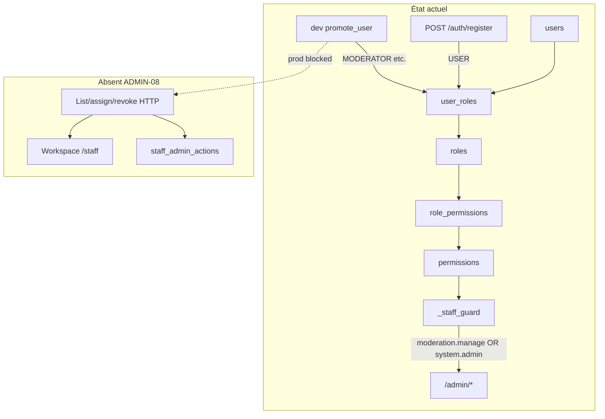

# ADMIN-08A — Discovery Staff (RBAC & accès admin)

**Phase BMAD :** DISCOVER  
**Feature :** FEATURE-ADMIN-V1 / ADMIN-08 Staff  
**Ticket :** ADMIN-08A-STAFF-DISCOVERY  
**Date :** 2026-06-05  
**Statut :** Audit read-only — **aucun code modifié, aucun commit, aucune PR**

**Prérequis livrés :**

| Module | Statut |
|--------|--------|
| ADMIN-01 Cockpit | ✅ |
| ADMIN-02 Partners | ✅ |
| ADMIN-03 Passport Ops | ✅ |
| ADMIN-04 Offers | ✅ |
| ADMIN-05 Events | ✅ |
| ADMIN-06 Creators | ✅ |
| ADMIN-07 Moderation | ✅ |

**Base code auditée :** `main` post-merge PR #62 (`103531a`) — ADMIN-07D-B Actions UI mergé ; ADMIN-07D-C Timeline UI en cours ou à merger selon branche locale.

**Références canoniques :**

- `docs/prd/PRD-101-auth-users-rbac.md` — matrice rôles / permissions MVP
- `backend/app/db/seeds/auth_rbac.py` — source de vérité seed RBAC
- `backend/app/models/rbac.py` — modèle ORM
- `frontend/apps/admin/lib/auth/staff-permissions.ts` — garde-fou accès app admin

---

## 1. Synthèse exécutive

**ADMIN-08** est le **dernier module** de FEATURE-ADMIN-V1. Aujourd’hui, « staff » dans l’écosystème Yunicity désigne surtout :

1. **Un garde-fou d’accès** à l’app admin (`moderation.manage` **OU** `system.admin`).
2. **Des rôles plateforme** stockés en DB (`user_roles`) — pas de table `staff_users`.
3. **Aucune UI de gestion** des comptes staff, rôles ou permissions.

La promotion staff en environnement non-prod repose sur le **CLI dev** `python -m app.db.dev promote_user`. En production, **aucune API HTTP** n’assigne ou retire un rôle.

**Gap principal :** le RBAC est **seedé et testé** (PRD-101 / TICKET-104), mais les permissions granulaires `users.read.all`, `users.manage.status` et `roles.assign` sont **dead code** côté routes métier. Toutes les routes `/admin/*` utilisent le même `_staff_guard` — un **MODERATOR** a le même accès admin qu’un **CITY_ADMIN** sur offers, events, passports, moderation, etc.

**Recommandation CTO (MVP ADMIN-08 V1) :**

- **Ne pas** refondre toute la granularité RBAC admin en V1 (split guards par module = V2).
- **V1 = Staff Ops** : workspace des comptes staff + fiche 360° + actions minimales sécurisées (assign/revoke rôles, suspend/reactivate compte) + audit.
- **Objet pivot :** `User` + `user_roles` (rôles plateforme), **pas** `organization_members` (partenaire).
- **Cockpit :** tuile légère optionnelle en 08D (`staff_total`, comptes suspendus) — non bloquant pour le workspace.

---

## 2. RBAC actuel — inventaire

### 2.1 Source de vérité

| Couche | Fichier | Rôle |
|--------|---------|------|
| **Seed idempotent** | `backend/app/db/seeds/auth_rbac.py` | Définitions rôles, permissions, matrice |
| **Modèles ORM** | `backend/app/models/rbac.py` | `Role`, `Permission`, `RolePermission`, `UserRole` |
| **Migration fondation** | `backend/alembic/versions/20260517_0001_auth_rbac_foundation.py` | Tables RBAC + `users` |
| **Repository** | `backend/app/repositories/rbac_repository.py` | Lecture, `assign_role_to_user` |
| **Service** | `backend/app/services/rbac_service.py` | Contexte effectif, cache request-scoped |
| **Guards FastAPI** | `backend/app/core/dependencies.py` | `require_permission`, `require_any_permission` |
| **Types frontend** | `frontend/packages/types/src/auth.ts` | `RoleKey`, `PermissionKey`, `AuthUser` |
| **PRD** | `docs/prd/PRD-101-auth-users-rbac.md` | Règles métier (ex. CITY_ADMIN → assign USER/MODERATOR only) |

**Doctrine :** pas de colonne `users.role` — assignation **uniquement** via `user_roles` (`backend/README.md`).

### 2.2 Rôles plateforme (4, seed MVP)

| Clé | Nom FR | Permissions effectives (via seed) |
|-----|--------|-----------------------------------|
| `USER` | Citoyen | `auth.me.read`, `users.read.self`, `users.update.self` |
| `MODERATOR` | Modérateur | USER + `moderation.read`, `moderation.manage` |
| `CITY_ADMIN` | Admin ville | MODERATOR + `users.read.all`, `users.manage.status` |
| `SUPER_ADMIN` | Super administrateur | **Toutes** les 9 permissions |

Tous les rôles seedés ont `is_system=True`.

### 2.3 Permissions plateforme (9, seed MVP)

| Clé | Description seed |
|-----|------------------|
| `auth.me.read` | Profil / contexte auth courant |
| `users.read.self` | Lire ses propres données |
| `users.update.self` | Modifier profil (champs autorisés) |
| `users.read.all` | Lister / lire utilisateurs (admin) |
| `users.manage.status` | Suspendre ou réactiver un compte |
| `moderation.read` | Consulter files de modération |
| `moderation.manage` | Actions de modération |
| `roles.assign` | Attribuer ou retirer des rôles |
| `system.admin` | Opérations système super admin |

**Enums Python dédiés RoleKey/PermissionKey :** absents — strings uniquement.  
**Enums distincts (≠ staff plateforme) :** `OrganizationMemberRole` (`owner`, `admin`, `staff`, `member`) — `organization_constants.py` ; `TribeMemberRole` — tribus.

### 2.4 Guards, decorators, policies

| Mécanisme | Fichier | Usage |
|-----------|---------|-------|
| `get_current_user` | `dependencies.py` | JWT ; 403 `ACCOUNT_SUSPENDED` si `is_active=false` |
| `require_permission(key)` | `dependencies.py` | 403 `FORBIDDEN` si permission absente |
| `require_any_permission(*keys)` | `dependencies.py` | OR logique |
| `_staff_guard` | Toutes routes `admin_*.py`, `partner_leads.py`, `organizations.py` (review) | `require_any_permission("moderation.manage", "system.admin")` |
| `StaffRoute` | `frontend/apps/admin/components/staff-route.tsx` | Redirect `/unauthorized` si non-staff |
| `isStaffUser()` | `frontend/apps/admin/lib/auth/staff-permissions.ts` | Même couple de permissions |

**Absent :** decorator `@staff_only`, policy class, middleware RBAC séparé, guards par permission sur routes admin métier.

### 2.5 Écart PRD vs runtime

| Permission | Seedée | Guard route admin métier | Sonde validation |
|------------|:------:|:------------------------:|:----------------:|
| `moderation.manage` | ✓ | ✓ (via `_staff_guard`) | — |
| `system.admin` | ✓ | ✓ (via `_staff_guard`) | `GET /rbac/admin/check` |
| `moderation.read` | ✓ | ✗ | `GET /rbac/moderation/check` |
| `users.read.all` | ✓ | ✗ | `GET /rbac/users/check` |
| `users.manage.status` | ✓ | ✗ | — |
| `roles.assign` | ✓ | ✗ | — |

**Conséquence :** la matrice MODERATOR / CITY_ADMIN / SUPER_ADMIN du PRD-101 **n’est pas appliquée** sur l’accès aux modules admin — seule la présence de `moderation.manage` ouvre tout.

---

## 3. Utilisateurs staff — représentation actuelle

### 3.1 Tables et entités

| Entité | Existe ? | Rôle pour ADMIN-08 |
|--------|----------|-------------------|
| `users` | ✅ | Compte plateforme (email, `is_active`, `is_verified`, …) |
| `user_roles` | ✅ | **Assignation staff plateforme** (FK user + role, `assigned_by`, scope nullable) |
| `roles` / `permissions` | ✅ | Catalogue RBAC |
| `staff_users` | ❌ | — |
| `moderators` | ❌ | — |
| `organization_members` | ✅ | Appartenance **partenaire** (`staff` = rôle org, pas admin Yunicity) |
| `user_profiles` | ✅ | `display_name` exposé dans auth / audit |

### 3.2 Définition opérationnelle « staff plateforme »

Un utilisateur est **staff admin Yunicity** s’il possède au moins une assignation `user_roles` vers un rôle **≠ citoyen seul**, typiquement :

- `MODERATOR`, `CITY_ADMIN`, ou `SUPER_ADMIN`

En pratique, l’inscription assigne toujours `USER` ; la promotion ajoute un rôle staff (CLI dev ou futur API).

**Accès app admin frontend :** `isStaffUser()` → permission `moderation.manage` **ou** `system.admin` (équivalent MODERATOR+ ou SUPER_ADMIN+ pour le seed actuel).

### 3.3 Promotion / rétrogradation aujourd’hui

| Voie | Fichier | Capacités |
|------|---------|-----------|
| Inscription | `auth_service.py` | Assigne `USER` uniquement |
| CLI dev | `backend/app/db/dev/promote_user.py` | Assigne rôle global ; **idempotent** ; **refus si `APP_ENV=prod`** ; **pas de retrait** |
| API HTTP | — | **Aucune** |

`RbacRepository` expose `assign_role_to_user` mais **pas** `remove_role_from_user`.

### 3.4 Suspension compte

| Mécanisme | Cible | API admin |
|-----------|-------|-----------|
| `User.is_active=false` | Compte plateforme | Auth 403 `ACCOUNT_SUSPENDED` — **pas d’API staff** |
| `Passport.suspended_at` | Passport citoyen | `/admin/passports/{id}` suspend/reactivate ✅ |

**Distinction importante :** suspendre un passport ≠ suspendre le compte `users.is_active`. ADMIN-08 V1 doit clarifier le périmètre (recommandation : **`users.manage.status`** = `is_active` plateforme ; lien read-only vers Passport Ops).

---

## 4. Permissions existantes — catalogue complet

Liste exhaustive des permissions seedées (`auth_rbac.py`) :

```
auth.me.read
users.read.self
users.update.self
users.read.all
users.manage.status
moderation.read
moderation.manage
roles.assign
system.admin
```

**Permissions futures PRD-101 (non seedées) :** `partner.*` — hors scope ADMIN-08.

**Permissions « admin » implicites via `_staff_guard` (2 clés utilisées comme passe-partout) :**

- `moderation.manage`
- `system.admin`

Aucune autre permission string n’apparaît dans les guards des routes `/admin/*`.

---

## 5. APIs existantes

### 5.1 RBAC / auth (staff-related)

| Méthode | Route | Description | Guard |
|---------|-------|-------------|-------|
| GET | `/api/v1/auth/me` | Profil + `roles[]` + `permissions[]` | Auth |
| GET | `/api/v1/rbac/me/permissions` | Permissions effectives | Auth |
| GET | `/api/v1/rbac/moderation/check` | Sonde | `moderation.read` |
| GET | `/api/v1/rbac/users/check` | Sonde | `users.read.all` |
| GET | `/api/v1/rbac/admin/check` | Sonde | `system.admin` |
| POST | `/api/v1/rbac/test/inactive-access` | Sonde compte actif | Auth |

Router : `backend/app/api/v1/rbac_validation.py`.

### 5.2 Gestion staff / users / roles — **absent**

| Besoin typique | Statut |
|----------------|--------|
| GET liste staff / admins | ❌ |
| GET fiche user staff | ❌ |
| PATCH suspend / reactivate user | ❌ |
| POST assign role | ❌ |
| DELETE revoke role | ❌ |
| GET catalogue roles / permissions | ❌ |
| GET audit actions staff (assign, suspend) | ❌ |

### 5.3 Routes admin métier (contexte — guard staff uniforme)

Toutes sous `/api/v1/admin/...` ou `/partner-leads` avec `_staff_guard` :

| Prefix | Opérations principales |
|--------|------------------------|
| `/admin/cockpit` | GET `/summary` |
| `/admin/organizations` | GET |
| `/admin/partners` | GET, PATCH, POST actions |
| `/admin/passports` | GET, PATCH, stamps, redemptions, actions |
| `/admin/partner-offers` | GET, POST, PATCH, approve/reject/archive |
| `/admin/partner-creator-content` | GET, approve/reject/archive |
| `/admin/local-events` | GET, approve/reject/cancel |
| `/admin/reports` | GET, dismiss, resolve, actions |
| `/admin/activation-waves` | GET |
| `/admin/activation-wave-items` | PATCH |
| `/admin/neighborhoods` | POST, PATCH, DELETE |
| `/admin/tribes` | GET, POST, archive |
| `/partner-leads` | POST, GET, PATCH, convert, import |

**Aucune** route `/admin/users` ou `/admin/staff`.

---

## 6. UI existante (frontend admin)

### 6.1 Pages et routes

| Route | Fichier | État |
|-------|---------|------|
| `/protected-admin` | `app/(protected)/protected-admin/page.tsx` | **Placeholder** — email, rôles session, déconnexion |
| `/unauthorized` | `app/unauthorized/page.tsx` | Refus accès staff |
| `/login` | `app/login/page.tsx` | Redirect staff → `/` |

**Routes absentes :** `/staff`, `/users`, `/roles`, `/permissions`, `/admins`.

### 6.2 Navigation

`frontend/apps/admin/components/admin-shell.tsx` :

- Section sidebar **« Staff »** avec lien **`/protected-admin` → label « Staff »**
- Items métier : Cockpit, Partenaires, Passport Ops, Offres, Events, Creator Content, Moderation
- Type `StaffNavDisabled` prévu — **non utilisé** pour Staff mgmt

### 6.3 Placeholders et liens « user staff » ailleurs

| Emplacement | Message |
|-------------|---------|
| `moderation-report-detail-reporter-card.tsx` | « Route admin utilisateur non disponible » |
| `moderation-report-detail-context-card.tsx` | « Route staff utilisateur à venir » |

### 6.4 Composants réutilisables (patterns V1)

| Pattern | Référence | Réutilisable pour ADMIN-08 |
|---------|-----------|---------------------------|
| Workspace (KPI + filtres + liste + pagination) | `moderation-workspace.tsx`, `events-workspace.tsx` | ✅ Liste staff |
| Detail 360° (header + cards + sections) | `moderation-report-detail-view.tsx` | ✅ Fiche staff |
| Actions staff + modales | `moderation-report-detail-staff-actions.tsx` | ✅ Assign / revoke / suspend |
| Audit timeline paginée | `moderation-report-detail-audit-section.tsx` | ✅ Historique assignations |
| Hooks | `use-admin-report-detail.ts`, `use-admin-report-actions.ts` | ✅ Parité |
| Pagination | `passport-ops-pagination.tsx` | ✅ |
| Garde-fou | `staff-permissions.ts`, `StaffRoute` | ✅ Existant |

### 6.5 Clients API frontend

**Absents :** `AdminStaffApi`, `AdminUsersApi`, types `AdminStaffListItem`, etc.

**Existants (contexte) :** `AdminReportsApi`, `AdminEventsApi`, `AdminPassportsApi`, … — `packages/utils/src/`.

### 6.6 Garde-fous layout — gap mineur

`/moderation` et `/creator-content` n’ont **pas** de `layout.tsx` avec `StaffRoute` (seulement `ProtectedRoute` session). Cohérence à traiter en polish ADMIN-08 ou ticket transversal.

---

## 7. Cas d’usage V1 — ce qui manque

| Cas d’usage | État | Priorité V1 |
|-------------|------|-------------|
| Voir les comptes staff (liste) | ❌ | **P0** |
| Voir rôles assignés par compte | ❌ (session seulement) | **P0** |
| Voir permissions effectives | ❌ (session seulement) | **P0** (lecture) |
| Fiche 360° staff (email, statut, dates, rôles) | ❌ | **P0** |
| Promouvoir (assign role) | CLI dev only | **P0** |
| Rétrograder (revoke role) | ❌ | **P0** |
| Activer / désactiver accès (`is_active`) | ❌ API | **P1** |
| Audit accès (qui a assigné / suspendu) | ❌ | **P1** |
| Catalogue roles/permissions (lecture) | ❌ | **P1** |
| Lien vers Passport Ops / Moderation (contexte) | ❌ | **P2** |
| Split guards admin par module | ❌ | **V2** |
| Trust & Safety sanctions hub | ❌ | **V2** |

**Hors scope V1 recommandé :**

- Création compte staff par invitation email
- RBAC scopé (`scope_type` / `scope_id` sur `user_roles`)
- Permissions partenaires `partner.*`
- Gestion `organization_members` depuis module Staff

---

## 8. Zones rouges sécurité

| Risque | Sévérité | État actuel | Mitigation BUILD |
|--------|----------|-------------|------------------|
| **Auto-escalade privilèges** | Critique | MODERATOR accède déjà à tout l’admin | V1 : API `roles.assign` avec matrice PRD-101 ; CITY_ADMIN → USER/MODERATOR only ; SUPER_ADMIN → tous rôles |
| **Attribution `SUPER_ADMIN` / `system.admin`** | Critique | CLI dev en non-prod | HTTP : réservé SUPER_ADMIN ; audit obligatoire ; confirmation modale |
| **Modification de son propre rôle** | Élevé | N/A | Interdire self-assign/revoke SUPER_ADMIN ; warn self-revoke dernier rôle staff |
| **Suppression du dernier SUPER_ADMIN** | Critique | N/A | Guard serveur : count SUPER_ADMIN ≥ 1 avant revoke |
| **Verrouillage système** (0 staff actif) | Élevé | N/A | Guard : ne pas revoke/désactiver si dernier compte avec `moderation.manage` ou `system.admin` |
| **Suspension du compte courant** | Moyen | N/A | Interdire self-suspend (ou logout immédiat + rollback session) |
| **Énumération emails** | Moyen | Login anti-enum OK | Liste staff : guard `users.read.all` ; pas d’endpoint public |
| **PII dans audit** | Moyen | — | Motif optionnel ; retention ; accès `users.read.all` |
| **Prod promotion via CLI** | Critique | Bloqué `require_non_production_env` | Conserver ; prod = API tracée uniquement |
| **Confusion org `staff` vs plateforme** | Moyen | Deux domaines | UI labels explicites « Staff plateforme » vs « Équipe partenaire » |

**Règles PRD-101 à implémenter côté service (pas UI seule) :**

- `CITY_ADMIN` + `roles.assign` → allowlist cibles `USER`, `MODERATOR` uniquement
- `SUPER_ADMIN` → toutes assignations
- `MODERATOR` → **pas** `roles.assign` (403)

---

## 9. Cockpit — faut-il relier ADMIN-08 ?

### 9.1 État cockpit actuel

`GET /admin/cockpit/summary` — métriques :

- **Executive :** `users_total`, `users_active` (= **citoyens**, pas staff)
- **Attention :** files offres, créateurs, events, reports, leads, orgs — **pas de staff**
- **Partners / Passport :** snapshots métier

Aucune tuile « admins », « staff actifs », « comptes suspendus staff ».

### 9.2 Recommandation

| Option | Verdict |
|--------|---------|
| **A — Pas de cockpit en V1** | Acceptable si nav Staff workspace suffit |
| **B — Tuile légère 08D** | **Recommandé** — faible coût, cohérence ADMIN-01 |

**KPIs cockpit proposés (option B, non bloquant) :**

| Métrique | Description |
|----------|-------------|
| `staff_total` | Users avec rôle ∈ {MODERATOR, CITY_ADMIN, SUPER_ADMIN} |
| `staff_active` | Idem + `is_active=true` |
| `staff_suspended` | Staff avec `is_active=false` |
| `super_admins_total` | Count SUPER_ADMIN (alerte si 0 en prod — monitoring interne) |

**Alertes cockpit (optionnel, P2) :**

- Lien « Gérer le staff » → `/staff`
- Badge si `staff_suspended > 0` (comptes staff désactivés)

**Ne pas** mélanger `users_total` citoyens et staff dans la même tuile sans libellé distinct.

---

## 10. Modèle cible V1 — Workspace → Detail → Actions

Aligné sur Offers / Events / Creators / Moderation :

```
/staff                    Workspace
  ├─ KPI strip            staff_total, active, by_role counts
  ├─ Filtres URL          role, status (active/suspended), search email
  ├─ Liste paginée        email, display_name, rôles, is_active, last_seen?
  └─ Lien fiche           /staff/[userId]

/staff/[userId]           Detail 360°
  ├─ Header               email, id, refresh, retour liste
  ├─ Identity card        display_name, city, created_at, is_verified
  ├─ Access card          is_active, rôles[], permissions effectives (read)
  ├─ Context card         lien Passport Ops si passport ; signalements traités (V2)
  ├─ Staff actions        assign role, revoke role, suspend/reactivate
  └─ Audit section        historique staff_admin_actions (assign, revoke, suspend)
```

**Objet pivot API :** `AdminStaffUserListItem` / `AdminStaffUserDetail` — projection de `User` + rôles + profil, **sans** mot de passe ni tokens.

**Nav :** remplacer `/protected-admin` placeholder par `/staff` ; redirect legacy optionnel.

---

## 11. Gaps — synthèse

| Zone | Gap |
|------|-----|
| **Backend** | APIs list/get staff ; assign/revoke role ; suspend user ; table audit `staff_admin_actions` (ou réutilisation pattern `*_admin_actions`) ; guards `users.read.all`, `roles.assign`, `users.manage.status` |
| **Backend** | `remove_role_from_user` repository + règles dernier admin |
| **Frontend admin** | Workspace + detail + actions + audit ; API client ; types ; hooks ; nav |
| **RBAC runtime** | Granularité guards admin métier non appliquée — **documenter dette V2** |
| **Cockpit** | Métriques staff optionnelles |
| **Cross-module** | Liens moderation reporter → `/staff/[id]` (placeholder actuel) |
| **Ops prod** | Seul CLI dev pour promotion — **bloquant prod** sans ADMIN-08 |
| **Tests** | API assign/revoke matrix ; last SUPER_ADMIN ; self-modify ; inactive user |

---

## 12. Recommandation CTO

1. **ADMIN-08 V1 = Staff Ops read + write minimal** — fermer le gap prod « comment promouvoir un modérateur sans CLI ».
2. **Ne pas** refactorer tous les `_staff_guard` en V1 — ticket séparé RBAC-V2 si besoin.
3. **Implémenter les règles PRD-101 §3.4** dans un `StaffRbacService` dédié (assign/revoke).
4. **Audit append-only** `staff_admin_actions` (parité reports/offers/events).
5. **Remplacer** `/protected-admin` par module réel ; conserver `StaffRoute` + affiner permissions UI (masquer actions si pas `roles.assign`).
6. **Cockpit** : tuile staff en dernière itération (08D), non bloquante.

**Décision proposée :**

```txt
GO ADMIN-08B — Staff Backend (list/detail + assign/revoke + suspend + audit)
```

puis 08C (workspace + detail read), 08D (actions UI + audit timeline + cockpit optionnel).

---

## 13. Découpage BUILD proposé

| Ticket | Intitulé | Périmètre | Backend | Frontend admin |
|--------|----------|-----------|---------|----------------|
| **ADMIN-08A** | Discovery | Ce document | — | — |
| **ADMIN-08B** | Staff Backend Foundation | `GET /admin/staff` (liste paginée, filtres role/status/q) ; `GET /admin/staff/{id}` ; `GET /admin/staff/roles` (catalogue read) ; `POST /admin/staff/{id}/roles` ; `DELETE /admin/staff/{id}/roles/{role_key}` ; `PATCH /admin/staff/{id}/status` ; migration `staff_admin_actions` ; `StaffRbacService` avec guards PRD-101 ; tests sécurité | ✅ | — |
| **ADMIN-08C** | Staff Workspace + Detail 360° (read) | Route `/staff`, `/staff/[id]` ; workspace KPI + filtres URL ; fiche identité + accès (read-only) ; API client + types + hooks ; nav ; remplace placeholder ; liens depuis moderation (read) | — | ✅ |
| **ADMIN-08D** | Staff Actions + Audit UI | Actions assign/revoke/suspend + modales + validation ; section audit paginée ; refresh après action ; masquage UI selon permissions session ; **optionnel** cockpit KPIs staff | — | ✅ |
| **ADMIN-08E** (V2) | RBAC guards split | `_staff_guard` par module selon permissions | ✅ | ✅ |
| **ADMIN-08F** (V2) | Trust & Safety hub | Sanctions cross-entités, récidive | large | large |

### 13.1 Détail ADMIN-08B (backend)

**Endpoints proposés :**

| Méthode | Route | Permission guard |
|---------|-------|------------------|
| GET | `/admin/staff` | `users.read.all` |
| GET | `/admin/staff/{user_id}` | `users.read.all` |
| GET | `/admin/staff/roles` | `users.read.all` |
| POST | `/admin/staff/{user_id}/roles` | `roles.assign` |
| DELETE | `/admin/staff/{user_id}/roles/{role_key}` | `roles.assign` |
| PATCH | `/admin/staff/{user_id}/status` | `users.manage.status` |
| GET | `/admin/staff/{user_id}/actions` | `users.read.all` |

**Payload assign :** `{ "role_key": "MODERATOR" }`  
**Payload status :** `{ "is_active": false, "reason": "..." }`

**Critère liste :** users ayant au moins un rôle ∈ `{MODERATOR, CITY_ADMIN, SUPER_ADMIN}` **OU** filtre explicite « tous users » réservé V2 / SUPER_ADMIN only.

### 13.2 Détail ADMIN-08C (frontend read)

- Pattern `moderation-workspace` + `use-admin-staff-list`
- Pattern `moderation-report-detail-view` (sans actions mutantes)
- `StaffRoute` sur layout `/staff`
- Types `AdminStaffUserListItem`, `AdminStaffUserDetail`, etc.

### 13.3 Détail ADMIN-08D (frontend write + audit)

- Modales assign/revoke/suspend (pattern `moderation-report-resolution-dialog`)
- `use-admin-staff-detail` mutations + `use-admin-staff-actions`
- Refresh detail + audit après succès
- Cockpit : `staff_total`, `staff_active` dans `AdminCockpitExecutiveMetrics` (extension 08D-B backend optionnel)

---

## 14. Ce qui attend V2 / post FEATURE-ADMIN-V1

- Split `_staff_guard` par permission (moderator read-only sur certains modules)
- Invitation / onboarding staff par email
- RBAC scopé (ville, quartier)
- Rôles `PARTNER_OWNER` / `PARTNER_STAFF` plateforme (PRD-101 futur)
- Hub sanctions unifié (user + passport + org)
- Historique connexions / sessions staff
- 2FA staff obligatoire
- Auto-revoke on offboarding workflow

---

## 15. Annexes — fichiers clés

| Domaine | Fichiers |
|---------|----------|
| RBAC seed | `backend/app/db/seeds/auth_rbac.py` |
| RBAC models | `backend/app/models/rbac.py`, `backend/app/models/user.py` |
| RBAC repo/service | `backend/app/repositories/rbac_repository.py`, `backend/app/services/rbac_service.py` |
| Guards | `backend/app/core/dependencies.py` |
| RBAC validation API | `backend/app/api/v1/rbac_validation.py` |
| Dev promote | `backend/app/db/dev/promote_user.py` |
| PRD RBAC | `docs/prd/PRD-101-auth-users-rbac.md` |
| Admin shell / nav | `frontend/apps/admin/components/admin-shell.tsx` |
| Staff guard FE | `frontend/apps/admin/lib/auth/staff-permissions.ts` |
| Placeholder staff | `frontend/apps/admin/app/(protected)/protected-admin/page.tsx` |
| Pattern audit | `frontend/apps/admin/components/moderation/detail/moderation-report-detail-audit-section.tsx` |
| Cockpit schema | `backend/app/schemas/admin_cockpit.py` |
| Org member (≠ staff) | `backend/app/core/organization_constants.py` |

---

## 16. Diagramme — staff plateforme aujourd’hui



---

**Fin ADMIN-08A — discovery uniquement. Aucun commit associé à ce ticket.**
