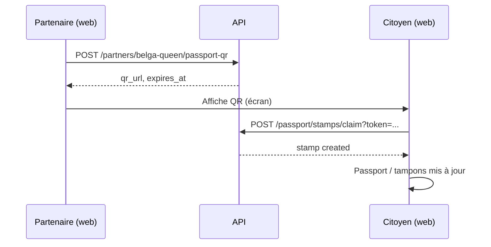
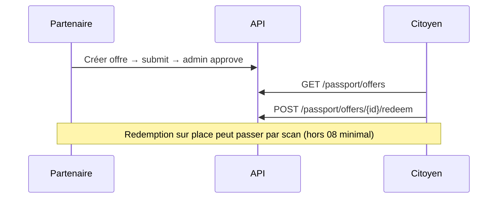

# WEB-PARTNERS-08 — Pilot Readiness

**Date :** 2026-06-01  
**Sprint :** PARTNER ECOSYSTEM  
**Phase :** DESIGN → BUILD (après validation gates PRD §13)  
**Statut :** DRAFT — spec design uniquement  
**Précédent :** [WEB-PARTNERS-REVIEW-01](../../product-review/WEB-PARTNERS-REVIEW-01.md)  
**Tickets bloqués :** WEB-PARTNERS-07 (distribution feed éditoriale)

---

## 1. Résumé produit

### Objectif

Rendre **opérationnels** les quatre partenaires pilotes Reims — Belga Queen, Pittaya, Centre des Ressources, Garçon Barbiers — dans Yunicity, sans manipulation API manuelle, avec un parcours vérifiable en recette.

### Promesse fin de sprint

> Un responsable de lieu pilote se connecte, complète sa présence, publie une offre et un contenu, génère un QR tampon ; un citoyen découvre le lieu, réclame le tampon, voit l’offre Passport et le contenu dans l’écosystème (fiche, agenda, feed).

### Non-objectifs (08)

| Exclu | Reporté vers |
|-------|----------------|
| Distribution / ranking feed éditorial | WEB-PARTNERS-07 |
| Marketplace, promo sponsorisée, publicité | — |
| Refonte globale `/places` ou `/map` | Hors scope |
| Parcours « créateur indépendant » (Yurpass) | Produit distinct |
| Données prod réelles non validées par le partenaire | Process métier hors BUILD |

---

## 2. Décisions clés

| Question | Décision | Justification |
|----------|----------|---------------|
| Découpage livraison | **4 sous-phases 08A→08D** | Risques, surfaces et reviewers différents (seeds vs Passport vs UI vs QA). |
| Cible self-service pilote | **Web app citoyenne** (`apps/web`) + **admin modération** | Mobile a déjà offres/scan ; recette pilote Reims = web + staff. Parité mobile = P2. |
| Comptes pilotes | Seed **recette/dev uniquement** (`--pilot` ou env guard) | Jamais emails/mots de passe en prod. |
| Coordonnées GPS | **Seed avec adresses réelles validées métier** + lat/lon | Sans GPS, carte morte (REVIEW-01). |
| Offres pilotes | **Seed `reims_partner_offers` + pipeline standard** | Tests et Passport déjà conçus autour de ces slugs. |
| Contenu créateur initial | **Créé via self-service 08C**, pas seed published obligatoire | Valide le parcours Belga E2E ; seed optionnel « démo » en recette seulement. |
| Sync feed événements seed | **Appeler `FeedEventSyncService` dans seed events** | Cohérence agenda public / feed. |
| Catalogue offres public | **Monter `GET /api/v1/partner-offers`** (tests existants) | Aligner router, tests, `fetchPublicPartnerOffers`. |
| QR tampon vs scan offre | **Deux parcours distincts**, copy explicite | 04A = tampon visit ; scan = redemption offre (déjà mobile/admin). |

---

## 3. Périmètre par sous-phase

### 08A — Partner Data Completion

#### Audit champs (état actuel → cible)

Modèle source : `Organization` + `PartnerProfile` → exposé via `PartnerPublicItem` (`backend/app/schemas/partner.py`).

| Champ | Source | Pilotes aujourd’hui | Cible 08A |
|-------|--------|---------------------|-----------|
| `name`, `slug`, `description` | org | OK | Conserver |
| `category`, `partnership_type`, `partner_status` | org + profile | OK (ACTIVE) | Conserver |
| `visibility` | org | PUBLIC | Conserver |
| `public_partner_label` | profile | OK | Conserver |
| `is_featured`, `featured_priority` | profile | Belga, Pittaya | Conserver |
| `address`, `postal_code` | org | **null** | **Renseigner** (adresse postale Reims) |
| `latitude`, `longitude` | org | **null** | **Renseigner** (géocodage ou coords validées) |
| `phone` | org | **null** | **Renseigner** (téléphone public) |
| `website` → `website_url` API | org | **null** | URL site ou page établissement |
| `social_links.instagram` → `instagram_url` | org | **null** | Handle ou URL Instagram |
| `logo_url` | org | **null** | URL asset (CDN / `uploads/` seed statique) |
| `banner_url` → `cover_image_url` | org | **null** | URL bannière hero fiche |
| `verification_status` | org | VERIFIED (seed) | Conserver |
| Carte `/map` | dérivé lat/lon | **invisible** | Pin visible pour les 4 |

#### Assets manquants

| Asset | Format | Usage | Responsable |
|-------|--------|-------|-------------|
| Logo carré | PNG/WebP ~512px | Fiche, Passport, feed | Produit / partenaire |
| Bannière | 16:9 ~1200px | Hero `/places/{slug}` | Produit / partenaire |
| Fallback | Catégorie (`resolvePartnerImage`) | Si asset absent temporairement | Dev (acceptable P1 recette) |

**Règle :** en recette, au minimum **coords + adresse** ; logos/bannières **souhaités P0** pour crédibilité pilote.

#### Données catalogue proposées (à valider métier avant BUILD)

| Slug | Adresse indicative | Catégorie carte |
|------|-------------------|-----------------|
| `belga-queen` | Centre-ville Reims (à confirmer) | nightlife |
| `pittaya` | Centre-ville Reims (à confirmer) | asian_food |
| `centre-des-ressources` | Reims (à confirmer) | institutional |
| `garcon-barbiers` | Reims (à confirmer) | barber |

Les coordonnées exactes doivent être **sourcées** (Google Maps / partenaire) et documentées dans le seed — pas d’invention silencieuse en prod.

#### Livrables 08A (BUILD)

- Extension `REIMS_SIGNED_PARTNERS_SEED` (champs optionnels remplis pour les 4 pilotes).
- Nouveau seed `reims_pilot_partner_memberships.py` : 4 users + `OrganizationMember` OWNER (emails `*@partner.yunicity.dev`, mot de passe via doc recette / env).
- `reims_partner_events.py` : appeler `FeedEventSyncService.upsert_event_post` après upsert event.
- Doc `docs/recette/partner-pilot-accounts.md` (identifiants recette, pas de secrets en repo si politique stricte → `.env.example` + script).

#### Critères d’acceptation 08A

- [ ] `GET /partners/belga-queen` retourne `latitude`, `longitude`, `address`, `phone` non null.
- [ ] `/map?city=Reims` affiche **4 pins** pilotes (web).
- [ ] Compte `belga-queen@partner.yunicity.dev` (recette) a membership OWNER sur org Belga Queen.
- [ ] Événement seed pilote apparaît dans `GET /feed` (ville Reims) après seed.

---

### 08B — Passport Readiness

#### État des lieux (REVIEW-01)

| Brique | Backend | Frontend citoyen | Frontend partenaire |
|--------|---------|------------------|---------------------|
| Offres publiées | `PublicPartnerOfferService`, `passport/offers`, `partners/{slug}/offers` | Passport dashboard, fiche lieu | Mobile + **admin** création ; **pas web** |
| Seed offres | **Absent** (`reims_partner_offers` manquant) | Catalogue vide | — |
| QR tampon | `POST /partners/{slug}/passport-qr` | `/passport/stamp/claim` | **Aucun écran** |
| Tampons liste | `GET /passport/stamps` | `PassportStampsSection` | — |
| Scan redemption offre | `scan.py` | — | Admin + mobile `partner-scan` |

#### Gaps identifiés

1. **Seed** : créer `backend/app/db/seeds/reims_partner_offers.py` (slugs attendus par tests : `belga-queen-accueil-passport`, `pittaya-avantage-passport`, etc.) + enregistrement dans `seeds/__main__.py`.
2. **Route catalogue** : exposer `GET /api/v1/partner-offers` (fichier `partner_offers_public.py` ou équivalent) — tests `test_partner_offers_api.py` l’attendent.
3. **Front** : corriger `fetchPublicPartnerOffers` si l’URL finale diffère ; vérifier ancres `#passport-offer-{slug}` sur fiche.
4. **UI QR tampon partenaire** : écran « Mon QR Passport » (génération + affichage QR + expiration + copie lien) — web prioritaire pour pilote.
5. **Copy UX** : distinguer « Tampon de visite » vs « Valider une offre (scanner) » sur hub partenaire.
6. **Recette** : au moins **1 offre published + active** par pilote (types variés : drink / discount / custom).

#### Parcours cible — tampon (04A)



#### Parcours cible — offre



#### Écrans à créer / compléter (08B)

| Écran | App | Priorité |
|-------|-----|----------|
| Hub Passport partenaire (QR + lien offres) | web | P0 |
| Liste / création offre (réutiliser pattern admin ou lien mobile doc) | web | P1 (si 08C hub regroupe) |
| Modération offres | admin | Existe — vérifier workflow |

#### Critères d’acceptation 08B

- [ ] Après seed standard : `GET /api/v1/partner-offers?city=Reims` liste offres Belga + Pittaya (tests verts).
- [ ] Fiche Belga : section Passport non vide.
- [ ] Partenaire connecté génère QR ; citoyen claim → tampon visible sur `/passport`.
- [ ] Offre pilote redeemable (ou parcours documenté si redemption scan seule en recette).

---

### 08C — Self-Service Partner

#### Backend (existant — pas de nouveau domaine)

| Capacité | Route | Permission |
|----------|-------|------------|
| Offres | `/organizations/me/offers` | `require_offer_manager` (OWNER/ADMIN) |
| Événements | `/organizations/me/events` | idem + gate `PartnerStatus` ACTIVE |
| Creator content | `/organizations/me/creator-content` | idem |
| Modération creator | `/admin/partner-creator-content/{id}/approve\|reject\|archive` | `moderation.manage` |
| Modération events | `/admin/local-events/...` | staff |
| QR tampon | `/partners/{slug}/passport-qr` | `require_offer_manager` |

#### Frontend gaps

| Capacité | Mobile | Admin | Web citoyen |
|----------|--------|-------|-------------|
| Offres CRUD | Oui | Oui | **Non** |
| Événements CRUD | Non repéré | Modération | **Non** |
| Creator CRUD | Non | API seulement | **Non** |
| QR tampon | Non | Non | **Non (08B)** |
| Hub partenaire | Partiel (offres) | Partiel | **Non** |

#### Architecture UX proposée (web)

**Route racine :** `/organizations/me/partner` (ou `/partner` si alias plus court — décision BUILD : préférer sous `organizations/me` pour cohérence TICKET-206).

| Sous-route | Fonction |
|------------|----------|
| `/organizations/me/partner` | Hub : statut lieu, checklist readiness, liens |
| `.../offers` | Liste + CTA créer (pattern `partner-offers-intention.md`) |
| `.../offers/new`, `.../offers/[id]` | Création / détail |
| `.../events` | Liste événements org |
| `.../events/new`, `.../events/[id]` | Création / édition / submit |
| `.../creator-content` | Liste contenus |
| `.../creator-content/new`, `.../creator-content/[id]` | CRUD + submit |
| `.../passport` | QR tampon (08B) |

**Sélecteur d’organisation** : si user a plusieurs orgs, reprendre pattern `PartnerOfferAccessPanel` (admin).

#### Admin — modération creator content

Nouvelle section admin (miroir `partner-offers`) :

- Liste `pending_review` / `published` / `rejected`
- Actions approve / reject (raison) / archive
- Lien vers fiche publique

#### Permissions & sécurité

- Toutes les actions self-service : JWT citoyen + membership ACTIVE + rôle OWNER/ADMIN.
- Pas d’exposition `notes_internal`, `contract_reference`, emails contact internes (déjà filtré côté public).
- QR : rate limit existant ; token JWT courte durée (04A).
- Upload média creator : réutiliser contraintes existantes (`media_url` max length) — pas d’upload fichier en 08 sauf déjà prévu.

#### Critères d’acceptation 08C

- [ ] User pilote Belga : créer événement → submit → visible après approval admin sur `/events` et fiche.
- [ ] User pilote : créer creator content → submit → staff approve → visible fiche + **feed** (`partner_creator`).
- [ ] User pilote : créer offre → submit → staff approve → visible Passport + fiche.
- [ ] Hub affiche statuts lisibles (langage humain, pas `pending_review` brut).

---

### 08D — Pilot Verification

#### Scénario recette canonique — Belga Queen

| Étape | Acteur | Action | Résultat attendu |
|-------|--------|--------|------------------|
| 1 | Partenaire | Login recette Belga | Dashboard org/partner |
| 2 | Partenaire | Vérifier fiche publique `/places/belga-queen` | Adresse, carte, visuels |
| 3 | Partenaire | Créer creator content → submit | Statut « en revue » |
| 4 | Staff | Admin approve creator | — |
| 5 | Citoyen | Feed Reims | Post `partner_creator` Belga visible |
| 6 | Partenaire | Créer / vérifier offre Passport published | Section Passport fiche |
| 7 | Partenaire | Générer QR tampon | QR affiché |
| 8 | Citoyen | Scanner / ouvrir lien claim | Tampon Belga sur Passport |
| 9 | Citoyen | Parcours découverte | Places, map pin, événement seed ou créé |

Répéter **smoke** (pas E2E complet) pour Pittaya, CDR, Garçon : fiche + pin + 1 offre + QR claim.

#### Checklist QA globale

Voir plan §08D — fichier `docs/recette/web-partners-08-pilot-checklist.md` (à créer en BUILD de 08D).

#### Critères de sortie sprint 08

- [ ] 4 pilotes : fiche complète + pin carte.
- [ ] 4 pilotes : ≥1 offre Passport visible.
- [ ] Belga : parcours E2E scénario ci-dessus sans curl.
- [ ] Aucune régression tests : `test_partner_offers_api`, `test_passport_stamp_qr`, `test_partner_creator_content_*`, `test_partner_events_api`.
- [ ] Doc recette à jour ; pas de secrets commités.

---

## 4. Modèle de données & seeds (synthèse)

### Fichiers seeds (nouveaux / modifiés)

| Fichier | Action |
|---------|--------|
| `reims_signed_partners.py` | Enrichir 4 entrées pilotes |
| `reims_partner_offers.py` | **Créer** (UUID stables, slugs tests) |
| `reims_pilot_partner_memberships.py` | **Créer** |
| `reims_partner_events.py` | + feed sync |
| `seeds/__main__.py` | Enchaîner offers + memberships (ordre : partners → offers → events → memberships) |

### Flag environnement

```text
python -m app.db.seeds --pilot   # memberships + mots de passe recette uniquement si APP_ENV in (dev, recette)
```

Alternative : inclure memberships dans `--demo` existant — **déconseillé** (mélange citoyen démo et partenaire). Préférer `--pilot` explicite.

---

## 5. API & contrats

### Corrections contrat

| Consumer | Actuel | Cible |
|----------|--------|-------|
| `test_partner_offers_api` | `GET /api/v1/partner-offers` | Router monté |
| `fetchPublicPartnerOffers` | `GET /api/v1/partners/offers` (404) | Aligner sur `/api/v1/partner-offers` |
| `listPassportOffers` (auth) | `GET /api/v1/passport/offers` | Inchangé |

### Nouveaux clients TS (08C)

- `organization-events-api.ts` (ou extension `organization-api.ts`) : list/create/update/submit events.
- `organization-creator-content-api.ts` : list/create/update/submit creator content.
- `partner-passport-api.ts` : `generatePartnerStampQr(slug, city, payload)`.

---

## 6. UX & copy (français)

- Hub partenaire : ton « contribution à la ville », réf. `docs/ux/partner-offers-intention.md`.
- États : « En revue », « Publié », « À ajuster » — pas `pending_review`.
- QR : « Tampon de visite » — « Montre ce QR à un citoyen Yunicity pour qu’il collectionne ton lieu. »
- Empty states : CTA vers création, pas page blanche.

---

## 7. Sécurité (zones rouges)

| Zone | Mesure 08 |
|------|-----------|
| Comptes pilotes | Recette/dev only ; guard `APP_ENV` |
| QR JWT | Durée courte ; pas de PII dans token |
| Membership | Vérifier qu’un user ne peut pas QR pour une org non membre |
| Offres | Modération admin avant `published` |
| Creator content | Modération admin + sync feed à l’approve |
| Uploads | Pas de nouvelle surface upload sans checklist `docs/ai/security-checklist.md` |

---

## 8. Risques

| Risque | Impact | Mitigation |
|--------|--------|------------|
| Adresses/GPS incorrects | Confiance citoyen | Validation métier avant merge seed |
| Une seule PR trop grosse | Review ratée | Découpage 08A→D (voir plan) |
| CI backend mypy baseline | Merge bloqué | Chore séparée ou fix minimal dans 08A |
| Partenaire sans staff pour approve | Recette bloquée | Compte staff seed + doc |
| Confusion QR / scan | Support | Copy + hub distinct |

---

## 9. Métriques (MEASURE post-recette)

- % pilotes avec fiche « complète » (champs checklist 08A).
- Temps médian partenaire : login → QR généré.
- Nombre tampons QR claim par pilote (semaine 1).
- Taux sections vides sur fiches pilotes (objectif → 0).

---

## 10. Gates PRD §13 (avant BUILD)

- [ ] Spec 08 validée CTO / product
- [ ] Adresses pilotes validées (métier)
- [ ] Assets logo/bannière : plan B fallback documenté
- [ ] Découpage PR accepté
- [ ] Checklist sécurité relue pour seeds comptes + QR UI

---

*Document DESIGN uniquement — aucune implémentation dans ce ticket.*
