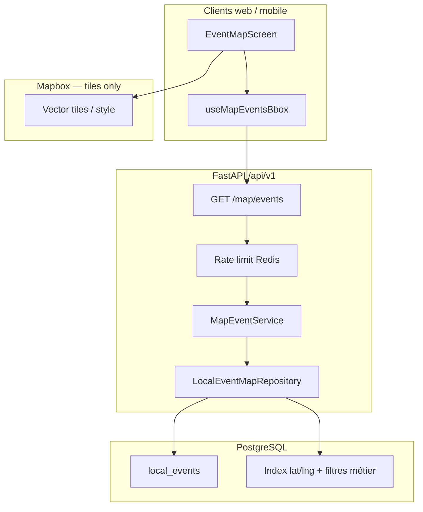

# Event Map — Technical Specification (MVP)

> **Ticket :** FEATURE-D / D.2.0  
> **Phase :** DESIGN (pas de BUILD dans ce ticket)  
> **Référence produit :** [`docs/prd/PRD-D20-event-map-foundation.md`](../prd/PRD-D20-event-map-foundation.md)  
> **Workflow :** `docs/workflow/YUNICITY-OFFICIAL-WORKFLOW.md` — gates BUILD : PRD §13 + `docs/bmad/BMAD.md`

| Champ | Valeur |
|-------|--------|
| **Statut** | **DESIGN_READY** — en attente validation CTO avant implémentation |
| **Date** | 2026-05-19 |
| **Interdit D.2.0** | Routes FastAPI implémentées, composants Mapbox, migrations nouvelles (sauf index recommandé), clés prod |

---

## 0. Objectif du document

Figer l’architecture technique de la **carte événementielle MVP** :

- endpoint bbox dédié,
- stack Mapbox web + mobile,
- stratégie chargement / performance / privacy,
- contrats API et validation,
- structure frontend (composants, hooks) **à implémenter** dans tickets D.3+.

**Mantra technique :** *« Bbox bornée, 100 points max, debounce 300 ms, événements publics géolocalisés — jamais de websocket présence. »*

---

## Schéma d’architecture (MVP)



**Décisions figées :**

- Pas de WebSocket carte.
- Pas de PostGIS obligatoire MVP — filtre bbox par comparaison `latitude`/`longitude` (index B-tree composite) ; évolution GIST documentée §13.
- Pas de fusion feed/posts/tribus sur la carte.

---

# Section 1 — Périmètre données

## 1.1 Source de vérité

Table existante : `local_events` (TICKET-505).

| Champ | Rôle carte |
|-------|------------|
| `latitude`, `longitude` | **Obligatoires** pour apparition carte (`IS NOT NULL`) |
| `starts_at`, `ends_at` | Filtrage temporel |
| `city` | Scoping ville |
| `district`, `neighborhood_id` | Contexte popup |
| `title`, `description`, `location_name` | Popup + payload minimal |
| `moderation_status`, `visibility`, `is_cancelled` | Filtres sécurité |

## 1.2 Filtres SQL (alignés liste publique)

```text
WHERE moderation_status = 'approved'
  AND visibility = 'public'
  AND is_cancelled = false
  AND starts_at >= :now
  AND latitude IS NOT NULL
  AND longitude IS NOT NULL
  AND lower(city) = lower(:city)          -- si city fourni
  AND latitude BETWEEN :lat_min AND :lat_max
  AND longitude BETWEEN :lon_min AND :lon_max
ORDER BY starts_at ASC
LIMIT :limit                               -- max 100
```

**Invariant :** même politique de visibilité que `LocalEventRepository.list_public_for_city` + contrainte géo.

## 1.3 Exclusions données

| Donnée | Raison |
|--------|--------|
| `EventInterest` count | Pas métrique popup |
| Position device user | Jamais stockée ni transmise |
| Organizations seules (sans event) | Hors MVP sauf couche optionnelle |
| Offres / posts | Hors MVP |

---

# Section 2 — Index & migrations (BUILD D.3)

## 2.1 État actuel

Index existants : `ix_local_events_city_starts_at`, etc. — **pas** d’index dédié bbox.

## 2.2 Migration recommandée (BUILD)

```sql
-- Indicatif — ticket D.3
CREATE INDEX ix_local_events_map_bbox
  ON local_events (city, starts_at)
  WHERE moderation_status = 'approved'
    AND visibility = 'public'
    AND is_cancelled = false
    AND latitude IS NOT NULL
    AND longitude IS NOT NULL;
```

Optionnel V2 : index GIST sur `ST_MakePoint(longitude, latitude)` si volume > seuil.

## 2.3 Pas de nouvelle colonne MVP

Les champs `latitude`/`longitude` suffisent. Pas de `geom` obligatoire en D.3.

---

# Section 3 — API Map

## 3.1 Endpoint

```
GET /api/v1/map/events
```

Router : `app/api/v1/map.py` (nouveau module) — tag `map`.

Auth : **`get_current_user_optional`** (lecture publique alignée `GET /events`), rate limit appliqué.

## 3.2 Query parameters

| Param | Type | Requis | Description |
|-------|------|--------|-------------|
| `lat_min` | float | oui | Sud-ouest bbox (-90 .. 90) |
| `lon_min` | float | oui | Sud-ouest bbox (-180 .. 180) |
| `lat_max` | float | oui | Nord-est bbox |
| `lon_max` | float | oui | Nord-est bbox |
| `city` | string | recommandé | Filtre ville (profil / Reims) — **max 128 chars** |
| `limit` | int | non | Défaut **100**, max **100** |

**Pas en MVP :** `page`, `cursor`, `period`, `neighborhood_slug` (filtres BUILD D.6+).

## 3.3 Validations (422)

| Règle | Détail |
|-------|--------|
| `lat_min <= lat_max` | |
| `lon_min <= lon_max` | |
| Bornes WGS84 | lat ∈ [-90, 90], lon ∈ [-180, 180] |
| Surface bbox max | `(lat_max - lat_min) * (lon_max - lon_min) <= 0.25` degrés² (~25 km × 25 km à Reims) — **anti-abuse** |
| `limit` | 1..100 |
| `city` | trim, longueur ≤ 128 |

## 3.4 Rate limiting

| Paramètre | Valeur |
|-----------|--------|
| Clé | `map_events:{ip}` ou `{user_id}` |
| Limite | **60 req / min** (ajustable recette) |
| Store | Redis (même pattern search B.4) |
| Réponse 429 | Message FR générique |

## 3.5 Réponse JSON

```json
{
  "city": "Reims",
  "bbox": {
    "lat_min": 49.22,
    "lon_min": 3.95,
    "lat_max": 49.28,
    "lon_max": 4.05
  },
  "count": 12,
  "truncated": false,
  "items": [
    {
      "id": "uuid",
      "title": "Concert place Drouet",
      "starts_at": "2026-05-24T19:00:00+02:00",
      "ends_at": null,
      "city": "Reims",
      "district": "Centre-ville",
      "location_name": "Place Drouet d'Erlon",
      "latitude": 49.2534,
      "longitude": 4.0287,
      "neighborhood": {
        "slug": "centre",
        "display_name": "Centre-ville"
      }
    }
  ]
}
```

| Champ | Note |
|-------|------|
| `truncated` | `true` si plus de `limit` rows match — client peut inviter zoom |
| `description` | **Omit** ou tronquée 120 chars dans liste map (perf) — détail sur fiche event |
| `count` | Nombre retourné (= `len(items)`) |

## 3.6 Schémas Pydantic (BUILD)

- `MapEventItem`
- `MapEventListResponse`
- `MapBboxQuery` — validateur bbox surface

## 3.7 Service layer

```
MapEventService.list_in_bbox(bbox, city, limit, now)
  → LocalEventMapRepository.list_public_in_bbox(...)
```

**Pas de logique métier dans la route** — règle `11-anti-spaghetti`.

## 3.8 Pagination

**MVP : pas de pagination.** Une bbox = un snapshot ≤ 100 points. Si besoin futur : `cursor` par `starts_at,id` — hors D.3.

## 3.9 Erreurs

| HTTP | Cas |
|------|-----|
| 200 | OK, items vide autorisé |
| 422 | Bbox invalide |
| 429 | Rate limit |
| 500 | Erreur serveur — message générique |

---

# Section 4 — Centroïdes ville (config)

Fichier config statique BUILD : `app/core/city_map_defaults.py` (indicatif).

| Ville | lat | lon | zoom |
|-------|-----|-----|------|
| Reims | 49.2583 | 4.0317 | 12 |

Utilisé pour recentrage bouton « Revenir à {ville} » côté client (dupliquer en `@yunicity/utils` pour partage web/mobile).

---

# Section 5 — Stack frontend

## 5.1 Web

| Choix | Détail |
|-------|--------|
| Lib | **Mapbox GL JS** via **`react-map-gl`** v7+ |
| App | `frontend/apps/web` |
| Route indicative | `/events/map` (ou `/map` — décision produit D.4) |
| Shell | `WebAppShell`, `contentWidth="default"` |

### Variables d’environnement (web)

| Variable | Exemple | Note |
|----------|---------|------|
| `NEXT_PUBLIC_MAPBOX_ACCESS_TOKEN` | `pk.eyJ...` | Token **public** Mapbox (URL restrictions domaine) |
| `NEXT_PUBLIC_DEFAULT_MAP_CITY` | `Reims` | Fallback |

Fichiers : `frontend/apps/web/.env.example` — section Map (BUILD D.4).

## 5.2 Mobile

| Choix | Détail |
|-------|--------|
| Lib | **`@rnmapbox/maps`** (Expo dev build / config plugin) |
| App | `frontend/apps/mobile` |
| Route | `app/(protected)/events/map.tsx` ou `map.tsx` |

### Variables d’environnement (mobile)

| Variable | Exemple |
|----------|---------|
| `EXPO_PUBLIC_MAPBOX_ACCESS_TOKEN` | `pk.eyJ...` |

**Note Expo :** Mapbox nécessite config native — documenter dans `frontend/apps/mobile/README` (BUILD) ; pas Expo Go standard si plugin requis.

## 5.3 Packages partagés (BUILD)

| Package | Fichiers indicatifs |
|---------|---------------------|
| `@yunicity/types` | `map.ts` — `MapEventItem`, `MapEventListResponse`, `MapBbox` |
| `@yunicity/utils` | `map-events-api.ts`, `map-labels.ts`, `city-map-defaults.ts` |
| Tests | `map-events-api.test.ts`, `map-bbox.test.ts` |

---

# Section 6 — Architecture composants (à implémenter)

## 6.1 Arborescence indicative

```text
apps/web/
  app/events/map/page.tsx
  components/map/
    event-map-screen.tsx
    event-map-canvas.tsx
    event-map-marker.tsx
    event-map-popup.tsx
    event-map-empty-state.tsx
  hooks/use-map-events-bbox.ts

apps/mobile/
  app/(protected)/events/map.tsx
  components/map/
    (équivalents RN)
  hooks/use-map-events-bbox.ts
```

## 6.2 Responsabilités

| Composant | Rôle |
|-----------|------|
| `EventMapScreen` | Layout, header ville, états empty/error, bouton recentrage |
| `EventMapCanvas` | Mapbox MapView, camera, onRegionChangeEnd |
| `EventMapMarker` | PointLayer / MarkerView — style sobre |
| `EventMapPopup` | Callout titre, date, quartier, CTA |
| `EventMapEmptyState` | Messages §6 PRD |

## 6.3 Hook `useMapEventsBbox`

```typescript
// Contrat indicatif
type UseMapEventsBboxResult = {
  items: MapEventItem[];
  loading: boolean;
  error: string | null;
  truncated: boolean;
  setBbox: (bbox: MapBbox) => void;
  setCity: (city: string) => void;
  retry: () => void;
};
```

| Comportement | Valeur |
|--------------|--------|
| Debounce bbox | **300 ms** après `onRegionChangeComplete` / idle |
| Requête minimale | Bbox valide + `city` non vide |
| Abort | `AbortController` sur changement bbox rapide |
| Cache optionnel | Mémoire dernière réponse par bbox arrondie (2 décimales) — TTL 60 s |

## 6.4 Refresh stratégie

| Déclencheur | Action |
|-------------|--------|
| Fin pan/zoom (debounced) | `GET /map/events` |
| Bouton Réessayer | Même bbox |
| Pull-to-refresh mobile | Même bbox |
| Focus écran | **Pas** de reload auto agressif |
| Interval / polling | **Interdit** |
| WebSocket | **Interdit** |

---

# Section 7 — Comportement carte (implémentation client)

## 7.1 Initialisation

1. Résoudre `city` = `profile.city ?? DEFAULT_CITY`.
2. Centrer camera sur `CITY_DEFAULTS[city]` zoom **12**.
3. Calculer bbox initiale depuis viewport (ou bbox fixe ville ~0.08° padding).
4. Fetch events.

## 7.2 Recentrage

- Bouton : `flyTo(cityCenter, zoom 12)` + fetch bbox résultante.

## 7.3 Géolocalisation device

| Plateforme | MVP |
|------------|-----|
| Web | `navigator.geolocation` — **opt-in** bouton « Me localiser » — **pas** au mount |
| Mobile | `expo-location` — permission explicite — centre carte user **sans** envoyer coords au backend |

**Important :** la position user **n’est jamais** envoyée à `GET /map/events`. Seule la bbox viewport est envoyée.

## 7.4 Limite exploration

- Valider côté client que bbox respecte surface max avant appel API.
- Si user zoome hors ville pilote : autoriser visuellement mais `city` filtre toujours les events — pas d’events hors Reims.

---

# Section 8 — Performance

| Technique | Détail |
|-----------|--------|
| **Bbox filtering** | Serveur — seuls points visibles |
| **Limit 100** | Hard cap API + client |
| **Debounce 300 ms** | Client — réduit rafales |
| **Pas de polling** | — |
| **Pas de WS** | — |
| **Cache court client** | Optionnel 60 s par tuile bbox |
| **Payload minimal** | Pas de description longue dans `items` |
| **Index SQL** | §2.2 |

### Objectifs (recette)

| Métrique | Cible |
|----------|-------|
| p95 `GET /map/events` | < 200 ms (100 rows, Reims) |
| Rendu 100 marqueurs | Fluide 60 fps devices milieu de gamme |

---

# Section 9 — Mobile UX technique

## 9.1 Layout

```text
SafeAreaView
  Header (titre + ville)
  MapView flex ~0.65
  EmptyState | Error (overlay bas si besoin)
  Optional: mini-liste 0–3 events sous carte
  Link retour feed/events
```

## 9.2 Gestes

- `scrollEnabled={false}` sur MapView si dans ScrollView parent — **préférer** carte hors scroll ou `nestedScrollEnabled` Android.
- Recommandation : **écran dédié stack** sans ScrollView parent autour de la carte.

## 9.3 Permissions

- `NSLocationWhenInUseUsageDescription` (iOS) — texte FR : « Pour centrer la carte sur votre position — optionnel. »
- Pas de background location.

---

# Section 10 — Sécurité & privacy

| Exigence | Implémentation |
|----------|----------------|
| Pas de localisation live user stockée | Coords device restent client |
| Pas de présence temps réel | Pas d’endpoint `/map/users` |
| Pas d’exposition position privée | Pas de profil sur carte |
| Pas de tracking social | Analytics agrégés sans bbox user fine |
| Events privés / pending | Filtrés SQL |
| Token Mapbox public | Restrictions URL ; rotation si fuite |
| Rate limit bbox | §3.4 |
| Logs serveur | Pas de log bbox + user_id corrélés en prod verbose |

Référence : `docs/ai/security-checklist.md` — zones géoloc.

---

# Section 11 — Intégration YunicityApi

```typescript
// BUILD — façade
yunicityApi.map.listEvents({
  lat_min, lon_min, lat_max, lon_max,
  city: "Reims",
  limit: 100,
});
```

Module : `map-events-api.ts` — `GET /map/events?...`

---

# Section 12 — Risques techniques

| Risque | Mitigation |
|--------|------------|
| Rafale bbox au pan | Debounce + abort |
| Bbox monde entier | Validation surface max |
| 100+ events dense | `truncated` + message zoom |
| Mapbox billing | Cache client, pas polling |
| Expo Go vs dev build | Doc plugin `@rnmapbox/maps` |
| Events sans coords | Backfill staff / form org (futur) |
| Divergence liste/carte | Mêmes filtres SQL |

---

# Section 13 — Futur technique (non MVP)

| Item | Stack |
|------|-------|
| PostGIS `ST_MakeEnvelope` + GIST | PostgreSQL |
| Clustering Mapbox GeoJSON supercluster | Client-side, clusters statiques |
| Couche organizations | Table + endpoint `/map/places` |
| Couche offres flash | Endpoint séparé, style pin distinct |
| Filtre `period=weekend` | Query param |
| CDN cache bbox | Redis keyed by rounded bbox + city |
| Service worker cache tiles | Web offline — basse priorité |

---

# Section 14 — Test plan (BUILD)

## 14.1 Backend (`pytest`)

| Test | Attendu |
|------|---------|
| `test_map_events_happy_bbox` | 200, items avec lat/lng |
| `test_map_events_excludes_no_coords` | Event sans coords absent |
| `test_map_events_excludes_past` | `starts_at < now` absent |
| `test_map_events_excludes_pending` | pending absent |
| `test_map_events_bbox_invalid` | 422 |
| `test_map_events_limit_cap` | max 100 |
| `test_map_events_truncated` | seed > 100 → truncated true |
| `test_map_events_city_filter` | hors ville absent |
| `test_map_events_rate_limit` | 429 (si Redis) |

## 14.2 Utils (`vitest`)

| Test | Attendu |
|------|---------|
| `buildMapEventsQuery` | Query string correcte |
| `validateBboxSurface` | Rejet trop grand |
| `roundBboxForCache` | Stabilité clé cache |
| Labels empty state | FR constants |

## 14.3 Frontend (manuel recette)

- [ ] Web : pan → debounce → marqueurs
- [ ] Web : popup → lien fiche event
- [ ] Web : secteur vide message
- [ ] Mobile : stack retour OK
- [ ] Mobile : pas de conflit scroll/carte
- [ ] Recentrage Reims zoom 12
- [ ] Erreur réseau + retry
- [ ] Pas de requête si bbox invalide

## 14.4 Non-régression

- [ ] `GET /events` inchangé
- [ ] `GET /search` group events inchangé
- [ ] Feed sync events coords inchangé

---

# Section 15 — Conclusion technique

La carte événementielle Yunicity repose sur un **contrat simple** : une bbox, une ville, cent événements publics géolocalisés à venir. Mapbox fournit le **fond cartographique** ; le backend fournit la **vérité métier** alignée sur les listes existantes ; le client applique **debounce, calme et exclusion de la présence sociale**.

**Prochaine étape BUILD :** ticket **D.3** (repository + route + tests) après validation CTO de ce document et du PRD-D20.

---

## Annexe A — Comparaison endpoints

| Endpoint | Usage | Géo |
|----------|-------|-----|
| `GET /events` | Liste temporelle paginée | Non (ville seule) |
| `GET /search?type=event` | Recherche texte | Non |
| `GET /map/events` | **Carte bbox** | Oui — lat/lng requis côté données |

## Annexe B — `.env.example` (BUILD)

```bash
# Web (apps/web/.env.example)
NEXT_PUBLIC_MAPBOX_ACCESS_TOKEN=
NEXT_PUBLIC_DEFAULT_MAP_CITY=Reims

# Mobile (apps/mobile/.env.example)
EXPO_PUBLIC_MAPBOX_ACCESS_TOKEN=
```

Backend : **pas** de secret Mapbox côté serveur pour tiles (token public client).

## Annexe C — Tickets BUILD suggérés

| Ticket | Scope |
|--------|-------|
| D.3 | API + index + tests backend |
| D.4 | Web UI Mapbox |
| D.5 | Mobile UI @rnmapbox/maps |
| D.6 | Liens navigation + MEASURE + `docs/ux/event-map-ui-intent.md` |
