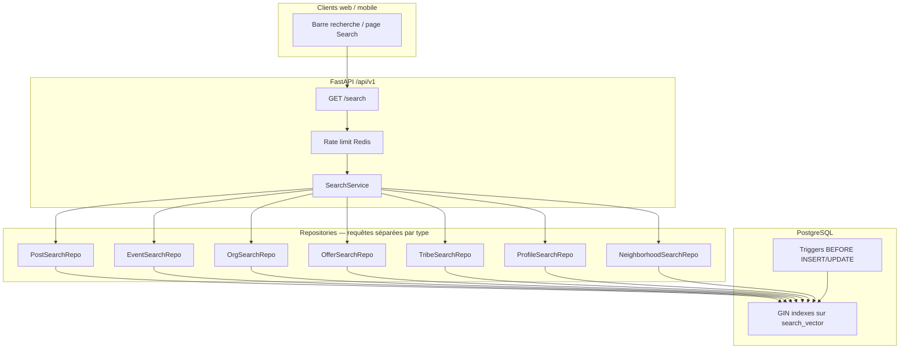
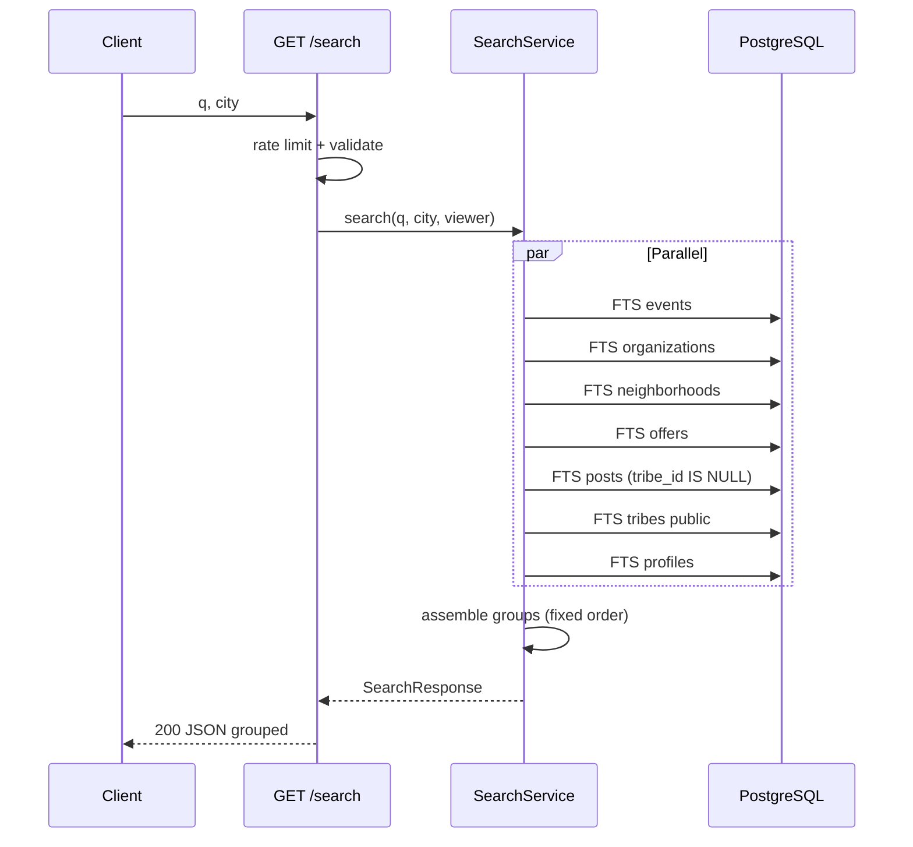

# Search & Indexing — Technical Specification (MVP)

> **Ticket :** FEATURE-B / B.3  
> **Phase :** DESIGN (pas de BUILD dans ce ticket)  
> **Référence produit :** [`docs/prd/PRD-B1-local-discovery-and-search-philosophy.md`](../prd/PRD-B1-local-discovery-and-search-philosophy.md)  
> **Workflow :** `docs/workflow/YUNICITY-OFFICIAL-WORKFLOW.md` — gates BUILD : PRD §13 + `docs/bmad/BMAD.md`

| Champ | Valeur |
|-------|--------|
| **Statut** | **DESIGN_READY** — en attente validation CTO avant migrations |
| **Date** | 2026-05-20 |
| **Interdit B.3** | Migrations, ORM `search_vector`, routes FastAPI implémentées, frontend, Elasticsearch/Meilisearch |

---

## 0. Objectif du document

Figer l’architecture technique de la **recherche locale MVP** :

- indexation **PostgreSQL Full-Text Search** (FTS),
- endpoint unique groupé par type,
- permissions alignées sur les services existants,
- performances et maintenance **simples**,
- **invariant Feature-A** (`posts.tribe_id IS NULL` dans feed **et** recherche) garanti partout.

**Mantra technique :** *« Requêtes par type, résultats groupés, ville par défaut, rang explicable — jamais de fil mélangé infini. »*

---

## Schéma d’architecture (MVP)



**Décision figée :** pas de moteur externe ; pas de worker d’indexation ; pas de `UNION ALL` unique renvoyant un flux mélangé paginé à l’infini.

---

# Section 1 — Périmètre recherchable

## 1.1 Entités indexées (INCLUS)

| Entité | Table | Champs texte indexés | Filtres métier obligatoires |
|--------|-------|----------------------|----------------------------|
| **Posts feed ville** | `posts` | `title`, `body` | `is_active = true`, **`tribe_id IS NULL`**, `city` match |
| **Événements publics** | `local_events` | `title`, `description`, `location_name`, `district`, `event_type` | `visibility = 'public'`, `moderation_status = 'approved'`, `is_cancelled = false` |
| **Organizations** | `organizations` | `name`, `description`, `category`, `slug` | `verification_status = 'verified'`, `visibility = 'public'` |
| **Offres partenaires** | `partner_offers` + join `organizations` | `title`, `description` | `status = 'published'`, `is_active = true`, org verified+public, fenêtre `valid_from`/`valid_until` |
| **Flash offers** | même table | idem offres | `is_flash = true` + règles `is_flash_active()` (BUILD : même filtres que `PartnerOfferRepository._visible_offer_filters` + flash non expiré) |
| **Tribus publiques** | `tribes` | `name`, `description`, `slug`, `category` | `visibility = 'public'`, `archived_at IS NULL` — **métadonnées uniquement** |
| **Profils publics** | `user_profiles` + join `users` | `username`, `display_name`, `bio` (pas email) | `users.is_active = true`, `onboarding_completed = true`, visibilité résolvable (§7) |
| **Quartiers** | `neighborhoods` | `display_name`, `short_description`, `slug`, `ambiance` | `is_active = true` |

## 1.2 Exclusions strictes (JAMAIS dans l’index / résultats)

| Exclusion | Raison | Garde-fou technique |
|-----------|--------|---------------------|
| Posts `tribe_id IS NOT NULL` | Invariant FEATURE-A | `WHERE tribe_id IS NULL` sur **toute** requête posts |
| Murs tribu | Hors discovery globale | Pas de route search tribu-posts |
| Événements non publics / non approuvés | Permissions métier | Aligné `LocalEventRepository.list_public_for_city` |
| Offres `draft`, `pending_review`, `rejected`, `archived` | Workflow partenaire | `status = published` |
| Offres expirées | Utilité | `valid_until >= now()` ou NULL |
| Organizations non vérifiées / `private` | Confiance lieu | Aligné `OrganizationService.get_public_by_slug` |
| Tribus `private_invite` | Pas de catalogue caché | `visibility = 'public'` |
| Tribus archivées | Fin de vie | `archived_at IS NULL` |
| Profils `private` | PII / consentement | Filtrage `ProfileVisibility` (§7) |
| Profils onboarding incomplet | Pas de fantômes | `onboarding_completed = true` |
| Users suspendus | Sécurité | `users.is_active = true` |
| Contenus `is_active = false` (posts) | Modération / soft delete | Exclu |
| Commentaires isolés | Faible valeur MVP | Hors scope |
| Notifications | Inbox | Hors scope |
| Brouillons partout | Intégrité | Statuts workflow |

## 1.3 Invariant Feature-A (rappel contractuel)

```text
Feed ville     = SELECT posts WHERE is_active AND tribe_id IS NULL
Recherche post = SELECT posts WHERE is_active AND tribe_id IS NULL AND <FTS>
Mur tribu      = GET /tribes/{city}/{slug}/posts ONLY
```

**Tests BUILD obligatoires :** post tribu créé → **absent** de `GET /api/v1/search?type=post` et de tout groupe `post`.

## 1.4 City scoping

Toutes les entités territoriales portent `city` (directement ou via `organizations.city` pour offres). La recherche **filtre toujours** sur la ville résolue (§4, §6) — pas de résultat hors ville sauf paramètre explicite staff (hors MVP).

---

# Section 2 — Stratégie d’indexation MVP

## 2.1 Choix : PostgreSQL Full-Text Search

| Option | Verdict MVP |
|--------|-------------|
| **PostgreSQL FTS** (`tsvector`, GIN, `plainto_tsquery`) | **Retenu** |
| Elasticsearch / OpenSearch | ❌ Rejeté MVP |
| Meilisearch / Typesense | ❌ Rejeté MVP |
| `ILIKE %q%` seul | ❌ Insuffisant perf + pertinence |

### Pourquoi PostgreSQL suffit au MVP

| Avantage | Détail |
|----------|--------|
| **Stack unique** | DB déjà PostgreSQL 16 + PostGIS — pas de cluster search |
| **Cohérence transactionnelle** | `search_vector` mis à jour avec la ligne (trigger ou ORM flush) |
| **Permissions** | Mêmes filtres SQL que feed / events / orgs — pas de dérive index |
| **Coût ops** | Zéro service additionnel, backup/restore unifié |
| **Volume pilote Reims** | Milliers de lignes — FTS GIN largement suffisant |
| **Explicabilité** | `ts_rank` + tri secondaire lisible — pas de boîte noire |

### Limites acceptées (dette future documentée)

| Limite | Impact | Mitigation MVP | Évolution §13 |
|--------|--------|----------------|---------------|
| Pas de fuzzy avancé | Typos mal gérées | `plainto_tsquery`, min 2 caractères | Synonymes, trigram |
| Français uniquement | `french` config | OK pilote Reims | Config `simple` + unaccent |
| Pas de géo-radius | Pas « à 500 m » | Filtre `city` + `neighborhood_slug` | PostGIS distance |
| Ranking basique | Moins « magique » | **Feature** produit (PRD-B1) | Pas ML opaque |
| Charge write | Trigger par UPDATE | Tables modérées MVP | Batch rebuild rare |

**Règle CTO :** ne pas scaler Elasticsearch avant preuve de saturation PostgreSQL (p95 search > 500 ms sustained + volume > 100k docs actifs).

## 2.2 Colonne `search_vector`

Sur **chaque table recherchable**, ajouter (BUILD migration) :

```sql
-- Pattern conceptuel (posts) — version STORED ou trigger-maintained
search_vector tsvector NOT NULL
```

**Index :**

```sql
CREATE INDEX ix_<table>_search_vector_gin
  ON <table> USING GIN (search_vector);
```

**Configuration linguistique :** `french` pour `to_tsvector` / `plainto_tsquery` / `ts_rank_cd`.

## 2.3 Construction du vecteur (par entité)

| Table | Expression `search_vector` (conceptuelle) |
|-------|----------------------------------------|
| `posts` | `setweight(to_tsvector('french', coalesce(title,'')), 'A') \|\| setweight(to_tsvector('french', coalesce(body,'')), 'B')` |
| `local_events` | title A, description B, location_name B, district C, event_type C |
| `organizations` | name A, description B, category C, slug C |
| `partner_offers` | title A, description B |
| `tribes` | name A, description B, slug C, category C |
| `user_profiles` | username A, display_name B, bio C — **jamais** `users.email` |
| `neighborhoods` | display_name A, short_description B, slug C, ambiance C |

**Tags JSON (`interests`, `metadata`) :** hors MVP index sauf DECIDE — risque bruit.

## 2.4 Requête FTS

```sql
-- Pattern lecture
WHERE search_vector @@ plainto_tsquery('french', :q_normalized)
ORDER BY ts_rank_cd(search_vector, plainto_tsquery('french', :q_normalized)) DESC,
         <tie_breaker>
```

**Normalisation entrée `q` :**

- trim, collapse espaces,
- longueur min **2**, max **120**,
- strip caractères de contrôle,
- pas d’échappement utilisateur avancé (utiliser `plainto_tsquery`, pas `to_tsquery` brut exposé).

## 2.5 Maintenance : triggers PostgreSQL (recommandé BUILD)

| Stratégie | Verdict |
|-----------|---------|
| **Trigger `BEFORE INSERT OR UPDATE`** recalcul `search_vector` | **Recommandé** — source de vérité DB |
| ORM `@event` recalcul | Acceptable en complément — **ne pas** dupliquer logique divergente |
| Batch reindex nocturne | ❌ Hors MVP |
| Worker async | ❌ Interdit MVP |

**Fonction trigger générique par table** (BUILD) : `yunicity_refresh_<entity>_search_vector()`.

**Backfill initial :** une migration `UPDATE ... SET search_vector = ...` post-ajout colonne.

## 2.6 Synchronisation ORM

- Les services existants (`PostService`, `LocalEventService`, etc.) **n’ont pas** à connaître FTS si triggers actifs.
- Tests : après `UPDATE title`, `search_vector` reflète le changement (test intégration SQL).

---

# Section 3 — Architecture des résultats

## 3.1 Principe : groupes par type, pas de fil mélangé

| Interdit | Autorisé |
|----------|----------|
| Liste plate infinie posts+events+orgs mélangés | **Sections** distinctes avec en-tête de type |
| Scroll infini global search | Pagination **par type** ou cap fixe multi-type |
| « Infinite mixed feed » | Max **8** items par groupe en mode multi-type (page 1) |

## 3.2 Structure JSON de réponse

```json
{
  "query": "café culturel",
  "city": "Reims",
  "neighborhood_slug": null,
  "type_filter": null,
  "ranking_explanation": "full_text_rank_then_chronological",
  "groups": [
    {
      "type": "event",
      "label": "Événements",
      "items": [ { "id": "...", "title": "...", "starts_at": "...", "href": "/events/..." } ],
      "total": 4,
      "page": 1,
      "page_size": 8,
      "has_more": false
    },
    {
      "type": "organization",
      "label": "Lieux",
      "items": [ ],
      "total": 0,
      "page": 1,
      "page_size": 8,
      "has_more": false
    }
  ],
  "meta": {
    "duration_ms": 42,
    "types_queried": ["event", "organization", "post", "offer", "tribe", "profile", "neighborhood"]
  }
}
```

## 3.3 Types discriminants (`SearchResultType`)

| Valeur API | Libellé UI | Item schema (réutilise DTO existants) |
|------------|------------|--------------------------------------|
| `event` | Événements | Sous-ensemble `LocalEventResponse` |
| `organization` | Lieux | `OrganizationPublicResponse` (champs publics) |
| `post` | Publications | Sous-ensemble `PostResponse` feed |
| `offer` | Offres | Sous-ensemble offre passport visible |
| `flash_offer` | Offres flash | Idem + `flash_ends_at`, `remaining_*` |
| `tribe` | Tribus | `TribeListItemResponse` (catalogue) |
| `profile` | Profils | `PublicProfileResponse` (sans email) |
| `neighborhood` | Quartiers | `NeighborhoodPublicResponse` |

**Pas de champ** `engagement_score`, `trending_rank`, `viral_boost`.

## 3.4 Modes de pagination

| Mode | Paramètres | Comportement |
|------|------------|--------------|
| **Multi-type** (défaut) | `type` absent | `page=1` seulement recommandé UI ; `page_size` = cap par groupe (défaut **8**, max **8**) ; `has_more` invite à relancer avec `type=` |
| **Single-type** | `type=event` | Pagination offset classique : `page`, `limit` (défaut 20, max **50**) |

**Pas de cursor opaque** en MVP — offset/limit explicite.

## 3.5 Ordre des groupes (fixe, non algorithmique)

1. `event`  
2. `organization`  
3. `neighborhood`  
4. `offer` / `flash_offer` (flash en sous-groupe ou type dédié si `type=flash_offer`)  
5. `post`  
6. `tribe`  
7. `profile`  

L’ordre reflète l’**utilité action** (sortir, aller quelque part) avant mémoire sociale — pas de réordonnancement par « engagement ».

---

# Section 4 — API Endpoints

## 4.1 Route

```
GET /api/v1/search
```

- Router tag : `search`
- Auth : **optionnelle** (`get_current_user_optional`) — permissions diffèrent (§7)
- Rate limit : **30 req / 60 s** par IP ou `user_id` si authentifié (§7)

## 4.2 Paramètres query

| Param | Type | Requis | Défaut | Validation |
|-------|------|--------|--------|------------|
| `q` | string | oui* | — | min 2, max 120 ; *si absent → 400 `QUERY_REQUIRED` |
| `city` | string | non | profil `user.city` ou 400 si anonyme sans ville | max 128, normalisé case-insensitive |
| `neighborhood_slug` | string | non | null | doit exister pour `(city, slug)` actif sinon ignoré + log warn |
| `type` | enum | non | null (multi) | valeurs §3.3 |
| `period` | enum | non | `upcoming` | `upcoming` \| `past` \| `all` — **events only** |
| `page` | int | non | 1 | ge 1 |
| `limit` | int | non | 20 (single) / 8 (multi) | ge 1, le **50** |

## 4.3 Résolution ville (territorial par défaut)

```text
1. Si query.city fourni → utiliser (normalisé)
2. Sinon si user authentifié et user.city → utiliser
3. Sinon → 400 CITY_REQUIRED ("Indiquez une ville pour rechercher")
```

**Pas de** recherche toutes villes sans `city` explicite (staff admin hors MVP public).

## 4.4 Comportements défaut

| Cas | Comportement |
|-----|--------------|
| `q` valide, pas de `type` | 7 requêtes parallèles (asyncio.gather) cap 8/group |
| `type=event` | Events seuls, pagination complète |
| `neighborhood_slug` | Filtre additionnel sur entités liées (`neighborhood_id` ou join) |
| `period=upcoming` | `local_events.starts_at >= now()` (défaut events) |
| Offres | Toujours fenêtre validité + org verified |
| Flash | Sous-ensemble `type=flash_offer` ou filtre `flash_only=true` (DECIDE BUILD : un seul param) |

## 4.5 Codes d’erreur

| HTTP | code | Détail FR |
|------|------|-----------|
| 400 | `QUERY_REQUIRED` | Saisissez au moins 2 caractères |
| 400 | `QUERY_TOO_SHORT` | Minimum 2 caractères |
| 400 | `QUERY_TOO_LONG` | Maximum 120 caractères |
| 400 | `CITY_REQUIRED` | Ville requise pour la recherche |
| 400 | `INVALID_SEARCH_TYPE` | Type de résultat inconnu |
| 400 | `INVALID_PERIOD` | Période invalide |
| 429 | `RATE_LIMITED` | Trop de recherches — réessayez plus tard |
| 504 | `SEARCH_TIMEOUT` | Recherche interrompue — simplifiez la requête |

## 4.6 Exemple requête / réponse

**Requête :**

```http
GET /api/v1/search?q=café&city=Reims&limit=8
Authorization: Bearer <optional>
```

**Réponse 200 :** structure §3.2 (groupes, pas de mixed feed).

## 4.7 Hors scope endpoint MVP

| Route | Statut |
|-------|--------|
| `GET /search/suggest` autocomplete | Future §13 |
| `GET /search/trending` | **Interdit** |
| `GET /search/recent` (serveur) | **Interdit** — historique client local (PRD-B1) |
| `POST /search/click` tracking | **Interdit** MVP |

---

# Section 5 — Pertinence & tri

## 5.1 Score primaire : PostgreSQL FTS

```text
score = ts_rank_cd(search_vector, plainto_tsquery('french', q))
```

- Pas de pondération likes/views/comments.
- Pas de personnalisation par historique utilisateur.

## 5.2 Tri secondaire explicable (tie-breaker)

| Type | Ordre après `ts_rank_cd` DESC |
|------|------------------------------|
| `event` + `upcoming` | `starts_at ASC` (plus proche dans le temps) |
| `event` + `past` | `starts_at DESC` |
| `post` | `created_at DESC` |
| `organization` | `name ASC` |
| `offer` | `valid_until ASC NULLS LAST`, puis `title ASC` |
| `flash_offer` | `flash_ends_at ASC` |
| `tribe` | `is_featured DESC`, `name ASC` |
| `profile` | `username ASC` |
| `neighborhood` | `is_featured DESC`, `display_name ASC` |

## 5.3 Fallback sans match FTS

Si `@@` retourne 0 ligne pour un type :

- **Option BUILD (recommandée) :** ne pas élargir en `ILIKE` sauf `q` length = 2 et staff flag — éviter bruit.
- **Pas de** fallback « contenus populaires ».

## 5.4 Interdictions ranking (rappel PRD-B1 §10)

| Interdit |
|----------|
| Ranking opaque multi-signaux |
| Personnalisation addictive (historique search) |
| Engagement boosting (`like_count`, `comment_count`) |
| Viral scoring |
| Couche recommendation cachée |
| A/B ranking non documenté |

**Champ réponse obligatoire :** `ranking_explanation: "full_text_rank_then_chronological"`.

## 5.5 Boost éditorial staff (optionnel P1)

- `neighborhoods.is_featured`, `tribes.is_featured` : tie-breaker uniquement — **pas** de score secret.
- Badge UI « Suggestion Yunicity » si `is_featured` — pas en MVP search obligatoire.

---

# Section 6 — Filtres géographiques & temporels

## 6.1 Filtre `city`

- Comparaison : `lower(city) = lower(:resolved_city)` sur chaque table.
- Offres : via `organizations.city`.
- Profils : `user_profiles.city` (pas `users.email`).

## 6.2 Filtre `neighborhood_slug`

Résolution :

```sql
SELECT id FROM neighborhoods
 WHERE lower(city) = :city AND slug = :slug AND is_active = true
```

Application :

| Entité | Jointure |
|--------|----------|
| `posts` | `posts.neighborhood_id = :nid` |
| `local_events` | `local_events.neighborhood_id = :nid` |
| `organizations` | `organizations.neighborhood_id = :nid` |
| `partner_offers` | `partner_offers.neighborhood_id = :nid` |
| `tribes` | pas de `neighborhood_id` — **ignorer** filtre quartier (PRD-601) |
| `user_profiles` | pas de quartier — ignorer |

**Pas de** hyper-segmentation : quartier **affine**, ne masque pas la ville entière par défaut.

## 6.3 Temporalité événements (`period`)

| Valeur | SQL |
|--------|-----|
| `upcoming` (défaut) | `starts_at >= :now` |
| `past` | `starts_at < :now` |
| `all` | pas de filtre date |

**Bloc éditorial « ce week-end »** (B.5 discovery UI) : hors endpoint search — service dédié ou param futur `period=weekend` (non MVP B.3).

## 6.4 Exclusions géo MVP

| Interdit MVP |
|--------------|
| `radius_m`, `lat`, `lng` query params |
| PostGIS `ST_DWithin` |
| Carte clustering |
| Géoloc continue |

---

# Section 7 — Sécurité & visibilité

## 7.1 Matrice permissions

| Entité | Anonyme | Authentifié | Règle alignée |
|--------|---------|-------------|---------------|
| Posts feed | ✅ mêmes champs publics feed | ✅ | `tribe_id IS NULL`, `is_active` |
| Events publics | ✅ | ✅ + `interested_by_me` si applicable | `list_public_for_city` |
| Organizations | ✅ verified+public | ✅ | `OrganizationService` public slug rules |
| Offers | ✅ published+valid | ✅ | `_visible_offer_filters` |
| Flash | ✅ actifs seulement | ✅ | `is_flash_active()` |
| Tribus | ✅ public catalogue | ✅ | `TribeRepository.list_public` |
| Profils | **public only** | public + **city_only** si même ville | `ProfileService._can_view_profile` |
| Neighborhoods | ✅ actifs | ✅ | `NeighborhoodService.list_public` |

**Règle d’or :** la recherche **ne élève jamais** un contenu que l’endpoint métier dédié refuserait.

## 7.2 Profils — logique search

Pour chaque candidat FTS :

```text
can_view = ProfileService._can_view_profile(profile, viewer=current_user)
```

- Anonyme : uniquement `visibility = public` + onboarding done.
- `city_only` : exclu pour anonyme ; inclus si viewer.city == profile.city.
- `private` : **jamais** dans résultats.
- **Jamais** exposer : `email`, `hashed_password`, tokens, préférences notification brutes.

## 7.3 Pas de contournement

| Risque | Mitigation |
|--------|------------|
| Deviner tribu privée par slug | FTS uniquement `visibility = public` |
| Retrouver post modéré | `is_active = false` exclu |
| Offre draft via search | statuts workflow |
| Enumération users | rate limit + pas de wildcard `*` |

## 7.4 Rate limiting

```text
Clé : rl:search:ip:{ip}  OU  rl:search:user:{user_id}
Limite : 30 requêtes / 60 secondes
Implémentation : enforce_rate_limit (Redis) — même pattern auth/notifications
```

Si Redis indisponible : log warning + **laisser passer** (comportement actuel `rate_limit.py`) — acceptable dev ; monitorer prod.

## 7.5 AuthZ endpoint

- Pas de données admin / draft dans search.
- Staff bypass multi-ville : route **`/admin/search`** hors MVP — ne pas exposer publiquement.

## 7.6 Timeout statement

`SET LOCAL statement_timeout = '3s'` dans transaction search (BUILD) — catch → `SEARCH_TIMEOUT`.

---

# Section 8 — Maintenance index

## 8.1 Cycle de vie

| Événement | Action |
|-----------|--------|
| INSERT | Trigger calcule `search_vector` |
| UPDATE colonnes texte | Trigger recalcule |
| Soft delete post (`is_active=false`) | Reste en DB mais **exclu** des SELECT search |
| Archive tribu | `archived_at` set → exclu |
| Reject event | `moderation_status != approved` → exclu |

## 8.2 Pas de pipeline async

| Interdit MVP |
|--------------|
| Queue indexation |
| Debezium / CDC |
| Cron Elasticsearch reindex |
| Dual-write search cluster |

## 8.3 Rebuild manuel (ops)

Script admin one-shot (BUILD ticket ops) :

```sql
UPDATE posts SET search_vector = yunicity_posts_search_vector_expr(title, body) WHERE ...;
```

À exécuter après migration initiale ou corruption — rare.

## 8.4 Cohérence ORM / trigger

- **Source de vérité recommandée :** trigger DB.
- Tests unitaires : modifier `title` via repository → search trouve le nouveau terme.

---

# Section 9 — Performances

## 9.1 Budgets

| Métrique | Cible MVP |
|----------|-----------|
| p95 endpoint search (multi-type, Reims) | **< 300 ms** |
| Timeout dur | **3 s** |
| `limit` max | **50** (single-type) |
| Per-group cap multi-type | **8** |
| Requêtes SQL par appel multi-type | **≤ 7** SELECT (parallèles) |

## 9.2 Stratégie requêtes

- **Pas** de mega-join 7 tables.
- **Pas** de `UNION ALL` paginé global.
- Chaque repository : `SELECT id, champs_publics, ts_rank... FROM <table> WHERE <filters> AND search_vector @@ ... ORDER BY ... LIMIT :n OFFSET :off`.
- `selectinload` minimal pour DTO — éviter N+1 (batch ids si besoin P1).

## 9.3 Index existants réutilisés

| Index | Usage search |
|-------|--------------|
| `ix_posts_city_created_at` | Filtre ville + tri post |
| `ix_local_events_city_starts_at` | Filtre ville + date |
| `ix_tribes_city_visibility` | Tribus publiques |
| `ix_neighborhoods_city_active` | Quartiers |
| **Nouveau** `GIN(search_vector)` | FTS chaque table |

## 9.4 Optimisations BUILD

- `EXPLAIN ANALYZE` sur requêtes pilote avec 1k posts seed.
- Éviter `SELECT *` — projection colonnes réponse.
- Préparer statement optionnel (P1).

## 9.5 Charge & cache

- **Pas de** cache résultats search cross-user en MVP (risque fuite + trending dérivé).
- CDN / HTTP cache : `Cache-Control: private, no-store`.

---

# Section 10 — Exemples SQL (pseudo-SQL optimisé)

> Les requêtes incluent **toujours** les filtres métier + `plainto_tsquery('french', :q)`.

### 10.1 Posts (feed ville uniquement)

```sql
SELECT
  p.id,
  p.title,
  p.body,
  p.created_at,
  ts_rank_cd(p.search_vector, plainto_tsquery('french', :q)) AS rank
FROM posts p
WHERE p.is_active = TRUE
  AND p.tribe_id IS NULL                    -- INVARIANT FEATURE-A
  AND lower(p.city) = lower(:city)
  AND (:neighborhood_id IS NULL OR p.neighborhood_id = :neighborhood_id)
  AND p.search_vector @@ plainto_tsquery('french', :q)
ORDER BY rank DESC, p.created_at DESC
LIMIT :limit OFFSET :offset;
```

### 10.2 Événements publics

```sql
SELECT
  e.id,
  e.title,
  e.starts_at,
  ts_rank_cd(e.search_vector, plainto_tsquery('french', :q)) AS rank
FROM local_events e
WHERE e.moderation_status = 'approved'
  AND e.is_cancelled = FALSE
  AND e.visibility = 'public'
  AND lower(e.city) = lower(:city)
  AND (:neighborhood_id IS NULL OR e.neighborhood_id = :neighborhood_id)
  AND (:period != 'upcoming' OR e.starts_at >= :now)
  AND (:period != 'past' OR e.starts_at < :now)
  AND e.search_vector @@ plainto_tsquery('french', :q)
ORDER BY rank DESC,
  CASE WHEN :period = 'past' THEN e.starts_at END DESC,
  CASE WHEN :period != 'past' THEN e.starts_at END ASC
LIMIT :limit OFFSET :offset;
```

### 10.3 Organizations vérifiées

```sql
SELECT
  o.id,
  o.slug,
  o.name,
  ts_rank_cd(o.search_vector, plainto_tsquery('french', :q)) AS rank
FROM organizations o
WHERE o.verification_status = 'verified'
  AND o.visibility = 'public'
  AND lower(o.city) = lower(:city)
  AND (:neighborhood_id IS NULL OR o.neighborhood_id = :neighborhood_id)
  AND o.search_vector @@ plainto_tsquery('french', :q)
ORDER BY rank DESC, o.name ASC
LIMIT :limit OFFSET :offset;
```

### 10.4 Offres partenaires (dont flash)

```sql
SELECT
  po.id,
  po.title,
  po.is_flash,
  po.flash_ends_at,
  ts_rank_cd(po.search_vector, plainto_tsquery('french', :q)) AS rank
FROM partner_offers po
JOIN organizations org ON org.id = po.organization_id
WHERE org.verification_status = 'verified'
  AND org.visibility = 'public'
  AND lower(org.city) = lower(:city)
  AND po.status = 'published'
  AND po.is_active = TRUE
  AND (po.valid_from IS NULL OR po.valid_from <= :now)
  AND (po.valid_until IS NULL OR po.valid_until >= :now)
  AND (:flash_only = FALSE OR (
        po.is_flash = TRUE
        AND po.flash_ends_at IS NOT NULL
        AND po.flash_ends_at > :now
      ))
  AND (:neighborhood_id IS NULL OR po.neighborhood_id = :neighborhood_id)
  AND po.search_vector @@ plainto_tsquery('french', :q)
ORDER BY rank DESC, po.valid_until ASC NULLS LAST
LIMIT :limit OFFSET :offset;
```

### 10.5 Tribus publiques (métadonnées)

```sql
SELECT
  t.id,
  t.slug,
  t.name,
  ts_rank_cd(t.search_vector, plainto_tsquery('french', :q)) AS rank
FROM tribes t
WHERE t.visibility = 'public'
  AND t.archived_at IS NULL
  AND lower(t.city) = lower(:city)
  AND t.search_vector @@ plainto_tsquery('french', :q)
ORDER BY rank DESC, t.is_featured DESC, t.name ASC
LIMIT :limit OFFSET :offset;
```

### 10.6 Profils publics

```sql
SELECT
  up.id,
  up.username,
  up.display_name,
  ts_rank_cd(up.search_vector, plainto_tsquery('french', :q)) AS rank
FROM user_profiles up
JOIN users u ON u.id = up.user_id
WHERE u.is_active = TRUE
  AND up.onboarding_completed = TRUE
  AND lower(up.city) = lower(:city)
  AND up.search_vector @@ plainto_tsquery('french', :q)
  -- Filtrage visibility appliqué en couche service après SELECT
  -- ou predicates SQL:
  AND (
    up.visibility = 'public'
    OR (
      up.visibility = 'city_only'
      AND :viewer_city_lower IS NOT NULL
      AND lower(up.city) = :viewer_city_lower
    )
  )
ORDER BY rank DESC, up.username ASC
LIMIT :limit OFFSET :offset;
```

### 10.7 Quartiers

```sql
SELECT
  n.id,
  n.slug,
  n.display_name,
  ts_rank_cd(n.search_vector, plainto_tsquery('french', :q)) AS rank
FROM neighborhoods n
WHERE n.is_active = TRUE
  AND lower(n.city) = lower(:city)
  AND n.search_vector @@ plainto_tsquery('french', :q)
ORDER BY rank DESC, n.is_featured DESC, n.display_name ASC
LIMIT :limit OFFSET :offset;
```

---

# Section 11 — Gestion des erreurs

| Cas | HTTP | UX backend message (FR) |
|-----|------|---------------------------|
| `q` absent ou whitespace | 400 | `QUERY_REQUIRED` |
| `q` longueur 1 | 400 | `QUERY_TOO_SHORT` |
| `q` > 120 | 400 | `QUERY_TOO_LONG` |
| Caractères uniquement ponctuation | 400 | `QUERY_INVALID` |
| Ville non résolvable | 400 | `CITY_REQUIRED` |
| `type` invalide | 400 | `INVALID_SEARCH_TYPE` |
| `period` invalide | 400 | `INVALID_PERIOD` |
| Rate limit | 429 | `RATE_LIMITED` |
| Timeout SQL 3s | 504 | `SEARCH_TIMEOUT` |
| Aucun résultat (tous groupes vides) | **200** | Groupes vides — **pas** 404 |

**Pas de** suggestions automatiques dans la réponse erreur (« essayez trending »).

**Pas de** auto-correction agressive (« did you mean ») en MVP.

---

# Section 12 — Recherche & notifications

## 12.1 Interdictions explicites (produit + technique)

| Interdit | Détail |
|----------|--------|
| Notifications déclenchées par recherche | Pas de « tu as cherché X » |
| `popular_searches` endpoint | Pas de trending queries |
| `people_searched_for` | Pas de social proof search |
| Réengagement email/push basé historique search | Pas de tracking serveur historique MVP |
| Trending queries dashboard public | Admin analytics agrégées anonymisées seulement (MEASURE), pas UX |

## 12.2 Analytics autorisées (MEASURE, pas UX)

- Compteur agrégé **requêtes/jour/ville** (sans stocker `q` brute en prod long terme — hash ou top N staff).
- **Pas** de profilage individuel search en MVP.

## 12.3 Séparation inbox

- `GET /notifications` reste indépendant.
- Clic résultat search → navigation — **pas** création notification.

---

# Section 13 — Évolutions futures (NON MVP)

| Capacité | Prérequis | Garde-fou produit |
|----------|-----------|------------------|
| **Recherche sémantique** | Embeddings + pgvector | Opt-in, explicable |
| **PostGIS distance** | Consentement géoloc | Pas gamification |
| **Autocomplétion** | Index prefix / trigram | Pas trending suggestions |
| **Synonymes** | Table ref + unaccent | Staff-curated |
| **Elasticsearch** | Volume + p95 | DECIDE documenté |
| **IA locale** | LLM réponses | Ne remplace pas feed |
| **Recommandations douces** | Profil opt-in | Transparent + off switch |
| **Historique serveur** | GDPR | Consent + effacement |

Aucun item ci-dessus sans PRD + gates §13 dédiés.

---

# Section 14 — Test plan (BUILD / VERIFY)

## 14.1 Tests unitaires

| ID | Cas |
|----|-----|
| T-U1 | Normalisation `q` (trim, min/max length) |
| T-U2 | Résolution ville (user.city, param, erreur) |
| T-U3 | `plainto_tsquery` n’interprète pas injection SQL |
| T-U4 | Visibilité profil : public / city_only / private |

## 14.2 Tests intégration API

| ID | Cas |
|----|-----|
| T-I1 | Post tribu créé → **0** résultat `type=post` |
| T-I2 | Post feed → trouvé par mot dans title |
| T-I3 | Event `pending_review` → absent |
| T-I4 | Org `pending` → absent ; `verified`+`public` → présent |
| T-I5 | Offer `draft` → absent ; `published` valide → présent |
| T-I6 | Offer expirée `valid_until < now` → absent |
| T-I7 | Tribu `private_invite` → absent ; `public` → présent |
| T-I8 | Tribu archivée → absent |
| T-I9 | Profil `private` → absent ; anonyme ne voit pas `city_only` |
| T-I10 | `neighborhood_slug` filtre posts/events/orgs |
| T-I11 | Rate limit 31e requête → 429 |
| T-I12 | Réponse multi-type : ordre groupes fixe §3.5 |
| T-I13 | `limit=51` → 422 validation |
| T-I14 | Post `is_active=false` → absent |

## 14.3 Tests performance

| ID | Cas |
|----|-----|
| T-P1 | Seed 2k posts — p95 < 300 ms multi-type |
| T-P2 | EXPLAIN utilise GIN sur `search_vector` |

## 14.4 Tests non-régression feed

| ID | Cas |
|----|-----|
| T-F1 | `GET /feed` inchangé après ajout search |
| T-F2 | Aucune migration ne casse `tribe_id IS NULL` feed filter |

## 14.5 Tests sécurité

| ID | Cas |
|----|-----|
| T-S1 | Email utilisateur jamais dans JSON search |
| T-S2 | Anonyme ne bypass pas org private via search |

---

# Section 15 — Documentation, risques, livrables BUILD

## 15.1 Fichiers à créer au BUILD (référence)

| Fichier indicatif | Rôle |
|-------------------|------|
| `backend/alembic/versions/YYYYMMDD_search_fts.py` | Colonnes + GIN + triggers |
| `backend/app/services/search_service.py` | Orchestration groupes |
| `backend/app/repositories/search_*_repository.py` | Requêtes par type |
| `backend/app/api/v1/search.py` | Route |
| `backend/app/schemas/search.py` | DTO groupés |
| `backend/tests/test_search.py` | §14 |

## 15.2 Constantes proposées (`app/core/search_constants.py`)

```python
SEARCH_QUERY_MIN_LENGTH = 2
SEARCH_QUERY_MAX_LENGTH = 120
SEARCH_LIMIT_DEFAULT = 20
SEARCH_LIMIT_MAX = 50
SEARCH_MULTI_TYPE_PER_GROUP_CAP = 8
SEARCH_RATE_LIMIT = 30
SEARCH_RATE_WINDOW_SECONDS = 60
SEARCH_STATEMENT_TIMEOUT_MS = 3000
```

## 15.3 Risques connus

| Risque | Mitigation |
|--------|------------|
| Fuite posts tribu | Tests T-I1 + revue SQL |
| Latence multi-7 queries | Parallélisation asyncio + timeout |
| Typos utilisateur | Future trigram ; copy UX « essayez … » |
| Redis down = pas de RL | Monitoring prod |
| Dérive « trending » en PR | Review checklist PRD-B1 §10 |

## 15.4 Gates PRD §13 (B.3 DESIGN)

| Gate | Statut B.3 |
|------|------------|
| Alignement PRD-B1 | ✅ |
| Index strategy justifiée | ✅ §2 |
| API contract | ✅ §4 |
| Permissions | ✅ §7 |
| Invariant tribu/feed | ✅ §1, §10 |
| Perf / timeout | ✅ §9 |
| Pas de BUILD prématuré | ✅ |
| Review CTO | ⏳ |

## 15.5 Tickets aval

| Ticket | Contenu |
|--------|---------|
| **B.4** | BUILD migrations + API + tests |
| **B.5** | Blocs découverte éditoriale (hors FTS global) |
| **B.2** | Partage deep links (parallèle possible) |

---

## Annexe A — Diagramme séquence (multi-type)



---

## Annexe B — Mapping PRD-B1 → technique

| Exigence PRD-B1 | Section spec |
|-----------------|--------------|
| Territorial par défaut | §4.3, §6.1 |
| Pas For You | §5.4 |
| Groupes pas mixed feed | §3 |
| 5 recherches récentes client | Hors API (§4.7) |
| Pas trending | §5.4, §12 |
| Invariant tribu | §1.3, §10.1 |
| KPIs action réelle | §12.2 analytics limitées |

---

*Document vivant — version 1.0 — TICKET B.3 — FEATURE-B RECHERCHE & PARTAGE.*
