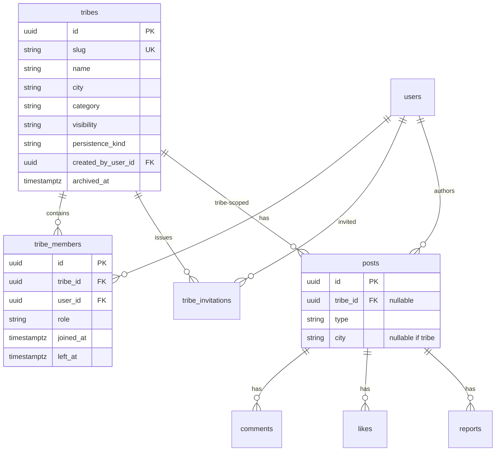

# Tribes — Technical Specification (MVP)

> **Ticket :** FEATURE-A / A.1  
> **Phase :** DESIGN (pas de BUILD dans ce ticket)  
> **Référence produit :** [`docs/prd/PRD-A0-tribes-philosophy-and-social-boundaries.md`](../prd/PRD-A0-tribes-philosophy-and-social-boundaries.md)  
> **Workflow :** `docs/workflow/YUNICITY-OFFICIAL-WORKFLOW.md` — gates BUILD : PRD §13 + `docs/bmad/BMAD.md`

| Champ | Valeur |
|-------|--------|
| **Statut** | **DESIGN_READY** — en attente validation CTO avant migrations |
| **Date** | 2026-05-20 |
| **Interdit A.1** | Migrations, ORM implémenté, routes FastAPI, frontend, WebSocket, realtime |

---

## 0. Objectif du document

Prouver qu’une architecture **tribus MVP** peut exister sans casser :

- le **feed principal** (mémoire ville-first),
- les **quartiers** (contexte éditorial, pas clans),
- la philosophie **calme** Yunicity (anti-Discord, anti-tribalisation).

Ce document fige : modèle de données conceptuel, permissions, règles feed, API REST conceptuelle, limites, modération, notifications minimales.

---

## Schéma relationnel (MVP)



**Règle d’or (feed) :** `posts.tribe_id IS NULL` ⟺ éligible au feed ville ; `posts.tribe_id IS NOT NULL` ⟺ **jamais** dans `GET /feed`.

---

# Section 1 — Modèle de données

## 1.1 Table `tribes`

| Colonne | Type | Contraintes | Notes |
|---------|------|-------------|-------|
| `id` | `UUID` | PK, default gen | |
| `slug` | `VARCHAR(64)` | NOT NULL | Unique par ville |
| `name` | `VARCHAR(120)` | NOT NULL | Affichage |
| `description` | `TEXT` | NOT NULL | Charte courte + intention |
| `city` | `VARCHAR(100)` | NOT NULL, index | Ancrage ville (ex. Reims) |
| `category` | `VARCHAR(32)` | NOT NULL | Enum §1.6 |
| `visibility` | `VARCHAR(24)` | NOT NULL | Enum §3 |
| `persistence_kind` | `VARCHAR(24)` | NOT NULL, default `persistent` | `persistent` \| `event_bound` \| `hybrid` |
| `cover_image_url` | `VARCHAR(500)` | NULL | Optionnel |
| `created_by_user_id` | `UUID` | FK → `users.id`, NOT NULL | Owner initial |
| `organization_id` | `UUID` | FK → `organizations.id`, NULL | Hôte asso (optionnel MVP) |
| `charter_version` | `SMALLINT` | NOT NULL, default 1 | Acceptation à l’adhésion |
| `member_limit` | `INTEGER` | NOT NULL, default 150 | Plafond §6 |
| `created_at` | `TIMESTAMPTZ` | NOT NULL | |
| `updated_at` | `TIMESTAMPTZ` | NOT NULL | |
| `archived_at` | `TIMESTAMPTZ` | NULL | Soft archive staff/owner |

**Interdit sur `tribes` (colonnes ou dérivés) :** score, XP, trending_rank, engagement_rate, member_count_public_leaderboard, `neighborhood_id` (pas de fusion tribu × quartier).

**Contraintes :**

- `UNIQUE (city, slug)`
- `CHECK (archived_at IS NULL OR visibility IN ('public', 'private_invite'))` — archive = lecture seule côté produit

## 1.2 Table `tribe_members`

| Colonne | Type | Contraintes | Notes |
|---------|------|-------------|-------|
| `id` | `UUID` | PK | |
| `tribe_id` | `UUID` | FK → `tribes.id` ON DELETE CASCADE | |
| `user_id` | `UUID` | FK → `users.id` ON DELETE CASCADE | |
| `role` | `VARCHAR(16)` | NOT NULL | `member` \| `moderator` \| `owner` |
| `joined_at` | `TIMESTAMPTZ` | NOT NULL | |
| `invited_by` | `UUID` | FK → `users.id`, NULL | Traçabilité |
| `left_at` | `TIMESTAMPTZ` | NULL | Sortie saine §12 |
| `charter_accepted_at` | `TIMESTAMPTZ` | NOT NULL | Adhésion |

**Contraintes :**

- `UNIQUE (tribe_id, user_id)` — une ligne historique ; réadhésion = nouvelle ligne **ou** réouverture `left_at` (DECIDE BUILD : **recommandation** — réutiliser ligne, reset `left_at` NULL + cooldown §6)
- Index partiel membre actif : `UNIQUE (tribe_id, user_id) WHERE left_at IS NULL` (PostgreSQL)
- Au plus **un** `owner` actif par tribu : contrainte applicative + trigger optionnel

**Pas de :** sous-groupes, channels, permissions JSON granulaires.

## 1.3 Table `tribe_invitations` (MVP recommandé)

| Colonne | Type | Notes |
|---------|------|-------|
| `id` | UUID PK | |
| `tribe_id` | UUID FK | |
| `token_hash` | VARCHAR(64) | Hash du token (jamais stocker le token brut) |
| `invited_by` | UUID FK users | |
| `invited_email` | VARCHAR(255) NULL | Optionnel si ciblé |
| `expires_at` | TIMESTAMPTZ | Default now + 7 jours |
| `accepted_at` | TIMESTAMPTZ NULL | |
| `accepted_by` | UUID FK users NULL | |
| `revoked_at` | TIMESTAMPTZ NULL | |

| Décision | Verdict |
|----------|---------|
| **MVP ou plus tard ?** | **MVP** pour `private_invite` ; `public` peut s’en passer |
| **Alternative MVP public** | Join direct + acceptation charte (pas de token) |

**Sécurité :** token opaque 32+ bytes, usage unique, rate-limit création.

## 1.4 Posts — réutilisation `posts` existante

### Décision critique (figée)

| Type de contenu | `tribe_id` | `city` | Visible `GET /feed` | Visible `GET /tribes/{slug}/posts` |
|-----------------|------------|--------|---------------------|-------------------------------------|
| Post citoyen ville | `NULL` | Reims… | **Oui** | Non |
| Post offre (sync) | `NULL` | oui | **Oui** | Non |
| Post événement (sync) | `NULL` | oui | **Oui** | Non |
| **Post tribu** | **NOT NULL** | `NULL` ou copie ville | **Non** | **Oui** (membres actifs) |
| Partage fil (futur) | `NULL` | oui | Oui (opt-in explicite) | N/A |

**Invariant :** un post **ne peut pas** être simultanément feed global et tribu.

```sql
-- Contrainte CHECK conceptuelle (BUILD)
CHECK (
  tribe_id IS NULL
  OR (
    partner_offer_id IS NULL
    AND local_event_id IS NULL
    AND type = 'post'
  )
)
```

**Colonne ajoutée :**

| Colonne | Type | Notes |
|---------|------|-------|
| `tribe_id` | `UUID` FK → `tribes.id` ON DELETE SET NULL | NULL = feed ville |

**`share_to_city_feed` (futur A.5+, hors MVP) :** colonne booléenne ou table `tribe_post_shares` — **pas en MVP** pour éviter repost automatique (PRD-A0 §6).

### Comments & likes

- Réutiliser `comments` / `likes` liés au `post.id` — **même modèle**.
- Règles d’accès : commenter / liker un post tribu ⇒ membre actif de la tribu (service layer).

## 1.5 Indexes & pagination (MVP)

| Index | Colonnes | Usage |
|-------|----------|-------|
| `ix_tribes_city_visibility` | `(city, visibility)` WHERE `archived_at IS NULL` | Liste publique curated |
| `ix_tribes_city_slug` | UNIQUE `(city, slug)` | Résolution slug |
| `ix_tribe_members_user_active` | `(user_id)` WHERE `left_at IS NULL` | Plafond tribus / user |
| `ix_tribe_members_tribe_active` | `(tribe_id)` WHERE `left_at IS NULL` | Liste membres, count |
| `ix_posts_tribe_created` | `(tribe_id, created_at DESC)` WHERE `is_active` AND `tribe_id IS NOT NULL` | Fil tribu paginé |
| `ix_posts_feed_city` | Existant + filtre **`tribe_id IS NULL`** | Feed ville protégé |

**Pagination :**

- Feed ville : curseur existant (inchangé) + **`WHERE tribe_id IS NULL`** obligatoire.
- Fil tribu : curseur `created_at` + `id`, `limit` ≤ 30, pas de scroll infini agressif côté UX.

**Performances MVP :** volumes pilote < 5 tribus × 150 membres — pas de shard ; `EXPLAIN` sur `list_feed` post-migration.

## 1.6 Enums conceptuels

```text
TribeCategory:
  sport_local | photography | volunteering | cafe_culture
  | students | music | association | other

TribeVisibility:
  public | private_invite

TribePersistenceKind:
  persistent | event_bound | hybrid

TribeMemberRole:
  member | moderator | owner
```

`other` soumis validation staff en pilote.

---

# Section 2 — Rôles & permissions

Matrice **MVP** (pas de RBAC granulaire par permission) :

| Action | member | moderator | owner | staff |
|--------|:------:|:---------:|:-----:|:-----:|
| Lire fil tribu | ✓ | ✓ | ✓ | ✓ |
| Publier post tribu | ✓ | ✓ | ✓ | ✓ |
| Commenter / liker | ✓ | ✓ | ✓ | ✓ |
| Signaler post/comment | ✓ | ✓ | ✓ | ✓ |
| Supprimer post/comment (tribu) | — | ✓ | ✓ | ✓ |
| Exclure membre (`left_at` forcé) | — | ✓ | ✓ | ✓ |
| Nommer / retirer moderator | — | — | ✓ | ✓ |
| PATCH tribu (meta) | — | — | ✓ | ✓ |
| Transférer ownership | — | — | ✓ | ✓ |
| Archiver tribu | — | — | ✓ | ✓ |
| Suspendre tribu | — | — | — | ✓ |
| Créer tribu (pilote) | — | — | — | ✓ (ou flag créateur) |

**Implémentation BUILD :** service `TribeAuthorizationService` — pas de logique dans les routes.

**Interdit :** permissions par canal, rôles custom, délégation en cascade > 2 niveaux.

---

# Section 3 — Visibilité

## 3.1 Modes MVP

| Mode | Liste publique | Mur / posts | Adhésion |
|------|----------------|-------------|----------|
| **`public`** | Oui (curated + `visibility=public`) | Membres actifs uniquement | Libre après acceptation charte |
| **`private_invite`** | **Non** | Membres actifs uniquement | Token invitation ou approbation owner |

## 3.2 Pas de mode « secret » en MVP

| Raison | Détail |
|--------|--------|
| **Modération** | Groupes invisibles = signalements tardifs |
| **Clans** | Espaces cachés favorisent dynamiques « nous vs eux » |
| **Confiance produit** | Yunicity = transparence calme, pas dark social |

## 3.3 Mur réservé aux membres (même en public)

- `GET /tribes/{slug}` : métadonnées publiques (nom, description, category, member_count_approx).
- `GET /tribes/{slug}/posts` : **403** si non membre actif.
- Pas de preview du contenu tribu aux non-membres.

---

# Section 4 — Structure sociale MVP

| Paramètre | Valeur recommandée | Justification |
|-----------|-------------------|---------------|
| Taille cible | 12–80 membres actifs | Coordination humaine |
| Plafond technique | **150** (`member_limit`) | Anti-masse, modération |
| Tribus actives / user | **5** max | Anti-fatigue |
| Owners / tribu | **1** | Clarté responsabilité |
| Moderators / tribu | **max 3** | Suffisant sans chaos |
| Sous-groupes | **0** | Anti-Discord |
| Channels | **0** | Un seul fil chronologique |

**Ownership :** `created_by_user_id` = owner initial ; transfert via `PATCH` owner-only.

**Organisation hôte :** `organization_id` optionnel — owner reste un **user** (membre de l’org), pas l’org elle-même comme compte posteur par défaut.

---

# Section 5 — Endpoints API conceptuels

Préfixe : `/api/v1` — auth JWT citoyen sauf admin.

## 5.1 Tribes

| Méthode | Path | Auth | Description |
|---------|------|------|-------------|
| `GET` | `/tribes` | User | Liste **curated** `public`, `city` = profil, non archivées |
| `GET` | `/tribes/{slug}` | User | Fiche tribu ; `city` query obligatoire |
| `POST` | `/tribes` | Staff / créateur flag | Création pilote — pas open-day citoyen |
| `PATCH` | `/tribes/{slug}` | Owner (+ staff) | Meta, archive request |

## 5.2 Membership

| Méthode | Path | Description |
|---------|------|-------------|
| `POST` | `/tribes/{slug}/join` | Public : join + charte ; private : 403 sans invite |
| `POST` | `/tribes/{slug}/leave` | Sortie silencieuse §12 |
| `GET` | `/tribes/{slug}/members` | Liste paginée (membres actifs) |
| `PATCH` | `/tribes/{slug}/members/{user_id}` | Owner : role → moderator ; pas promote owner via API citoyen |
| `DELETE` | `/tribes/{slug}/members/{user_id}` | Mod/owner : exclusion |

## 5.3 Invitations (MVP si private)

| Méthode | Path | Description |
|---------|------|-------------|
| `POST` | `/tribes/{slug}/invitations` | Owner/mod : créer lien |
| `POST` | `/tribes/invitations/accept` | Body `{ token }` — join |

## 5.4 Posts tribu

| Méthode | Path | Description |
|---------|------|-------------|
| `GET` | `/tribes/{slug}/posts` | Fil tribu paginé — membres only |
| `POST` | `/tribes/{slug}/posts` | Créer post `tribe_id` set, type `post` |
| `DELETE` | `/tribes/{slug}/posts/{post_id}` | Auteur, mod, owner |

Réutiliser endpoints existants **sous préfixe tribu** ou IDs globaux avec garde membre :

- `POST /tribes/{slug}/posts/{id}/comments` → proxy vers logique comment existante
- `POST /tribes/{slug}/posts/{id}/like` → idem
- `POST /tribes/{slug}/posts/{id}/report` → idem `ReportReason`

## 5.5 Admin

| Méthode | Path | Auth |
|---------|------|------|
| `GET` | `/admin/tribes` | Staff |
| `PATCH` | `/admin/tribes/{id}` | Staff suspend / archive |
| `GET` | `/admin/tribes/reports` | Staff queue signalements tribu |

**Interdit MVP :** WebSocket, SSE live, `wss://`, typing indicators.

## 5.6 Schéma flux (adhésion publique)

```text
Client                    API                      DB
  |-- POST /join -------->|-- verify charter ----->| tribe_members INSERT
  |<-- 201 member --------|                        | left_at NULL
  |-- GET /posts -------->|-- assert member ------>| WHERE tribe_id
```

---

# Section 6 — Limites MVP

| Limite | Valeur | Enforcement |
|--------|--------|-------------|
| Membres / tribu | 150 | Refus join 409 |
| Tribus actives / user | 5 | Refus join 409 |
| Posts tribu / user / jour / tribu | 10 | Rate-limit Redis ou DB |
| Invitations / jour / tribu | 20 | Anti-spam |
| Cooldown rejoin après leave | **7 jours** | Même tribu |
| Longueur body post tribu | 5000 | Réutiliser `POST_BODY_MAX_LENGTH` |
| Pagination max | 30 | Query param cap |

**Archivage :** `archived_at` set → lecture seule, pas de nouveaux posts ; leave autorisé.

**Futur :** auto-archive `event_bound` +90j inactivité — **non MVP**.

---

# Section 7 — Modération

## 7.1 Réutilisation système existant

| Composant existant | Usage tribu |
|--------------------|-------------|
| `reports` + `ReportReason` | Signalement post/comment tribu — champ `context=tribe` ou déduction via `post.tribe_id` |
| Staff admin | Queue unifiée + filtre tribu |
| Blocage utilisateur global | Prioritaire sur conflit tribu |

## 7.2 Actions

| Action | Acteur | Effet |
|--------|--------|-------|
| Masquer / supprimer post | mod, owner, staff | `is_active=false` |
| Exclure membre | mod, owner, staff | `left_at=now`, motif interne optionnel |
| Révoquer mod | owner | role → member |
| Archiver tribu | owner, staff | `archived_at` |
| Suspendre tribu | staff | archive + blocage join |

## 7.3 Risque modération

**Élevé** — tribus = espace semi-privé. Pilote : modération humaine renforcée, SLA signalement grave < 24 h recette.

**Logs audit :** exclusions, suppressions, changements rôle — table `tribe_audit_log` **recommandée BUILD** (hors scope A.1 minimal, P1).

---

# Section 8 — Feed rules (section critique)

## 8.1 Invariants techniques

1. **`FeedService.list_feed`** : `WHERE posts.tribe_id IS NULL AND posts.is_active`.
2. **Aucun trigger** ne copie un post tribu vers le feed.
3. **Offers / events** : posts sync gardent `tribe_id IS NULL` — visibilité ville.
4. **Tests d’intégration obligatoires** : post tribu créé → absent de `GET /feed`.

## 8.2 Produits interdits

| Interdit | Raison |
|----------|--------|
| Repost automatique tribu → feed | Pollution |
| Propagation virale | Anti-FOMO |
| Badge « trending tribu » sur feed | Anti-tribalisation |
| Filtre feed par tribu | Fragmentation |

## 8.3 Relation quartiers

- `posts.neighborhood_id` reste **contexte éditorial ville** sur posts **feed**.
- Posts tribu : `neighborhood_id` **NULL** (recommandé) — pas de « tribu du quartier X ».

## 8.4 Mantra technique

```text
Feed ville  = SELECT ... WHERE tribe_id IS NULL
Fil tribu   = SELECT ... WHERE tribe_id = :id
Jamais les deux pour un même post_id
```

---

# Section 9 — Notifications (MVP minimal)

| Type | Déclencheur | Défaut |
|------|-------------|--------|
| `tribe_invitation` | Invitation créée | On (si email/push opt-in global) |
| `tribe_join_accepted` | Join réussi (invité) | On pour invitant |
| `tribe_new_post` | Nouveau post tribu | **Off** |

**Préférences utilisateur :** étendre `UserNotificationPreferences` — `tribe_posts_enabled: false` par défaut.

**Interdit :** @everyone, mass ping, streak, « X personnes ont posté », leaderboard tribu.

**Volume plafond :** max **5** notifications tribu / user / jour (Redis counter).

---

# Section 10 — Discovery

## 10.1 Autorisé (MVP)

- Liste **éditoriale** : `GET /tribes` retourne tribus `featured=true` (colonne optionnelle) ou liste blanche staff.
- Filtre `category` + `city`.
- Copy calme : pas de compteurs « hot ».

## 10.2 Interdit explicitement

| Interdit | |
|----------|--|
| `trending` query param | |
| Ranking par engagement | |
| Suggestions « people like you » | |
| Recommandation ML agressive | |
| Compteur messages non lus global tribu | |

---

# Section 11 — Persistance sociale

| `persistence_kind` | Comportement technique |
|--------------------|------------------------|
| `persistent` | `archived_at` NULL jusqu’action owner/staff |
| `event_bound` | Lié `local_event_id` optionnel sur `tribes` (FK futur) — auto-archive post-event + délai |
| `hybrid` | Transition manuelle staff après vote owner |

**Risques permanentes :** fatigue, cliquisme, modération continue — mitigations §6 limites, §12 leave facile.

**MVP pilote :** 2–3 `persistent`, 1–2 `event_bound`.

---

# Section 12 — Sortie saine

## 12.1 `POST /tribes/{slug}/leave`

| Règle | Détail |
|-------|--------|
| Pas de notification groupe | Aucun event « X a quitté » |
| Pas de modal guilt | Copy neutre |
| Effet immédiat | `left_at = now()` |
| Owner leave | Interdit si seul owner — transfert ou archive d’abord |
| Réadhésion | Autorisée après cooldown §6 — nouvelle acceptation charte |

## 12.2 Données post-sortie

| Donnée | Comportement recommandé |
|--------|-------------------------|
| Posts publiés | Restent ; auteur affiché (pas de purge) |
| Comments / likes | Inchangés |
| Notifications tribu | Coupées immédiatement |
| Membership row | Conservée avec `left_at` pour cooldown & audit |

---

# Section 13 — Évolutions futures (NON MVP)

| Feature | Ticket futur indicatif |
|---------|------------------------|
| Lien événement ↔ tribu (`tribes.local_event_id`) | A.5 |
| Partage opt-in post tribu → feed | A.5 + review produit |
| Sondages légers | A.7+ |
| Images dans commentaires | A.7+ |
| Modération déléguée avancée | A.4+ |
| Création tribu citoyenne ouverte | DECIDE post-pilote |
| Auto-archive inactivité | A.8+ |

**Aucune implémentation** tant que MVP pilote non validé en MEASURE.

---

# Section 14 — Exclusions strictes (rappel BUILD)

| # | Exclusion |
|---|-----------|
| 1 | Realtime / WebSocket |
| 2 | Vocaux / audio rooms |
| 3 | Channels / sous-groupes |
| 4 | Threads infinis forum |
| 5 | Rôles complexes type Discord |
| 6 | Leaderboard / score tribu |
| 7 | XP communautaire |
| 8 | Feed tribu autonome infini (algo addictif) |
| 9 | Trending tribes |
| 10 | Gamification sociale |
| 11 | Fusion `tribe_id` + `neighborhood_id` sur même post |
| 12 | Repost automatique feed global |
| 13 | Mode secret non listé |
| 14 | `@everyone` notifications |

Gate BUILD : toute PR violant cette table → **refus**.

---

# Section 15 — Validation CTO

## 15.1 Checklist pré-BUILD

- [ ] PRD-A0 validé (fait)
- [ ] Spec A.1 relue par modération + backend lead
- [ ] Contrainte `tribe_id` / feed documentée + plan tests
- [ ] Pas de WebSocket dans scope ticket BUILD
- [ ] Plan pilote 3–5 tribus Reims
- [ ] Rollback : flag feature `TRIBES_ENABLED` + archive tribu

## 15.2 Risques sociaux (suivi MEASURE)

| Risque | Indicateur |
|--------|------------|
| Fragmentation | % sessions sans visite feed |
| Harcèlement | Reports / 1k posts tribu |
| Fatigue | Leave rate, tribus actives/user |
| Modération sous-capacité | SLA signalements |

## 15.3 Verdict

| Statut | Action |
|--------|--------|
| **DESIGN_READY** | Validation CTO explicite requise |
| **BUILD bloqué** | Sans signature §15 + gates PRD §13 ticket A.2+ |

---

## Annexe A — Tickets BUILD suggérés

| Ticket | Scope |
|--------|-------|
| **A.2** | Migrations `tribes`, `tribe_members`, `tribe_invitations`, `posts.tribe_id` + CHECK |
| **A.3** | Services + API §5 + tests feed isolation |
| **A.4** | Modération admin + signalements |
| **A.5** | Notifications + préférences |
| **A.6** | UX web/mobile (fil tribu unique) |
| **A.7** | Seed pilote Reims + MEASURE |

---

## Annexe B — Alignement PRD-A0

| PRD-A0 | Spec A.1 |
|--------|----------|
| Feed = cœur | §8 `tribe_id IS NULL` |
| Quartiers ≠ tribus | Pas de `neighborhood_id` sur tribu |
| Pas Discord | §4 un fil, §14 |
| Sortie saine | §12 |
| KPIs humains | §15.2, pas métriques en DB |

---

*Document canon FEATURE-A A.1 — DESIGN uniquement. Prochaine étape : validation CTO → ticket A.2 BUILD.*
