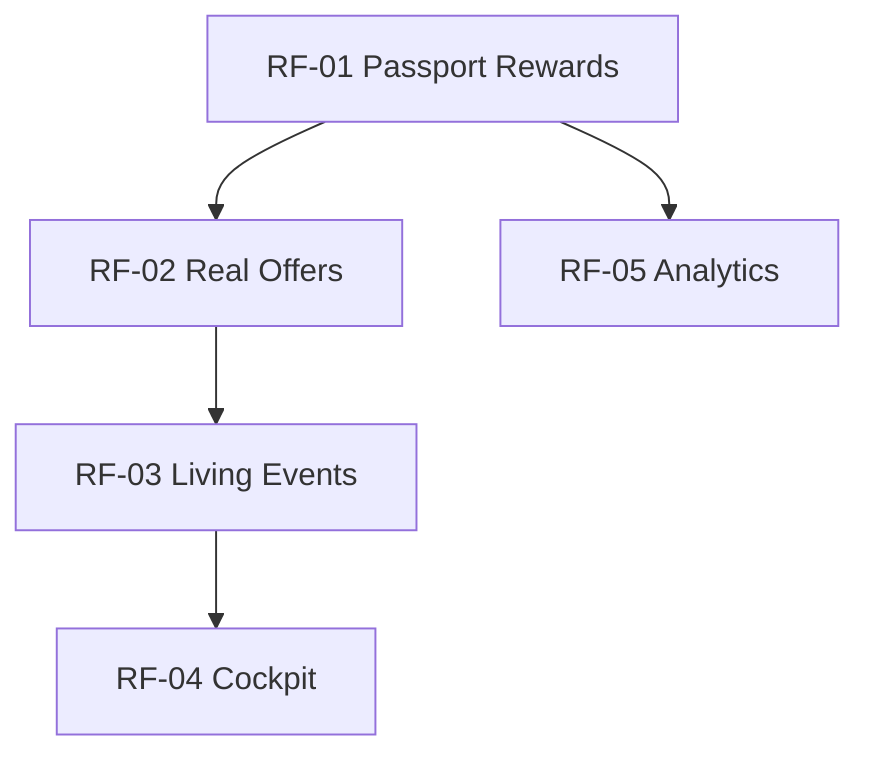
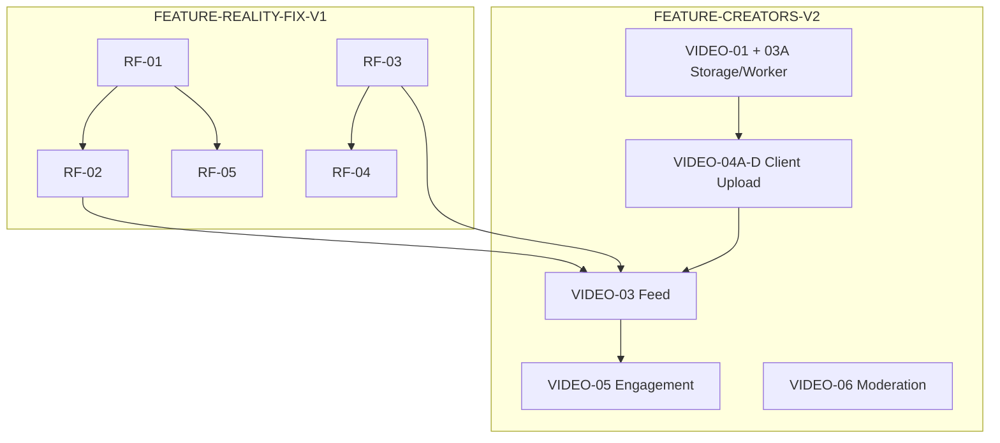

# FEATURE-ROADMAP-POST-RC — Exécution post Reality Check

> **Source de vérité exécution** après clôture des Reality Checks (FEATURE-REALITY-CHECK-V1).  
> Workflow : `docs/workflow/YUNICITY-OFFICIAL-WORKFLOW.md` — BMAD : `docs/bmad/BMAD.md`

---

## 0. Métadonnées

| Champ | Valeur |
|-------|--------|
| **ID** | FEATURE-ROADMAP-POST-RC |
| **Statut** | **APPROVED** — GO documentation |
| **Date** | 2026-06-16 |
| **Auteur** | Founder + CTO (synthèse RC + audit code) |
| **Environnement cible** | dev → recette → preprod → prod (Reims pilote) |
| **Prérequis** | RC-01 à RC-06 livrés (lecture seule) |

### Features couvertes

| Feature | ID | Phase |
|---------|-----|-------|
| Correctifs 20/80 post-RC | `FEATURE-REALITY-FIX-V1` | BUILD |
| Local Video territorial | `FEATURE-CREATORS-V2` | BUILD (compléter + activer) |

### Documents liés

| Doc | Rôle |
|-----|------|
| `docs/prd/PRD-CREATORS-V2-local-video.md` | Spec Local Video |
| `docs/architecture/ADR-CREATORS-V2-local-video-media.md` | Pipeline R2 / FFmpeg |
| `docs/creators/DESIGN-CREATORS-V2-local-video.md` | UX différenciation vs TikTok |
| `docs/product/passport-levels.md` | Seuils Silver / Gold |
| `docs/prd/PRD-301-passport-benefits-foundation.md` | Fondation Passport |

---

## 1. Résumé exécutif

### Diagnostic post-Reality Check

Yunicity est une **plateforme territoriale crédible mais sous-alimentée** — pas une coquille vide.

| Pilier | Note RC | Diagnostic |
|--------|---------|------------|
| Partenaires (RC-01) | 6,5 | Réseau pilote OK, offres placeholder |
| Carte / territoire (RC-02) | 5,8 | Patrimoine solide, territoire calme (0 event carte) |
| Cockpit admin (RC-03) | 5,9 | Ops OK, pilotage territorial faible |
| Analytics admin (RC-04) | 5,4 | Données réelles, UI trompeuse (stocks vs flux) |
| Passport Ops (RC-05) | 5,9 | Stack 8,5/10, terrain ~3/10 (YM jamais dépensé) |
| Staff & ops (RC-06) | 6,9 | Admin mature, scale citoyens limité |
| **Moyenne** | **~6,1** | Techniquement fonctionnel, pas encore « ville vivante » |

### Thèse produit

> Les 20 % de problèmes qui expliquent 80 % des notes RC ne demandent **pas** une refonte applicative.  
> Ils demandent du **carburant terrain** (offres, events, économie YM) puis le **WOW** (Local Video).

### Feuille de route validée

```
FEATURE-REALITY-FIX-V1          (2–3 semaines)
    RF-01 Passport Rewards
    RF-02 Real Partner Offers
    RF-03 Living Events
    RF-04 Cockpit Reality
    RF-05 Analytics Reality
            ↓
FEATURE-CREATORS-V2             (4–6 semaines)
    VIDEO-01 Storage + VIDEO-03A Worker  ✅ merged
    VIDEO-04A–D Client Upload & Processing UX  (remplace VIDEO-02)
    VIDEO-03 Feed
    VIDEO-05 Engagement  (ex VIDEO-04)
    VIDEO-06 Moderation  (ex VIDEO-05)
```

### Scores cibles

| Phase | Moyenne RC cible | Condition |
|-------|------------------|-----------|
| Aujourd'hui | 6,1 | État constaté |
| Après REALITY-FIX | **7,7+** | Carburant terrain + pilotage honnête |
| Après CREATORS-V2 pilote | **8,5–9,0** | WOW + conversion locale |

---

## 2. Principe directeur — WOW sans substrat = échec

Un fil vertical sans conversion locale expose les failles RC :

| Vidéo citoyenne | Sans REALITY-FIX | Effet |
|-----------------|------------------|-------|
| « Nouveau burger à Reims » | Offre placeholder | Déception |
| « Concert ce week-end » | 0 event sur carte | Mensonge produit |
| Tampon + récompense | YM inutilisable | Gamification morte |

**Règle CTO :** ne pas ouvrir CREATORS-V2 en prod publique avant **RF-02 + RF-03** minimum.

---

## 3. FEATURE-REALITY-FIX-V1

### Objectif

Corriger les 20 % qui expliquent 80 % des notes RC — **sans refaire l'application**.

### Vue d'ensemble

| Ticket | Issue RC | Livrable | Impact score |
|--------|----------|----------|--------------|
| **RF-01** | Passport = moteur sans carburant | Récompenses réelles, `spend()` YM, catalogue, tiers utiles | RC-05 : 5,9 → 7,5+ |
| **RF-02** | Partenaires sans valeur réelle | Vraies offres, avantages lisibles, workflow validation | RC-01 : 6,5 → 8+ |
| **RF-03** | Territoire trop calme | Events à venir visibles, alertes agenda, indicateurs | RC-02 : 5,8 → 7+ |
| **RF-04** | Cockpit administre, ne pilote pas | Vitalité territoire, alertes réelles | RC-03 : 5,9 → 8 |
| **RF-05** | Analytics mesure la base, pas la ville | Activité territoire homogène (flux période) | RC-04 : 5,4 → 7,5+ |

---

### RF-01 — Passport Rewards (P0 absolu)

**Diagnostic :** `YuniWalletService.earn()` branché ; **`spend()` jamais appelé** en `backend/app/`. `REWARD_REDEMPTION` défini mais sans catalogue.

**Approche minimale (ne pas implémenter PASSPORT-V2-B3 `partner_rewards` complet) :**

| # | Livrable | Détail |
|---|----------|--------|
| 1 | Migration | `partner_offers.ym_cost INTEGER DEFAULT 0` (ou table légère `passport_rewards` si séparation offre scan / récompense YM) |
| 2 | Service | `PassportRewardRedemptionService` — liste, `spend()` idempotent, code redemption |
| 3 | API citoyen | `GET /passport/rewards` + `POST /passport/rewards/{id}/redeem` |
| 4 | Scan partenaire | Validation redemption YM (réutiliser `ScanRedemptionService`) |
| 5 | Seed | 4–6 récompenses réelles chez pilotes (ex. café 5 YM, dessert 8 YM) |
| 6 | Tiers | 2 offres `tier_code_required=silver`, 1 `gold` (lien RF-02) |
| 7 | Hook | Progression défi `sorties_remoises` ou `EVENT_ATTENDED` réputation |

**Sous-tickets :**

| ID | Scope | Jours est. |
|----|-------|------------|
| RF-01A | Migration + `spend` service + tests | 2 |
| RF-01B | API rewards + scan validation | 1,5 |
| RF-01C | UI web/mobile catalogue YM | 1,5 |

**Critères d'acceptation :**

- [ ] ≥ 1 transaction `SPEND` en recette
- [ ] Citoyen voit solde + catalogue + coût YM
- [ ] Silver débloque ≥ 1 avantage inaccessible en Basic
- [ ] `lifetime_spent > 0` mesurable (RF-05)

**Fichiers clés :** `yuni_wallet_service.py`, `scan_redemption_service.py`, `reims_partner_offers.py`, `passport_me_service.py`

---

### RF-02 — Offres partenaires réelles

**Diagnostic :** seed `reims_partner_offers.py` — 4 offres identiques (« Présentez votre Passport… »). Workflow admin **complet** (approve/reject/archive + audit).

**Livrable :**

| Partenaire | Offre exemple | Tier |
|------------|---------------|------|
| Belga Queen | Première bière artisanale −15 % | basic |
| Pittaya | Entrée offerte | basic |
| Centre des Ressources | Accès atelier découverte | silver |
| Garçon Barbiers | Coupe + soin | gold |

**Sous-tickets :**

| ID | Scope | Jours est. |
|----|-------|------------|
| RF-02A | Réécriture seed + `tier_code_required` | 0,5 |
| RF-02B | Validation terrain partenaires + deploy prod | 1 (ops) |

**Critères d'acceptation :**

- [ ] Bénéfice lisible en 5 secondes (mobile + carte)
- [ ] ≥ 1 offre Silver-only, ≥ 1 Gold-only
- [ ] 0 copy générique placeholder

---

### RF-03 — Agenda vivant

**Diagnostic :** seed `reims_partner_events.py` existe ; **0 event carte en prod** (RC-02). Admin events prêt.

**Livrable :**

| # | Action |
|---|--------|
| 1 | 5–10 événements réels (EVENTS-PILOT-01A) — dates futures, lieux réels |
| 2 | Tous `APPROVED` + `starts_at` futur + sync feed/map |
| 3 | Alerte admin si `events_upcoming < 3` (cockpit + activity) |

**Sous-tickets :**

| ID | Scope | Jours est. |
|----|-------|------------|
| RF-03A | Contenu events pilote + seed/deploy | 1 (ops) |
| RF-03B | Alertes agenda `< 3` | 0,5 |

**Critères d'acceptation :**

- [ ] `GET /map/events` ≥ 5 events à venir Reims
- [ ] Cockpit `events_upcoming ≥ 3`
- [ ] Alerte visible si agenda retombe sous seuil

---

### RF-04 — Cockpit vérité territoire

**Diagnostic :** `buildCockpitYunicitySignal()` — `pendingTotal === 0` → « Territoire serein » même si agenda mort.

**Livrable :**

| # | Changement |
|---|------------|
| 1 | `cockpitTerritoryVitality(signals, partners)` — events, offres, activité 7j |
| 2 | Signal `serene` uniquement si files modération vides **ET** vitalité OK |
| 3 | Alerte Activity A10 « Agenda faible » (`events_upcoming < 3`) |
| 4 | Territory Pulse enrichi (tampons 7j, top event) |

**Sous-tickets :**

| ID | Scope | Jours est. |
|----|-------|------------|
| RF-04A | Signal cockpit vitalité | 1 |
| RF-04B | Alertes Activity + tests unitaires | 0,5 |

**Fichiers clés :** `frontend/packages/utils/src/admin-cockpit.ts`, `admin_activity_service.py`, `cockpit-territory-pulse.tsx`

**Critères d'acceptation :**

- [ ] Agenda vide → plus jamais « Territoire serein » seul
- [ ] CEO voit en 10 s : events à venir, tampons 7j, offres publiées

---

### RF-05 — Analytics vérité terrain

**Diagnostic :** `buildModuleActivityBars()` mélange flux période (passport) et stocks totaux (offres, events).

**Livrable backend (`AdminAnalyticsSummary`) :**

- `events.upcoming_published`
- `events.approved_in_period`
- `passport.ym_earned_in_period` / `ym_spent_in_period` (post RF-01)
- `partners.redemptions_in_period`
- `creators.published_in_period`

**Livrable UI :**

- Panneau « Activité territoire » (4 KPI + barres homogènes)
- Correction `buildModuleActivityBars` — tout en `in_period`
- Courbe 7 points réelle (stamps + redemptions + events) — pas de placeholder fictif

**Sous-tickets :**

| ID | Scope | Jours est. |
|----|-------|------------|
| RF-05A | API analytics territoire | 1 |
| RF-05B | UI panneau + fix barres + courbe 7j | 1,5 |

**Critères d'acceptation :**

- [ ] Barres comparables (même unité : activité période)
- [ ] Ratio territoire / plateforme lisible sans interprétation

---

### REALITY-FIX — Matrice dépendances internes



| Dépendance | Raison |
|------------|--------|
| RF-01 avant RF-05 | `ym_spent_in_period` inexistant sans spend |
| RF-02 après RF-01 | Tiers Silver/Gold sur offres + récompenses YM cohérentes |
| RF-03 avant RF-04 | Alertes agenda nécessitent contenu ou seuil |
| RF-02 + RF-03 parallèle | Peu de code, surtout ops contenu |

**Effort total REALITY-FIX :** ~8–12 jours dev + ~2 jours ops contenu.

---

## 4. FEATURE-CREATORS-V2 — Local Video

### Positionnement (validé Founder)

> **Pas un TikTok bis.** Un fil qui rapproche de sa ville — chaque swipe ouvre une action locale.

**Question gate DESIGN** (`DESIGN-CREATORS-V2`) : un Rémois comprend-il immédiatement pourquoi c'est différent de TikTok ?  
**Réponse visée :** bandeau territorial + CTA « Y aller » dès la première frame.

### Hiérarchie feed territoriale (à implémenter VIDEO-03)

```
Quartier     → vidéos du quartier préféré / géoloc (~2 km)
    ↓
Ville        → Reims, récence + proximité
    ↓
Territoire   → culture, events liés, partenaires vérifiés
```

**Règle :** l'utilisateur comprend *pourquoi* il voit cette vidéo — pas d'algorithme mondial opaque.

### Durées vidéo (spec Founder — à aligner PRD + code)

| Profil | Durée max |
|--------|-----------|
| Pilote citoyen | **90 s** |
| Créateur vérifié | **3 min** |
| Plafond absolu | **5 min** (jamais plus) |

> **Aligné (VIDEO-04B.1) :** `LOCAL_VIDEO_MAX_DURATION_SECONDS = 90` dans `local_video_constants.py`.
> **Action VIDEO-04D :** règle par tier créateur (`pilot` / `verified` / `staff`) — au-delà du pilote C2 fixe 90 s.

### Scope validé

| Brique | Inclus MVP |
|--------|------------|
| Upload vidéo | MP4/MOV, presigned PUT |
| Stockage | Cloudflare R2 (+ filesystem dev) |
| Thumbnails | FFmpeg frame @ 1s |
| Player | Vertical web mobile-first |
| Feed | Swipe, autoplay, pagination cursor |
| Engagement | Likes, commentaires, partages |
| Modération | Signalements + admin (seuil ≥ 3) |

### État code au 2026-06-29 (VIDEO-DOCS-SYNC-01)

| Brique | État | Note |
|--------|------|------|
| Modèles + migrations | ✅ | `local_videos`, social |
| Upload-init + publish API | ✅ | presigned + **HTTP 202** async |
| Worker ARQ + Redis | ✅ | PR #72 VIDEO-03A |
| Worker Railway recette | ✅ | PR #73 INFRA-03, smoke EXIT 0 |
| R2 + CDN recette | ✅ | `yunicity-media-recette` |
| FFmpeg transcode + thumb | ✅ | worker container |
| API feed / like / comment / report | ✅ | |
| Web `/videos` feed vertical | ✅ | consommation |
| **Client upload web** | ❌ | VIDEO-04A–D |
| Teasers quartier web | ✅ | `list_published_for_neighborhood` |
| Ranking territorial | ❌ | chrono ville only (VIDEO-03) |
| Mobile Expo feed | ❌ | |
| Admin module vidéos | ❌ | reports génériques seulement |
| Durées 90s/3min/5min | ❌ | 60s hardcodé (VIDEO-04D) |

**Conclusion :** backend + infra **merged** ; prochaine vague = **VIDEO-04A–D** (client) + VIDEO-03 feed ranking.

---

### VIDEO-01 — Storage + VIDEO-03A Worker (P0) — ✅ merged

| Livrable | Détail | Statut |
|----------|--------|--------|
| R2 recette/prod | Bucket `yunicity-media-{env}`, variables env | ✅ recette |
| CDN | `media.{env}.yunicity.city` | ✅ recette |
| Publish async | HTTP 202 + ARQ worker | ✅ PR #72 |
| Worker Railway | Service `video-worker` | ✅ PR #73 |
| CI / smoke | `pilot_m00_seed_videos.py --smoke` | ✅ recette |

**Références :** `docs/architecture/MEDIA-PLATFORM.md`, `docs/adr/ADR-VIDEO-03A-async-media-processing-worker.md`, `docs/api/LOCAL-VIDEO-API.md`

---

### VIDEO-04A–D — Client Upload & Processing UX (P0) — remplace VIDEO-02

> **VIDEO-02** (upload backend) est **obsolète** comme ticket roadmap — API upload + worker livrés en VIDEO-01/03A. Ce bloc couvre le **client** (types, page upload, polling, durcissement).

| Ticket | Livrable |
|--------|----------|
| **VIDEO-04A** | Types TS + client API (`LocalVideoPublishAcceptedResponse`, `processing_status`, publish 202) |
| **VIDEO-04B** | Page web `/videos/new` — upload presigned + formulaire métadonnées |
| **VIDEO-04C** | UX processing — polling `GET /local-videos/{id}`, états loading/failed |
| **VIDEO-04D** | Durcissement — durées tier 90s/3min/5min, quotas, validation client |

**Critères d'acceptation :**

- [ ] Citoyen pilote publie depuis web recette (presigned R2 direct)
- [ ] UI affiche « Préparation… » jusqu'à `published`
- [ ] Rejet explicite si dépassement tier (VIDEO-04D)

**Audit :** VIDEO-04-AUDIT-01 — upload web absent, mobile absent.

### VIDEO-03 — Feed (P0)

| Livrable | Détail |
|----------|--------|
| Ranking territorial | Quartier → Ville → Territoire |
| Mobile Expo | Feed vertical natif |
| Intégration | Teasers carte, pages quartier, events RF-03 |
| Explicabilité | Label « Parce que tu es à {quartier} » |

**Exemples contenu cible :**

| Exemple | `LocalVideoType` | Lien FK |
|---------|------------------|---------|
| 🍔 Nouveau burger | `bon_plan` | `organization_id` |
| 🎵 Concert ce WE | `moment` | `local_event_id` |
| 🏀 Tournoi étudiant | `tribu` | `tribe_id` |
| 🎭 Festival local | `lieu` | `cultural_place_id` |
| 🏛 Histoire monument | `quartier` | `neighborhood_id` |

**Critères d'acceptation :**

- [ ] Feed quartier prioritaire si géoloc / quartier préféré
- [ ] CTA « Y aller » fonctionnel vers event/lieu réel (RF-03)

---

### VIDEO-05 — Engagement (P1) *(ex VIDEO-04 roadmap v1)*

| Livrable | Détail |
|----------|--------|
| Likes / commentaires | Web ✅ — parité mobile |
| Partage | Deep link `/videos/{id}` |
| Notifications | Best-effort likes (post-MVP acceptable) |
| Passport | Lien tampon / offre sur vidéo partenaire |

**Critères d'acceptation :**

- [ ] Like idempotent mobile + web
- [ ] Partage ouvre vidéo dans contexte territorial

---

### VIDEO-06 — Moderation (P0 — zone rouge) *(ex VIDEO-05 roadmap v1)*

| Livrable | Détail |
|----------|--------|
| Admin workspace | Liste vidéos, masquer, supprimer, audit |
| Seuil signalements | Priorité review à ≥ 3 (`LOCAL_VIDEO_REPORT_REVIEW_PRIORITY_THRESHOLD`) |
| Cockpit | Alerte vidéos signalées |
| RC-06 lien | Pas de bulk — modération unitaire acceptable pilote |

**Critères d'acceptation :**

- [ ] Staff masque vidéo abusive < 5 min
- [ ] Action auditée dans feed Activité

---

### CREATORS-V2 — Matrice dépendances REALITY-FIX

| Ticket VIDEO | Dépend de | Bloquant ? |
|--------------|-----------|------------|
| VIDEO-01 + 03A | — | ✅ merged |
| VIDEO-04A–D | VIDEO-01 recette + worker | Oui pour prod publique (UX upload) |
| VIDEO-03 | **RF-02, RF-03** | **Oui pour prod publique** |
| VIDEO-05 | VIDEO-03 | Partiel |
| VIDEO-06 | — | Non (parallèle) |

> Renumerotation VIDEO-04→05 et VIDEO-05→06 : VIDEO-DOCS-SYNC-01 — libère le préfixe VIDEO-04 pour le bloc client upload (04A–D).



---

## 5. Calendrier indicatif

| Semaine | Focus | Livrables |
|---------|-------|-----------|
| S1 | RF-01A/B + RF-02A | YM spend live, offres seed réelles |
| S2 | RF-03 + RF-04 | Events pilote prod, cockpit vitalité |
| S3 | RF-05 + RF-02B/03B ops | Analytics territoire, validation partenaires |
| S4 | VIDEO-04A–D + VIDEO-03 | Upload web client, feed territorial |
| S5 | VIDEO-03 mobile | Feed Expo |
| S6 | VIDEO-05 + VIDEO-06 + seed contenu | Engagement, modération, 10–15 vidéos pilote |

**Gate prod CREATORS-V2 :** RF-02 ✅ + RF-03 ✅ + VIDEO-01/03A recette ✅ + VIDEO-04A–C ✅ + VIDEO-06 ✅ + ≥ 10 vidéos seed terrain.

---

## 6. Contenu pilote (ops — hors code)

### Avant ouverture publique Local Video

| Type | Quantité | Source |
|------|----------|--------|
| Offres réelles | 4 | RF-02 |
| Events à venir | 5–10 | RF-03 / EVENTS-PILOT-01A |
| Vidéos seed | 10–15 | Partenaires + quartiers + staff |
| Récompenses YM | 4–6 | RF-01 |

**Règle :** chaque vidéo pilote a un **lien FK** (partenaire, event, lieu ou quartier) et un **CTA testable**.

---

## 7. Métriques succès (MEASURE post-deploy)

### REALITY-FIX

| Métrique | Cible pilote |
|----------|--------------|
| `lifetime_spent` users | > 0 |
| Offres avec redemption | ≥ 1 / partenaire actif |
| Events carte à venir | ≥ 5 |
| Cockpit faux « serein » | 0 quand agenda mort |
| Analytics barres | 100 % flux période |

### CREATORS-V2

| Métrique | Cible pilote 30j |
|----------|------------------|
| Vidéos publiées | ≥ 15 |
| Ouvertures fil / DAU | ≥ 30 % |
| Clics « Y aller » | ≥ 10 % des vues |
| Conversions event/offre post-vue | ≥ 5 % |
| Signalements / vidéo | < 5 % |

---

## 8. Risques top 5

| # | Risque | Mitigation |
|---|--------|------------|
| 1 | WOW avant carburant | Gate prod RF-02 + RF-03 |
| 2 | Offres « réelles » non validées commerces | RF-02B validation terrain |
| 3 | R2 coût / bandwidth | Durées max, compression, quota/user |
| 4 | Modération submergée | VIDEO-05 + seuil 3 signalements |
| 5 | Confusion Stories / Local Video | Naming UI « Vidéos » vs « Stories » |

---

## 9. Hors scope (explicitement)

- Refonte carte / feed social principal
- Module citoyens admin (RC-06 — ticket séparé)
- Table `partner_rewards` complète (PASSPORT-V2-B3)
- Algorithme de recommandation mondial
- Filtres AR / sons trending
- NFT / crypto

---

## 10. Prochaines actions

| # | Action | Owner |
|---|--------|-------|
| 1 | Démarrer **RF-01A** (migration `ym_cost` + `spend`) | Backend |
| 2 | Parallèle **RF-02A** (seed offres) | Backend + ops |
| 3 | Préparer bucket R2 recette (**VIDEO-01**) | Infra |
| 4 | Mettre à jour PRD CREATORS-V2 durées 90s/3min/5min | Product |
| 5 | Planifier 10 vidéos seed terrain | Ops / partenaires |

---

## 11. Changelog

| Date | Version | Changement |
|------|---------|------------|
| 2026-06-16 | 1.0 | Création post RC-01 à RC-06 — GO documentation |
